# Unified Review Workbench Design-Conformance Review

Status: complete
Date: 2026-08-03
Reviewed commit: `3cfccf6`
Design authority: `design/design.md`, all 47 images under `design/`, `spec.md`, and review-workbench ADRs
Implementation surface: current development Electron app plus renderer source and tests

## Verdict

The current implementation is **not yet conformant with the approved unified Review workbench design**.

The basic foundation is real: one canonical workbench renders Files first, the Files navigator exposes Files, Findings, and Commits, Pierre remains the main code surface, the Review draft appears as a bottom dock when present, and the PR Overview uses the selected right-side overlay pattern. The live app also had no document-level overflow at the reference viewport, and the overlay restored focus correctly after Escape.

The main selected experiences are still missing or materially simplified. Insights is a two-card dashboard instead of the selected navigator-and-document workspace; Analysis lifecycle states are not represented by their approved state designs; draft editing becomes unavailable exactly when remote updates are detected; Needs attention has no repair workflow; PR Overview puts Description first and omits revision, Insight, and merge actions; the selected publication state machine is reduced to a generic dialog; merge is not reachable from the unified workbench; and existing Published feedback overlaps Insights and the expanded draft at both exercised desktop widths.

This is a design acceptance blocker, not a polish-only gap.

## Audit Scope And Method

The audit compared:

- Approved UI direction in `design/design.md` and its selected raster references.
- Every visual under `design/`: 18 approved implementation targets, 16 superseded or exploratory references, and 13 current-UI baseline captures.
- The complete `design/current-ui-inventory.md` index so baseline screenshots were not mistaken for acceptance targets.
- Behavioral state requirements in `spec.md` and `docs/adr/`.
- Renderer implementation in `src/renderer/src/components/` and `src/renderer/src/flows/review-workbench-flow.tsx`.
- Renderer and browser test coverage under `tests/renderer/` and `tests/browser/`.
- Fresh live development-Electron evidence captured in this audit run.

The live app was launched in isolated state with:

```text
ELECTRON_CLI_ARGS='["--user-data-dir=/tmp/patchdesk-unified-ui-audit-20260803"]' pnpm dev --remoteDebuggingPort 9237
```

- tmux: `patchdesk-ui-audit:1.1`, pane `%0`
- user-data directory: `/tmp/patchdesk-unified-ui-audit-20260803`
- CDP port: `9237`
- renderer: `http://localhost:5174`
- comparison viewport: `1487 x 1058`, matching the selected reference dimensions
- document size: `1487 x 1058`; no horizontal or vertical document overflow
- console errors: none observed
- page errors: none observed
- remote writes: none
- model execution: none

A second isolated session selected a richer live pull request and exercised both target desktop widths:

```text
ELECTRON_CLI_ARGS='["--user-data-dir=/tmp/patchdesk-unified-ui-audit-20260803-2"]' pnpm dev --remoteDebuggingPort 9241
```

- pull request: `#702 feat(YIMCMC-2548): add pricing management permission`
- changed files: 3, including two SQL migrations and `go.mod`
- retained remote state: one existing Published feedback review with `APPROVED` decision
- comparison viewports: `1487 x 1058` and `1280 x 900`
- selected Analysis model: visible option `openai-codex/gpt-5.6-luna`
- Analysis execution: blocked by the automation platform before the click/IPC; no model run started
- console errors: none observed
- page errors: none observed
- remote writes: none
- session teardown: complete; isolated app stopped and ports closed

A third isolated session used the user's exact destination-specific authorization to execute Analysis:

```text
pnpm dev -- --remote-debugging-port=9347 --user-data-dir=/tmp/patchdesk-analysis-702-20260803
```

- tmux: session `chezmoi`, window `analysis-qa`, pane `%19`
- pull request: `#702`
- selected model: `openai-codex/gpt-5.6-luna`
- selected completion: `Keep result only`; the closed selector rendered its internal value `none`
- first run: entered `queued`, then failed after about 1.5 seconds with the bounded provider-access error
- retry: entered `queued`, then failed before Cancel could be activated
- retained result: none; Current, Findings, result reader, replacement-with-retained-result, and cancelled recovery remained unavailable
- console errors: none observed
- page errors: none observed
- GitHub writes: none
- session teardown: complete; browser, Electron pane, and CDP port `9347` stopped

## Live Evidence

### Step 1: Enter the Review

Health: needs work.

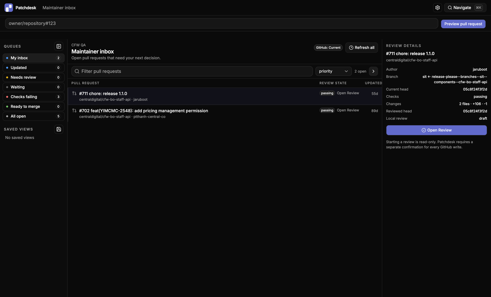

The live entry point works and opens the Review, but the supporting copy still says `Starting a review is read-only`. The approved design removes read-only mode vocabulary because GitHub-write safety is not the maintainer's task or a workbench mode.

### Step 2: Default Files surface

Health: partial match.

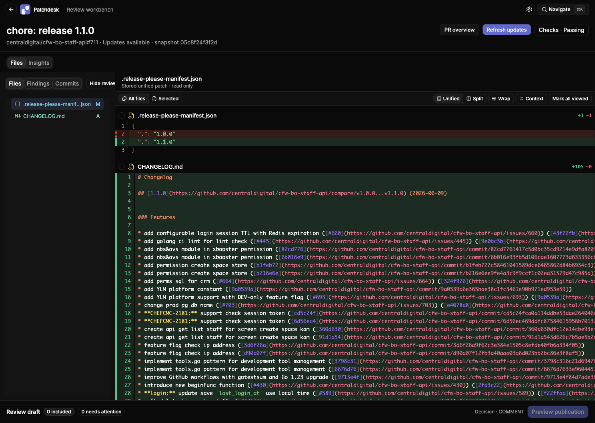

The implementation preserves the selected diff-first hierarchy, a roughly 288px navigator, the Files/Findings/Commits tabs, a large Pierre diff, detected-update treatment, and the bottom Review draft dock. The workbench header omits base branch, head branch, and last-refreshed time, and its large stacked treatment uses substantially more height than the selected compact header. The diff header also exposes `read only` implementation language.

Reference: `design/concepts/01-diff-first.png`.

### Step 3: Insights overview

Health: not conformant.

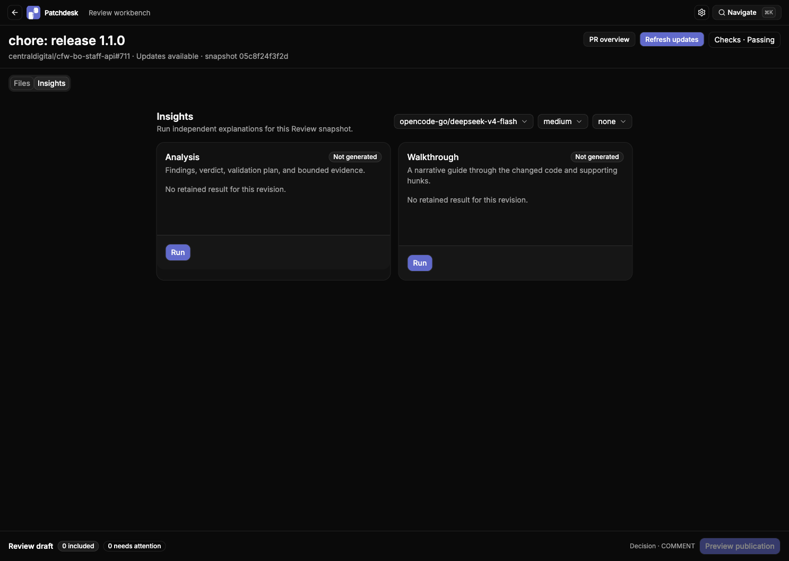

The live surface is a centered two-card grid with global model, reasoning, and completion selectors. It has no persistent left Insight navigator, neutral Overview destination, revision identity, recency, retained-result readability summary, or selected central detail surface.

Reference: `design/insights-exploration/04-refined-insight-navigator-overview.png`.

### Step 4: Expanded Review draft

Health: not conformant.

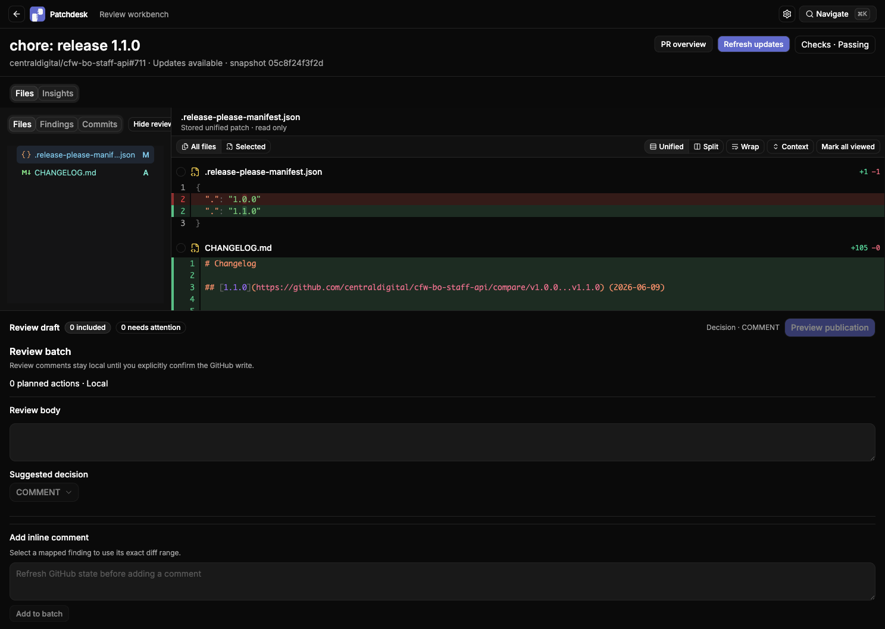

The dock expands in place and leaves part of the diff visible, which matches the basic layout contract. Because the workbench has Updates available, however, the Review body, decision, and comment controls are disabled. The contract explicitly keeps local drafting available while only GitHub writes pause. The expanded surface is also a generic full-width form rather than the selected structured draft and focused repair workspace.

Reference: `design/concepts/02-expanded-review-draft.png` and `design/review-draft-exploration/01-focused-anchor-repair.png`.

### Step 5: PR Overview

Health: strong shell, nonconformant content.

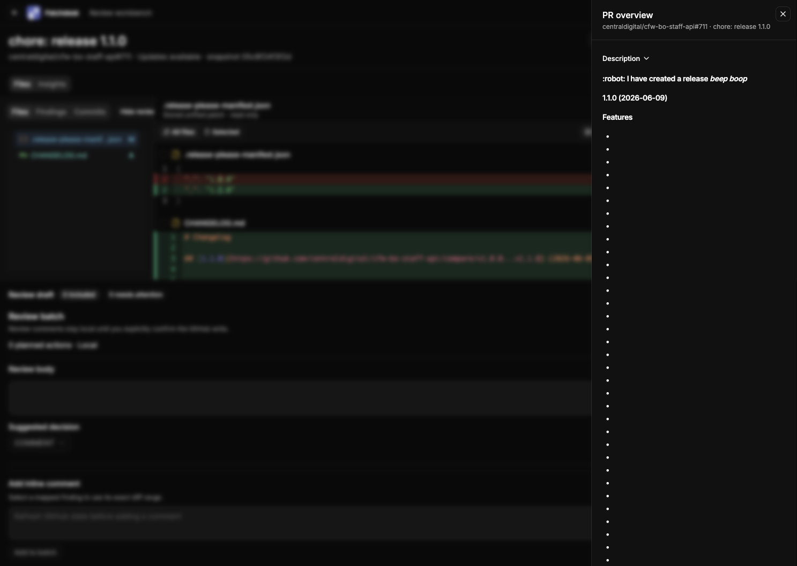

The right panel is about 26% of the viewport, overlays rather than resizes the workbench, dims and blurs the background, scrolls independently, closes with Escape, and restores focus to `PR overview`. A bounded keyboard check also moved from the restored trigger to `Refresh updates` with one Tab.

The visible content begins with a long Description containing empty bullet rows. The approved order begins with Summary, revision and freshness with Refresh, Checks, Discussion, Insight status, and merge readiness; long narrative content comes last. Revision, Analysis, Walkthrough, and merge actions are absent from this implementation.

Reference: `design/concepts/04-pr-overview-overlay.png`.

### Step 6: Richer PR, Existing Published Feedback, And 1280px

Health: new critical layout failure.

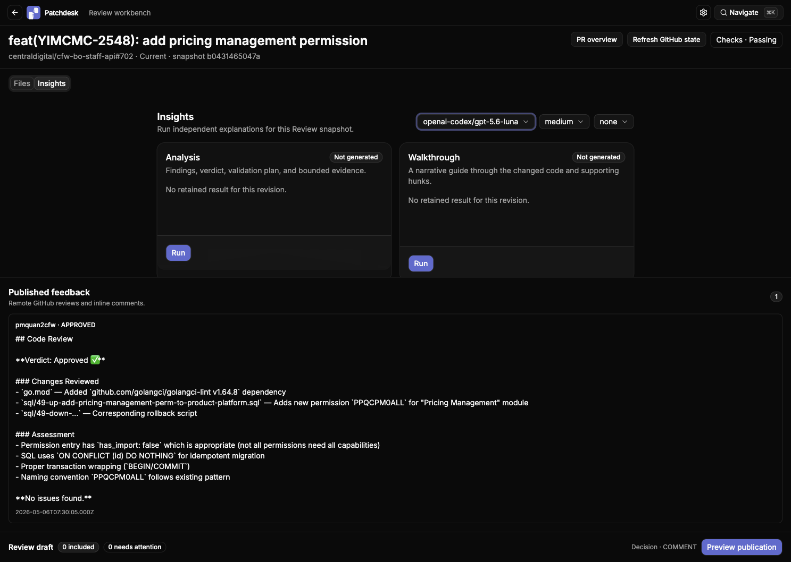

PR #702 exposed existing Published feedback and kept the local Review draft editable. Files rendered all three changed files, but Findings and Commits were empty, so this PR still could not exercise Finding focus or commit selection.

At `1280 x 900`, the Insight cards and Published feedback occupy overlapping vertical ranges: the `Review insights` region measured approximately `y=205..528`, while Published feedback began around `y=363.5`. The document remained fixed at `900px` high rather than providing page-level scroll, leaving roughly `164.5px` of Insight content clipped behind Published feedback.

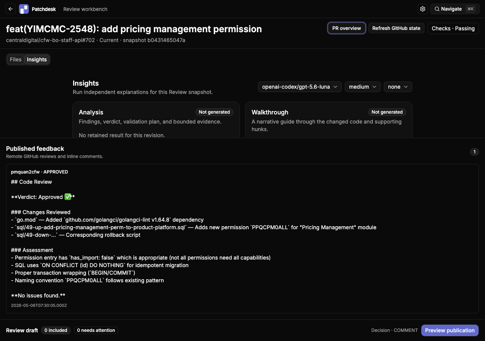

The expanded draft makes the same stacking defect more severe: Published feedback covers the Files/Insights controls and the top of the Insight surface while the draft extends below it.

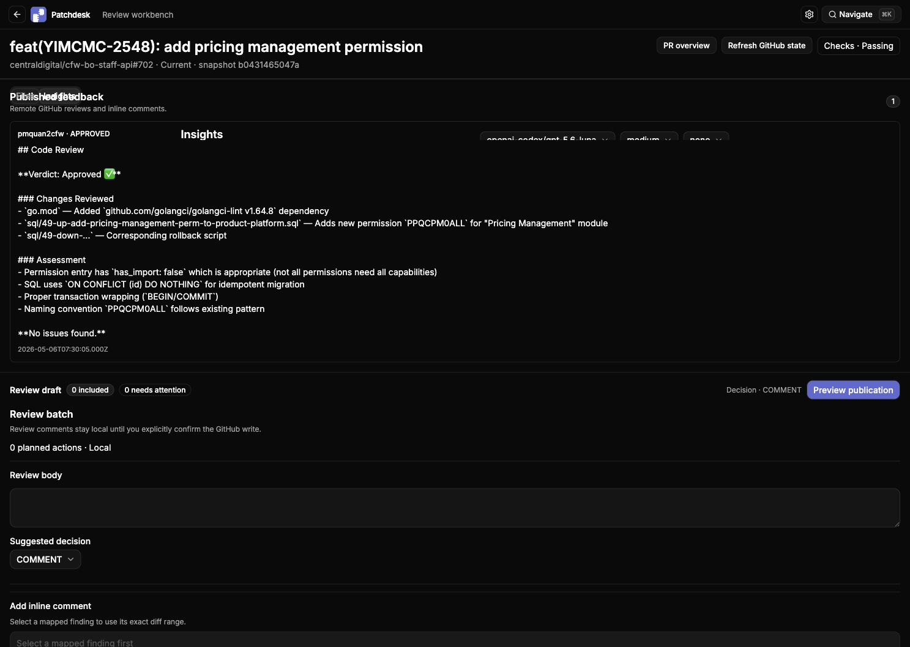

The second PR Overview pass reconfirmed the strong overlay mechanics and the Description-first content defect.

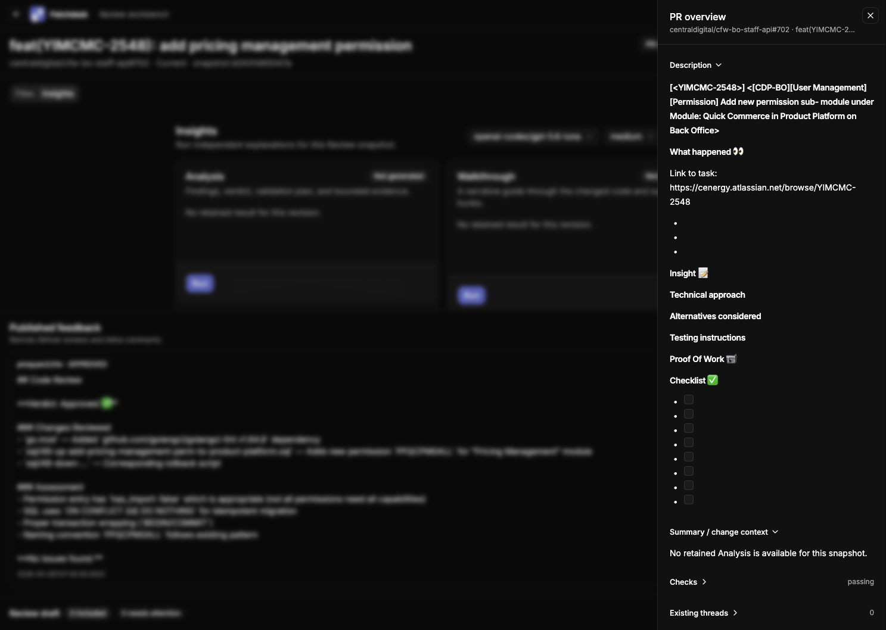

### Step 7: Authorized Analysis Run And Failure

Health: fail.

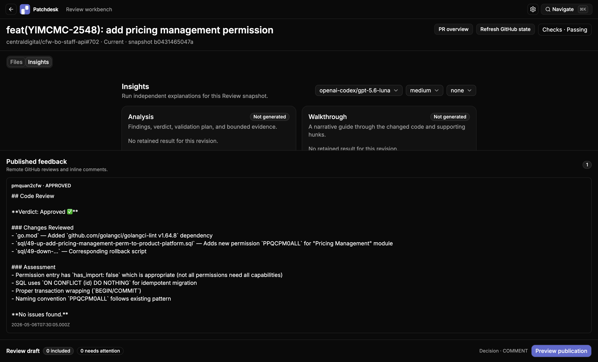

The exact Luna model was selected with `Keep result only`, although the closed completion control exposed the internal value `none`. A normal pointer action on the enabled Analysis Run control produced no request or state change because Published feedback covered the card's action region. For evidence collection only, direct DOM dispatch of that same visible control invoked its existing handler.


The accessibility snapshot recorded `queued`, a Loading status, `Generating a bounded result…`, and Cancel. None of that state was visibly readable in the accepted screenshot because Published feedback covered the Analysis cards. The run failed after about 1.5 seconds.


The failure snapshot reported an Analysis card badge of `Not generated`, a provider access/credentials/usage-limit alert, and a polite live-region message of `Analysis failed`. This is internally inconsistent and does not match the selected Failed document with revision, safe trace ID, technical disclosure, no-draft-change confirmation, Retry Analysis, and Change run options.


The same-model retry reached `queued` but failed before a Cancel interaction could win the race. Because the first run never produced a retained result, this was a retry rather than the selected Replacement Running state.

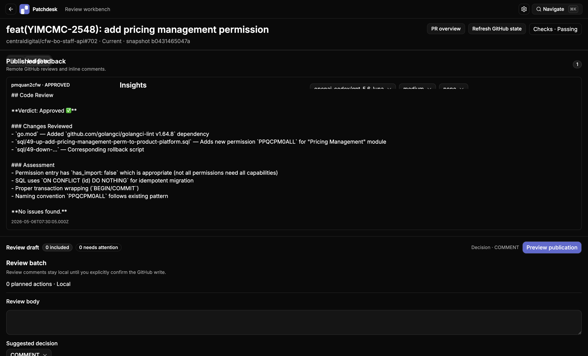

No Current result, Findings, Review body, result reader, retained replacement, or cancelled recovery could be exercised. The run produced no GitHub write and no page or console error.

References: `design/analysis-states/01-running.png`, `design/analysis-states/04-failed.png`, and `design/analysis-states/05-replacement-running.png`.

## Findings

### P1-01: Insights does not implement the selected information architecture

Requirement: `design/design.md:189-195` selects a stable left rail with Overview, Analysis, and Walkthrough, while only central content changes.

Evidence:

- Live screenshot: `evidence/2026-08-03-design-live/04-insights-overview.png`.
- `src/renderer/src/flows/review-workbench-flow.tsx:266-329` renders one centered header and two cards.
- `src/renderer/src/flows/review-workbench-flow.tsx:330-331` appends opened Analysis and Walkthrough readers below the overview instead of replacing only the central content.

Impact: users lose the stable place, status hierarchy, revision context, and predictable navigation selected for every Insight lifecycle state.

Repair target: implement the selected Insight rail and Overview projection, then render one selected Insight detail in the central pane while preserving the workbench header, Files state, and Review draft dock.

### P1-02: The approved Analysis lifecycle states are missing

Requirement: `design/design.md:197-248` defines Running, Current, Outdated, Failed, and Replacement Running states in one stable document layout.

Evidence:

- Live queued screenshot and snapshot: `evidence/2026-08-03-analysis-lifecycle/05-analysis-queued.png` and `05-analysis-queued.snapshot.txt`.
- Live failure screenshot and snapshot: `evidence/2026-08-03-analysis-lifecycle/06-analysis-failed.png` and `06-analysis-failed.snapshot.txt`.
- `src/renderer/src/flows/review-workbench-flow.tsx:378-400` reduces every lifecycle state to the same generic card, badge, short error line, and Run/Regenerate button.
- The authorized run reached `queued`, but showed no bound revision, start time, phase, bounded progress, elapsed time, or current file before the provider failed.
- The failure card reverted its visible badge to `Not generated` while simultaneously rendering a failure alert and announcing `Analysis failed` through the live region.
- The failure alert grouped model access, credentials, and usage limits into one generic instruction. It exposed no safe trace identifier, technical disclosure, no-draft-change statement, Retry Analysis, or Change run options.
- `src/renderer/src/components/analysis-reader.tsx:35-95` renders a stack of generic cards instead of the selected readable document with Review body and Findings tabs.
- The Review body order is wrong: Reviewed Changes precedes Pull Request Overview, Verdict is embedded in overview copy, Verification is absent, and empty Human Reviewer Callouts are rendered rather than omitted.
- `src/renderer/src/flows/review-workbench-flow.tsx:330` passes Finding dismissal to retained Analysis regardless of whether that result is outdated.

Impact: retained results, replacement safety, outdated evidence boundaries, and recovery are visually indistinguishable or unavailable.

Repair target: implement the five explicit Analysis projections, including retained-result replacement strips, revision comparison, safe action suppression, correct structured Review body order, and Current-only Finding actions.

### P1-03: Updates available incorrectly disables local draft work

Requirement: `spec.md` and ADR-0001 keep local Review draft editing available while GitHub writes pause.

Evidence:

- Live screenshot: `evidence/2026-08-03-design-live/05-review-draft-expanded.png`.
- `src/renderer/src/flows/review-workbench-flow.tsx:497-502` converts every non-fresh revision into one `writeBlocked` flag.
- `src/renderer/src/components/review-batch-panel.tsx:183-194` uses that remote-write flag to disable the Review body, decision, inclusion controls, and inline item editing.

Impact: detected remote activity interrupts safe local work and contradicts one of the core reasons for a stable Review workbench.

Repair target: separate local-edit eligibility from remote-write eligibility. Continue to block preview publication, Published feedback mutation, thread mutation, and merge while allowing local draft edits.

### P1-04: Needs-attention anchor recovery is absent and does not gate preview

Requirement: `design/design.md:292-300` selects focused repair with Reattach, Convert to Review body, confirmed Remove, automatic progression, and publication blocking until the queue is empty.

Evidence:

- `src/renderer/src/components/review-draft-dock.tsx:28-42` computes and displays only an attention count.
- `src/renderer/src/components/review-batch-panel.tsx:203-206` renders a stale location badge and immediate Remove action, but no Reattach, Convert, original context comparison, or removal confirmation.
- `src/renderer/src/components/review-draft-dock.tsx:39` disables publication only for remote freshness, not a non-zero attention count.

Impact: maintainers cannot safely repair carried-forward comments and may enter publication with invalid coordinates.

Repair target: implement the selected focused repair queue and make unresolved attention a hard preview/publication gate.

### P1-05: PR Overview omits the selected urgent-state hierarchy

Requirement: `design/design.md:137-149` orders Summary, Revision/freshness, Checks, Discussion, Insight status, Merge readiness/action, then long description.

Evidence:

- Live screenshot: `evidence/2026-08-03-design-live/06-pr-overview-open.png`.
- `src/renderer/src/components/pr-overview-sheet.tsx:83-106` renders Description first, then Summary, Checks, threads, Published feedback, and merge-readiness text.
- The canonical overview model has no revision/freshness or Analysis/Walkthrough fields and no action contract.

Impact: the most urgent decision state is hidden below long and sometimes malformed narrative content, reproducing the exact current-UI problem that the selected design resolves.

Repair target: add the missing projection fields and actions, use the approved ordering, and keep long GitHub description content last.

### P1-06: Merge is unreachable from the unified workbench

Requirement: PR Overview owns merge readiness and the explicitly confirmed merge action.

Evidence:

- `src/renderer/src/flows/review-workbench-flow.tsx:137-142` provides `mergeAction: null`.
- `src/renderer/src/components/pr-overview-sheet.tsx:66-110` renders only merge-readiness text for the canonical Review path.

Impact: the workbench cannot complete the maintainer's primary terminal action or demonstrate the selected merge-readiness states.

Repair target: route SHA-bound merge readiness, permitted methods, acknowledgement state, and the existing merge confirmation dialog into canonical PR Overview.

### P1-07: The selected publication flow and recovery states are not implemented

Requirement: `design/design.md:314-356` selects a roughly 1040px wide ledger with Ready, Publishing, Confirmed, and Needs confirmation states.

Evidence:

- `src/renderer/src/components/publication-preview-dialog.tsx:45-48` uses a generic `max-w-2xl` scrolling dialog.
- It has no structured ledger navigation, no code-context preview, no ordered publication progress, and no Confirmed or Needs confirmation presentation.
- While confirmation is loading, the close button, Escape, backdrop, and Cancel remain available through the dialog's ordinary open-state handler.
- A failure becomes one generic retryable error, rather than locking conflicting writes and offering reconciliation.

Impact: users cannot inspect the exact publication package in the selected form or understand whether a remote write is active, confirmed, partial, or unsafe to retry.

Repair target: implement the four selected publication projections and bind modal closeability and available actions to the durable publication state.

### P1-08: The Review draft is not persistent when empty or after publication

Requirement: `design/design.md:95-114` keeps a persistent bottom dock; confirmed publication exposes a new empty draft.

Evidence:

- `src/renderer/src/flows/review-workbench-flow.tsx:440-443` returns no dock whenever the projection has no draft.
- `src/renderer/src/components/published-feedback.tsx:38` likewise hides Published feedback when empty, leaving no stable lifecycle destination.

Impact: the shell changes structure depending on optional data and cannot express the selected empty successor-draft state.

Repair target: project and render a durable empty draft state for every active Review, including immediately after confirmed publication.

### P1-09: Published feedback obscures Insights and the expanded draft

Requirement: `design/design.md` requires the same information hierarchy at 1280px, allows the Files navigator to collapse before code readability is reduced, and prohibits viewport overflow. Published feedback, Insights, and the persistent draft must remain distinct readable regions.

Evidence:

- Live screenshot: `evidence/2026-08-03-design-live/12-pr702-1280-insights.png`.
- Expanded-state screenshot: `evidence/2026-08-03-design-live/10-pr702-draft-expanded.png`.
- Authorized Analysis screenshots: `evidence/2026-08-03-analysis-lifecycle/05-analysis-queued.png` and `06-analysis-failed.png`.
- At `1280 x 900`, the Insight and Published feedback boxes overlapped by about `164.5px`, while document `scrollHeight` remained `900px`.
- At `1487 x 1058`, the overlap still covered the Analysis card state and actions. A normal pointer action on the enabled Run control produced no request or state transition; only direct DOM dispatch could invoke the already-visible control for QA.
- `src/renderer/src/components/review-workbench.tsx:240-249` renders the internally scrolling Insight tab, Published feedback, merge action, and draft dock as competing siblings in one height-constrained workbench without a responsive vertical composition for their combined content.

Impact: users cannot reliably read or operate Insight cards once Published feedback exists. Running and failure state changes occur in the accessibility tree but remain visually hidden, and expanding the draft further covers the primary surface and tabs. This violates the selected persistent-shell layout at both exercised desktop widths.

Repair target: define one responsive vertical ownership model for primary tab content, Published feedback, and the draft dock. Keep the dock pinned, make the remaining workbench region scroll or size predictably, and ensure Published feedback never overlaps the selected primary surface.

### P2-01: The workbench header is incomplete and visually too tall

Requirement: `design/design.md:53-64` calls for one compact row containing PR identity, repository, base, head, short SHA, last refreshed, update status, checks, and PR Overview.

Evidence:

- Live Files screenshot: `evidence/2026-08-03-design-live/03-review-files-1487x1058.png`.
- `src/renderer/src/components/review-workbench.tsx:164-185` uses a large title plus a second metadata line and omits base branch, head branch, and last-refreshed time.

Impact: the header consumes code-reading space while still withholding freshness context.

Repair target: match the selected compact density and project every required metadata field.

### P2-02: Legacy read-only language remains visible

Requirement: `design/design.md:358-368` removes prepared/completed/read-only mode language.

Evidence:

- Live inbox screenshot: `evidence/2026-08-03-design-live/01-inbox.png` says `Starting a review is read-only`.
- Live Files screenshot: `evidence/2026-08-03-design-live/03-review-files-1487x1058.png` says `Stored unified patch · read only`.

Impact: the interface still describes an implementation boundary as a product mode, undermining the unified Review vocabulary.

Repair target: use task-focused copy such as local snapshot identity and explicit GitHub-write confirmation boundaries.

### P2-03: Finding rows omit required disposition

Requirement: Finding entries show severity, title, file, line, and whether the Finding is open, added to the Review draft, or dismissed.

Evidence: `src/renderer/src/components/review-navigator.tsx:74-81` shows severity and a constant `Mapped` badge but not disposition or selected state.

Impact: maintainers cannot triage the Finding list or distinguish analysis state from draft inclusion.

Repair target: show the actual Finding disposition and selected treatment while keeping mapping implicit in the navigator's eligibility.

### P2-04: Commit detail is incomplete

Requirement: `design/design.md:276-290` requires the selected commit header to show title, position, author, SHA, time, file count, additions, and deletions.

Evidence:

- `src/renderer/src/components/review-workbench.tsx:156-160` includes title, author, full SHA, authored-at value, and position only.
- `src/renderer/src/components/review-navigator.tsx:84-92` correctly provides compact subject-first rows, relative time, and HEAD, but the live PR had no projected commits to exercise.

Impact: commit-specific review lacks scope and size context.

Repair target: extend the commit-diff projection and central header with the missing statistics.

### P2-05: Visual acceptance fixtures still model legacy states

Requirement: the spec requires a complete seeded unified journey at 1280px and 1440px across Files, Findings, Commits, Insights, refresh, draft repair, publication, and terminal state.

Evidence:

- `src/design/scenarios.ts:28-35` still registers `review-prepared`, `review-running`, and `review-completed` rather than the approved unified state matrix.
- `src/renderer/src/flows/app-fixtures.tsx:248-253` supplies placeholder Insight content and no draft, Published feedback, or merge action.
- `tests/browser/review-workbench.spec.ts:512-633` still names completed-review behavior and does not exercise the required unified lifecycle states.

Impact: visual regressions can pass even when the approved UI states do not exist.

Repair target: replace the legacy design registry with deterministic unified-workbench scenarios and one complete protected-browser journey.

### P2-06: Accessibility evidence covers only part of the contract

Confirmed strengths:

- Files/Insights and Files/Findings/Commits use semantic tabs.
- PR Overview contains focus while open through the Base UI dialog primitive.
- Escape closes PR Overview and restores focus to its trigger in the live app.
- Analysis and Walkthrough expose a bounded polite live region.

Remaining gaps:

- No current audit evidence for focus preservation while Insight progress changes.
- No deterministic scenarios for keyboard operation across all Analysis, draft-repair, publication, and terminal states.
- Reduced-motion behavior was not exercised.
- The incomplete Insights and Needs-attention structures prevent full keyboard acceptance.

### P2-07: Analysis completion exposes an internal value

Requirement: run choices use task language and the selected Insights surface exposes the next appropriate action without implementation vocabulary.

Evidence:

- Live screenshot: `evidence/2026-08-03-analysis-lifecycle/04-before-authorized-run.png`.
- `src/renderer/src/flows/review-workbench-flow.tsx:286-292` labels the option `Keep result only`, but the closed trigger visibly renders its value as `none`.

Impact: the maintainer cannot tell what the third run control means without reopening it, and the UI exposes a transport/state token instead of the selected action.

Repair target: render the selected option label in the closed control, or move the completion choice into the selected Analysis action flow rather than keeping it as a global Insight selector.

## Complete Design-Folder Coverage

The folder contains two Markdown documents and 47 visual files. Both documents and every visual were inspected. The code is judged against the 18 images explicitly selected by `design/design.md`; the other 29 visuals are accounted for below but are not treated as independent acceptance screens.

Approved-target result: **0 complete passes, 5 partial matches, 13 failures**.

### Approved Implementation Targets: 18 Of 18 Checked

1. `design/concepts/01-diff-first.png` — **Partial.** The live app has the correct default Files surface, stable left navigator, dominant Pierre diff, collapsed Review draft dock, and overlay trigger. The header is too tall and omits base, head, and refreshed time; update state disables safe local draft work; `read only` copy remains.
2. `design/concepts/02-expanded-review-draft.png` — **Fail.** The dock expands without replacing the workbench, but the implementation is a generic full-width form rather than the selected structured body-and-items workspace. In the exercised Updates available state, all editing controls were disabled.
3. `design/concepts/03-findings-focus.png` — **Partial, static evidence.** Selecting a Finding can route the central diff to exact evidence, but navigator rows omit open/added/dismissed disposition and selected treatment. The central surface has no selected-Finding header with Add to review and Dismiss actions. The live PR had no Findings.
4. `design/concepts/04-pr-overview-overlay.png` — **Partial.** The live overlay width, scrim, blur, independent scrolling, focus containment, Escape close, and focus restoration match. Its content order and action model do not: long Description appears first, while revision/freshness, Insight state, and merge readiness/action are missing.
5. `design/insights-exploration/04-refined-insight-navigator-overview.png` — **Fail.** The live UI is a centered two-card dashboard. It lacks the selected Overview/Analysis/Walkthrough rail, revision and recency summaries, retained-result readability, stable selected destination, and one central detail surface. With existing Published feedback, the cards are clipped behind the feedback region at both exercised widths.
6. `design/analysis-states/01-running.png` — **Fail, live queued evidence.** The authorized run exposed only a generic card with `queued`, `Generating a bounded result…`, and Cancel in the accessibility tree. It did not show bound revision, start time, phase, bounded progress, elapsed time, or current file, and Published feedback visually hid even the generic state.
7. `design/analysis-states/02-current.png` — **Fail, static evidence.** The reader uses generic cards instead of the selected document and local Review body/Findings tabs. Document order is wrong, Verification is absent, empty Human Reviewer Callouts are shown, and the selected result-action hierarchy is missing.
8. `design/analysis-states/03-outdated.png` — **Fail, static evidence.** There is no explicit retained-revision versus current-revision warning, Run for latest revision emphasis, or complete suppression of old navigation, draft generation, publication, Finding projection, and merge-policy influence.
9. `design/analysis-states/04-failed.png` — **Fail, live evidence.** The provider failure rendered a short generic alert while the card badge returned to `Not generated` and the live region announced `Analysis failed`. The selected safe trace identifier, technical-detail disclosure, no-draft-change statement, Retry Analysis, and Change run options presentation do not exist; Published feedback also hid the visible failure state.
10. `design/analysis-states/05-replacement-running.png` — **Fail, static evidence.** Replacement does not appear as one compact progress strip above a fully readable retained result, and result actions are not visibly suppressed for the active replacement state.
11. `design/walkthrough-states/01-current.png` — **Partial, static evidence.** `NarrativeWalkthrough` has an outline, one reading surface, prose, shared diff rendering, Previous/Next, local reviewed progress, and a Support group. It is appended below overview cards instead of occupying the selected central Insight pane, and lacks the stable Insight rail and complete Current header/action treatment.
12. `design/walkthrough-states/02-outdated.png` — **Fail, static evidence.** The implementation has no explicit retained/current revision warning, no Run for latest revision and View current Files hierarchy, and no selected outdated presentation wrapped around the still-readable walkthrough.
13. `design/commit-states/01-selected-commit.png` — **Partial, static evidence.** The newest-first compact navigator, HEAD marker, subject, author, short SHA, relative time, selection, and commit-filtered diff are implemented. The central header omits file count, additions, and deletions and displays an authored-at value rather than the selected relative-time treatment. The live PR projected no commits.
14. `design/review-draft-exploration/01-focused-anchor-repair.png` — **Fail.** Only a needs-attention count, stale-location badge, and immediate Remove exist. There is no focused queue, original/current context, Reattach, Convert to Review body, removal confirmation, automatic advance, or hard preview gate.
15. `design/publication-states/01-ready.png` — **Fail, static evidence.** The generic `max-w-2xl` dialog is narrower and materially less structured than the selected roughly 1040px ledger. It does not present the exact body, inline comments, thread actions, decision, head, warnings, and code context in the approved inspectable layout.
16. `design/publication-states/02-publishing.png` — **Fail, static evidence.** The implementation has no ordered publication progress and does not keep the payload in the selected stable ledger. Close, Escape, backdrop, Back/Cancel, and repeat-action safety are not bound to a durable active-write presentation.
17. `design/publication-states/03-confirmed.png` — **Fail, static evidence.** Successful confirmation closes the generic dialog and patches local draft state. There is no Confirmed surface, GitHub-owned Published feedback continuation, new empty Review draft presentation, or View published feedback action.
18. `design/publication-states/04-needs-confirmation.png` — **Fail, static evidence.** Uncertain outcome is reduced to a generic retryable error. The implementation does not show confirmed/prepared/not-confirmed groups, retain the exact payload, lock the draft and conflicting writes, or provide Check GitHub again and Open on GitHub while withholding Publish again.

### Explorations And References: 16 Of 16 Accounted For

These images were inspected for intent and consistency but are not separate acceptance targets:

- `design/concepts/00-previous-selected-direction.png` — superseded multi-region direction. Useful evidence for the old dashboard-heavy model; not selected.
- `design/insights-exploration/01-insight-ledger.png` — superseded ledger alternative. Its peer Insight summaries informed the selected overview.
- `design/insights-exploration/02-insight-navigator.png` — superseded navigator alternative. The selected `04-refined-insight-navigator-overview.png` keeps its stable rail and neutral Overview.
- `design/insights-exploration/03-parallel-insights.png` — rejected side-by-side dashboard direction. It conflicts with the selected one-rail, one-document model.
- `design/commit-exploration/01-dense-commit-ledger.png` — exploration that established subject-first density; superseded by the selected commit-state image.
- `design/commit-exploration/02-chronological-timeline.png` — rejected date grouping and timeline treatment; first version explicitly avoids date sections and a graph.
- `design/commit-exploration/03-commit-with-files.png` — rejected affected-file expansion; first version keeps rows ungrouped and compact.
- `design/walkthrough-exploration/01-focused-chapter-reader.png` — alternative without the selected permanent section-outline layout.
- `design/walkthrough-exploration/02-outline-document-reader.png` — closest structural precursor to the selected Walkthrough states; the selected images add final diff and lifecycle treatment.
- `design/walkthrough-exploration/03-change-story-map.png` — rejected accordion/story-map alternative.
- `design/review-draft-exploration/02-context-compare-queue.png` — saved alternative explicitly excluded from first implementation.
- `design/review-draft-exploration/03-diff-led-reattach.png` — saved alternative explicitly excluded from first implementation.
- `design/publication-exploration/01-wide-publication-ledger.png` — selected structural direction, with final behavior expressed by the four `publication-states` images.
- `design/publication-exploration/02-publication-side-sheet.png` — rejected side-sheet alternative.
- `design/publication-exploration/03-in-place-draft-preview.png` — rejected in-place preview alternative.
- `design/reference-inputs/commit-navigator-reference.png` — external/source reference for density and commit navigation, not a Patchdesk acceptance screen.

### Current-UI Baselines: 13 Of 13 Accounted For

These captures document the prior live product. They are comparison evidence, not targets to reproduce:

- `design/current-ui/01-review-workbench-files.jpg` — baseline diff-first workbench, tall header, read-only vocabulary, and current Pierre surface.
- `design/current-ui/02-pr-overview-top.jpg` — baseline Description-first overlay and sticky bottom merge state.
- `design/current-ui/03-pr-overview-scrolled.jpg` — baseline checks/discussion ordering and long-scroll problem that the selected overlay corrects.
- `design/current-ui/04-pending-pull-requests.jpg` — baseline inbox entry and `Run review` action; only its entry copy is relevant to this audit.
- `design/current-ui/05-settings-main.jpg` — General settings baseline; outside the unified-workbench acceptance surface.
- `design/current-ui/06-settings-workspace.jpg` — Workspace settings baseline; outside the unified-workbench acceptance surface.
- `design/current-ui/07-settings-review.jpg` — Review model/reasoning defaults baseline; outside the workbench layout, but relevant to moving run options into Insights.
- `design/current-ui/08-settings-data-recovery.jpg` — recovery/settings baseline; outside this visual acceptance surface.
- `design/current-ui/09-navigation-palette.jpg` — global navigation baseline; not redesigned by the selected workbench direction.
- `design/current-ui/10-walkthrough-setup.jpg` — legacy `read-only walkthrough` setup and copy baseline, replaced by Walkthrough as an Insight.
- `design/current-ui/11-review-run-setup.jpg` — legacy `read-only review` setup and copy baseline, replaced by Analysis lifecycle states.
- `design/current-ui/12-saved-review-workbench.jpg` — saved-review Files baseline with the same tall header and legacy actions.
- `design/current-ui/13-saved-review-overview.jpg` — saved-review PR Overview baseline with long description first and missing unified Review state.

### Non-Raster Design Requirements Also Checked

- Merged and closed Reviews have no dedicated raster by design. Source inspection shows terminal projection exists, but deterministic visual acceptance is incomplete and merge is still unreachable from the canonical PR Overview.
- Live 1487px and 1280px checks had no document-level overflow, but both compositions failed because Published feedback covered the primary Insight surface. The required deterministic 1440px and 1280px fixture matrix is not implemented.
- Accessibility was checked where the current surfaces exist; full lifecycle keyboard and reduced-motion acceptance remains blocked by missing screens.

## Verification

Passed:

```text
pnpm lint
pnpm typecheck
pnpm test -- --run
pnpm build
```

Results:

- ESLint passed with no warnings.
- TypeScript passed.
- Vitest passed: 105 files, 658 tests.
- Electron/Vite production build passed.
- Live development Electron app loaded with no observed console or page errors.

Not run:

- Playwright CLI browser suite. The live Electron pass supplied current visual evidence without adding a second browser surface.
- Packaged-app QA. Packaging proof was not requested.

## Evidence Limits

- The live PR had no current Findings or projected commits, so those states were reviewed from source and existing tests rather than live screenshots.
- Queued and first-run Failed Analysis states were exercised live. The provider failed before a Current result existed, so Current, retained-result replacement, cancelled recovery, Outdated, result reading, and live Finding behavior still rely on source inspection and selected design references.
- Publication and merge were not exercised because the audit prohibited GitHub writes.
- The exact authorized model `openai-codex/gpt-5.6-luna` failed with the app's bounded provider access/credentials/usage-limit message after about 1.5 seconds. The audit cannot determine from that generic copy whether access, credential routing, or a usage limit was the underlying cause.
- No claim of complete WCAG conformance is made. The audit confirms only the focus and semantic behavior explicitly exercised or visible in source.

## Recommended Repair Order

1. Preserve the workbench shell: separate local editing from remote-write blocking, keep an empty draft dock present, and eliminate Published feedback overlap at every supported width.
2. Build the selected Insights rail and Analysis state projections.
3. Implement focused Needs-attention recovery and hard publication gating.
4. Reorder and complete PR Overview, including merge wiring.
5. Replace the generic publication dialog with the selected four-state ledger.
6. Finish header, Finding disposition, commit statistics, and legacy-copy cleanup.
7. Replace legacy design fixtures with deterministic unified-workbench acceptance scenarios at 1280px and 1440px.
