# Patchdesk Current UI Inventory

Status: captured
Captured: 2026-08-01
Surface: existing packaged Patchdesk app at 1224 × 768

This inventory records the current Patchdesk interface before the unified Review workbench redesign. It was captured read-only through Computer Use. No review or walkthrough run, GitHub write, merge, deletion, or settings save was performed.

The screenshots contain real workspace and repository information. Keep them local unless they have been reviewed for publication.

## 1. Review Workbench: Files

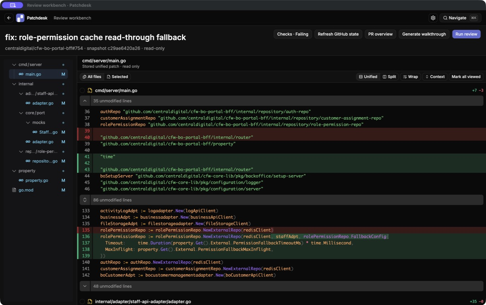

Health: healthy diff baseline, incomplete Review workspace.

- The current workbench is strongly diff-first: changed-file tree on the left, full diff in the center, and PR actions in the header.
- File selection, unified or split mode, wrapping, context, and viewed state are available without leaving the diff.
- `read-only` appears in both PR metadata and stored-patch copy. This describes an implementation boundary instead of the maintainer's task.
- Findings, Insights, Review draft, and Published feedback have no persistent place in the current shell.
- The narrow tree truncates long names; muted metadata and compact icon controls require contrast, labeling, and zoom verification.

## 2. PR Overview: Top

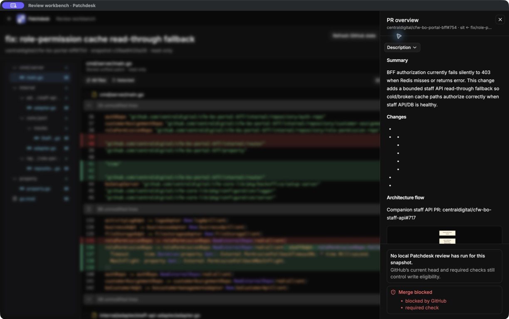

Health: strong overlay pattern, weak content ordering.

- The panel overlays the diff instead of resizing it. The background remains recognizable through a strong dim and blur treatment.
- The full-height panel has a sticky header, close control, and independent scrolling.
- Narrative description, generated lists, and architecture content appear before checks and readiness.
- Empty bullet rows make generated content look broken.
- Escape and backdrop click close the panel; Escape returns focus to the PR Overview trigger.

## 3. PR Overview: Checks And Readiness

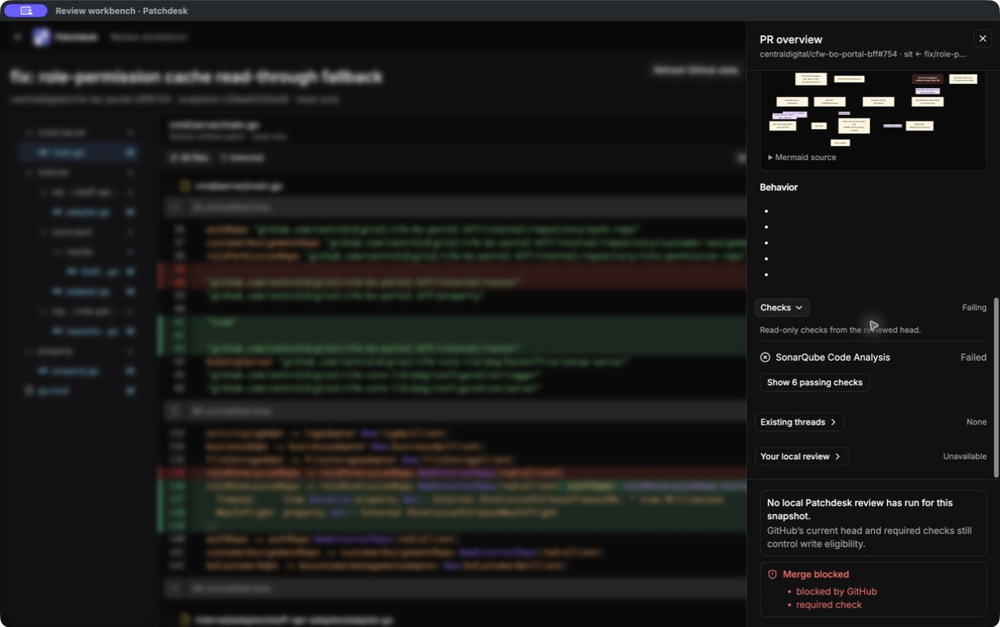

Health: clear state, placed too far below the fold.

- Failed checks and merge blocking are explicit and easy to distinguish once reached.
- Existing threads, local review state, and write eligibility share the same inspection surface.
- Important readiness information is hidden below long narrative content.
- `Your local review` and `Unavailable` do not explain whether Analysis, draft feedback, or publication is missing.
- Status still needs text and icon redundancy so color is not the only signal.

## 4. Maintainer Inbox

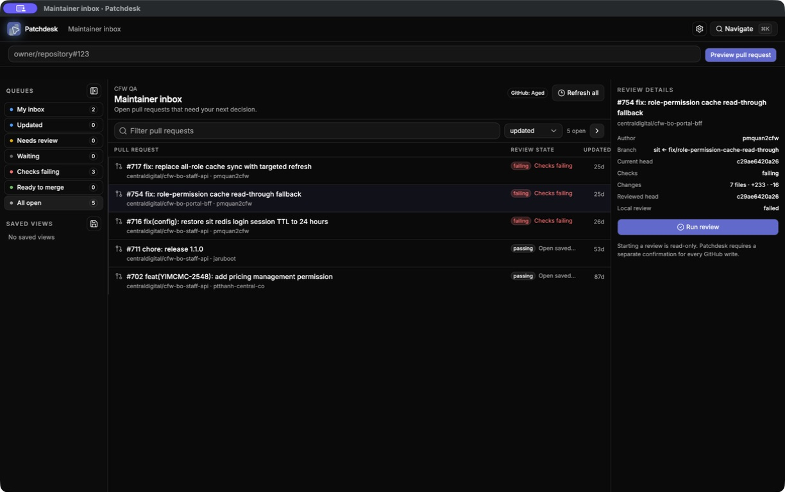

Health: useful queue and entry point, visually dense.

- The queue rail, PR list, and selected PR details let the maintainer choose work without opening GitHub.
- Selection updates the details pane in place and keeps the primary Run review action nearby.
- Three columns compress titles and metadata at 1224px.
- Counts, dots, state badges, and updated time compete for attention.
- The copy `Starting a review is read-only` reinforces the concept the redesign removes.

## 5. Settings: General

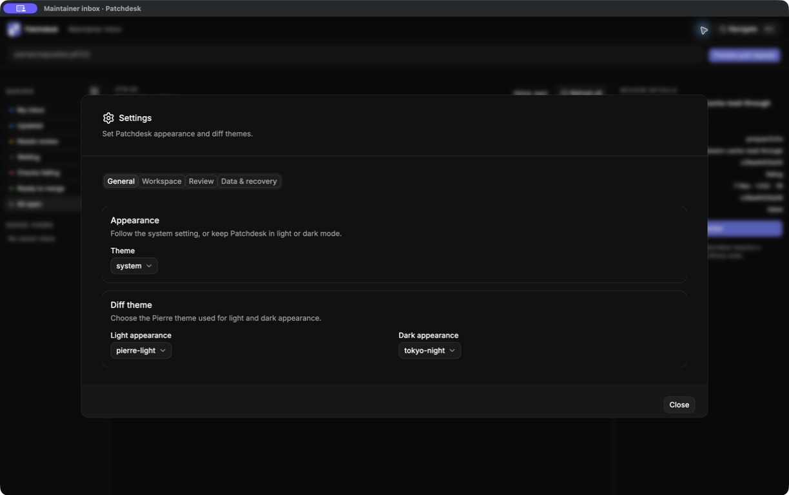

Health: clear grouping, underused space.

- General, Workspace, Review, and Data & recovery form a straightforward tab model.
- Appearance and diff-theme controls are simple and legible.
- The modal has substantial unused space and a subtitle that describes only the General tab.
- Tab keyboard behavior, focus containment, and background accessibility still require interactive verification.

## 6. Settings: Workspace

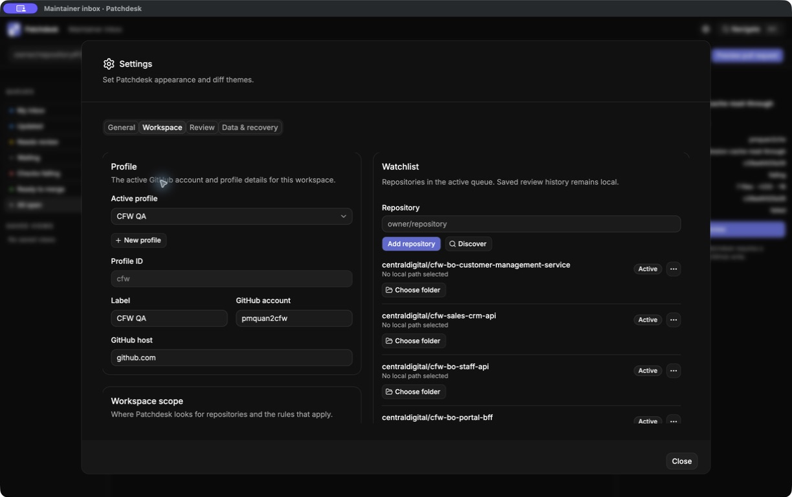

Health: capable but dense.

- Profile identity, workspace scope, and watched repositories are grouped in one place.
- Watchlist rows expose repository status and local-folder actions.
- The two-column form has many similarly weighted actions and no obvious save model in the captured viewport.
- Repository names truncate, and repeated actions need repository-specific accessible names.

## 7. Settings: Review

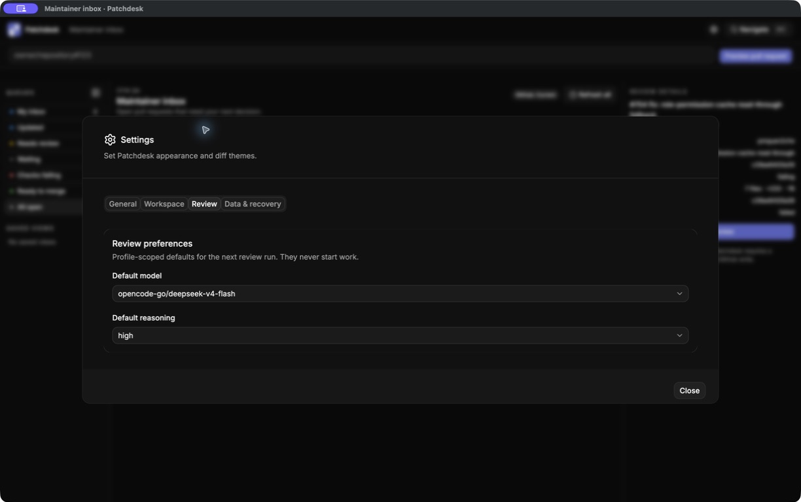

Health: concise, missing the new policy controls.

- Default model and reasoning are clearly profile-scoped and explicitly do not start work.
- The surface does not yet include Analysis policy or completion-action defaults from the unified-workbench specification.
- Model capability, latency, or cost differences are not explained.

## 8. Settings: Data And Recovery

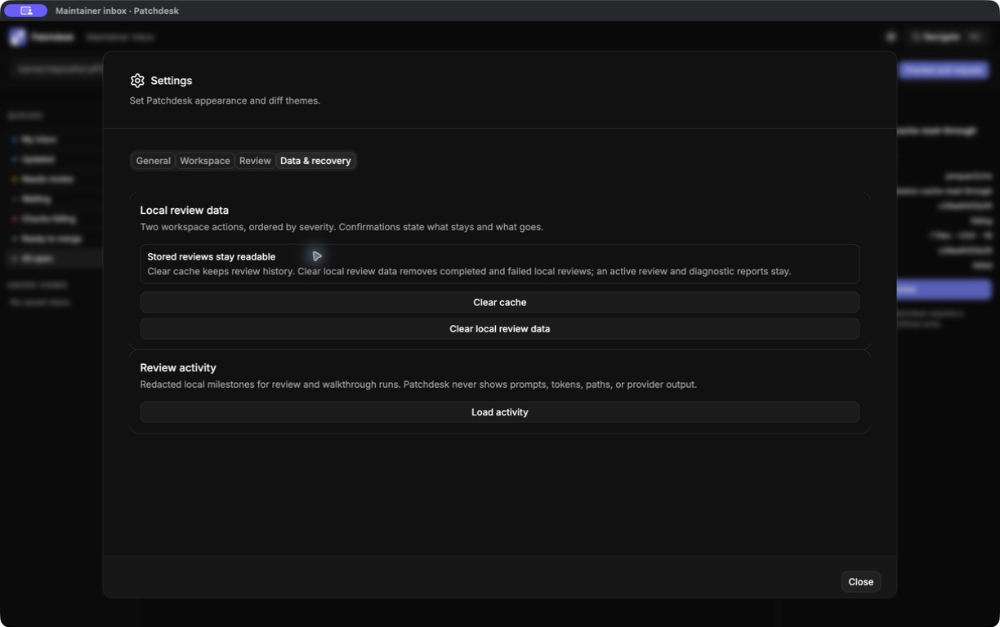

Health: strongest current explanatory copy.

- The interface clearly explains what cache cleanup and local-review cleanup retain or remove.
- Review activity is separated from cleanup actions.
- `Clear cache` and `Clear local review data` look too similar despite different consequences.
- Confirmation, progress, completion feedback, and focus return require interactive verification.

## 9. Navigation Palette

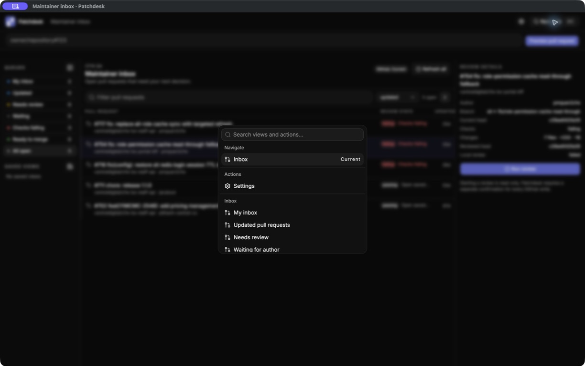

Health: efficient, visually small.

- The searchable palette provides fast global access to Inbox, Settings, and queue views.
- The current destination is explicit.
- Queue destinations repeat the persistent inbox rail, and the palette uses little of the available viewport.
- Search focus, selected-row contrast, focus trapping, and Escape behavior should remain part of acceptance testing.

## 10. Walkthrough Setup

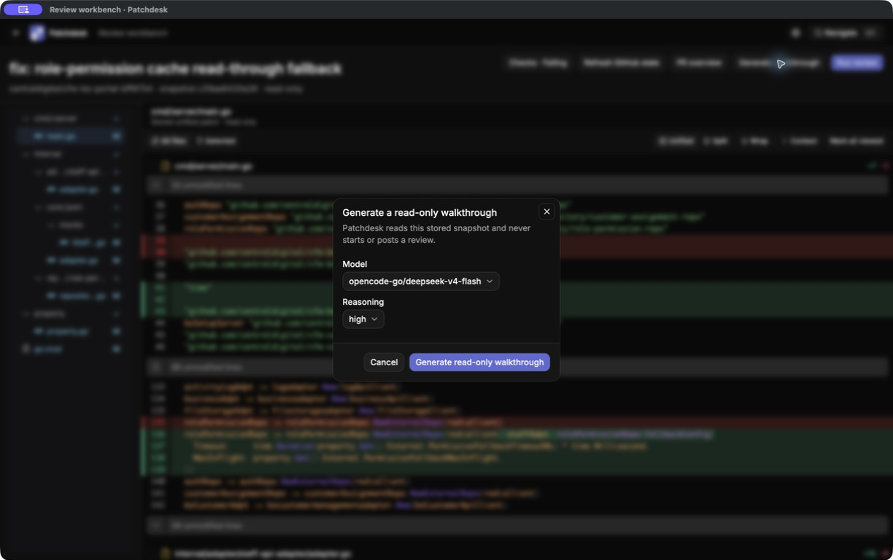

Health: understandable setup, legacy framing.

- Model and reasoning are selected before work begins.
- The modal confirms that the stored snapshot is the input and that no GitHub review is posted.
- `read-only walkthrough` confuses GitHub-write safety with the purpose of the Insight.
- No duration expectation, completion destination, or retained-result behavior is shown.

## 11. Analysis Setup

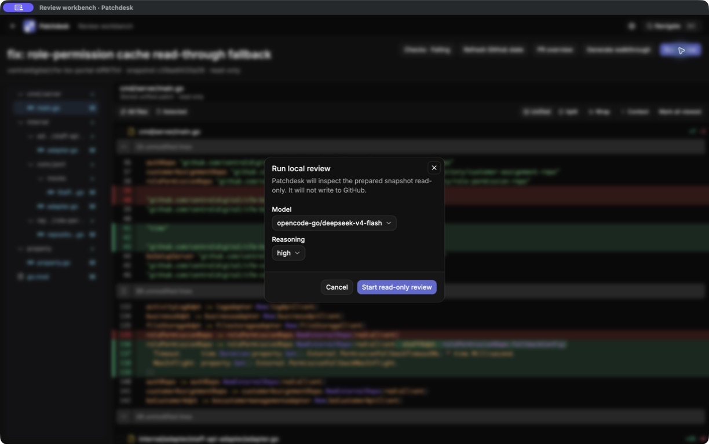

Health: safe preflight, unclear destination.

- The current dialog clearly separates starting local model work from writing to GitHub.
- `prepared snapshot` and `Start read-only review` preserve the prepared/completed mode vocabulary.
- The dialog does not show where Analysis will appear, what happens to an existing result, or what completion action is selected.

## 12. Saved Review Workbench

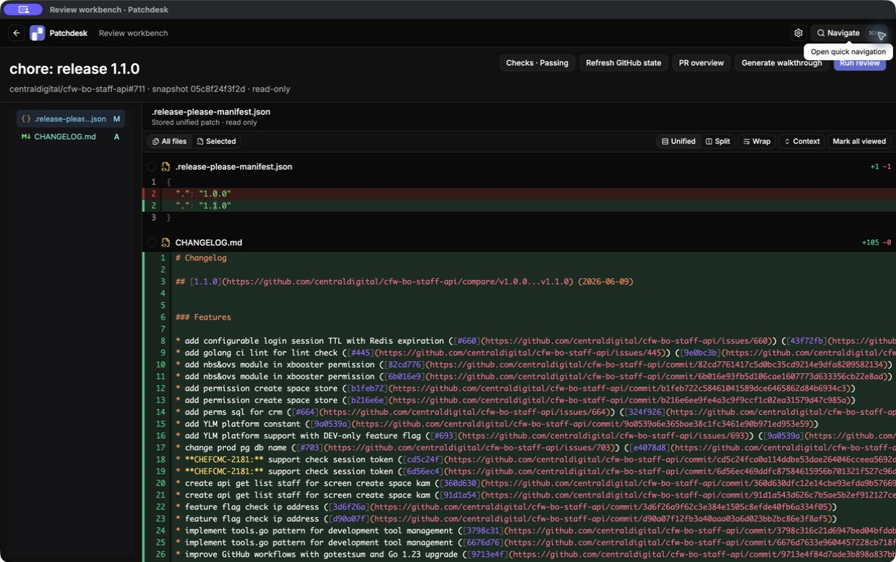

Health: readable diff, missing the saved result.

- Small pull requests remain easy to inspect in the current diff surface.
- Inbox state implies a saved review exists, but the workbench exposes no Review body, Findings, Insights, draft, or Published feedback.
- Long changed lines need an explicit wrapping and horizontal-navigation strategy.

## 13. Saved Review PR Overview

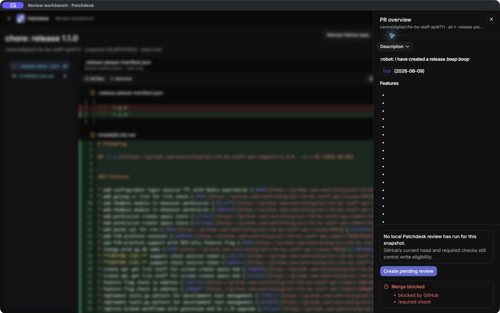

Health: publication actions are separated, state language conflicts.

- `Create pending review` remains an explicit action, separate from local model work.
- The overlay reports `0 drafts` and `No local Patchdesk review has run` even though the inbox offered `Open saved review`.
- Patchdesk Analysis, Review draft, pending GitHub review, and submitted GitHub review need distinct names and states.

## Unavailable Current States

The live app did not provide safe current examples of:

- Findings navigation or a mapped Finding focused against code.
- A rendered Analysis Review body.
- Insights overview, running, failed, outdated, or retained-result states.
- Walkthrough detail.
- Review draft editing or publication preview.
- Merge confirmation.

These gaps are not evidence that the product should omit those states. They identify the parts of the new design that require explicit visual design rather than adaptation of current UI.

## Current UI Strengths To Preserve

- Dense, code-first Review workbench.
- Fast changed-file navigation and strong diff rendering.
- Compact dark visual language with restrained indigo emphasis.
- Explicit GitHub-write boundaries.
- PR Overview overlay behavior: full-height, independently scrolling, closeable by X, Escape, or backdrop, with focus restoration.
- Clear local-data retention copy.

## Current UI Problems To Resolve

- Remove prepared, completed, model-review, manual-review, and read-only modes from product language.
- Give Analysis, Walkthrough, Findings, Review draft, and Published feedback stable homes.
- Replace contradictory saved-review and draft status copy with one Review lifecycle.
- Keep freshness, checks, and write safety visible even when PR Overview is closed.
- Put checks and merge readiness earlier in PR Overview.
- Reduce equally weighted header actions and clarify the primary action for the current state.
