# Unified Review Workbench Design

Status: approved implementation reference
Updated: 2026-08-01

## Purpose

This file is the visual reference for consolidating Patchdesk's prepared and completed workbench experiences into one persistent Review workbench. It translates the approved product specification into a UI direction grounded in the current live app.

Use this file together with:

- [Current UI inventory](current-ui-inventory.md)
- [Unified Review Workbench specification](../spec.md)
- [Product glossary](../../../../CONTEXT.md)
- [Review-workbench ADRs](../../../../docs/adr/)

The current-state screenshots contain real workspace and repository information. Keep them local unless they have been reviewed for publication.

## Selected Direction

Use one adaptive workbench rather than separate permanent layouts:

- The diff-first layout is the default Review surface.
- The expanded Review draft is a state of the bottom dock.
- Finding focus is a state of the Files navigator and central diff.
- PR-level context appears in the existing right-side overlay pattern.

The workbench changes emphasis when the maintainer changes tasks, but it never changes identity or enters prepared, completed, model-review, manual-review, or read-only modes.

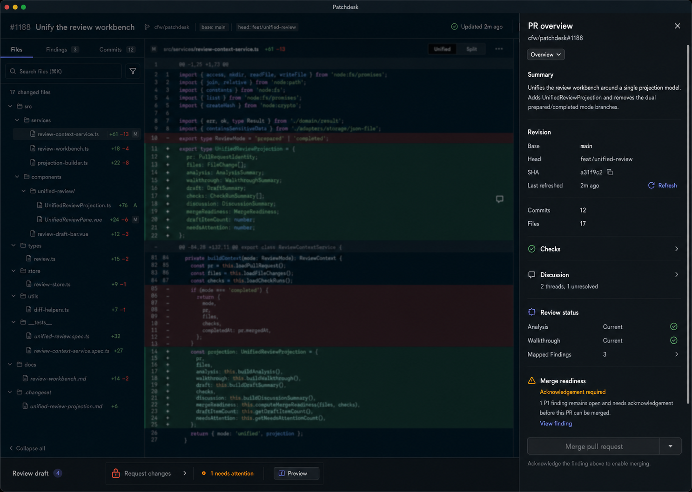

## Specification Alignment

The product specification uses the existing on-demand PR Overview overlay for full pull request context and merge readiness. The workbench header keeps freshness and checks visible while the overlay is closed.

## Visual Foundation

Preserve the current Patchdesk system instead of introducing a new brand layer:

- Dark neutral base with subtle charcoal surface changes.
- Inter for product UI and monospace typography for code.
- Indigo `#5e6ad2` for primary actions and selected navigation.
- Semantic red, amber, green, and blue only for meaningful status.
- Thin separators and spacing before borders, elevation, or cards.
- Restrained radii near the current 10px token.
- Dense desktop-tool proportions with approximately 14px body text.
- Existing Pierre diff rendering and theme behavior remain the code surface.

Do not use decorative gradients, floating app cards, dashboard metrics, illustrations, or marketing patterns.

## Workbench Anatomy

### Header

The compact header keeps stable PR identity and state visible:

- PR number and title.
- Repository, base branch, head branch, and short head SHA.
- Last refreshed time.
- `Updates available` only after positive detection.
- Checks summary.
- `PR overview` trigger.

Refresh becomes the primary action only when updates have been detected. Analysis and Walkthrough start actions belong in Insights rather than competing with diff controls in the header.

### Primary Surfaces

Use two semantic tabs:

- Files is the default and source-of-truth code surface.
- Insights contains Analysis, Walkthrough, and later built-in ways to understand code.

Changing Insight state must not reset Files selection, scroll position, Review draft, or focus.

### Files Navigator

The left side uses three semantic tabs:

- Files: changed-file tree and search.
- Findings: current safely mapped Findings only.
- Commits: ordered pull-request commits; selecting one filters the diff.

The selected tab changes navigation content, not the workbench route.

### Diff Canvas

The diff receives the largest share of the viewport:

- Full pull-request diff by default.
- Commit-specific diff when a commit is selected.
- Exact Finding evidence when a Finding is selected.
- Existing unified or split, wrap, context, and viewed controls.
- Inline drafting and mapped-Finding markers at valid current coordinates.

### Review Draft Dock

The Review draft is a persistent bottom dock across Files and Insights.

Collapsed state shows:

- Draft item count.
- Proposed GitHub decision.
- Needs-attention count.
- Preview action.

Expanded state shows:

- Structured Review body editor.
- Inline comments and thread actions.
- Include or exclude controls.
- Exact invalid-anchor recovery actions.
- Preview and publication entry points.

Expansion reduces visible diff height but does not cover or replace the workbench.

## PR Overview Overlay

Reuse the current overlay interaction because it preserves the diff's full width while closed and already behaves well in the live app.

### Layout

- Full-height panel attached to the right edge.
- Approximately 25–28% of the viewport; target about 370px at 1440px.
- Overlays rather than resizes the workbench.
- Strong dim and soft blur behind the panel.
- Sticky header with `PR overview`, PR identity, and close control.
- Independently scrolling body with a visible subtle scrollbar.

### Behavior

- Triggered from the stable workbench header.
- X, Escape, and backdrop click close it.
- Closing restores focus to the trigger.
- The background is recognizable but non-interactive while open.
- Panel focus is contained while open.

### Content Order

The current overlay puts long narrative content before urgent state. Reorder it:

1. Summary.
2. Revision and freshness, including Refresh.
3. Checks.
4. Discussion and review state.
5. Analysis and Walkthrough status.
6. Merge readiness and merge action.
7. Longer description, architecture, behavior, or linked context.

Use disclosure rows for secondary detail. Do not turn every section into a card.

## State Designs

### Default Files

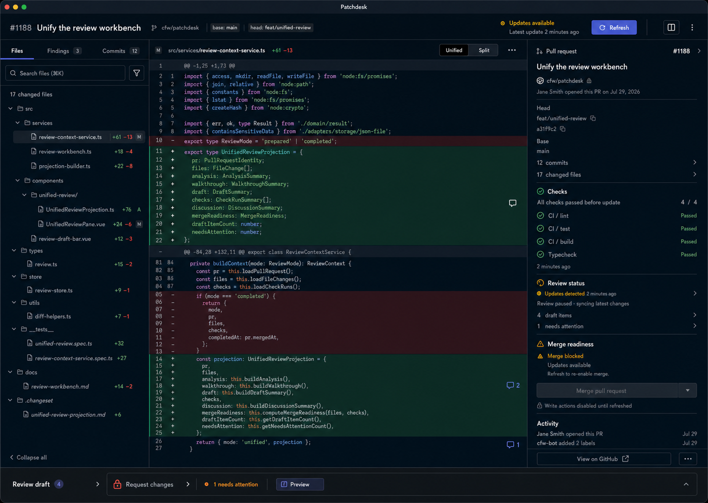

- Files navigator open.
- Full PR diff visible.
- Review draft collapsed.
- PR Overview closed.
- Freshness and checks remain visible in the header.

### Expanded Review Draft

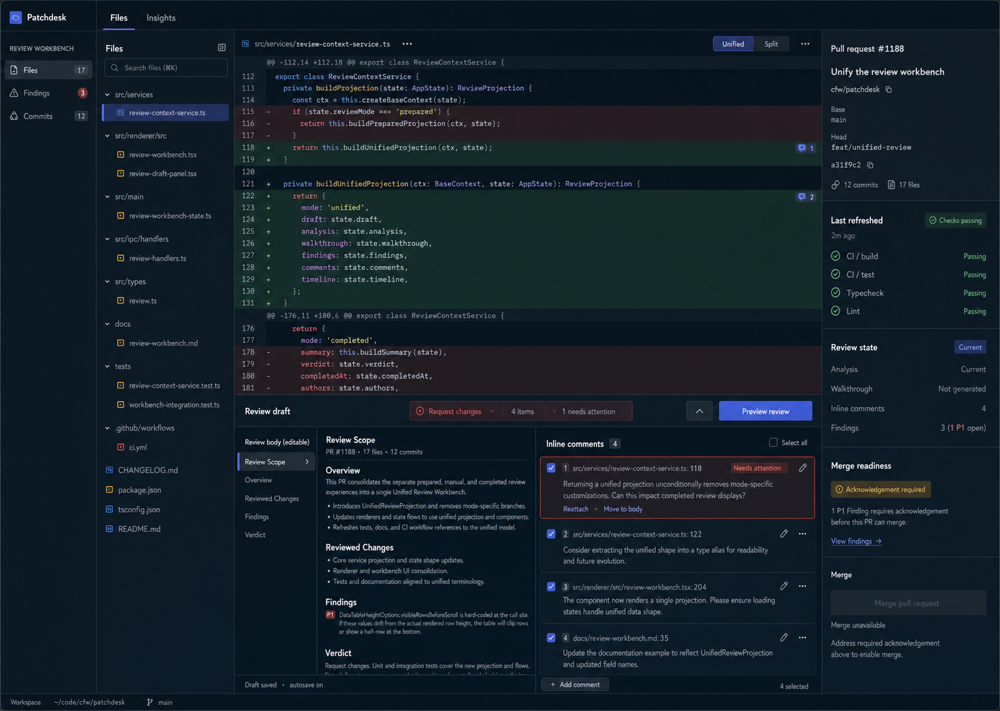

- Diff remains visible above the dock.
- Review body and inline draft items are edited together.
- Needs-attention recovery is visible before publication.
- This is a dock state, not a separate draft destination.

### Finding Focus

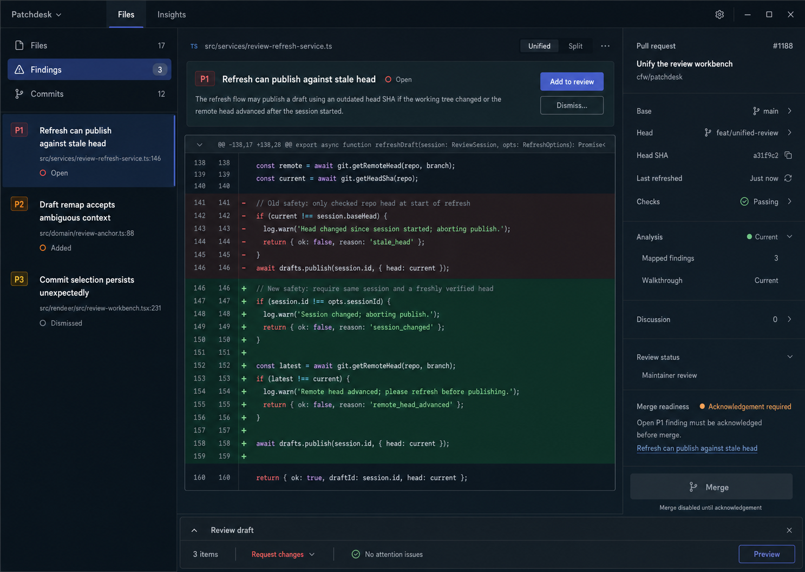

- Findings tab shows current mapped Findings only.
- Selecting a Finding highlights exact current code evidence.
- `Add to review` creates an independent editable draft copy.
- Finding state and merge-policy effect remain distinct from draft inclusion.

### PR Overview Open

- The diff keeps its full closed-state width under the overlay.
- The overlay temporarily owns PR-level inspection and merge readiness.
- The Review draft remains visible but non-interactive behind the scrim.

## Insights Navigation

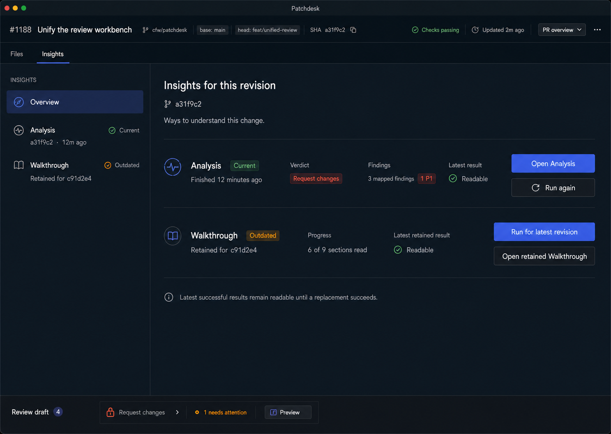

The left rail owns Insight navigation. It starts with a neutral Overview, then lists Analysis and Walkthrough as peers with status, revision identity, and recency. This leaves room for later built-in ways to understand code without adding another workbench mode.

Selecting an Insight replaces only the central content. The primary Files and Insights tabs, PR header, PR Overview trigger, and Review draft dock stay stable. The Overview summarizes each Insight and exposes the next appropriate action without duplicating its detail content.

## Analysis Lifecycle

Analysis detail uses one stable document layout. Status changes alter the header, safety message, and available actions; they do not replace the workbench shell.

### Running

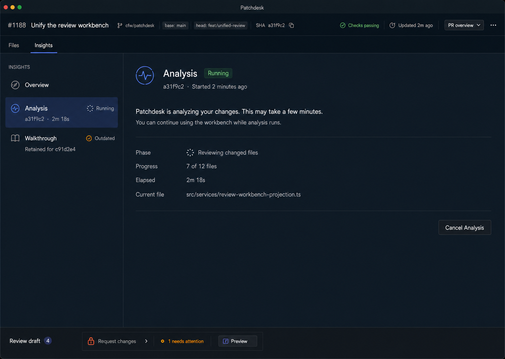

- Show the bound revision, current phase, bounded progress, elapsed time, and current file when available.
- Keep Files, other Insights, and the Review draft usable.
- Cancel Analysis is the only competing action.
- Do not show partial Review body, Verdict, or Findings.

### Current

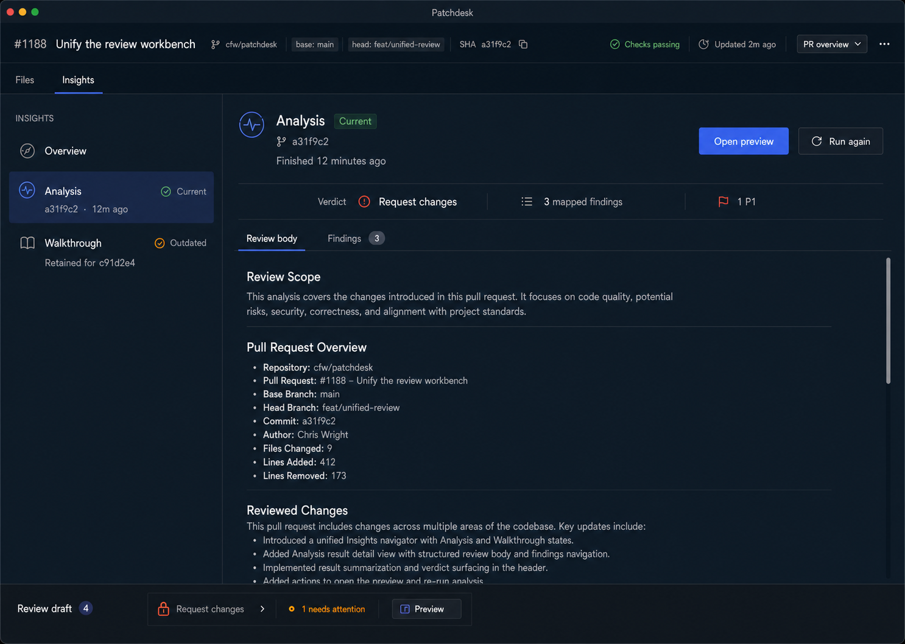

- Summarize Verdict, mapped Finding count, and highest priority before the document.
- Use Review body and Findings as local detail tabs; they do not replace the Files-level Findings navigator.
- Render the structured Review body as a readable document rather than a dashboard.
- Open preview and Run again are the main result actions. Existing draft content remains maintainer-owned.

### Outdated

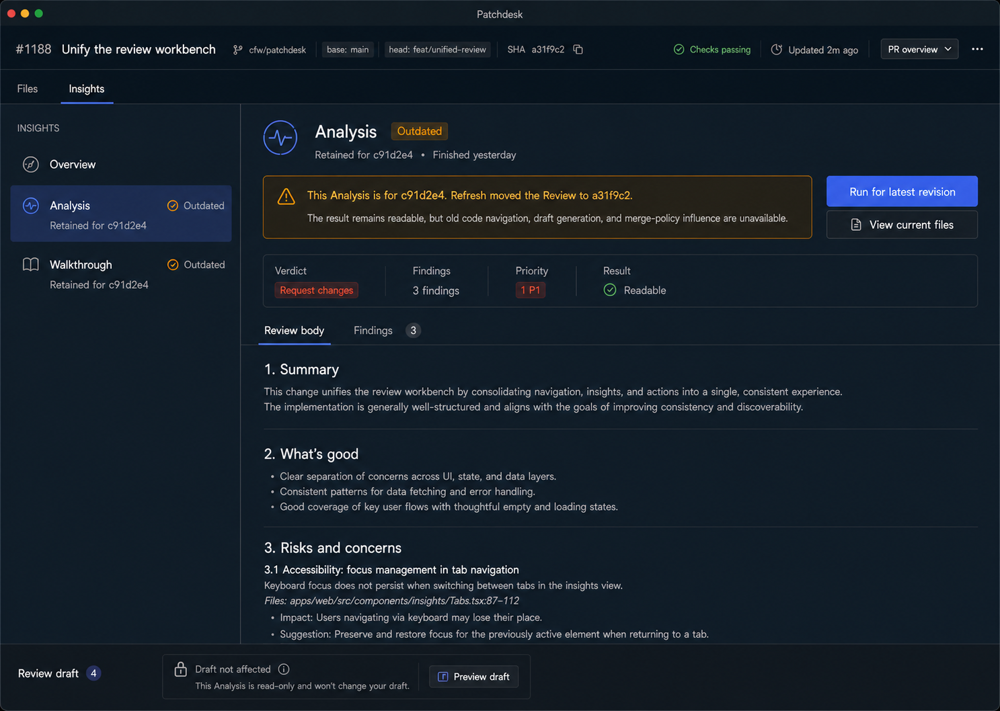

- Keep the retained result fully readable and show both its revision and the current Review revision.
- Make Run for latest revision the primary action.
- Disable old code navigation, Review draft generation, publication, and merge-policy influence.
- Do not label general concerns as unmapped or project old Findings into the Files navigator.

### Failed

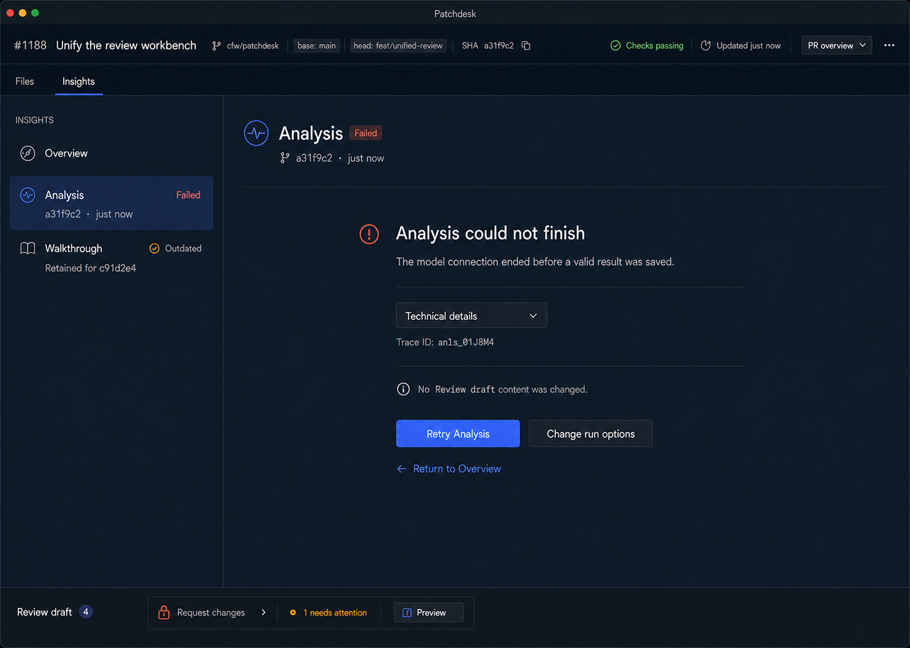

- Keep failure copy bounded and actionable: what failed, whether anything was saved, Retry Analysis, and Change run options.
- Put technical detail behind a disclosure and show a safe trace identifier instead of a raw stack trace.
- A first-run failure has no partial result.
- A failed or cancelled replacement keeps the retained result visible and adds the failure treatment above it.
- Analysis failure does not change GitHub checks or other independent PR state.

### Replacement Running

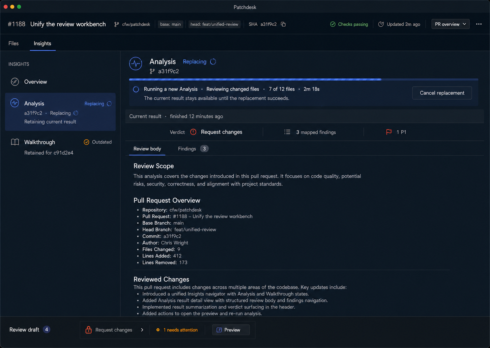

- Keep the latest successful result readable while its replacement runs.
- Show replacement progress in one compact strip above the retained result.
- Cancel replacement affects only the active run.
- Hide result actions that could publish or replace draft content until the replacement reaches a validated terminal state.
- On success, atomically replace the retained result. On failure or cancellation, preserve it and show bounded recovery.

Patchdesk retains only the latest successful Analysis result. The UI does not expose Analysis history.

## Walkthrough Experience

Walkthrough is a guided explanation of one immutable revision. It keeps the approved Insights rail, then adds one section outline and one reading surface. The outline gives fast random access; Previous and Next preserve a deliberate reading path.

### Current

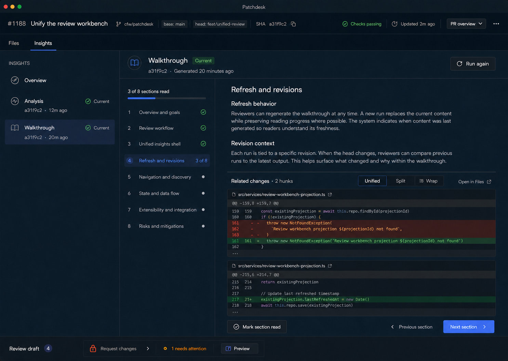

- Show one active section with concise prose followed by its related diff hunks.
- Render hunks directly with the existing diff language and shared Unified, Split, and Wrap preferences.
- `Open in Files` is optional and provides full-file context; it is never required to understand the section.
- Keep inline hunks evidence-only. Walkthrough does not create Findings, comments, or Review draft items.
- Keep Mark section read and overall reading progress local to this retained result. Reading progress never implies Review completion or GitHub publication.
- Keep any source hunks not explained by the narrative in a final Support group so coverage gaps remain visible.
- Run again follows the same non-destructive replacement contract as Analysis: keep this result readable until its replacement succeeds.

### Outdated

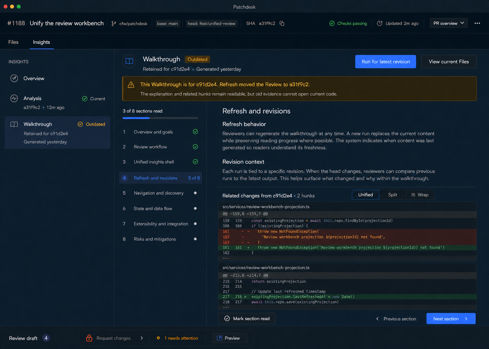

- Show the retained revision and current Review revision together with a bounded Outdated warning.
- Keep the explanation, inline hunks, section navigation, and local reading progress fully usable.
- Remove old `Open in Files` links and other coordinate-based evidence navigation.
- Make Run for latest revision primary and View current Files secondary.
- A successful replacement starts a new result with its own reading progress. Patchdesk does not expose Walkthrough history.

## Commits Navigator

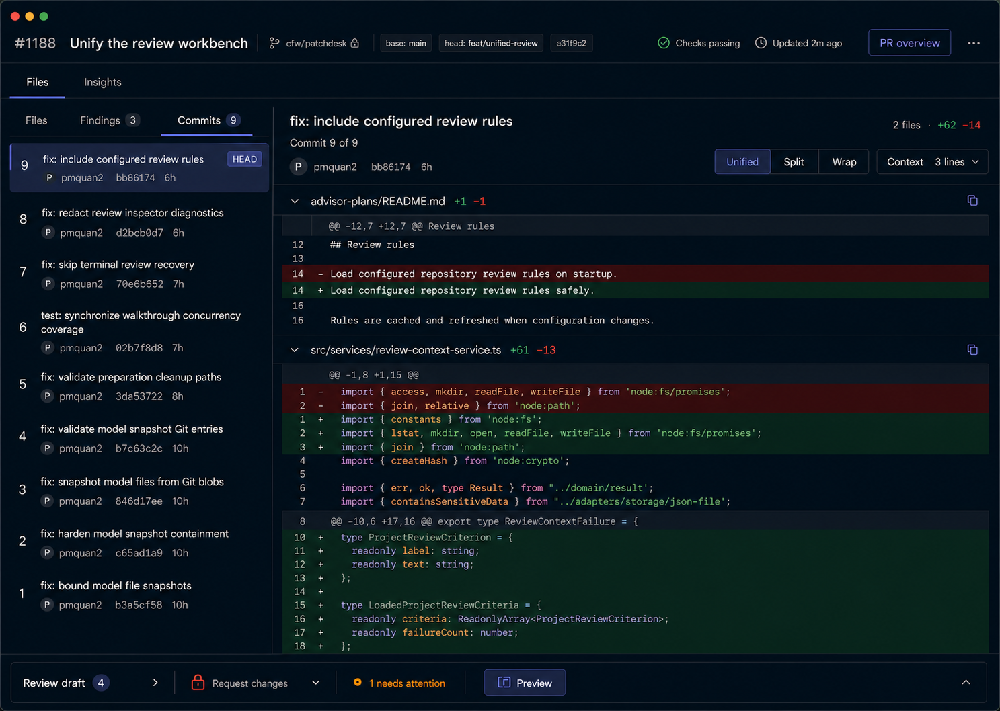

Use the dense subject-first list because it matches the supplied reference and requires the fewest new interaction rules.

- Keep Files and Insights as the primary surface tabs. Commits remains a tab inside the Files navigator beside Files and Findings.
- Opening Commits selects the newest pull-request commit. Reopening it selects the newest commit again instead of restoring temporary selection.
- Order commits newest first. Show subject, author, short SHA, relative time, and a HEAD marker on the newest commit.
- Keep rows compact and ungrouped. Do not add search, date sections, a commit graph, or affected-file expansion in the first version.
- Show commit title, position, author, SHA, time, file count, and additions and deletions in the central header.
- Render only the selected commit's diff beneath that header with the existing diff preferences.
- Clicking Files restores the full pull-request diff. Do not add an `All changes` row or another scope control.
- Allow inline drafting only where a commit line maps safely to the current pull-request diff. Hide unavailable comment entry points instead of explaining internal mapping.
- Preserve the Review draft and full-PR Files state while commit selection changes.

## Review Draft Needs Attention

Use focused anchor repair in the expanded Review draft dock. It keeps the affected draft item and its original code context together, makes one unsafe anchor the active repair target, and preserves the diff above the dock.

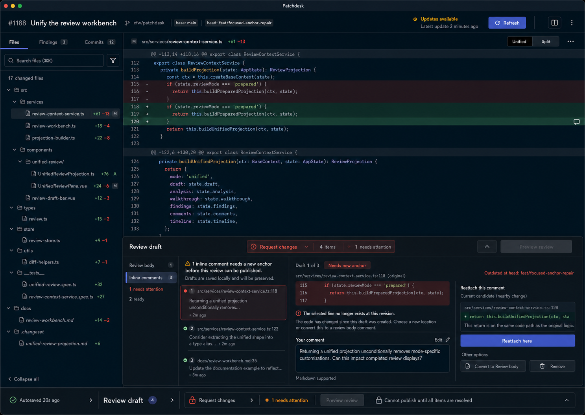

The dock lists every item that needs attention and focuses the first unresolved item when opened. `Reattach` starts explicit current-line selection in Files. `Convert to Review body` moves the text without losing its original context. `Remove` requires confirmation. Resolving an item advances to the next one. Publication remains blocked until the queue is empty.

The context-compare and diff-led variants remain saved as alternatives. They are not part of the first implementation.

## Publication Preview Exploration

Three publication-preview structures are preserved for selection. Each is a final confirmation surface rather than an editor and shows the exact Review body, included inline comments, included thread actions, selected GitHub decision, current head revision, and warnings.

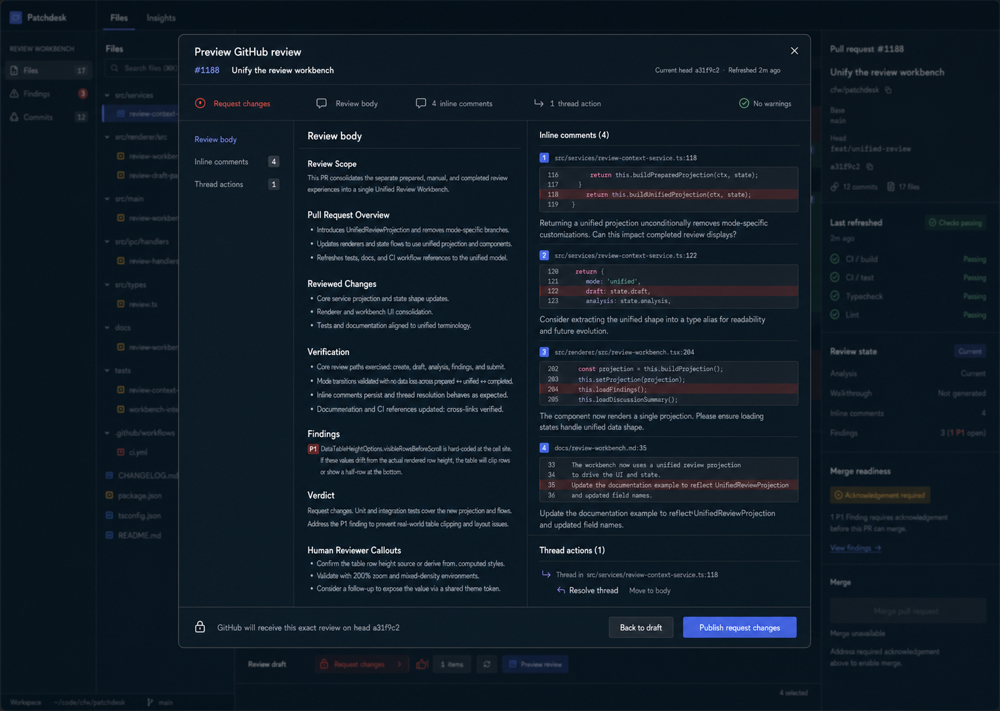

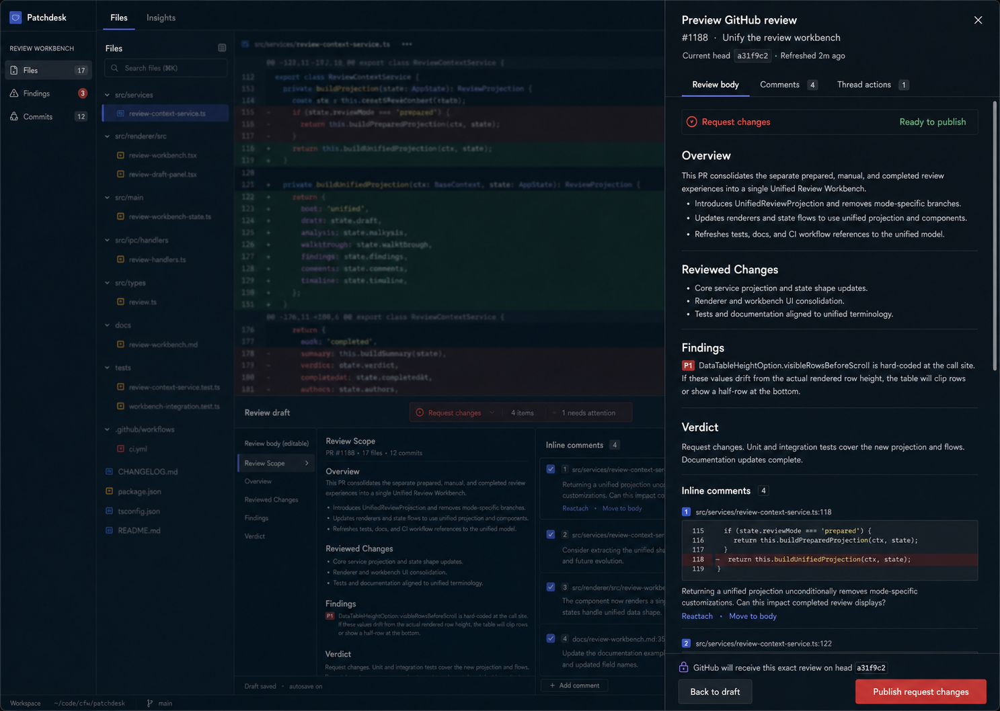

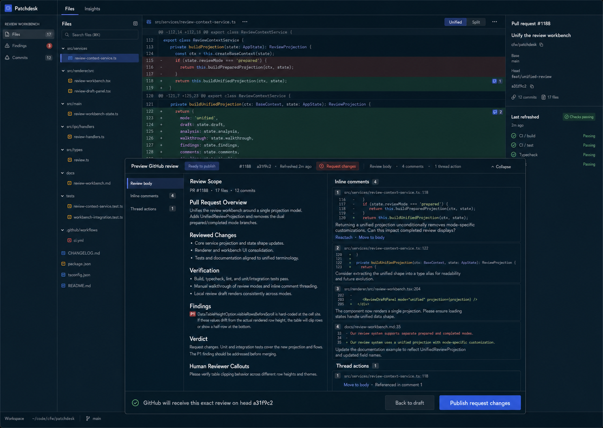

Every direction returns to the Review draft for edits and requires one explicit publish action. Draft content remains intact until GitHub confirms the complete intended publication outcome.

## Selected Publication Flow

Use the wide modal ledger because the complete Review body and code-heavy inline comments remain inspectable together without confusing preview with editing.

### Ready To Publish

- Open a centered modal approximately 1040px wide over a dimmed, non-interactive workbench.
- Show the exact Review body, included inline comments, included thread actions, GitHub decision, current head, and warnings.
- Keep all content read-only. `Back to draft` closes the preview and returns to editing.
- Bind the single explicit publish action to the visible decision and head revision.

### Publishing

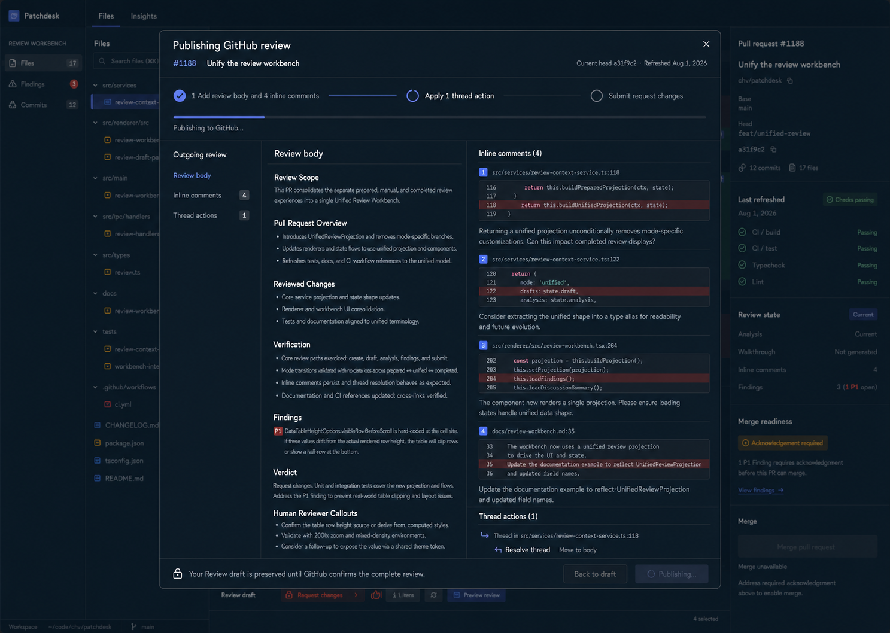

- Keep the exact payload visible while publishing so the modal does not become an unrelated loading screen.
- Show bounded ordered progress for adding the Review body and inline comments, applying thread actions, and submitting the chosen decision.
- Disable closing, returning to the draft, cancellation, and another publish action while a remote write is active.
- Preserve the Review draft until GitHub confirms the complete intended review.

### Confirmed

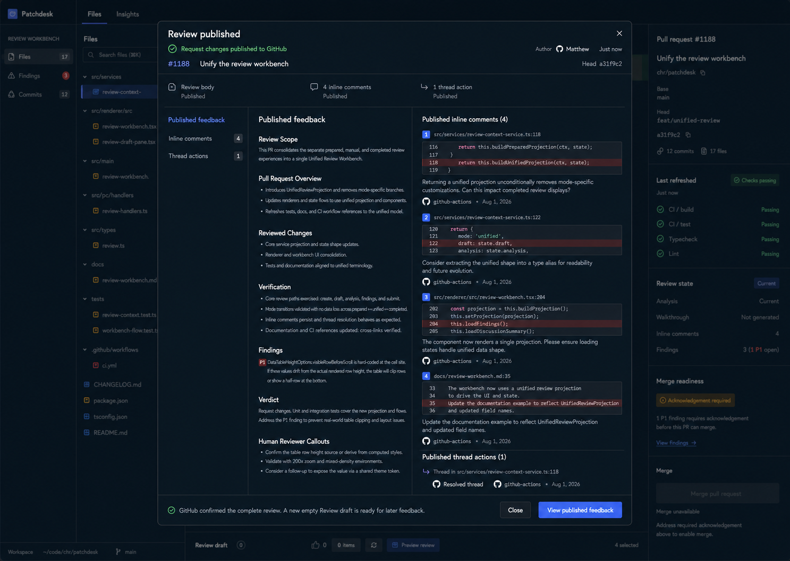

- Declare success only after GitHub confirms the complete publication outcome.
- Present the submitted content as GitHub-owned Published feedback rather than editable local draft content.
- Create and expose a new empty Review draft for later feedback.
- Offer `View published feedback` as the primary continuation and `Close` as the secondary action.
- Refresh Published feedback from GitHub instead of treating the submitted local payload as authoritative remote state.

### Publication Needs Confirmation

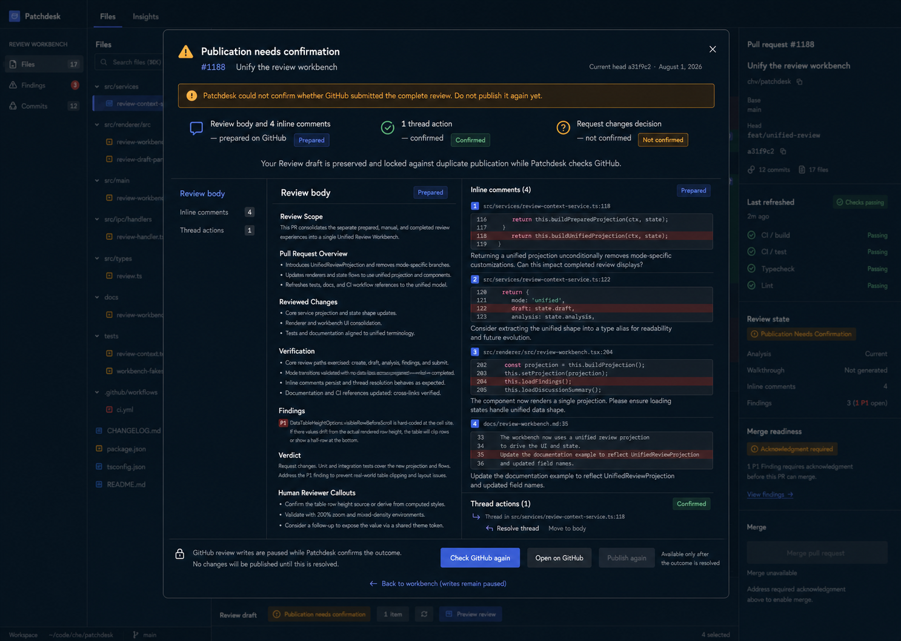

- State plainly that Patchdesk could not confirm the complete outcome and that the maintainer must not publish again yet.
- Summarize each user-visible group as confirmed, prepared, or not confirmed while retaining the exact intended payload below it.
- Preserve and lock the Review draft against duplicate publication. Pause conflicting GitHub writes across the workbench.
- Make `Check GitHub again` the primary recovery action and `Open on GitHub` secondary. Keep `Publish again` unavailable until reconciliation resolves the outcome.
- Never expose raw provider responses, pending-review identifiers, receipts, stack traces, or speculative success.

The implementation keeps the existing two-stage GitHub write and durable evidence model underneath these states. The UI presents one deliberate publication flow rather than asking maintainers to manage that protocol.

## Copy Direction

Replace implementation-oriented language:

- `Run local review` becomes `Run Analysis`.
- `Start read-only review` becomes the selected Analysis completion action, such as `Run Analysis` or `Run and open preview`.
- `Generate a read-only walkthrough` becomes `Generate Walkthrough`.
- `prepared snapshot` becomes revision or snapshot identity where needed.
- `Open saved review`, `0 drafts`, and `No local Patchdesk review has run` become explicit Analysis, Review draft, and Published feedback states.

Safety remains visible through precise statements such as `No GitHub writes until you publish`, `Updates available`, or `Publishing paused until refresh`.

## Responsive Behavior

At 1440px:

- The Files navigator targets 300–320px across Files, Findings, and Commits so switching tabs does not resize the diff.
- Diff receives the remaining width while PR Overview is closed.
- PR Overview targets about 370px when open.

At 1280px:

- Keep the same information hierarchy.
- Allow the Files navigator to collapse before reducing code readability.
- Keep PR Overview as an overlay rather than permanently compressing the diff.
- Prevent horizontal viewport overflow; internal code scrolling remains allowed.

## Accessibility Contract

- Use semantic tabs for Files and Insights and for Files, Findings, and Commits.
- Preserve focus when background Insight or freshness state changes.
- Restore focus after overlays, dialogs, and previews close.
- Trap focus inside modal overlays while open.
- Provide text and icon status, not color alone.
- Give every repeated file, repository, and comment action a unique accessible name.
- Announce Analysis and Walkthrough progress through bounded live regions.
- Respect reduced motion for dock, overlay, and disclosure transitions.

## Reference Assets

### Current UI

The accepted current-state screenshots are indexed in [Current UI inventory](current-ui-inventory.md) and stored under [`current-ui/`](current-ui/).

### Concepts

- [Previous selected direction](concepts/00-previous-selected-direction.png)
- [Diff-first default](concepts/01-diff-first.png)
- [Expanded Review draft](concepts/02-expanded-review-draft.png)
- [Finding focus](concepts/03-findings-focus.png)
- [PR Overview overlay](concepts/04-pr-overview-overlay.png)

### Insights

- [Selected Insights overview](insights-exploration/04-refined-insight-navigator-overview.png)
- [Analysis running](analysis-states/01-running.png)
- [Current Analysis](analysis-states/02-current.png)
- [Outdated Analysis](analysis-states/03-outdated.png)
- [Failed Analysis](analysis-states/04-failed.png)
- [Replacement Analysis running](analysis-states/05-replacement-running.png)
- [Current Walkthrough](walkthrough-states/01-current.png)
- [Outdated Walkthrough](walkthrough-states/02-outdated.png)

### Walkthrough Explorations

- [Focused chapter reader](walkthrough-exploration/01-focused-chapter-reader.png)
- [Outline document reader](walkthrough-exploration/02-outline-document-reader.png)
- [Change story map](walkthrough-exploration/03-change-story-map.png)

### Commit References And Explorations

- [Supplied commit navigator reference](reference-inputs/commit-navigator-reference.png)
- [Dense commit ledger](commit-exploration/01-dense-commit-ledger.png)
- [Chronological timeline](commit-exploration/02-chronological-timeline.png)
- [Commit with affected files](commit-exploration/03-commit-with-files.png)
- [Selected commit-specific diff](commit-states/01-selected-commit.png)

### Review Draft Explorations

- [Focused anchor repair](review-draft-exploration/01-focused-anchor-repair.png)
- [Context compare queue](review-draft-exploration/02-context-compare-queue.png)
- [Diff-led reattach](review-draft-exploration/03-diff-led-reattach.png)

### Publication Preview Explorations

- [Wide publication ledger](publication-exploration/01-wide-publication-ledger.png)
- [Publication side sheet](publication-exploration/02-publication-side-sheet.png)
- [In-place draft preview](publication-exploration/03-in-place-draft-preview.png)

### Selected Publication States

- [Ready to publish](publication-states/01-ready.png)
- [Publishing GitHub review](publication-states/02-publishing.png)
- [GitHub review confirmed](publication-states/03-confirmed.png)
- [Publication needs confirmation](publication-states/04-needs-confirmation.png)

Generated concepts are directional references. The product specification and ADRs are authoritative. Use this document for layout guidance only when it agrees with that contract; never implement text or behavior solely because it appears in a raster image.

## Implementation Readiness

The required first-version states are selected. Generated raster concepts remain directional references. The product specification and ADRs define the required behavior.

Merged and closed pull requests do not need dedicated visual designs. Reuse the unified workbench shell, replace active Review actions with the authoritative GitHub terminal status, and keep prior code, Insights, and Published feedback readable.
