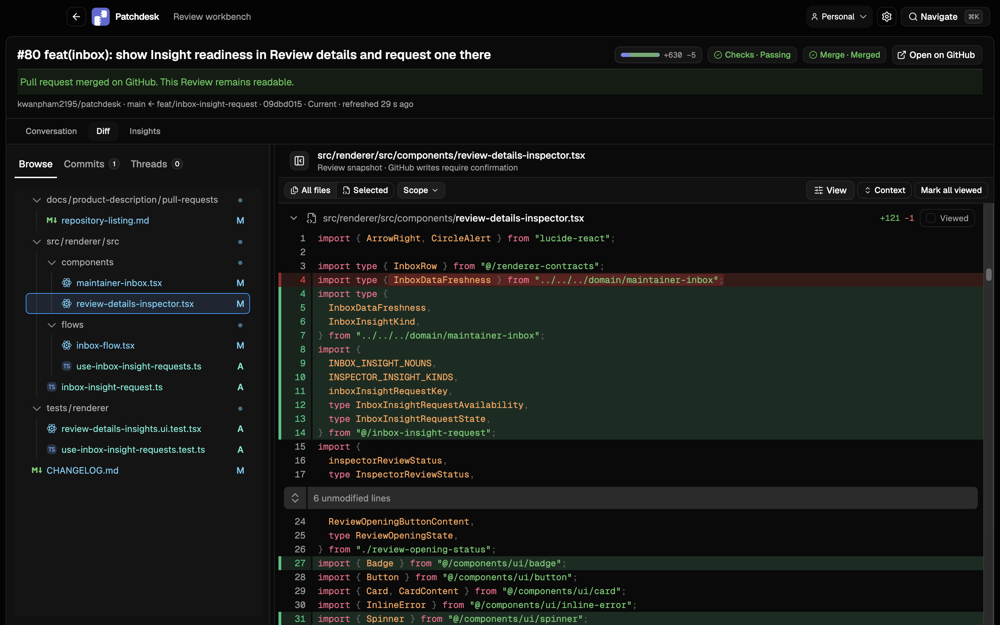
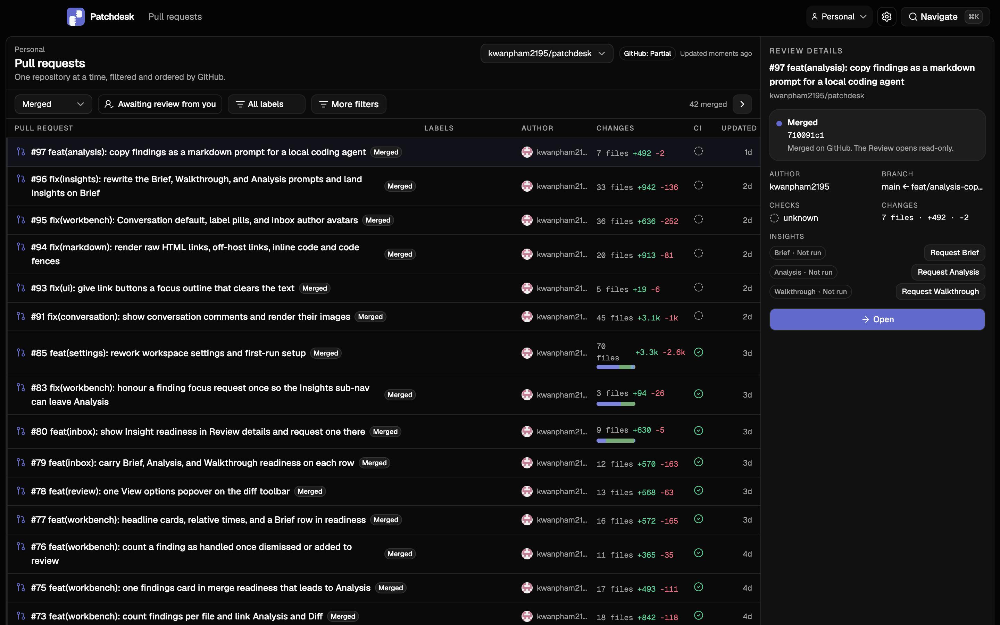
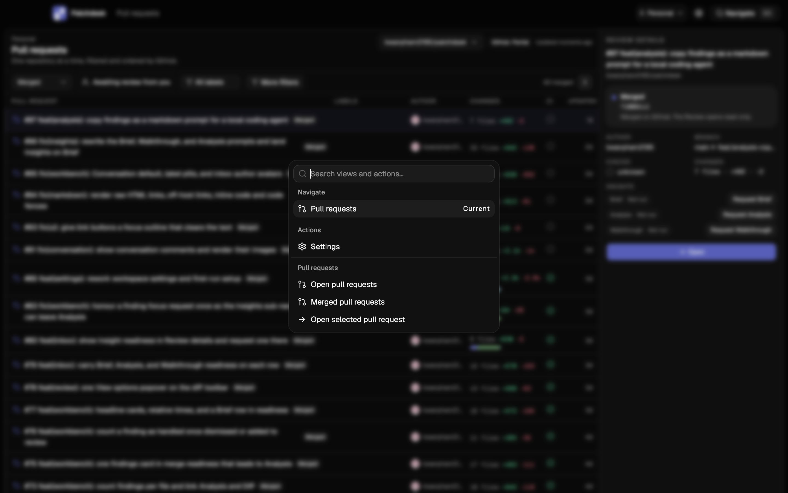

<p align="center">
  
</p>
<h1 align="center">Patchdesk</h1>
<p align="center">
  Review GitHub pull requests on your Mac, next to your checkouts, with no server in between.
</p>
<p align="center">
  <a href="https://github.com/kwanpham2195/patchdesk/releases"></a>
  <a href="LICENSE"></a>
</p>



## Why Patchdesk

- Everything runs on your Mac, and no GitHub token is stored: Patchdesk runs
  `gh auth token` each time it needs one.
- A GitHub write only happens from an action you name explicitly, never
  because an Insight finished.
- Models are optional and only add Insights: a Brief, a Walkthrough, or an
  Analysis of the diff.
- The Scope gauge buckets changed files by path and needs no model at all.

## What you get

### Pull requests



- Patchdesk shows one repository at a time, and GitHub decides what is in
  the list and in what order.
- Filter by state, labels, and More filters (review state, check status,
  author, base branch); active choices show as chips and are kept with your
  workspace.
- **Review details** shows checks, changes, and whether each Insight is
  Ready, Outdated, or Not run, with a **Request** button that starts one.
- The list refreshes only when you ask: opening the screen, changing a
  filter or page, or pressing ⌘R.

### Review workbench

- The **Conversation** tab holds the description, comments, threads, and the
  images inside them.
- The **Diff** tab has a file tree, one-commit slices, threads on their
  lines, view options, a Viewed mark per file, and a Diff/Preview switch for
  each Markdown file.
- The Scope picker in the diff toolbar narrows the tree and the diff to
  Core, Tests, Generated, Docs, or Config, and All files restores the whole
  diff.
- Leave line comments, resolve conversations, collect a pending review, and
  finish it as Approve, Request changes, or Comment.
- Merge with Squash, Merge, or Rebase when GitHub says the pull request is
  ready.
- A Review of a merged pull request opens read-only and stays readable.

### Insights

An Insight is optional and needs a model. It helps you understand a change;
it never replaces your Review.

- **Brief**, **Walkthrough**, and **Analysis** read in the order you review a
  change, and Insights opens on Brief.
- An **Analysis** finding carries a severity, opens at its line in the
  **Diff**, can be added to your review, and the open findings copy as a
  markdown prompt for a local coding agent.
- The **Scope** gauge buckets changed files by path and needs no model.
- There are two providers: API keys, read from environment variables for 32
  providers, or your existing Codex CLI login.
- The model never touches GitHub, your checkout, or the network beyond the
  model API itself.

The provider list is in
[docs/user-guide.md#insights](docs/user-guide.md#insights).

### Navigate



- ⌘K opens the **Navigate** palette, which jumps to a screen or runs a
  **Pull requests** action.
- Enter a GitHub pull request URL or a compact reference there to open that
  pull request, whether or not it is in the current list.

## Install

You need:

- macOS on Apple Silicon (arm64). Patchdesk does not run on Intel Macs,
  Windows, or Linux.
- `git`.
- The GitHub CLI (`gh`), logged in with `gh auth login`.

You do not need Node.js installed. The part of Patchdesk that runs Insights
ships inside the app and runs on Electron's own Node.

Either download the `.dmg` by hand or install through Homebrew.

**From the `.dmg`:**

1. Download the `.dmg` from the
   [Releases page](https://github.com/kwanpham2195/patchdesk/releases).
2. Open the `.dmg` and drag Patchdesk into Applications.

The build is not signed with an Apple Developer ID or notarized. The first
time you open Patchdesk, macOS reports Patchdesk.app as damaged and offers
only Move to Trash. Clear the quarantine flag macOS adds to downloads, once,
from a terminal, then open it normally:

```bash
xattr -cr /Applications/Patchdesk.app
```

**With Homebrew:**

```bash
brew trust --tap kwanpham2195/patchdesk
brew install --cask kwanpham2195/patchdesk/patchdesk
xattr -dr com.apple.quarantine /Applications/Patchdesk.app
```

Homebrew loads casks from a tap that is not its own only after you trust it,
which is what `brew trust` does. The `xattr` line clears the same quarantine
flag as above, because the app is not notarized. Later versions install with
`brew upgrade --cask patchdesk`.

Opening Patchdesk a second time while it is already running quits the new
copy right away; the existing window comes to the front instead.

## Learn more

- [docs/user-guide.md](docs/user-guide.md) — first run, reviewing pull
  requests, Insights and the providers they use, where Patchdesk keeps its
  files, how it stays safe, and known limits.
- [docs/product-description/README.md](docs/product-description/README.md) —
  what Patchdesk does, screen by screen.
- [docs/architecture.md](docs/architecture.md) — how the app is put together.
- [CONTRIBUTING.md](CONTRIBUTING.md) — building from source and contributing
  changes.
- [CHANGELOG.md](CHANGELOG.md) — what changed in each release.
- [LICENSE](LICENSE) — Patchdesk is MIT licensed.
