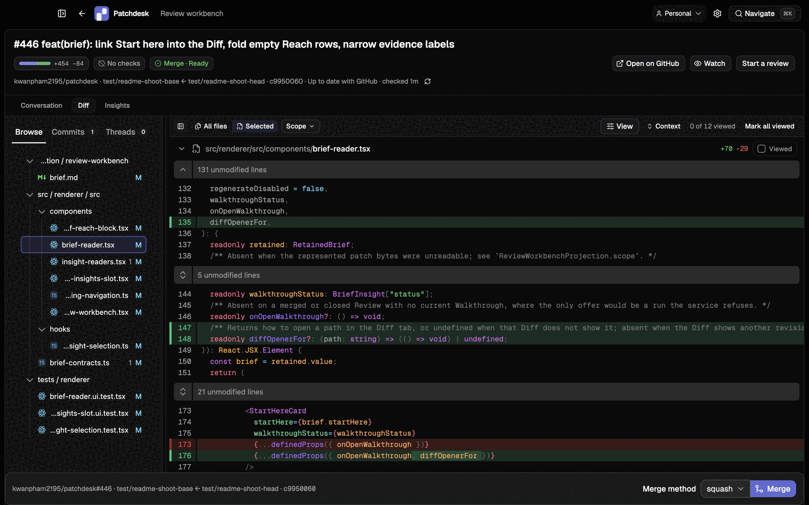
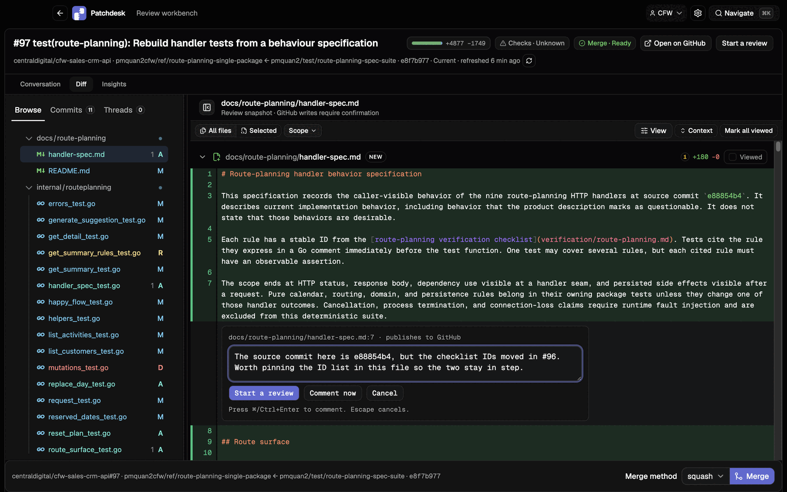
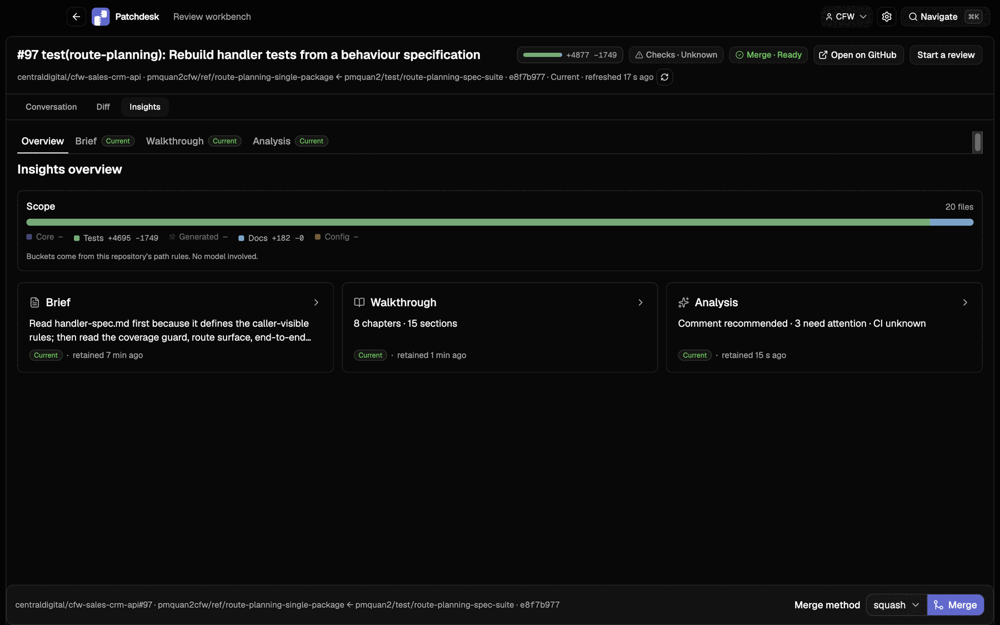

<p align="center">
  
</p>
<h1 align="center">Patchdesk</h1>
<p align="center">
  <strong>Review GitHub pull requests with the code beside you.</strong>
</p>
<p align="center">
  Patchdesk is an open-source macOS workbench for developers who want to
  understand a change before approving it. Browse by file, commit, or scope;
  comment and merge from one place; and add optional AI Insights. The model
  never receives access to GitHub.
</p>
<p align="center">
  <a href="https://github.com/kwanpham2195/patchdesk/releases/latest">Download the latest release</a>
  ·
  <a href="#install-with-homebrew">Install with Homebrew</a>
</p>
<p align="center">
  <a href="https://github.com/kwanpham2195/patchdesk/releases"></a>
  <a href="LICENSE"></a>
</p>


*A pull request open in the Review workbench, beside its local checkout.*

## Why developers use Patchdesk

- **Understand large changes faster.** Move between the conversation, files,
  commits, scopes, and review threads without rebuilding context across tabs.
- **Review beside the local checkout.** Patchdesk finds your repositories and
  keeps the represented pull-request revision next to the code it describes.
- **Use AI only when you choose.** The core review workflow needs no model.
  Optional Insights add a Brief, Walkthrough, or Analysis.
- **Keep every GitHub write explicit.** Comments, reviews, metadata changes,
  and merges start only from an action you name.

## Quick start

1. Use macOS on Apple Silicon, install `git` and the GitHub CLI, then sign in
   with `gh auth login`.
2. Install Patchdesk with Homebrew:

   ```bash
   brew trust --tap kwanpham2195/patchdesk
   brew install --cask kwanpham2195/patchdesk/patchdesk
   xattr -dr com.apple.quarantine /Applications/Patchdesk.app
   ```

3. Open Patchdesk, choose the folder that contains your checkouts, and select
   a repository to review.

> Patchdesk is not yet signed with an Apple Developer ID or notarized. The
> `xattr` command clears the quarantine flag that macOS adds to the downloaded
> app. See [Install](#install) for the full instructions and current platform
> limits.

## Review from change to decision

Start with one repository. Filter its pull requests by state, labels, review
state, check status, author, or base branch. Open a pull request to keep its
description, discussion, checks, changed files, and review state together.



*Browse the diff from a file tree, narrow it by scope, or read one commit at a
time.*

The Diff tab carries each file's status and Viewed mark. Markdown files can
switch between Diff and Preview. Scope narrows the change to Core, Tests,
Generated, Docs, or Config without using a model.



*A line comment reaches GitHub only when you publish it.*

Leave line comments, resolve conversations, and collect a pending review.
Finish it as Approve, Request changes, or Comment. When GitHub reports that the
pull request is ready, merge with Squash, Merge, or Rebase.

Press ⌘K anywhere to open the Navigate palette. Paste a GitHub pull-request
URL or compact reference to open it directly.

## Optional Insights

Insights help you understand a change; they never replace your Review. The
core review workflow, including the Scope gauge, works without a model.



*Brief, Walkthrough, and Analysis remain separate, revision-bound results.*

- **Brief** shows the shape and reach of the change and suggests where to
  start reading.
- **Walkthrough** explains the change in chapters tied to its diff hunks.
- **Analysis** presents evidence-backed findings that open at their lines in
  the Diff and can be added to your review.

Every run names its provider, model, reasoning effort, and readable inputs
before it starts. Patchdesk can use API keys from environment variables or an
existing Codex CLI login. The model cannot access GitHub, your checkout, or the
network beyond its model API. See the
[Insights guide](docs/user-guide.md#insights) for supported providers.

## Privacy and write safety

- Patchdesk runs on your Mac, with no Patchdesk server in between.
- It does not store your GitHub token. It runs `gh auth token` each time it
  needs one.
- An Insight result cannot publish a comment, submit a review, change pull
  request metadata, or merge code.
- GitHub writes start only from explicit controls and stay tied to the
  represented pull-request revision.
- A merged pull request opens read-only and remains available for inspection.

## Install

Patchdesk currently requires:

- macOS on Apple Silicon (arm64). Intel Macs, Windows, and Linux are not
  supported.
- `git`.
- The GitHub CLI (`gh`), authenticated with `gh auth login`.

Node.js is not required. The optional Insight runtime ships inside the app and
uses Electron's Node runtime.

### Install with Homebrew

```bash
brew trust --tap kwanpham2195/patchdesk
brew install --cask kwanpham2195/patchdesk/patchdesk
xattr -dr com.apple.quarantine /Applications/Patchdesk.app
```

Homebrew requires trust before it loads a cask from a third-party tap. The
`xattr` command is also required because the app is not notarized. Upgrade a
later release with:

```bash
brew upgrade --cask patchdesk
```

### Install from the disk image

1. Download the `.dmg` from the
   [latest release](https://github.com/kwanpham2195/patchdesk/releases/latest).
2. Open it and drag Patchdesk into Applications.
3. Clear the quarantine flag once, then open Patchdesk normally:

   ```bash
   xattr -cr /Applications/Patchdesk.app
   ```

Until Patchdesk is signed and notarized, macOS may report the downloaded app
as damaged and offer only Move to Trash. The command above clears the download
quarantine flag; it does not change the app.

Opening Patchdesk while it is already running brings the existing window to
the front and quits the new copy.

## Build and contribute

Patchdesk is an Electron application released under the MIT license. A source
checkout requires Node.js 22.19 or later and pnpm 8.8.0:

```bash
pnpm install
pnpm dev
```

Read [CONTRIBUTING.md](CONTRIBUTING.md) before making a change. It covers the
codebase, test boundaries, development commands, and commit conventions.

## Documentation

- [User guide](docs/user-guide.md) — first run, reviews, Insights, storage,
  safety, and known limits.
- [Product description](docs/product-description/README.md) — detailed
  behavior, screen by screen.
- [Architecture](docs/architecture.md) — application layers and boundaries.
- [Changelog](CHANGELOG.md) — changes in each release.
- [License](LICENSE) — MIT license terms.

If Patchdesk improves your review workflow,
[star the repository](https://github.com/kwanpham2195/patchdesk).
