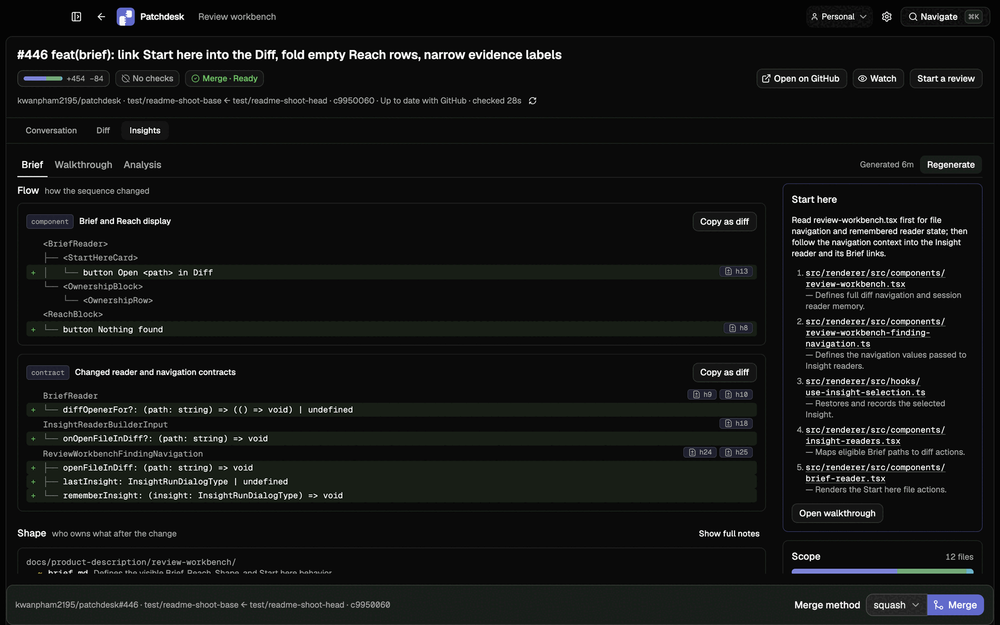
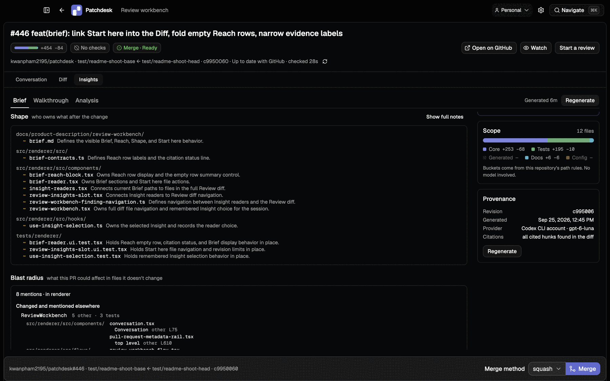
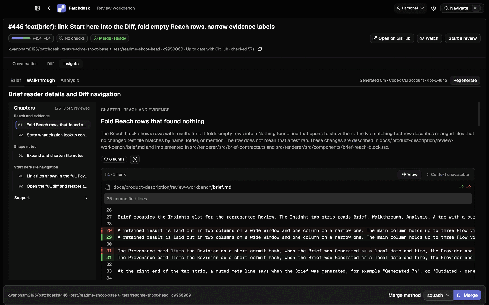
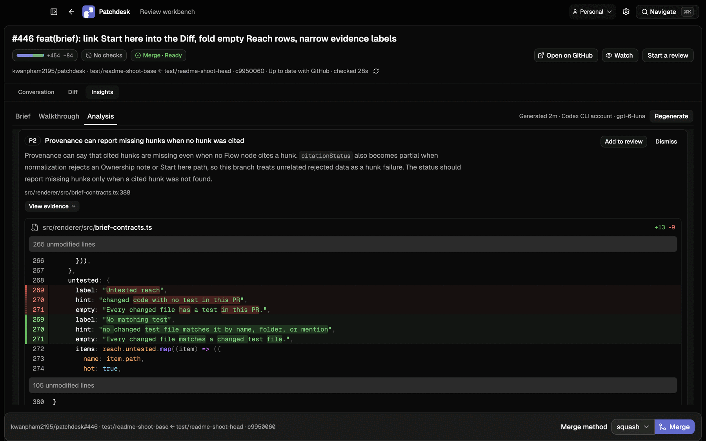
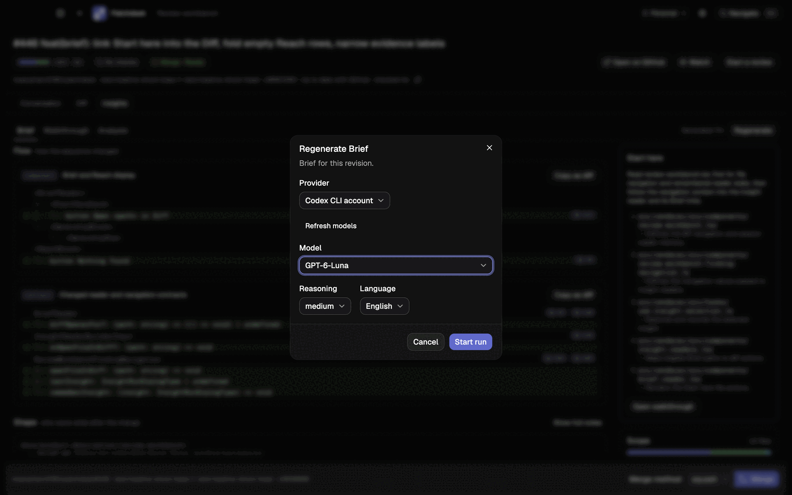

<p align="center">
  
</p>
<h1 align="center">Patchdesk</h1>
<p align="center">
  <strong>AI-assisted pull request review, grounded in the diff.</strong>
</p>
<p align="center">
  Patchdesk turns a GitHub pull request into a focused desktop workspace with
  an AI Brief, a guided Walkthrough, and evidence-backed Analysis. Read the
  code, follow every finding to its line, and finish the review without
  rebuilding context across tabs.
</p>
<p align="center">
  <a href="https://github.com/kwanpham2195/patchdesk/releases/latest"><strong>Download for macOS</strong></a>
  ·
  <a href="#install-with-homebrew">Install with Homebrew</a>
  ·
  <a href="docs/user-guide.md">Read the guide</a>
</p>
<p align="center">
  <a href="https://github.com/kwanpham2195/patchdesk/releases"></a>
  
  <a href="LICENSE"></a>
</p>



<p align="center"><em>Start with the shape of the change, follow its implementation, then review the evidence.</em></p>

## Understand the change before you approve it

Patchdesk gives you three AI tools for different stages of a review. Run one or
all three with the provider, model, and reasoning level you choose.

### Brief finds the reading path

Brief maps the shape of a pull request, explains what each changed area owns,
shows what it could affect in files it doesn't change, and links each
recommended file straight into the Diff.



### Walkthrough explains the implementation

Walkthrough organizes the change into chapters tied to real diff hunks. Move
through the implementation in a deliberate order while keeping the code in
view.



### Analysis reviews the evidence

Analysis calls out concrete concerns with file and line evidence. Open a
finding at the relevant code, add it to your review, or dismiss it as you work
through the pull request.



## Bring your preferred model

Choose the provider, model, and reasoning level for every run. Patchdesk works
with supported API-key providers and your existing Codex CLI login, so you can
use the models and account you already have.

Each Insight stays attached to the pull-request revision it analyzed. Brief,
Walkthrough, and Analysis remain separate results, ready to revisit throughout
the review.



## Review the whole pull request in one place

AI Insights sit inside a complete GitHub review workflow:

- Triage pull requests by state, labels, review status, checks, author, or base
  branch.
- Browse changes by file, commit, or scope, with a local checkout beside the
  review.
- Read conversations, preview Markdown, and comment on exact diff lines.
- Build a pending review, submit your decision, and merge when the pull request
  is ready.
- Press <kbd>⌘K</kbd> to jump to a pull request from anywhere in the app.


<p align="center"><em>Files, commits, scope, threads, and the rendered diff stay together.</em></p>

## Local-first by design

Patchdesk runs on your Mac and connects to GitHub through your authenticated
GitHub CLI account. Insight runs use prepared review context from the current
revision, and you decide which findings become part of the review.

## Quick start

Patchdesk currently supports macOS on Apple Silicon. Install `git` and the
GitHub CLI, then sign in once with `gh auth login`.

### Install with Homebrew

```bash
brew trust --tap kwanpham2195/patchdesk
brew install --cask kwanpham2195/patchdesk/patchdesk
xattr -dr com.apple.quarantine /Applications/Patchdesk.app
```

Open Patchdesk, choose the folder that contains your checkouts, and select the
repositories you want to review.

> The current release is not notarized. The `xattr` command clears the
> quarantine flag that macOS adds to the downloaded app.

### Install from the disk image

1. Download the `.dmg` from the
   [latest release](https://github.com/kwanpham2195/patchdesk/releases/latest).
2. Drag Patchdesk into Applications.
3. Clear the download quarantine flag once:

   ```bash
   xattr -cr /Applications/Patchdesk.app
   ```

### Build from source

A source build requires Node.js 22.19 or later and pnpm 8.8.0:

```bash
git clone https://github.com/kwanpham2195/patchdesk.git
cd patchdesk
pnpm install
pnpm install:mac
```

For development commands and project conventions, read
[CONTRIBUTING.md](CONTRIBUTING.md).

## Learn more

- [User guide](docs/user-guide.md) covers first run, review workflows,
  Insights, providers, storage, and current limits.
- [Product description](docs/product-description/README.md) documents the app
  screen by screen.
- [Architecture](docs/architecture.md) explains the application layers and
  boundaries.
- [Changelog](CHANGELOG.md) lists changes in each release.

Patchdesk is open source under the [MIT license](LICENSE). If it improves your
review workflow, [star the repository](https://github.com/kwanpham2195/patchdesk).
