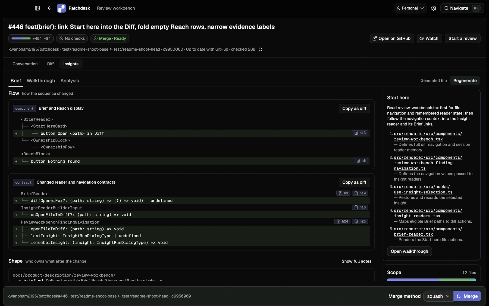
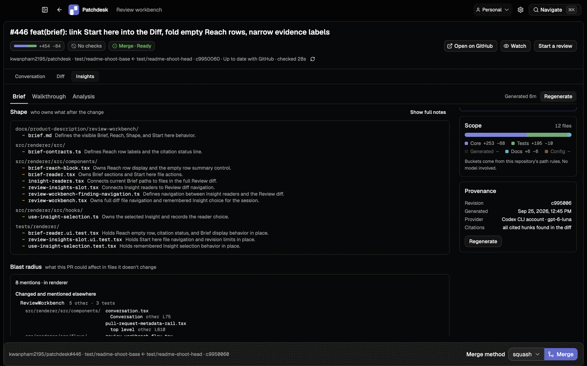
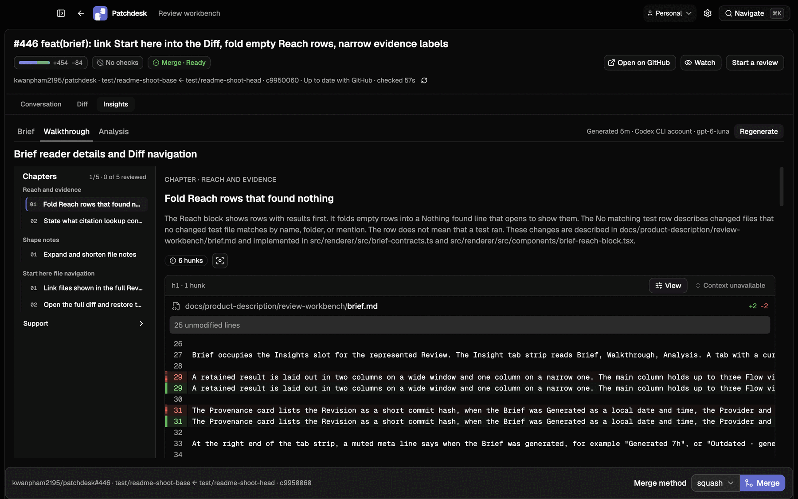
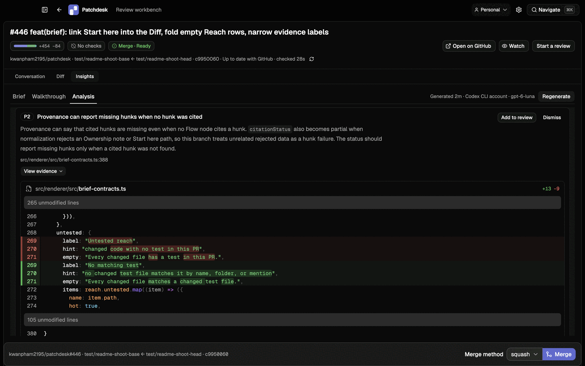
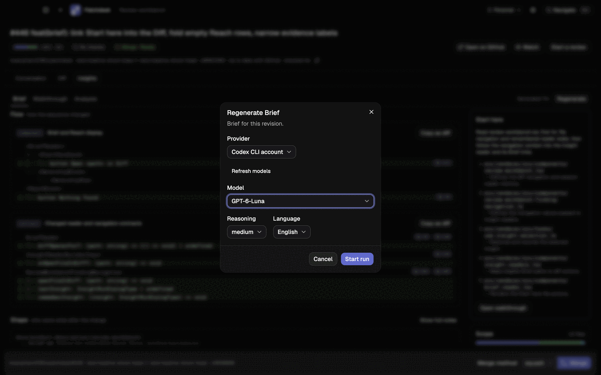
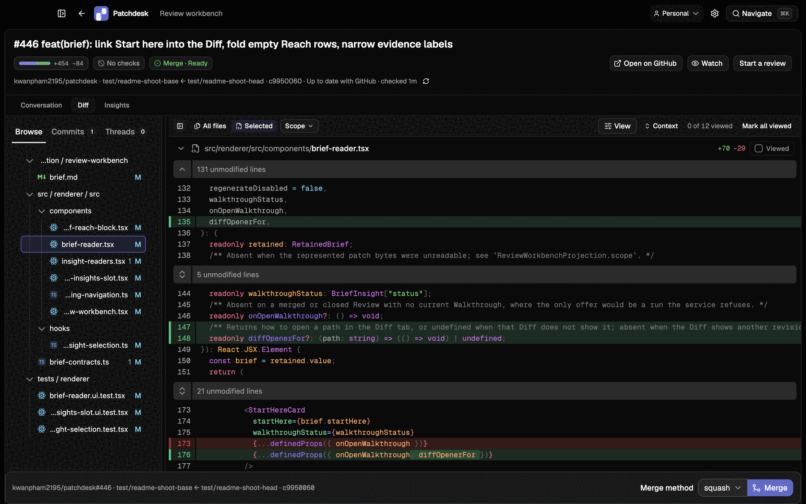

<p align="center">
  
</p>
<h1 align="center">Patchdesk</h1>
<p align="center">
  <strong>Review pull requests and your coding agent's changes with the diff in view.</strong>
</p>
<p align="center">
  Brief maps changed flows and where to read. Walkthrough pairs each chapter
  with its cited diff. Analysis shows findings at source lines for you to
  inspect, add to a review, or dismiss. You can also leave notes on an agent's
  uncommitted work and review its next revision in the same app.
</p>
<p align="center">
  <a href="#install-patchdesk"><strong>Install for macOS</strong></a>
  ·
  <a href="https://github.com/kwanpham2195/patchdesk/releases/latest">Download</a>
  ·
  <a href="docs/user-guide.md">Read the guide</a>
</p>
<p align="center">
  <sub>Setting this up as a coding agent? Start at <a href="#for-coding-agents">For coding agents</a>.</sub>
</p>
<p align="center">
  <a href="https://github.com/kwanpham2195/patchdesk/releases"></a>
  
  <a href="LICENSE"></a>
</p>



<p align="center"><em>Start with the shape of the change, follow its implementation, then review the evidence.</em></p>

## Watch the tour

A five-minute walkthrough: triage pull requests, read a diff with Insights,
send a review, and review a coding agent's change over MCP.

https://github.com/user-attachments/assets/861a56f9-c76d-4b77-8254-43762a924251

## Features

- **Pull request triage.** Filter a repository's pull requests by state,
  labels, review status, checks, author, or base branch. Press <kbd>⌘K</kbd>
  or paste a GitHub link to open any pull request.
- **GitHub review.** Browse the diff by file, commit, or scope beside your
  local checkout. Comment on diff lines, resolve conversations, build a pending
  review, submit your decision, and merge.
  [More](#review-the-whole-pull-request-in-one-place)
- **Insights.** Three optional AI reads of a change, each kept with the
  revision it analyzed:
  - [Brief](#brief-finds-the-reading-path) shows which calls, states, or
    exported contracts changed, which code outside the patch mentions them,
    and where to start reading.
  - [Walkthrough](#walkthrough-explains-the-implementation) explains the
    change in chapters, each beside its cited diff hunks, and tracks which
    chapters you reviewed.
  - [Analysis](#analysis-reviews-the-evidence) checks the patch against its
    description and lists Findings with file and line evidence. You add a
    Finding to your review, sometimes as a GitHub suggested change, or dismiss
    it.
- **Your provider and model.** Run Insights with an API key for providers such
  as Anthropic, OpenAI, or Google, or with your Codex CLI login. Pick the
  model, reasoning level, and output language (English or Vietnamese) per run.
  [More](#bring-your-preferred-model)
- **Local Reviews.** Review your branch against its base branch, committed
  and uncommitted changes together, or one commit, before it reaches GitHub.
- **Coding agents over MCP.** Claude Code and Codex open a local Review of
  their change, read your notes on its lines, and refresh the Review with
  their fix. An Insight an agent requests waits until you press **Run**.
  [More](#review-your-coding-agents-work)
- **Watch.** Get a macOS notification when a watched pull request gets a
  comment or review, new commits, or changed checks, or when it merges or
  closes.
- **Explicit GitHub writes.** Patchdesk writes to GitHub only from an action
  you choose, such as **Add to review**. If it cannot confirm that a write
  went through, it blocks further writes until you check GitHub again.

## Install Patchdesk

Patchdesk runs on macOS with Apple Silicon. You need `git` and the GitHub CLI
(`gh`) to review GitHub pull requests. The packaged app does not need Node.js.

### Install with one command

For a fresh install, run:

```bash
curl -fsSL https://raw.githubusercontent.com/kwanpham2195/patchdesk/main/scripts/install-release.sh | sh
```

[Read the installer](scripts/install-release.sh) before running it. It downloads
the latest published Apple Silicon ZIP, checks its SHA-256 digest against the
GitHub release, installs Patchdesk in `/Applications`, and links `patchdesk`
in `/usr/local/bin`. It may request an administrator password for those
folders. It stops if the app or command already exists, so you can choose how
to update or replace it. The current release is not notarized, so the installer
clears the download quarantine flag if macOS added it.

### Install with Homebrew

```bash
brew install --cask kwanpham2195/patchdesk/patchdesk
```

Installing by the fully qualified cask name trusts only this cask, and
Homebrew puts the `patchdesk` command on your PATH. The current release is not
notarized, so clear the quarantine flag before the first launch:

```bash
xattr -dr com.apple.quarantine /Applications/Patchdesk.app
```

### Install from the disk image

1. Download the `.dmg` from the
   [latest release](https://github.com/kwanpham2195/patchdesk/releases/latest).
2. Drag Patchdesk into Applications.
3. The current release is not notarized, so clear the download quarantine
   flag before the first launch:

   ```bash
   xattr -dr com.apple.quarantine /Applications/Patchdesk.app
   ```

To connect a coding agent after a disk-image install, first
[link the `patchdesk` command](docs/mcp.md#install-the-command).

### Build and install from source

Install Node.js 22.19 or later and pnpm 8.8.0, then run:

```bash
git clone https://github.com/kwanpham2195/patchdesk.git
cd patchdesk
pnpm install
pnpm install:mac
```

`pnpm install:mac` builds Patchdesk, replaces the copy in `/Applications` if
one exists, and opens the installed app. Run `pnpm package:mac` if you only
want the package files. See [CONTRIBUTING.md](CONTRIBUTING.md) for development
commands.

### Finish setup

Check that `uname -m` prints `arm64`, `git --version` and `gh --version` work,
and `gh auth status` shows an authenticated account. If it does not, run
`gh auth login`. Open Patchdesk and add the repositories to review as
`owner/repo`. Press Continue to see the pull request list. With Patchdesk open,
`patchdesk setup add-repo` run in a checkout adds its repository from the
terminal instead; see
[Set up the workspace from the terminal](docs/mcp.md#set-up-the-workspace-from-the-terminal).

To have a coding agent do the whole setup, run it in the project you want
to review and give it this task:

> Set up Patchdesk for this project using
> https://github.com/kwanpham2195/patchdesk. Follow these steps in order:
>
> 1. Check the prerequisites in [Finish setup](#finish-setup): `uname -m`
>    prints `arm64`, and `git --version` and `gh --version` work.
> 2. If `command -v patchdesk` finds nothing, install Patchdesk
>    [with Homebrew](#install-with-homebrew). If
>    `/Applications/Patchdesk.app` already exists,
>    [link the command](docs/mcp.md#install-the-command) instead.
> 3. Run `patchdesk setup status`. If it answers `app_not_running`, run
>    `open -a Patchdesk`, wait a few seconds, and run it again. If it asks
>    for `gh auth login`, stop and ask me to run it.
> 4. Run `patchdesk setup add-repo` in this project's checkout.
> 5. Register the MCP server unless `claude mcp get patchdesk` or
>    `codex mcp get patchdesk` already finds it: run
>    `claude mcp add patchdesk -- patchdesk mcp` in Claude Code or
>    `codex mcp add patchdesk -- patchdesk mcp` in Codex. Then run
>    `patchdesk mcp --check`, which lists this checkout when the app answers.
> 6. Ask me whether you should open a Review for every change. If yes, add
>    the "Review in Patchdesk" block from
>    [Tell your agent when to use it](docs/mcp.md#tell-your-agent-when-to-use-it)
>    to this project's `AGENTS.md` or `CLAUDE.md`.
> 7. Report what you installed and changed, and what is left for me:
>    restarting you so the Patchdesk tools load, and choosing an Insight
>    provider in Patchdesk.

## Understand the change before you approve it

Patchdesk gives you three AI tools for different stages of a review. Run one or
all three with the provider, model, and reasoning level you choose.

### Brief finds the reading path

Brief shows which calls, states, or exported contracts changed, with links from
changed steps to their diff hunks. It groups files by directory, finds uses of
changed names outside the patch, and opens its suggested reading path in the
Diff.



### Walkthrough explains the implementation

Walkthrough pairs each chapter with the relevant diff hunks and inline
discussion. Move through sections with the keyboard, keep the code in view,
and mark sections reviewed as you go.



### Analysis reviews the evidence

Analysis checks the patch against the pull request description or the local
Review's Change intent. Each finding points to file and line evidence; some
also show a verified replacement. Inspect the containing hunk, add a finding
to your review, or dismiss it.



## Bring your preferred model

Choose the provider, model, reasoning level, and language for every run.
Patchdesk works with supported API-key providers and your existing Codex CLI
login, so you can use the models and account you already have.

Each Insight stays attached to the Review revision it analyzed. Brief,
Walkthrough, and Analysis remain separate results, ready to revisit throughout
the review.



## Review the whole pull request in one place

AI Insights sit inside a complete GitHub review workflow:

- Triage pull requests by state, labels, review status, checks, author, or base
  branch.
- Browse changes by file, commit, or scope, with a local checkout beside the
  review.
- Read conversations, preview Markdown, and comment on exact diff lines.
- Build a pending review, submit your decision, and merge when the pull request
  is ready.
- Press <kbd>⌘K</kbd> to jump to a pull request from anywhere in the app.



<p align="center"><em>Files, commits, scope, threads, and the rendered diff stay together.</em></p>

## Review your coding agent's work

Patchdesk also reviews changes that are not on GitHub yet: a branch in your
checkout against its base branch, with its uncommitted changes, or one
commit. Claude Code and Codex
can send their work to Patchdesk over MCP:

1. The agent opens a local Review of its change and asks for an Analysis.
2. You press **Run** in Patchdesk. Nothing spends your model account without
   that click.
3. You leave notes on diff lines, then tell the agent "check Patchdesk".
4. The agent reads your notes, fixes the code, answers each note, and
   prepares the new revision.
5. You press **Refresh**. Patchdesk moves the Review to the new code and marks
   each note **Unchanged**, **Changed since your note**, or **Needs attention**.
   You resolve the notes the agent handled.

Patchdesk gives the agent no way to apply a suggestion, commit, edit or
resolve your notes, or reach GitHub. To set it up, see
[Connect a coding agent](#connect-a-coding-agent).

## Local-first by design

Patchdesk runs on your Mac and connects to GitHub through your authenticated
GitHub CLI account. Insight runs use prepared review context from the current
revision, and you decide which findings become part of the review.

## For coding agents

If you are a coding agent installing or using Patchdesk for your user, read
these in order:

1. [Install Patchdesk](#install-patchdesk) for the prerequisites and install
   steps. [Finish setup](#finish-setup) lists the steps only your user can do,
   such as `gh auth login`.
2. [Connect a coding agent](#connect-a-coding-agent) to register
   `patchdesk mcp`, check the connection, and learn when to call Patchdesk.
3. [Patchdesk MCP server](docs/mcp.md) for each tool, the review loop, what
   the tools cannot do, and [Troubleshooting](docs/mcp.md#troubleshooting)
   for error codes.

Insight providers are chosen in the app, not over MCP.
[Insights](docs/user-guide.md#insights) lists the options to tell your user
about. [llms.txt](llms.txt) indexes these docs with one line each.

## Connect a coding agent

The shell installer links `patchdesk` in `/usr/local/bin`, and Homebrew links
it in Homebrew's `bin` directory. Make sure that directory is on your PATH.
After a disk-image install, [link it yourself](docs/mcp.md#install-the-command).

1. Register the command with your agent. Run the line for the agent you use:

   ```bash
   claude mcp add patchdesk -- patchdesk mcp
   codex mcp add patchdesk -- patchdesk mcp
   ```

2. With Patchdesk open, check the connection:

   ```bash
   patchdesk mcp --check
   ```

   The command prints your repositories. If it prints `app_not_running`,
   open Patchdesk and run it again.

3. Optionally, have the agent open a Review whenever a change is ready.
   Patchdesk sends the agent its review loop rules when it connects, so the
   agent opens a Review when you ask for one. To make it automatic, or if
   your agent ignores MCP server instructions, copy the block in
   [Tell your agent when to use it](docs/mcp.md#tell-your-agent-when-to-use-it)
   into your project's `CLAUDE.md` or `AGENTS.md`. To teach an agent that
   loads skills how to set Patchdesk up and handle its refusals, install the
   Patchdesk skill with `npx skills add kwanpham2195/patchdesk --skill patchdesk`.

The Review compares the agent's branch with its base branch, so the agent's
commits stay in the diff and your notes stay on their lines after it commits.
[The MCP server page](docs/mcp.md) covers a disk-image install, other MCP
hosts, each tool, and troubleshooting.

## Learn more

- [User guide](docs/user-guide.md) covers first run, review workflows,
  Insights, providers, coding agents over MCP, storage, and current limits.
- [MCP server](docs/mcp.md) covers connecting a coding agent and lists its
  tools.
- [Product description](docs/product-description/README.md) documents the app
  screen by screen.
- [Architecture](docs/architecture.md) explains the application layers and
  boundaries.
- [Changelog](CHANGELOG.md) lists changes in each release.

Patchdesk is open source under the [MIT license](LICENSE). If it improves your
review workflow, [star the repository](https://github.com/kwanpham2195/patchdesk).
