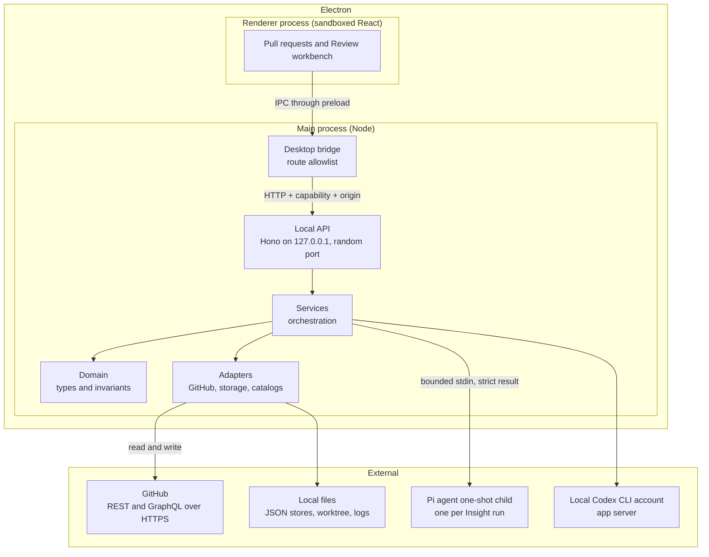

# Architecture

This document describes the high-level architecture of Patchdesk.
If you want to become familiar with the code base, you are in the right place.

For the vocabulary of the domain, read [CONTEXT.md](../CONTEXT.md) first.
It defines the exact meaning of Review, Review session, Insight, Finding, and every other domain term used here.
For the history of architectural decisions, read the records in [docs/adr](adr/).
For how agents should explore this repository, read [docs/agents/domain.md](agents/domain.md).

The architecture has three layers of authority:

1. GitHub owns the remote truth.
2. The Electron main process owns all local authority: writes, model runs, and storage.
3. The renderer is a sandboxed view. It requests actions and renders confirmed results.

## Bird's Eye View

Patchdesk is a local-first workbench for pull-request review.
A maintainer opens a Review for an open pull request, inspects the represented revision, and decides what to publish or merge.

On the highest level, Patchdesk accepts two kinds of input:

- Remote state from GitHub: the pull request, its diff, comments, review threads, checks, and merge policy.
- Actions from the maintainer: open a review, refresh, run an Analysis, Walkthrough, or Brief, comment, resolve a thread, submit a review, merge.

The ground state is local:

- JSON files that describe each Review, Review session, and Insight run.
- Immutable prepared artifacts for each session: the canonical patch and the represented-review worktree. The model context pack is built on the first Insight run rather than at prepare, and is rebuilt whenever it does not describe the session's patch.
- Cached remote snapshots that prove the represented GitHub state.

Derived state is assembled per request:

- The workbench projection, which the renderer re-validates before display.
- The retained Insight records, which are bound to the analyzed revision.

The outputs are GitHub writes (comments, thread state changes, review submission, merge) and the projections rendered in the workbench.
GitHub writes happen only from explicit maintainer actions on a current Review session; the review-content writes also require a Fresh review.
Model output is never authoritative by itself; Patchdesk validates it and decides what it may change.

Startup is strictly ordered:

1. The main process starts the local API on a random loopback port and issues a per-launch capability.
2. The main process health-checks the API with that capability and the renderer origin.
3. Only a healthy API opens the workbench window.
4. A failed start shows an error box and exits. No Review or GitHub write was started.

The login-shell environment import runs beside that sequence rather than inside it.
`startDesktopBesideLoginShellImport` in `app-lifecycle.ts` starts the import first, keeps its promise, and starts the lifecycle next, so neither the local API nor the window waits for a shell to source the maintainer's dotfiles (ADR 0038, amended 2026-09-19).
Each reader that needs an imported PATH or provider credential awaits that one promise for itself, and `electron-main.ts` awaits it after the window is up.

## Code Map

This section describes the important directories and data structures.
Pay attention to the **Architecture Invariant** sections.
They often describe things which are deliberately absent.

### `src/main/`

The Electron composition root.
This directory builds every service and adapter and wires them together.
It is the only place that knows about Electron.

- `electron-main.ts` is the entry point. It enforces a single instance, registers window and lifecycle events, starts the login-shell import beside the desktop lifecycle, and records crashes before exit.
- `app-lifecycle.ts` owns startup order: local API start, health check, workbench display, then shutdown in reverse. `startDesktopBesideLoginShellImport` sits beside that order rather than inside it.
- `local-api.ts` starts the Hono API on `127.0.0.1` with a random port. It builds the container (`local-api-container.ts` over `local-api-stores.ts`), registers the route modules in `routes/`, and listens. Most routes parse their body with a Valibot schema, call a service, and serialize the typed result; the merge, inline-conversation, and Review recovery routes use strict schemas that reject unknown fields. The Settings, profile, and watchlist routes in `dashboard-routes.ts` parse inside `DashboardController` instead, the profile-select route reads one id field, and the diff-file route parses inside `ReviewDiffSourceService`.
- `local-api.ts` also owns the app's recurring background work. `startRetentionSweepScheduler` sweeps each configured profile's retained data once every 24 hours, and `startWatchedPullRequestScheduler` polls the watched pull requests once at start and then on the interval Settings holds; `PATCH /v1/settings` reschedules it when that interval changes (ADR 0045). The server's `stop` settles both schedulers before it closes the HTTP server, and `electron-main.ts` is what turns them on.
- `ipc-contract.ts` is the contract the preload and bridge bullets below describe: `DESKTOP_REQUEST_CHANNEL`, the closed `DesktopRequest` and `DesktopResponse` shapes, `PatchdeskDesktopApi`, and `APP_CAPABILITY_HEADER`. Every main-to-renderer channel name is a constant written here exactly once.
- `github-capability-guards.ts` decides which GitHub write gateways the container may expose. `local-api-container.ts` builds the pending-review, direct-summary, and merge services only when the adapter structurally implements the matching gateway, and startup fails closed when the pending-review gateway is absent.
- `desktop-bridge.ts` is the only IPC surface the renderer can reach. It validates the requested route against an allowlist, forwards the request to the local API with the capability and renderer-origin headers, caps responses at 8 MiB, and applies a 30-second timeout.
- `app-capability.ts` generates the per-launch capability and compares presented values with constant-time equality.
- `preload.ts` exposes the minimal `window.patchdesk` bridge to the sandboxed renderer: `request`, `openExternalHttps`, `onMenuAction` for the native menu, `onNotificationClick`, `onWatchedPullRequestChange`, `qaScrollDiagnosticsEnabled`, `setWindowAppearance`, and `onWindowFullScreen` with the `windowFullScreenAtLoad` and `appearanceAtLoad` values it reads as the renderer loads — the renderer cannot see native full screen for itself.
- `renderer-origin.ts` parses and verifies the renderer origin.
- `desktop-close-guard.ts` protects an unsaved review draft and an in-flight GitHub write during close.
- `external-navigation.ts` opens external links only over HTTPS, with no credentials and no custom port. A link the user clicked in a rendered body may go to any host (`isUserActivatedExternalUrl`), because comment bodies link off GitHub constantly; a navigation the page starts on its own is still confined to the allowlisted hosts (`isAllowedExternalUrl`).
- `desktop-notifier.ts` posts the macOS notifications of ADR 0044. `decideDesktopNotification` is the pure silence rule, and `createDesktopNotifier` owns the settings read, Electron's `Notification`, and the click hand-off.
- `insight-runtime.ts`, `electron-paths.ts`, `window-state.ts`, `window-chrome.ts`, `window-appearance.ts`, and `desktop-menu.ts` hold small desktop concerns. The five `desktop-*-channel.ts` modules each keep both halves of one main-to-renderer channel — menu action, full screen, appearance, notification click, watched pull request change — in one module, so the channel name is written once.

**Architecture Invariant:** the renderer is sandboxed and has no Node.js access.
The preload bridge is the only way out.

**Architecture Invariant:** every local API request requires the per-launch capability and a matching renderer origin.
Cross-site and navigation-shaped requests are rejected before any service runs.

**Architecture Invariant:** the main process is the single authority.
It owns the capability, every GitHub write, every model child, and all storage.
The renderer can only request; it can never execute.

### `src/domain/`

The types and invariants of the system. This is the **API Boundary** every other layer builds on.

- `ids.ts` defines branded primitive types (`ReviewId`, `GitSha`, `FindingId`, ...) and the parsers that produce them. A branded value cannot be created from a raw string by accident.
- `result.ts` defines `Result<T, E>`. Errors are typed values, never thrown exceptions.
- `review.ts` models the Review aggregate: identity, current session, freshness, and terminal state. Pure functions such as `reconcileReviewRemoteState` and `markReviewTerminal` are the only state transitions.
- `review-session.ts` models a session pinned to one pull-request revision.
- `insight-record.ts` models the run lifecycle of an Insight: an `InsightRun` is `queued`, `running`, or `cancelling`, a run that produces a validated result becomes a `RetainedInsight` bound to the analyzed revision, and a run that ends without one becomes an `InsightFailure` whose reason is `cancelled`, `failed`, `invalid_result`, or `superseded`.
- `pending-review.ts`, `merge-operation.ts`, and `direct-summary-review.ts` model write intents and their receipts. `local-draft.ts` models a Local draft, the entry `Review.localDrafts` stores for a local Review only: a Finding draft, or a maintainer note (ADR 0051). `local-draft-carry.ts` is ADR 0002's carry rule for one draft when the Review moves to a new session: it moves when its `diff-anchor.ts` fingerprint maps once in the new patch or its surrounding lines are found once in the new file, and needs attention otherwise; a moved draft is changed when its lines differ from the lines at note time, which the draft keeps (#452). `local-apply-operation.ts` models the Apply suggestion write on a local Review and decides its recovery from file hashes; `local-apply-patch.ts` composes one file's post-image and patch from its current text.
- `patch.ts` maps Findings to diff locations (`mapFindingLocation`, `toGitHubReviewCoordinates`), and `diff-anchor.ts` fingerprints the diff context around a `PendingReviewAnchor` so one inline command can be validated against the represented diff. Both read the patch through the tokenizer in `unified-patch.ts`.
- `watched-pull-request.ts` models a watched pull request and the GitHub snapshot each poll is compared against. `diffWatchedSnapshot` derives the changes between two snapshots, and `checkWatchCapacity` refuses a 21st watch before GitHub is asked (ADR 0045).
- `github-context.ts` describes the GitHub shapes the app consumes.
- `contracts.ts` holds the schemas for the global config file, including `NotificationSettings`: the two notification toggles and the watched pull request poll interval, stored and patched as one object.

**Architecture Invariant:** the domain layer is pure.
It does no I/O, knows nothing about Electron or HTTP, and never touches GitHub.
Every value that crosses a boundary is parsed here first.

### `src/services/`

The orchestration layer.
Services compose domain functions with adapters.
They implement the flows: open, refresh, analyze, walk through, comment, publish, merge, recover.

- `review-workbench-controller.ts` is the facade for opening and loading a Review.
- `review-session-preparation.ts` prepares one immutable session: fetch the PR, fetch the canonical diff, write the patch, and create the represented-review worktree. `review-preparation-journal.ts` makes preparation resumable.
- `review-context-pack-service.ts` builds the model context pack (`context.json`, `review-input.md`, `debug.json`) when an Insight run first needs it, under the review lock that serializes runs. A local Review's pack carries no comments or checks and makes no GitHub read (ADR 0050). It needs no journal: a pack that does not name the session's current patch hash is rebuilt.
- `review-refresh-service.ts` separates revision refresh from PR reconciliation (ADR "Separate PR reconciliation from revision refresh and merge confirmation").
- `review-workbench-projection.ts` assembles the projection the renderer displays.
- `review-operation-coordinator.ts` serializes every mutation or reconciliation for one Review.
- `review-lifecycle-gate.ts` serializes durable lifecycle mutations per workspace profile.
- `review-write-gate.ts` holds the write preconditions: `requireFresh` for review-content writes — comment, publish, merge — and `requireCurrentSession` for pull-request metadata writes. Label, assignee, reviewer, base-branch, and draft-state writes need only a current, non-stale, non-terminal session (ADR 0025). `requireFreshLocal` is the local branch of freshness (ADR 0050): it recomputes the source from the checkout immediately before the write and records `RevisionChanged` when the head/base pair moved.
- `insight-run-coordinator.ts` is the sole durable owner of Insight runs: lifecycle, recovery, revision checks, validation, supersession, and retained results. It delegates the parts it owns: `insight-run-executor.ts` runs one invocation to its terminal state under the Review lock, `insight-recovery.ts` fails the runs a crash left marked active, `insight-result-validation.ts` validates the result a child submitted, and `insight-provider-catalog.ts` owns provider status, explicit Codex model discovery, and the provider, model, and effort revalidation immediately before a run.
- `insight-activity-buffer.ts` keeps one running Insight's bounded activity trace in memory — the phase, the last reasoning line, at most 200 command rows, and the approval counts — which the run poll answers from and nothing ever persists (ADR 0043).
- `pi-insight-child-invoker.ts` and `codex-insight-invoker.ts` start model children.
- `brief-reach-service.ts` counts the Brief's Reach block in the main process. The child proposes symbol names only; the main process verifies each name against the patch and counts it with one `git grep` per symbol name — over the proposed names and over the removed symbols it derives from the patch — in a represented-review worktree it first confirms with `git rev-parse HEAD`, so no model gains a search capability (ADR 0036).
- `merge-write-controller.ts`, `pending-review-service.ts`, `direct-summary-review-service.ts`, `published-feedback-service.ts`, and `inline-conversation-service.ts` implement the GitHub write flows. `merge-service.ts` performs the merge itself behind the merge controller, and `review-write-recovery-service.ts` reconciles a write whose outcome Patchdesk could not confirm, through complete GitHub reads only.
- `label-service.ts`, `assignee-service.ts`, `reviewer-service.ts`, `base-branch-service.ts`, and `draft-state-service.ts` implement the conversation rail's pull-request metadata writes (ADR 0029). The shared plumbing is `pull-request-metadata-write.ts`: `resolvePullRequestWritePermission` reads the account's repository permission, and `runGuardedMetadataWrite` runs all five through the same admission, durable intent, mutation, and confirmation sequence.
- `review-observation-service.ts` reconciles bounded GitHub state only after canonical same-revision proof, in a fixed candidate, journal, session, Review order; `review-observation-recovery.ts` replays an observation the process was interrupted partway through from that journal rather than from a new read.
- `review-worktree-service.ts` owns the git commands that create a session checkout: the managed refs, `git worktree add --detach`, the ownership marker, and cleanup, for pull request and local sessions alike.
- `local-review-opening.ts` opens and refreshes a local Review (ADR 0050) under the Review lock. Refresh is a command, so it refuses a held Review instead of waiting; every move to a new session, from Refresh, a reopen, or Apply, carries the Local drafts, reading the new patch and each drafted file from the new session's worktree. `local-review-session-preparation.ts` resolves the source from a profile repository's `localPath` and prepares its session, and `local-review-revision-service.ts` reads the head and base SHAs from the checkout, writes the working-tree Local snapshot in a temporary index copy, and renders the patch with `git diff --binary`. The maintainer's index is only read.
- `local-apply-service.ts` applies verified Finding suggestions to a working-tree checkout with `git apply` (ADR 0050): durable intent, outcome-unknown immediately before the write, confirmation from file hashes, then the drafted Findings it wrote marked applied and the next session through the local open path. `local-apply-composition.ts` rebuilds each range from the retained Analysis and the file's current bytes, and `local-apply-checkout.ts` reads a file only inside the checkout and never through a symlink. Recovery at startup and on request reads file hashes only and never applies again.
- `local-draft-service.ts` implements Add to draft, maintainer notes (add, edit, remove), and Remove on a local Review (ADR 0050 "Local drafts", ADR 0051): a Review record write under the Review coordinator with no freshness gate; each names the session the workbench displays and is refused on another. For a Finding draft the main process reads the Finding from the Analysis retained for the current session; for a note it takes the lines the renderer names. Either way it fingerprints the anchor against the current session's patch with `diff-anchor.ts`, and refuses lines that patch does not show. `agentPrompt` composes the drafts as one prompt for the coding agent with `renderLocalDraftsAsAgentPrompt` in `src/domain/local-draft-agent-prompt.ts`. `brief-pull-request-description.ts` serves the retained Brief as Markdown through `renderBriefAsPullRequestDescription` in `src/domain/`, which writes each hunk citation as `path:line`.
- `review-diff-source-service.ts`, `review-patch-index.ts`, and `review-inspector.ts` read the diff and expose a bounded, immutable inspector to model agents.
- `review-recovery-service.ts` recovers a Review after an interrupted operation.
- `review-diagnostic-service.ts` and `app-log-service.ts` implement observability.
- `maintainer-inbox-service.ts` and `inbox-refresh-coordinator.ts` implement the Pull requests screen. `dashboard-service.ts` now holds only workspace-repo discovery (`discoverWorkspaceRepos`), which Settings uses; its second pull-request scan was dead code and is deleted.
- `dashboard-controller.ts` is the main-process composition root for the renderer's profile and dashboard actions. It owns the request parsing the `dashboard-routes.ts` bullet above defers to it, the profile store and Settings reads and patches, the inbox and its refresh coordinator, and the memoized first-run account detection.
- `sidebar-listing-service.ts` lists the pull requests visited in one workspace profile, newest first and capped at 20 rows, from `ReviewStore.list` alone. It makes no GitHub call, and a terminal row carries the instant Patchdesk observed the state rather than a live one (ADR 0042).
- `watched-pull-request-service.ts` owns each profile's watched pull requests: the watch and unwatch commands, and the poll that reads them all in one query, saves the new snapshots, and raises one notification event per change (ADR 0045). `desktop-notifier.ts` is the port those and every other notification are posted through (ADR 0044).

**Architecture Invariant:** services receive parsed domain values.
They never parse raw input themselves and never trust the renderer's claims.

### `src/adapters/`

The I/O layer. This is the only place that touches GitHub, files, and processes.

- `github/github-adapter.ts` is the GitHub boundary. It issues bounded REST and GraphQL queries and maps every outcome to a typed result. `FakeGitHubAdapter` provides the same surface for tests.
- `github/github-http-client.ts` is the transport every one of those requests goes over: HTTPS from the main process, with the profile account's token as a bearer header (ADR 0046, issue #276). There is no second transport and no fallback; a failure is classified from the response status. `gh` keeps only `auth token`, `auth status`, `--version`, and the git credential helper.
- `github/gh-request-runner.ts` is the layer every GitHub module sits on. `GhRequestRunner` sends each REST or GraphQL request over a `GitHubServedTransport` as the profile's own account and classifies what comes back into a typed `GitHubReadFailure` per named read operation. It holds the one piece of state that outlives a call: the last rate limit observed per host, so a later refusal on that host can name its resume time.
- `github/command-runner.ts` executes explicitly formed `argv` commands with timeouts. Nothing goes through a shell. Its remaining callers are `git`, `gh auth`, the `gh --version` probe in `github-environment-probe.ts`, and the Insight runtime child, which `pi-insight-child-invoker.ts` spawns as this process's own executable running the staged runner.
- `github/github-credentials.ts` resolves the credential of the GitHub account a workspace profile is configured with, so every request runs as that account instead of the machine-wide active one (ADR "Authenticate GitHub as the profile account"). Tokens stay in memory and are never logged or persisted.
- `storage/json-file.ts` reads and writes one JSON value per file with atomic replacement and a sensitive-value guard.
- `storage/` contains one store per aggregate: `review-store.ts`, `review-session-store.ts`, `insight-store.ts`, `review-remote-store.ts`, `review-observation-journal-store.ts`, `merge-operation-store.ts`, `local-apply-operation-store.ts` (the one Apply operation of a local Review), `viewed-files-store.ts` (per-session Diff viewed marks), and others.
- `storage/review-remote-store.ts` stores remote snapshots by content hash. A stored snapshot that does not match its hash fails the hash check and is never trusted.
- `storage/review-artifact-storage.ts` stores artifacts and quarantines corrupt or unexpected files.
- `storage/patchdesk-paths.ts` builds every app-owned path without doing I/O.
- `process/executable-discovery.ts` finds executable files on PATH and macOS desktop paths as process I/O.
- `process/login-shell-environment.ts` runs the maintainer's login shell once at startup and imports two things from it: PATH, and the Pi provider credential names (ADR "Import provider credentials and PATH from the login shell"). It never overwrites a variable this process already has, and a failure or timeout imports nothing. This is the only place the main process's own environment is written.
- `process/login-shell-import.ts` holds that import as the launch's single awaited barrier. `startLoginShellEnvironmentImport` runs it exactly once, and `whenLoginShellEnvironmentImported` is what every reader — a child spawn, the Pi child invoker, the provider catalog, Codex discovery — waits on instead of starting a second import.
- `pi/` holds the model catalogs — the generated catalog and the runtime catalog the main process consults — and `pi-provider-catalog.ts`, which reports each built-in provider's credential name and whether this launch has it. The catalog waits on the login-shell import above before it answers, because that import is where the credential names come from.
- `codex/` talks to the maintainer's local Codex CLI account (ADR "Use the local Codex CLI account") without reading or persisting its credentials. `codex-app-server-client.ts` is the app-server connection, accepts command requests whose working directory resolves inside the represented-review worktree, and declines network, stdin-write, file-change, permission, and outside-worktree requests. `codex-brief-prompt.ts` composes the Brief turn, and `codex-activity.ts` maps the account's notifications to the bounded activity events the run poll projects (ADR 0043).

**Architecture Invariant:** adapters are the only layer that performs I/O.
Nothing else reads a file, spawns a process, or talks to GitHub.

**Architecture Invariant:** storage never persists sensitive values.
A read that would expose a sensitive value fails closed, and corrupt files go to quarantine instead of being loaded.

### `src/renderer/src/`

The React view layer.

- `flows/` implements the three surfaces: `inbox-flow.tsx`, `review-workbench-flow.tsx`, and `settings-flow.tsx`.
- `api-client.ts` wraps `window.patchdesk.request` and maps HTTP failures to typed `PatchdeskApiError` values.
- `renderer-contracts.ts` re-validates every projection with strict Valibot schemas before React renders it.
- `components/` and `hooks/` implement the workbench UI on Base UI with shadcn-style components.

**Architecture Invariant:** the renderer is the view in the MVC sense.
It requests actions and renders confirmed results; it never decides writes.
It re-validates every projection: a 200 response from the API does not mean the workbench will open.

### `runtime/insight/`

The isolated model runtime (ADR 0041, superseding the runtime choice in ADR 0018).
Each Analysis run, Walkthrough, or Brief runs in one dedicated one-shot child that builds a single `@earendil-works/pi-agent-core` agent and drives its loop once.
The Brief child is the narrowest of the three: it mounts only the result-submission tool, and its evidence — the patch — is supplied on the invocation rather than fetched, so the child reads nothing for itself.

The parent sends one bounded, strictly parsed invocation through stdin.
The child runs the agent loop under a 24-turn ceiling, submits one strict result through its own tool, and exits.
The parent validates the result again before it can affect retained content or GitHub state.
Moving the exact `@earendil-works` version this runtime pins is its own procedure: see [Upgrading Pi](upgrading-pi.md).

**Architecture Invariant:** the child mounts no sandbox, no MCP connection, no declared subagent, no generic filesystem or shell capability, and no GitHub writer.
The agent loop mounts no tool of its own and the runtime installs no MCP client, so no code path here can create one.
The shipped child is an exact locked package, staged at package time and validated by package smoke.

### `src/skills/`

`patchdesk-code-review` is the only skill a model sees: its instructions are concatenated into the Analysis system prompt, and no agent can activate any other.
It is analysis guidance, never permission: no shell commands, no GitHub writes, no credential exposure, and only evidence-backed findings.

### `docs/adr/`

The architecture decision records, one file per decision, numbered in the order they were made.
They document why the system looks the way it does:
the pull-request lifecycle, GitHub pending reviews as the one authoritative draft, bounded and non-authoritative model runs, the local Codex CLI account, one-shot Insight children driving Pi directly, GitHub calls authenticated as the profile's account, the narrow login-shell import that makes a Dock launch find the maintainer's keys and `codex`, the visited pull requests listed from local Review records alone, the bounded activity trace a running Codex Insight projects, the desktop notifications posted outside the window, and the poll that covers only the pull requests the maintainer explicitly watches.

### `tests/`

Test suites that mirror the production boundaries.
See [Testing](#testing) below.

## Cross-Cutting Concerns

This section describes the things which are everywhere and nowhere in particular.

### Safety and write authority

Patchdesk is a local app that writes to GitHub with the maintainer's account.
The design concentrates authority in the main process and removes it from everywhere else.

- The renderer is sandboxed. It reaches the main process only through the preload bridge, and the bridge only allows listed routes.
- Every local API request requires the per-launch capability and the renderer origin.
- Every GitHub write requires a current, non-stale, non-terminal Review session, checked by `review-write-gate.ts`. Review-content writes — comment, publish, merge — also require a Fresh Review; pull-request metadata writes do not.
- Merge and Published feedback deletion or dismissal require explicit confirmation.
- A confirmed write is followed by one read-only post-write reconciliation. The reconciliation never repeats the write.
- If Patchdesk cannot confirm a write outcome, it locks further writes for explicit GitHub reconciliation. It never retries automatically.
- The one write to the maintainer's checkout is Apply on a working-tree local Review: `git apply` without `--index`, gated by `requireFreshLocal`, with file pre- and post-image hashes recorded before the write.
- Model children never touch GitHub, the maintainer's checkout, or the network.

**Architecture Invariant:** the app must never start with the renderer holding authority.
Startup fails closed when the local API cannot prove its own health.

### Serialization

Long-running local apps break when two operations mutate the same state at the same time.
Patchdesk serializes mutations at four scopes:

- `ReviewOperationCoordinator` queues every mutation or reconciliation for one Review. Command callers use a non-waiting acquire/release pair so a user action returns an immediate in-progress result instead of blocking behind another action.
- `ReviewLifecycleGate` serializes durable lifecycle mutations per workspace profile.
- `InboxRefreshCoordinator` coalesces concurrent pull-request scans for one profile.
- `WatchedPullRequestService` runs every change to one profile's watched list — watch, unwatch, and the poll that saves the new snapshots — under a per-profile `KeyedMutex`, so a watch and a poll writing the same file never drop each other's change.

**Architecture Invariant:** one owner mutates one Review at a time.
There is no lock-free mutation of a Review anywhere.

### Freshness and revision identity

GitHub state changes between reads.
Patchdesk records revision evidence with every remote snapshot: head SHA, base SHA, and the canonical patch hash.

A Review is `Fresh`, `RevisionChanged`, or `Unavailable` (`ReviewFreshness` in `src/domain/review.ts`).
A write requires `Fresh`: the represented snapshot must still match the current head.
`RevisionChanged` is intentionally evidence-complete; an incomplete comparison stays `Unavailable` instead of guessing.

**Architecture Invariant:** GitHub wins.
Patchdesk never merges drafts and never reconciles a pending review while a pending-review operation is locked.

### Notifications and watched pull requests

Patchdesk posts a macOS notification for five events it already knows about: an Insight run settling, a write left outcome-unknown, a new session from preparation, a completed merge, and a change on a watched pull request (ADR 0044).
Services see only the `DesktopNotifier` port in `src/services/desktop-notifier.ts`, whose `notify` is synchronous and never throws, so a notifier defect can never change the `Result` the write or run that raised it returns.
The main-process implementation owns the toggles, Electron's `Notification`, and the click.
An event about the Review the focused window is showing posts nothing, and a watched pull request open in the workbench stays silent whether the window is focused or not.

Watched pull requests are the one thing Patchdesk polls GitHub for (ADR 0045, superseding part of ADR 0032, which had left the app with no timer at all).
A profile watches at most 20 pull requests, and one tick is one aliased GraphQL query over all of them.
The poll compares each answer with the stored snapshot, saves the new snapshots, and only then posts one notification per change, so a restart never repeats a notification.
The polling is notification-only: it replaces no row, no Review session, no diff, and no other displayed state, which is why a timer is allowed here at all.
The only thing the renderer sees from it is a dot on the Pull requests freshness badge, pushed over the watched-pull-request channel until the next refresh.

**Architecture Invariant:** no timer moves state under the reader.
A poll may raise a notification and light a badge; refreshing what is on screen stays an explicit maintainer action.

### Cancellation

An Insight run is cancelled when the user asks, when the represented revision changes, or when the app shuts down.

Cancellation is owned at both boundaries:

- The coordinator holds an `AbortController` per run. The renderer holds none: it POSTs the cancel route and guards the reply with a generation counter and `cancellingRef` (`use-insight-run.ts`).
- The coordinator signals the child, and the child aborts its running Pi agent before it exits.
- The parent retains owned process-group termination as the hard backstop.

`InsightRunCoordinator` remains the sole durable owner of lifecycle, recovery, and retained results.
Cancelling only a local wait is never sufficient.

### Error handling

The code base uses `Result<T, E>` from `src/domain/result.ts` at every boundary.
Failures are typed values with a reason; they are not exceptions.
Valibot schemas validate every value that crosses a boundary, with `strictObject` schemas rejecting unknown fields.

Storage is defensive:

- Writes are atomic (temp file, fsync, rename).
- Values that contain sensitive data are rejected on read and write.
- Corrupt or unexpected files are quarantined, never loaded.

The main process records uncaught exceptions and unhandled rejections to the log before it exits.
A panic in one feature must not corrupt the local state of another.

### Observability

Patchdesk is a desktop process; understanding what happens inside it matters for support.

- The app writes an append-only JSONL log to `~/.local/share/patchdesk/logs/patchdesk.jsonl`. It is tail-f friendly and records requests, model runs, and lifecycle events.
- `review-diagnostic-service.ts` records incidents with phases, durations, and retryability. `GET /v1/diagnostics` serves them as the redacted local activity list in Settings → Data & recovery.
- A support bundle exports those diagnostic events on demand. It carries no logs, and no renderer path calls the export route today: it is reachable only through the allowlisted API route.
- The renderer mirrors logs through `appLog` in `src/renderer/src/lib/logger.ts`.

### Testing

Two Vitest projects and one Playwright project run everything.

`vitest.config.ts` includes every `tests/**/*.test.ts` and `.test.tsx` file, so the boundaries are directories inside one project rather than separately configured suites.
`tests/domain/` exercises pure parsers and state transitions; it is fast and fully deterministic.
`tests/services/` runs real services against temporary directories and `FakeGitHubAdapter`, covering preparation, refresh, coordination, and recovery without a network.
`tests/adapters/` covers the I/O layer — the GitHub transport, request classification, and write shapes, the command runner, the Codex client, and the login-shell import — and `tests/storage/` covers one store per aggregate.
`tests/main/` covers the privileged desktop boundary, where `desktop-bridge-allowlist.test.ts` and `local-api-auth.test.ts` are the two that pin the capability and allowlist rules.
`tests/renderer/` uses jsdom and Testing Library, and `renderer-contracts.test.ts` pins the projection schemas that the live API must satisfy.
`tests/scripts/` covers the packaging, release, and gate scripts, and `tests/workflows/` holds the Walkthrough generation flow from prompt to parsed output.

`runtime/insight` is the second project, configured inside its own package because it has its own dependencies and lockfile.
`pnpm test:root` runs the root project, `pnpm test:insight` runs the runtime's, and `pnpm test:all` runs both, which is what `pnpm check` calls.
Running only `pnpm test` proves nothing about the runtime.

The outermost boundary is the built app.
Playwright browser tests run against the built renderer bundle (`out/renderer`) served over loopback, with an installed test bridge (`tests/browser/bridge-fixture.ts`), plus a dedicated performance suite.
`local-api-workbench.spec.ts` and `protected-loopback-workflow.spec.ts` point that bridge at a real main-process local API started over `FakeGitHubAdapter`.
There is no accessibility suite; ADR 0034 rules out assistive-technology tests.
Package smoke runs the packaged app with a fixed faux provider before UI checks.

**Architecture Invariant:** tests are reproducible and local-only.
They do not depend on external resources, GitHub accounts, or network access.

### Code generation

Some files are generated and committed:

- The Pi AI model catalog (`src/adapters/pi/pi-ai-catalog.generated.ts`) and the insight runtime manifest (`runtime/insight/runtime-manifest.json`), both written by `runtime/insight`'s own build.
- The Pierre theme catalog (`src/renderer/src/pierre-theme-catalog.generated.ts`), checked by `pnpm test:bundle`.

**Architecture Invariant:** generated code is committed.
The root `prepare` script runs that build on every `pnpm install`, so the catalog and the manifest are rewritten from the installed Pi packages each time.
`pnpm stage:insight-runtime` runs it once more at packaging time and refuses to stage when the manifest's `catalogDigest` does not match the digest in the committed catalog.
