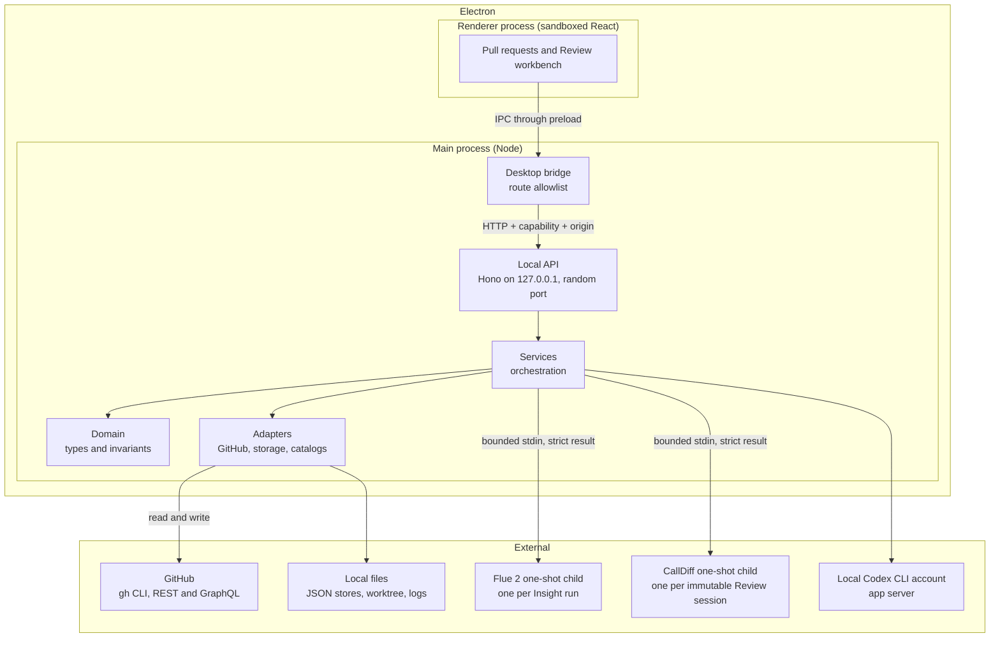

# Architecture

This document describes the high-level architecture of Patchdesk.
If you want to become familiar with the code base, you are in the right place.

For the vocabulary of the domain, read [CONTEXT.md](../CONTEXT.md) first.
It defines the exact meaning of Review, Review session, Insight, Finding, and every other domain term used here.
For the history of architectural decisions, read the records in [docs/adr](adr/).
For how agents should explore this repository, read [docs/agents/domain.md](agents/domain.md).

The architecture has three layers of authority:

1. GitHub owns the remote truth.
2. The Electron main process owns all local authority: writes, model runs, and storage.
3. The renderer is a sandboxed view. It requests actions and renders confirmed results.

## Bird's Eye View

Patchdesk is a local-first workbench for pull-request review.
A maintainer opens a Review for an open pull request, inspects the represented revision, and decides what to publish or merge.

On the highest level, Patchdesk accepts two kinds of input:

- Remote state from GitHub: the pull request, its diff, comments, review threads, checks, and merge policy.
- Actions from the maintainer: open a review, refresh, run an Analysis or Walkthrough, comment, resolve a thread, submit a review, merge.

The ground state is local:

- JSON files that describe each Review, Review session, and Insight run.
- Immutable prepared artifacts for each session: the canonical patch, the model context, and the represented-review worktree.
- Cached remote snapshots that prove the represented GitHub state.

Derived state is assembled per request:

- The workbench projection, which the renderer re-validates before display.
- The retained Insight records, which are bound to the analyzed revision.

The outputs are GitHub writes (comments, thread state changes, review submission, merge) and the projections rendered in the workbench.
GitHub writes happen only from explicit maintainer actions on a Fresh review.
Model output is never authoritative by itself; Patchdesk validates it and decides what it may change.

Startup is strictly ordered:

1. The main process starts the local API on a random loopback port and issues a per-launch capability.
2. The main process health-checks the API with that capability and the renderer origin.
3. Only a healthy API opens the workbench window.
4. A failed start shows an error box and exits. No Review or GitHub write was started.

## Code Map

This section describes the important directories and data structures.
Pay attention to the **Architecture Invariant** sections.
They often describe things which are deliberately absent.

### `src/main/`

The Electron composition root.
This directory builds every service and adapter and wires them together.
It is the only place that knows about Electron.

- `electron-main.ts` is the entry point. It enforces a single instance, registers window and lifecycle events, and records crashes before exit.
- `app-lifecycle.ts` owns startup order: local API start, health check, workbench display, then shutdown in reverse.
- `local-api.ts` starts the Hono API on `127.0.0.1` with a random port. Every route parses its input with a Valibot schema, calls a service, and serializes the typed result.
- `desktop-bridge.ts` is the only IPC surface the renderer can reach. It validates the requested route against an allowlist, forwards the request to the local API with the capability and renderer-origin headers, caps responses at 8 MiB, and applies a 30-second timeout.
- `app-capability.ts` generates the per-launch capability and compares presented values with constant-time equality.
- `preload.ts` exposes the minimal `window.patchdesk.request` bridge to the sandboxed renderer.
- `renderer-origin.ts` parses and verifies the renderer origin.
- `desktop-close-guard.ts` protects an unsaved review draft and an in-flight GitHub write during close.
- `external-navigation.ts` lets only user clicks open external HTTPS links, and only on allowlisted hosts.
- `insight-runtime.ts`, `electron-paths.ts`, `window-state.ts`, and `desktop-menu.ts` hold small desktop concerns.

**Architecture Invariant:** the renderer is sandboxed and has no Node.js access.
The preload bridge is the only way out.

**Architecture Invariant:** every local API request requires the per-launch capability and a matching renderer origin.
Cross-site and navigation-shaped requests are rejected before any service runs.

**Architecture Invariant:** the main process is the single authority.
It owns the capability, every GitHub write, every model child, and all storage.
The renderer can only request; it can never execute.

### `src/domain/`

The types and invariants of the system. This is the **API Boundary** every other layer builds on.

- `ids.ts` defines branded primitive types (`ReviewId`, `GitSha`, `FindingId`, ...) and the parsers that produce them. A branded value cannot be created from a raw string by accident.
- `result.ts` defines `Result<T, E>`. Errors are typed values, never thrown exceptions.
- `review.ts` models the Review aggregate: identity, current session, freshness, and terminal state. Pure functions such as `markReviewFresh` and `markReviewTerminal` are the only state transitions.
- `review-session.ts` models a session pinned to one pull-request revision.
- `insight-record.ts` models the run lifecycle of an Insight: queued, running, completed, failed, superseded.
- `pending-review.ts`, `merge-operation.ts`, and `direct-summary-review.ts` model write intents and their receipts.
- `patch.ts` and `diff-anchor.ts` parse the unified patch and map Findings to diff locations.
- `github-context.ts` describes the GitHub shapes the app consumes.
- `contracts.ts` holds the schemas for the global config file.

**Architecture Invariant:** the domain layer is pure.
It does no I/O, knows nothing about Electron or HTTP, and never touches GitHub.
Every value that crosses a boundary is parsed here first.

### `src/services/`

The orchestration layer.
Services compose domain functions with adapters.
They implement the flows: open, refresh, analyze, walk through, comment, publish, merge, recover.

- `review-workbench-controller.ts` is the facade for opening and loading a Review.
- `review-session-preparation.ts` prepares one immutable session: fetch the PR, fetch the canonical diff, write the patch and prepared context, and create the represented-review worktree. `review-preparation-journal.ts` makes preparation resumable.
- `review-refresh-service.ts` separates revision refresh from PR reconciliation (ADR "Separate PR reconciliation from revision refresh and merge confirmation").
- `review-workbench-projection.ts` assembles the projection the renderer displays.
- `review-operation-coordinator.ts` serializes every mutation or reconciliation for one Review.
- `review-lifecycle-gate.ts` serializes durable lifecycle mutations per workspace profile.
- `review-write-gate.ts` is the shared precondition for every GitHub write: the Review must be Fresh.
- `insight-run-coordinator.ts` is the sole durable owner of Insight runs: lifecycle, recovery, revision checks, validation, supersession, and retained results.
- `flue-insight-child-invoker.ts` and `codex-insight-invoker.ts` start model children.
- `call-flow-service.ts` and `call-flow-child-invoker.ts` run and cache a bounded CallDiff projection for one immutable Review session.
- `merge-write-controller.ts`, `pending-review-service.ts`, `direct-summary-review-service.ts`, `published-feedback-service.ts`, and `inline-conversation-service.ts` implement the GitHub write flows.
- `review-worktree-service.ts` owns the read-only git commands that create a session checkout.
- `review-diff-source-service.ts`, `review-patch-index.ts`, and `review-inspector.ts` read the diff and expose a bounded, immutable inspector to model agents.
- `review-recovery-service.ts` recovers a Review after an interrupted operation.
- `review-diagnostic-service.ts` and `app-log-service.ts` implement observability.
- `dashboard-service.ts`, `maintainer-inbox-service.ts`, and `inbox-refresh-coordinator.ts` implement the Pull requests screen.

**Architecture Invariant:** services receive parsed domain values.
They never parse raw input themselves and never trust the renderer's claims.

### `src/adapters/`

The I/O layer. This is the only place that touches GitHub, files, and processes.

- `github/github-adapter.ts` is the GitHub boundary. It runs the `gh` CLI through `command-runner.ts`, issues bounded REST and GraphQL queries, and maps every outcome to a typed result. `FakeGitHubAdapter` provides the same surface for tests.
- `github/command-runner.ts` executes explicitly formed `argv` commands with timeouts. Nothing goes through a shell.
- `github/github-credentials.ts` resolves the credential of the GitHub account a workspace profile is configured with, so every `gh` call runs as that account instead of the machine-wide active one (ADR "Authenticate GitHub as the profile account"). Tokens stay in memory, are never logged or persisted, and reach the child only through its environment.
- `storage/json-file.ts` reads and writes one JSON value per file with atomic replacement and a sensitive-value guard.
- `storage/` contains one store per aggregate: `review-store.ts`, `review-session-store.ts`, `insight-store.ts`, `review-remote-store.ts`, `review-observation-journal-store.ts`, `merge-operation-store.ts`, and others.
- `storage/review-remote-store.ts` stores remote snapshots by content hash. A stored snapshot that does not match its hash fails the hash check and is never trusted.
- `storage/review-artifact-storage.ts` stores artifacts and quarantines corrupt or unexpected files.
- `storage/patchdesk-paths.ts` builds every app-owned path without doing I/O.
- `process/executable-discovery.ts` finds executable files on PATH and macOS desktop paths as process I/O.
- `pi/` holds the model catalogs: the generated catalog and the runtime catalog that the main process consults.
- `codex/codex-app-server-client.ts` talks to the maintainer's local Codex CLI account (ADR "Use the local Codex CLI account") without reading or persisting its credentials.

**Architecture Invariant:** adapters are the only layer that performs I/O.
Nothing else reads a file, spawns a process, or talks to GitHub.

**Architecture Invariant:** storage never persists sensitive values.
A read that would expose a sensitive value fails closed, and corrupt files go to quarantine instead of being loaded.

### `src/renderer/src/`

The React view layer.

- `flows/` implements the three surfaces: `inbox-flow.tsx`, `review-workbench-flow.tsx`, and `settings-flow.tsx`.
- `api-client.ts` wraps `window.patchdesk.request` and maps HTTP failures to typed `PatchdeskApiError` values.
- `renderer-contracts.ts` re-validates every projection with strict Valibot schemas before React renders it.
- `components/` and `hooks/` implement the workbench UI on Base UI with shadcn-style components.

**Architecture Invariant:** the renderer is the view in the MVC sense.
It requests actions and renders confirmed results; it never decides writes.
It re-validates every projection: a 200 response from the API does not mean the workbench will open.

### `runtime/flue/`

The isolated model runtime (ADR "Run Flue 2 Insights in Patchdesk-owned one-shot children").
Each Analysis run or Walkthrough runs in one dedicated one-shot child built on the Flue 2 programmatic Node API.

The parent sends one bounded, strictly parsed invocation through stdin.
The child starts one in-memory Flue runtime, runs one finite request, submits one strict result, and exits.
The parent validates the result again before it can affect retained content or GitHub state.

**Architecture Invariant:** the child mounts no sandbox, no MCP connection, no declared subagent, no generic filesystem or shell capability, and no GitHub writer.
The shipped child is an exact locked package, staged at package time and validated by package smoke.

### Call Flow child

Call Flow is a deterministic projection of the base and head commits in one Review session (ADR "Run Call Flow as a revision-bound one-shot analysis"). The main process starts `out/main/call-flow-runner.js` through Electron's Node mode and sends one bounded invocation through stdin.

The child runs the app-owned Go syntax rule or the exact packaged CallDiff fallback against the represented-review worktree. Its strict node kinds distinguish calls, control branches, receiver-held dependency boundaries, unresolved targets, references, concurrency, and deferral; the fallback continues to emit only calls and branches. Go returns a compact receiver-collaborator change explanation: it prefers topmost affected definitions in changed files, flattens ordinary control flow, identifies nested receiver-field calls as inversion-of-control boundaries without inferring an implementation, filters package/local support calls, and avoids expanding one-revision callees. It supports only the packaged Go, JavaScript, JSX, TypeScript, and TSX parsers. Native parser packages load their exact published N-API prebuilds; packaging does not rebuild them on the release machine. The child returns one strict bounded result and exits.

The renderer projects that result into three reading modes. Paths shows the combined change tree without row-level semantic badges; only dependency labels receive a restrained semantic text treatment, and one Go legend explains that inversion-of-control boundary. New only keeps added calls and their required ancestors. Call Diff separates removed base paths from added head paths in side-by-side panes. Raw retains technical dependency, uncertainty, and reference markers, and all modes keep source navigation on the canonical Diff.

**Architecture Invariant:** Call Flow has no GitHub credentials, model provider, network access, or write command. Its source links return to the canonical Diff screen. A packaged target is supported only when package verification proves its published parser prebuild loads in the Call Flow child.

### `src/skills/`

`patchdesk-code-review` is the only skill mounted into model agents.
It is analysis guidance, never permission: no shell commands, no GitHub writes, no credential exposure, and only evidence-backed findings.

### `docs/adr/`

The architecture decision records, one file per decision, numbered in the order they were made.
They document why the system looks the way it does:
the pull-request lifecycle, GitHub pending reviews as the one authoritative draft, bounded and non-authoritative model runs, the local Codex CLI account, one-shot Flue children, and GitHub calls authenticated as the profile's account.

### `tests/`

Test suites that mirror the production boundaries.
See [Testing](#testing) below.

## Cross-Cutting Concerns

This section describes the things which are everywhere and nowhere in particular.

### Safety and write authority

Patchdesk is a local app that writes to GitHub with the maintainer's account.
The design concentrates authority in the main process and removes it from everywhere else.

- The renderer is sandboxed. It reaches the main process only through the preload bridge, and the bridge only allows listed routes.
- Every local API request requires the per-launch capability and the renderer origin.
- Every GitHub write requires a Fresh Review, checked by `review-write-gate.ts`.
- Merge and Published feedback deletion or dismissal require explicit confirmation.
- A confirmed write is followed by one read-only post-write reconciliation. The reconciliation never repeats the write.
- If Patchdesk cannot confirm a write outcome, it locks further writes for explicit GitHub reconciliation. It never retries automatically.
- Model children never touch GitHub, the maintainer's checkout, or the network.

**Architecture Invariant:** the app must never start with the renderer holding authority.
Startup fails closed when the local API cannot prove its own health.

### Serialization

Long-running local apps break when two operations mutate the same state at the same time.
Patchdesk serializes mutations at two levels:

- `ReviewOperationCoordinator` queues every mutation or reconciliation for one Review. Command callers use a non-waiting acquire/release pair so a user action returns an immediate in-progress result instead of blocking behind another action.
- `ReviewLifecycleGate` serializes durable lifecycle mutations per workspace profile.
- `InboxRefreshCoordinator` coalesces concurrent pull-request scans for one profile.

**Architecture Invariant:** one owner mutates one Review at a time.
There is no lock-free mutation of a Review anywhere.

### Freshness and revision identity

GitHub state changes between reads.
Patchdesk records revision evidence with every remote snapshot: head SHA, base SHA, and the canonical patch hash.

A Review is `Fresh`, `RevisionChanged`, or `Unavailable` (`ReviewFreshness` in `src/domain/review.ts`).
A write requires `Fresh`: the represented snapshot must still match the current head.
`RevisionChanged` is intentionally evidence-complete; an incomplete comparison stays `Unavailable` instead of guessing.

**Architecture Invariant:** GitHub wins.
Patchdesk never merges drafts and never reconciles a pending review while a pending-review operation is locked.

### Cancellation

An Insight run is cancelled when the user asks, when the represented revision changes, or when the app shuts down.

Cancellation is owned at both boundaries:

- The renderer and the coordinator hold an `AbortController` per run.
- The coordinator signals the child, and the child aborts its active Flue handle before a bounded runtime stop.
- The parent retains owned process-group termination as the hard backstop.

`InsightRunCoordinator` remains the sole durable owner of lifecycle, recovery, and retained results.
Cancelling only a local wait is never sufficient.

### Error handling

The code base uses `Result<T, E>` from `src/domain/result.ts` at every boundary.
Failures are typed values with a reason; they are not exceptions.
Valibot schemas validate every value that crosses a boundary, with `strictObject` schemas rejecting unknown fields.

Storage is defensive:

- Writes are atomic (temp file, fsync, rename).
- Values that contain sensitive data are rejected on read and write.
- Corrupt or unexpected files are quarantined, never loaded.

The main process records uncaught exceptions and unhandled rejections to the log before it exits.
A panic in one feature must not corrupt the local state of another.

### Observability

Patchdesk is a desktop process; understanding what happens inside it matters for support.

- The app writes an append-only JSONL log to `~/.local/share/patchdesk/logs/patchdesk.jsonl`. It is tail-f friendly and records requests, model runs, and lifecycle events.
- `review-diagnostic-service.ts` records incidents with phases, durations, and retryability. It powers the Diagnostics surface.
- A support bundle collects diagnostics and logs on demand.
- The renderer mirrors logs through `appLog` in `src/renderer/src/lib/logger.ts`.

### Testing

The canonical test cases for each flow, automated and manual, live in [test-cases.md](./test-cases.md).

The system has four test boundaries, mirroring the production layers.

The innermost boundary is `src/domain`.
Tests exercise pure parsers and state transitions. They are fast and fully deterministic.

The next boundary is `src/services`.
Tests run real services against temporary directories and `FakeGitHubAdapter`. They cover preparation, refresh, coordination, and recovery without a network.

The renderer boundary uses jsdom and Testing Library.
`renderer-contracts.test.ts` pins the projection schemas that the live API must satisfy.

The outermost boundary is the built app.
Playwright browser tests run against the packaged renderer with an installed test bridge (`tests/browser/bridge-fixture.ts`), plus dedicated accessibility and performance suites.
Package smoke runs the packaged app with a fixed faux provider before UI checks.

**Architecture Invariant:** tests are reproducible and local-only.
They do not depend on external resources, GitHub accounts, or network access.

### Code generation

Some files are generated and committed:

- The Pi AI model catalog (`src/adapters/pi/pi-ai-catalog.generated.ts`).
- The Pierre theme catalog (`src/renderer/src/pierre-theme-catalog.generated.ts`), checked by `pnpm test:bundle`.
- The Flue runtime model catalog and manifest (`runtime/flue/`), generated by `pnpm stage:flue-runtime`.

**Architecture Invariant:** generated code is committed.
A check fails when the committed catalog is stale.
