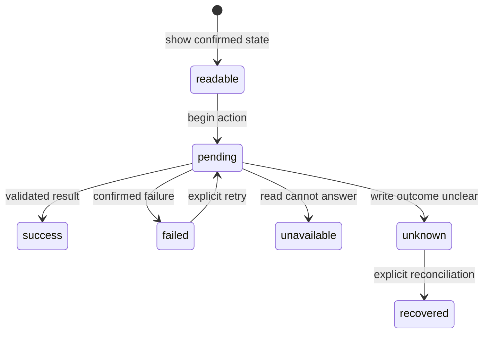

# Errors and recovery

## Summary

Patchdesk treats a confirmed failure, an unavailable read, a cancelled task, and an outcome-unknown GitHub write as different user-visible states. Each owning screen keeps the prior readable state or editable draft where safe, gives the narrow next action, and avoids retrying an external write until it knows what happened. Recovery is explicit and bounded rather than an endless spinner.

## The simple case

The maintainer starts a read, local preparation, Insight run, or GitHub action. Patchdesk shows the feature's pending state and then either replaces it with a validated result or reports a bounded error beside the affected surface.

For a confirmed failure, the maintainer can use the feature's Retry, Try again, Reload, Prepare again, or Check GitHub again action when that action is safe. If GitHub may have accepted a write but the response is not provable, Patchdesk keeps the write locked and asks for reconciliation instead of submitting again.

## The task, event by event

### Arrive

A screen can show the latest confirmed state, a local empty state, or a previous result with an error. Pull requests can distinguish repository read outcomes and cached data; Reviews can distinguish Remote state unavailable, Revision changed, and Terminal; Settings can show preference, storage, or activity errors.

The [task lifecycle foundation](../foundations/task-lifecycle-and-interruption.md) owns the common pending, failed, cancelled, and uncertain categories. This document describes how surfaces preserve evidence and choose recovery without changing those categories.

### Leave unchanged

Reading an error, opening an error detail, or closing a retryable dialog does not repeat the action. A failed read does not erase a previously confirmed Review, cached listing, retained Insight, or safe form draft unless the owning feature says that state cannot be retained.

### Begin an action

The owning feature classifies prerequisites before starting. It can refuse malformed input, missing credentials, stale revision evidence, absent permissions, invalid local data, or an unavailable provider without calling the requested external action.

Retry is an explicit new request. Reload repeats a read with a new request identity. Check GitHub again reconciles a durable intent or pending-review state; it is not a blind retry of the original write.

### While the action runs

Pending controls and the titlebar busy state identify work that is still in motion. A status-read failure does not prove that a child process, Insight, or GitHub request failed. The owner keeps the run, request, session, or intent identity needed to check again.

When a confirmed failure arrives, the screen keeps the prior safe projection and presents the feature's recovery action. When the outcome is unknown, related writes stay paused and the screen avoids optimistic confirmation. Error text is bounded and does not expose credentials or unredacted provider output.

### Settle

A validated success replaces or patches the screen. A confirmed failure becomes retryable, terminal, or read-only according to the feature. An unavailable read remains a named unavailable state; it is not silently converted into an empty result.

An outcome-unknown write settles only after explicit reconciliation proves the remote effect or proves that a new safe action is possible. [Persistence and recovery](../foundations/persistence-and-recovery.md) owns restart journals and durable locks; feature documents own the visible recovery control.

## Variants

| Variant | Before the action runs | While the action runs |
| --- | --- | --- |
| Workspace profile and GitHub account | Profile and GitHub identity determine which local and remote errors are relevant. | A late error from another profile cannot replace the active profile's state. |
| Pull request and Review state | Revision, terminal, pending-review, and Insight state determine whether retry is safe. | A remote change can become Revision changed, Terminal, or recovery instead of a generic failure. |
| GitHub permissions and merge readiness | Read and write permission failures are separate from merge readiness. | Confirmed rejection keeps its feature action bounded; unknown write outcome pauses related writes. |
| Network, local tool, and Insight provider availability | Missing dependencies can prevent start and show corrective guidance. | Timeout, process exit, malformed output, and status-read failure use distinct recovery paths. |
| Input path: mouse, keyboard, or desktop menu | Visible Retry, Reload, and Check GitHub again controls share their owning action. | Keyboard and menu commands cannot bypass pending, lock, or reconciliation state. |

## Cancel and interrupt

| Event | Before the action runs | While the action runs |
| --- | --- | --- |
| Cancel, Stop, or Escape | Closing a clean error or unconfirmed dialog records no new action. | Stop requests cancellation only where supported; it does not turn an unknown write into failure. |
| Navigate to another Patchdesk screen, Review, Settings section, or workspace profile | A retryable error can be left without retrying. | Write-pending or dirty state blocks navigation; feature-local reads may settle after navigation but cannot update a new scope. |
| Start another action or request a refresh | A new explicit retry or refresh owns a new request. | Newer request identity prevents an older error or result from overwriting current state. |
| GitHub, the network, a local tool, or an Insight provider fails or times out | A prerequisite error prevents the action from starting. | The owner distinguishes confirmed failure, unavailable read, cancellation, and unknown outcome. |
| Close Settings, reload the renderer, close the window, or quit Patchdesk | Readable prior state and durable recovery records remain. | Journals and intent records recover durable work; renderer-only error banners may disappear after reload. |
| The pull request, represented revision, pending review, permission, or other target changes elsewhere | A changed target can remove retry eligibility before a new attempt. | The owner refuses stale adoption and asks for refresh, reconciliation, or a new Review. |
| macOS focus, a file or folder picker, or another input path takes control | Focus loss without activating Retry has no effect. | Focus loss does not classify an in-flight operation as failed or cancelled. |

## Interactions with other systems

**Workspace profile and identity.** Errors are scoped to the profile, Review, or app-level preference that owns the request.

**Review revision and freshness.** [Review session and revision](../foundations/review-session-and-revision.md) owns Revision changed, Remote state unavailable, Fresh, and Terminal rather than treating all as generic errors.

**Local persistence and recovery.** Durable journals, intent records, quarantine, and locks make interruption recoverable. Renderer error copy is not proof of remote outcome.

**GitHub permissions and write authority.** Permission rejection is a confirmed failure; an unconfirmed transport result is outcome unknown and requires reconciliation.

**Network, local tools, and Insight providers.** Each boundary reports its own failure. Provider output, local command detail, and credentials are filtered before user-facing projection.

**Concurrent operations and locking.** Request generations drop late results. Review and lifecycle locks prevent a retry or recovery action from racing a related operation.

**Feedback, errors, and diagnostics.** Errors are action-local and bounded. Redacted Diagnostics may record lifecycle facts; app Logs preserve more local debug context but mask credentials.

**Preferences, keyboard commands, and desktop integration.** Retry and recovery commands use the same owners as visible controls. Preferences do not automatically retry failed work.

**Supported input and accessibility limits.** Keyboard and mouse recovery controls are supported. Touch, pen, and screen-reader behavior are outside the supported product surface.

## Edge cases

- A successful HTTP response with malformed content is not a confirmed success.
- A status-read failure leaves the operation identity available for another status read.
- Cached Pull requests remain readable but are marked degraded rather than presented as Current.
- A stale or terminal Review can remain readable while its writes are disabled.
- A retained Insight remains readable after a failed regeneration.
- A confirmed GitHub rejection may be retried when the feature says it is safe; an outcome-unknown write must not be retried automatically.
- An invalid stored session is quarantined instead of becoming a renderer error with guessed content.
- Recovery can require manual GitHub inspection when no exact receipt or projection proves the result.

## Open questions and verification

- Live desktop verification is pending; no CDP pass was run for this document.
- Confirm the exact error copy and next action for each repository, Review, Settings, Insight, and write failure surface.
- Confirm which error banners survive a renderer reload and which are intentionally renderer-only.
- Confirm focus placement after Retry, Reload, Check GitHub again, and recovery-required states.
- Confirm the visible distinction between an unavailable read and an empty successful result in every screen that has both.

Verified against Patchdesk application source commit `3100615`.
