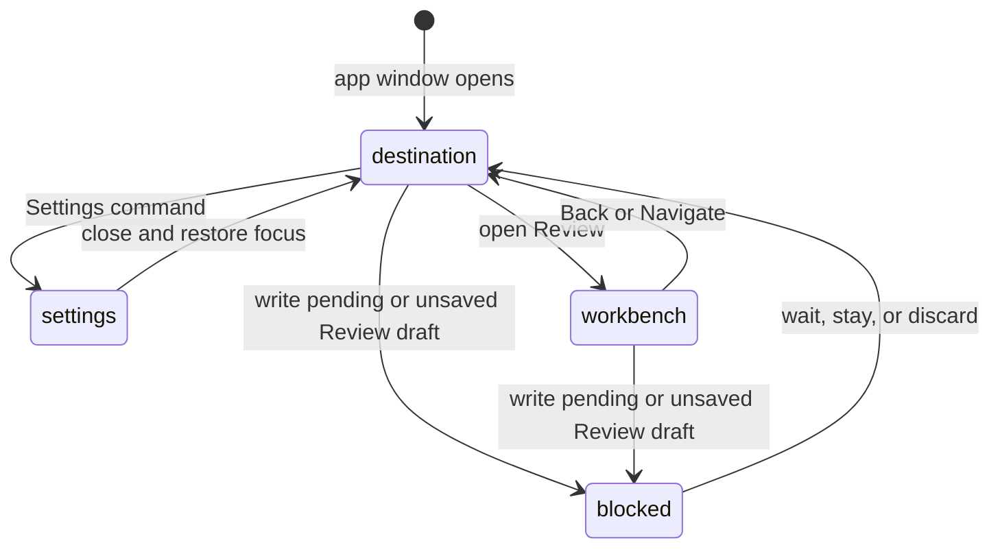

# Keyboard, focus, and desktop

## Summary

Patchdesk's supported direct input is keyboard and mouse in one macOS desktop window. Navigation, Settings, Pull requests, and the Review workbench share destination guards, focus movement, keyboard commands, and native close behavior. A clean action proceeds; a pending GitHub write keeps the maintainer at the current surface until the final result arrives, and an unsaved Review draft asks before it is discarded. When Patchdesk is in the background or showing another Review, macOS notifications report Insight runs that settle, GitHub writes that need a check, and changes to watched pull requests.

## The simple case

The maintainer opens Settings from the titlebar, ⌘,, ⌘K, or the native application menu. Settings opens as an overlay above Pull requests or the Review workbench, starts on General unless a section is targeted, and returns focus to the opener when it closes normally.

The maintainer uses keyboard focus to move through controls, selects a Pull request, and enters its Review workbench. A destination change focuses the new screen's first heading. While a Review's GitHub write is pending, navigation and desktop close show the owning guard instead of abandoning work whose result has not arrived.

## The task, event by event

### Arrive

Patchdesk restores the last saved destination, defaulting to Pull requests when the saved value is absent or invalid. The titlebar names Pull requests or Review workbench. A Skip to content link targets the main content region.

Settings is a global overlay with General, Workspace, Review, Data & recovery, and Logs sections. The opener is remembered for normal focus return. Within a Review workbench, the selected top-level tab, navigator section, and file position restore under that Review's identity.

### Leave unchanged

Closing a clean Settings overlay returns to the underlying destination and focuses its opener. Closing Navigate without choosing a command, pressing Escape on a clean dialog, or leaving an unchanged control records no domain change.

Selecting the current destination again does nothing. Keyboard focus moving among readable controls does not start a GitHub write, Insight, cleanup, or Review preparation.

### Begin an action

Mouse clicks, keyboard commands, and supported native menu items call the same destination and action owners as visible buttons. Pull requests rows support keyboard selection and Enter activation; Review navigation supports keyboard movement through its file and section controls.

Opening Settings writes a session-only section marker for reload restoration. Changing workbench position saves the position for the current Review. These view preferences do not change represented revision, freshness, or write authority.

### While the action runs

The titlebar busy bar appears for tracked loading actions and remains until all overlapping tracked actions settle. It is shared feedback, not a global lock: feature-local controls decide what remains usable.

When a GitHub write is pending, the guard offers Wait for completion and prevents leaving or closing the window until the final result arrives. When an unsaved Review draft is reported instead, the guard offers Stay on this review or Discard changes and leave.

Settings itself holds nothing back: its sections save their own values, so closing the overlay, changing section, reload, window close, and quit are never blocked by it. A native close path can show the desktop warning when the renderer cannot remain visible.

### Desktop notifications

Patchdesk posts a macOS notification when a Brief, Walkthrough, or Analysis finishes or fails, and when a GitHub write leaves the Review waiting for **Check GitHub again**. With **Review ready and merge completed** switched on in Settings → General → Notifications, it also posts one when a Review finishes preparing and when a merge completes. A cancelled or superseded Insight run posts nothing. The notification names the pull request as `owner/repo#number`.

No notification is posted for the Review the focused window is showing, for a Review that finishes preparing while the window is focused, or while **Notifications** is off. Refresh that adopts a new head prepares the Review again, so it can post **Review ready** too. Clicking a notification brings the window forward and navigates to its Review with the same guards as any navigation; an Insight notification lands on the Insights tab with that Insight selected.

A watched pull request posts one notification per change Patchdesk finds when it checks: a new comment or review, a changed review decision, changed checks, new commits, or merging or closing. It posts nothing while that pull request's Review is open in the workbench, focused or not. Clicking it brings the window forward and opens the pull request as the ⌘K palette opens a pasted reference, with the same guards. Settings → General → Notifications sets how often Patchdesk checks, every 1, 3, 5, or 10 minutes; a new interval applies the next time Patchdesk starts.

> Technical note: the main process writes a `desktop-notification` debug log line for each event: `shown`, `skipped` with `focused_on_review`, `focused`, `open_in_workbench`, or `disabled`, and `clicked`. Each check writes a `watched-pull-requests` line, `polled` or `skipped` with its reason. ADR 0044 and ADR 0045 record the decisions.

### Settle

A destination change updates the titlebar, screen, saved destination, and focus. Returning from Settings reveals the same destination and restores opener focus. A workbench position remains associated with its Review rather than becoming global navigation state.

After an explicit Discard, the draft guard clears and the requested destination can proceed. After a GitHub write settles, the write-pending guard clears according to its confirmed, failed, or recovery state. A renderer reload reopens Settings on its session-stored section, while a normal new launch does not reopen the overlay.

## Variants

| Variant | Before the action runs | While the action runs |
| --- | --- | --- |
| Workspace profile and GitHub account | The active profile names the loaded destination and scopes its workbench position. | Switching workspace clears the old workbench and returns to Pull requests; late focus or load results cannot target the old profile. |
| Pull request and Review state | Pull requests and one keyed Review workbench are the destinations; Review position is per Review. | Revision or terminal changes alter workbench controls, not the destination key; a pending write still blocks leaving. |
| GitHub permissions and merge readiness | Navigation and Settings do not need GitHub write permission. | A pending GitHub write blocks navigation and close regardless of merge readiness. |
| Network, local tool, and Insight provider availability | Stored destinations and view positions can restore offline; content loading may fail separately. | A load failure shows its owner’s Retry while focus remains within the current surface. |
| Input path: mouse, keyboard, or desktop menu | Visible buttons, keyboard commands, titlebar actions, and native menus share owners and guards. | No input path bypasses the write-pending, draft, focus-return, or window-close rules. |

## Cancel and interrupt

| Event | Before the action runs | While the action runs |
| --- | --- | --- |
| Cancel, Stop, or Escape | Escape closes a clean dialog or leaves a clean menu without changing destination. | Escape cannot bypass a write-pending or draft guard; feature Stop controls affect only their own task. |
| Navigate to another Patchdesk screen, Review, Settings section, or workspace profile | Clean navigation proceeds and focuses the new destination. | An unsaved Review draft parks navigation behind an explicit choice; write-pending blocks it until settlement. |
| Start another action or request a refresh | A command can request a new destination or action through its owner. | Overlapping tracked actions share busy feedback, while feature owners keep their own controls and focus. |
| GitHub, the network, a local tool, or an Insight provider fails or times out | A failed load stays on its owning screen with Retry where available. | Failure changes the feature state, not the destination guard; unknown writes still require reconciliation. |
| Close Settings, reload the renderer, close the window, or quit Patchdesk | Settings always closes and restores opener focus; a clean close exits. | An unsaved Review draft requires Discard or Stay; a pending GitHub write requires Wait and prevents close. |
| The pull request, represented revision, pending review, permission, or other target changes elsewhere | A target change may remove an action but does not move focus by itself. | The owning Review state can disable writes or require refresh while navigation remains guarded. |
| macOS focus, a file or folder picker, or another input path takes control | Focus movement alone does not activate a command. | Focus loss does not prove cancellation; native picker return or window-close handling settles through its owner. |

## Interactions with other systems

**Workspace profile and identity.** Profile changes are destination actions that clear the old workbench and reload Pull requests.

**Review revision and freshness.** [Review session and revision](../foundations/review-session-and-revision.md) owns represented revision and freshness; keyboard focus never proves either.

**Local persistence and recovery.** [Navigation and overlays](../foundations/navigation-and-overlays.md) owns destination restoration, Settings section session storage, workbench position, and leave guards.

**GitHub permissions and write authority.** Keyboard and menu commands call the same write owner; focus or a disabled visual control is not authorization.

**Network, local tools, and Insight providers.** Local load and provider failures stay with their feature. Navigation does not retry them automatically.

**Concurrent operations and locking.** The titlebar busy bar is reference-counted for tracked work, while Review and write locks remain feature-local safety boundaries.

**Feedback, errors, and diagnostics.** Focus and titlebar feedback identify where the maintainer is; feature errors and Diagnostics identify why an action failed.

**Preferences, keyboard commands, and desktop integration.** Settings, ⌘K, ⌘,, Navigate, Back, Skip to content, native close, and a clicked desktop notification share destination state and guards.

**Supported input and accessibility limits.** Keyboard and mouse are supported. Touch, pen, and screen-reader behavior are outside the supported product surface.

## Edge cases

- Settings can open over either primary destination and normally returns focus to the opener.
- A targeted Settings section is restored on renderer reload, but a normal fresh launch does not reopen Settings.
- A pending GitHub write blocks navigation and desktop close until its final result arrives.
- The titlebar busy bar can remain visible for one tracked action while the current feature stays interactive.
- A second tracked action can settle first without clearing the busy bar for the first action.
- A Review workbench position belongs to its Review ID, not to the next Review opened in the same window.
- A native window close uses desktop warning behavior because renderer state may not remain visible during shutdown.
- Keyboard row selection and Enter activation share the same action owner as mouse selection.
- A clicked Insight notification for the Review already on screen reopens that Review on the Insight, unless an unsaved draft or pending write holds it; then the window is only focused.
- A write that GitHub rejected, or one refused because an earlier write already holds the lock, posts no notification.

## Open questions and verification

- Live desktop verification is pending; no CDP pass was run for this document.
- Confirm focus placement after destination changes, Settings close, profile switch, guard Cancel, and native window close.
- Confirm the exact keyboard and native-menu behavior for Settings, Navigate, Pull requests row activation, and Review file navigation.
- Confirm the titlebar busy label when overlapping tracked actions settle in reverse order.
- Confirm the native close prompt for an unsaved Review draft and for a pending GitHub write on a real macOS window.
- Live verification of desktop notifications is pending: a macOS banner cannot be observed over CDP, so the log lines are the evidence.
- In the current source only the Review workbench reports navigation state, and only as write-pending or clear. Confirm which surface, if any, still reports an unsaved draft to this guard.

Verified against Patchdesk application source commit `3100615`; the removal of the workspace draft guard described from `883fad2`.
