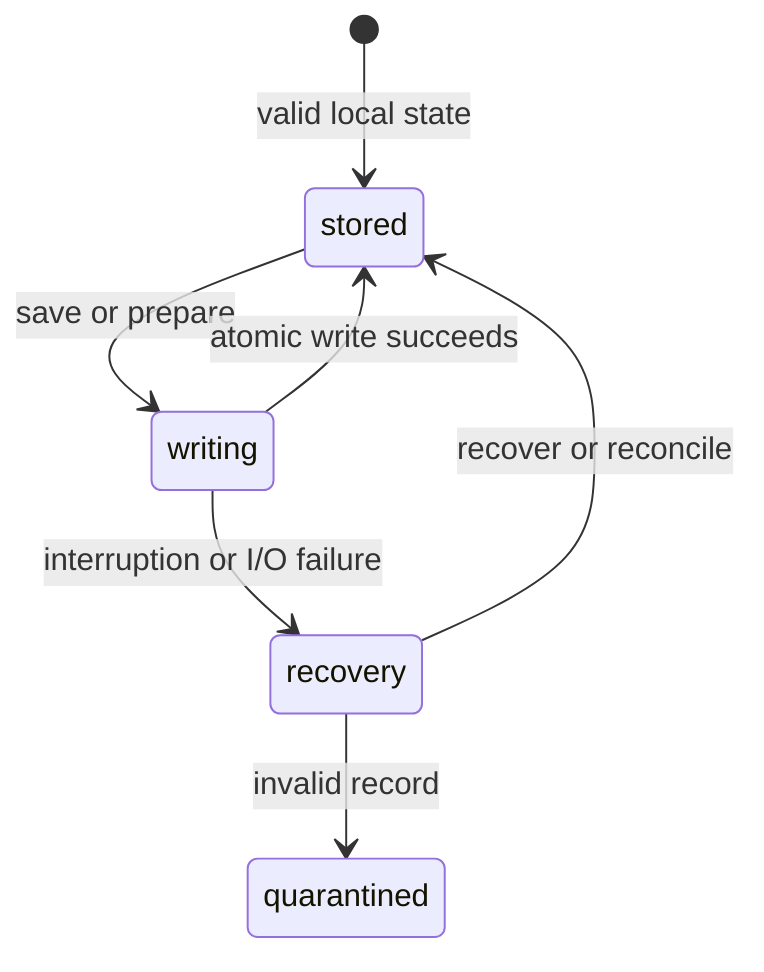

# Local storage and privacy

## Summary

Patchdesk keeps four local boundaries separate: Config for profiles and app preferences, Local data for durable Review and Insight state, Cache for rebuildable state, and Logs for local debug evidence. Credential-shaped values are rejected or masked at storage boundaries. Review Diagnostics are redacted more strictly than the app log so support evidence cannot expose prompts, tokens, provider output, diff bodies, or sensitive paths.

## The simple case

The maintainer saves a workspace profile or global preference. Patchdesk writes a complete local value and reloads it later without storing the GitHub credential itself. Opening a Review creates durable session evidence while rebuildable worktrees and inbox data remain in Cache.

If storage is interrupted or a record is malformed, Patchdesk keeps the last complete value where possible, quarantines invalid Review state, and recovers from a journal. The maintainer can clear Cache without clearing Review history, or use the stronger [Data & recovery action](../settings/data-and-recovery.md) to remove eligible local Review data after confirmation.

## The task, event by event

### Arrive

Config lives under `~/.config/patchdesk` and contains profiles, the active-profile choice, Appearance, and Diff theme. Local data lives under `~/.local/share/patchdesk` and contains Review records, Review sessions, retained Insights with their Walkthrough progress and Analysis Verification ticks, write intents and receipts, journals, prepared artifacts, the pull requests each profile watches, and Diagnostics. A Review record also holds what the maintainer last looked at: the head it showed and the newest Conversation entry timestamp it showed, which is GitHub's timestamp and never this machine's clock. Cache lives under `~/.cache/patchdesk` and contains re-creatable inbox data, avatars, and represented-review worktrees. The app log is `~/.local/share/patchdesk/logs/patchdesk.jsonl`.

The [persistence foundation](../foundations/persistence-and-recovery.md) owns these classes and their recovery behavior. A stored profile contains account settings but no credential; GitHub CLI authentication is resolved when Patchdesk needs it.

A Review record also holds the pull request's title and the time the maintainer last opened it. The [Visited pull requests column](../foundations/visited-pull-requests.md) reads both from Local data and makes no GitHub read. A successful open records them; reloading a workbench already on screen does not. A record written before these fields existed has neither.

> Technical note: The two fields were added without changing the Review record's schema version, and the record schema rejects unknown fields. An older Patchdesk build therefore refuses to read a record this build has written, and there is no downgrade path.

### Leave unchanged

Reading a profile, preference, Review, Cache entry, Log, or Diagnostic does not rewrite it. Opening Settings or loading a stored Insight leaves durable Review state unchanged. Closing a clean app flushes pending log writes and leaves stable data in place.

### Begin an action

Patchdesk validates a value before it can become product state. It creates private directories, writes complete replacements through temporary siblings, syncs and renames them, and removes a failed temporary file when possible.

Review preparation journals paths before creating worktrees or artifacts. GitHub writes persist intent before sending the request. Cleanup takes the profile lifecycle lock and checks ownership and active state before removing local data.

### While the action runs

The previous complete file remains authoritative until the replacement is safely installed. A storage or directory-sync failure is reported as a local failure rather than loading partial bytes.

Invalid JSON, invalid domain values, secret-shaped keys, or token-shaped content is rejected. Invalid Review entries are quarantined so valid neighboring evidence remains usable. When the Visited pull requests column reads a profile's Review records, an unreadable record is skipped rather than emptying the column, and a recovery Diagnostic records how many were skipped. Active Reviews, active Insights, protected writes, pending merges, and preparation journals protect their sessions from Clear local review data.

App Logs mask credential shapes and drop sensitive metadata keys, but they may retain local paths and error text for debugging. Review Diagnostics use fail-closed redaction and omit prompts, provider output, diff bodies, stack details, tokens, credentials, and sensitive paths.

### Settle

A successful save makes one validated complete value authoritative. A failed save leaves the prior value where possible. A recovered journal either completes or cleans its owned artifacts before normal use.

Clear cache removes rebuildable children while durable Review history remains. Clear local review data removes eligible non-running sessions and leaves active work and Diagnostics protected. Automatic retention removes a terminal Review's record together with its session 14 days after the session last changed, removes orphaned sessions after 14 days, and removes quarantine entries after 30 days. A terminal Review that still has an unreconciled GitHub write operation keeps its record and session. Once retention removes a record, its pull request leaves the Visited pull requests column.

## Variants

| Variant | Before the action runs | While the action runs |
| --- | --- | --- |
| Workspace profile and GitHub account | Config, Local data, Cache, and Diagnostics are namespaced by profile where applicable; credentials are not stored. | Profile locks prevent cleanup or recovery from crossing profile boundaries. |
| Pull request and Review state | Durable session and represented revision identify Review evidence; worktrees and inbox results are rebuildable Cache. | Preparation journals and Review locks prevent partial or cross-revision state from becoming current. |
| GitHub permissions and merge readiness | Local reads do not grant GitHub permission or merge authority. | Write intent persists before a GitHub call; an uncertain result remains locked for reconciliation. |
| Network, local tool, and Insight provider availability | Config and retained Local data can be read offline; rebuilding Cache may need GitHub, Git, or a provider. | Tool or provider failures do not expose credentials and do not silently convert incomplete state into success. |
| Input path: mouse, keyboard, or desktop menu | Settings, Review, and cleanup controls share the same local storage boundaries. | Input path cannot bypass validation, atomic replacement, redaction, or active-work protection. |

## Cancel and interrupt

| Event | Before the action runs | While the action runs |
| --- | --- | --- |
| Cancel, Stop, or Escape | Cancelling a cleanup confirmation or clean editor changes nothing. | A journaled write or preparation must settle or recover; Escape cannot discard durable intent. |
| Navigate to another Patchdesk screen, Review, Settings section, or workspace profile | Stable local state remains available. | Locks and profile/session identities prevent a late result from replacing another scope. |
| Start another action or request a refresh | Independent reads can proceed without rewriting state. | Conflicting durable mutations serialize or refuse; they do not interleave file replacement. |
| GitHub, the network, a local tool, or an Insight provider fails or times out | Local Config and retained data remain readable where valid. | Recovery distinguishes confirmed failure from uncertain external outcome and keeps sensitive detail redacted. |
| Close Settings, reload the renderer, close the window, or quit Patchdesk | Stable Config, Local data, Cache, Logs, and Diagnostics persist according to their class. | Startup recovery reads journals and intents before adopting or removing interrupted state. |
| The pull request, represented revision, pending review, permission, or other target changes elsewhere | Stored evidence remains bound to its saved identity and revision. | A changed target cannot rewrite an existing immutable session or receipt. |
| macOS focus, a file or folder picker, or another input path takes control | Focus loss does not change local state. | Focus loss does not cancel file replacement, journal recovery, or cleanup. |

## Interactions with other systems

**Workspace profile and identity.** Profile identity namespaces local records and selects the expected GitHub account; credentials remain external.

**Review revision and freshness.** Sessions and artifacts carry represented-revision identity. Storage does not decide whether remote evidence is Fresh.

**Local persistence and recovery.** This document summarizes the boundaries; [persistence and recovery](../foundations/persistence-and-recovery.md) owns atomic writes, quarantine, journals, locks, and retention.

**GitHub permissions and write authority.** Local files record intent and evidence but never authorize a GitHub write.

**Network, local tools, and Insight providers.** Cache is rebuildable from these systems. Their credentials and raw output do not become stored Diagnostic content.

**Concurrent operations and locking.** Profile lifecycle and Review locks serialize cleanup, preparation, recovery, and writes.

**Feedback, errors, and diagnostics.** Diagnostics are bounded and fail closed. App Logs provide richer local debugging context but are still credential-masked.

**Preferences, keyboard commands, and desktop integration.** Appearance and Diff theme are global Config; Review defaults and view positions use their own preference scopes. Whether the Visited pull requests column is collapsed is one renderer local-storage preference for the whole app, shared by every workspace. Settings commands do not alter storage classes.

**Supported input and accessibility limits.** Storage and redaction are input-independent. Keyboard and mouse controls are supported; touch, pen, and screen-reader behavior are outside the supported product surface.

## Edge cases

- A missing Config file is normal first-run state; invalid Config is not silently treated as empty.
- A stored profile contains account information but no GitHub credential.
- Secret-shaped keys or token-shaped values are rejected before they become trusted stored state.
- A malformed Review record is quarantined instead of rendered.
- App Logs may retain paths and error text, while Review Diagnostics redact them.
- Clear cache does not remove durable Review history; Clear local review data protects active work and Diagnostics.
- A represented-review worktree is Cache even though it is a Git checkout; the session that identifies it is Local data.
- Atomic replacement failures leave the previous complete value authoritative where possible.
- Retention sweeps remove only old terminal Review records with their sessions, old orphaned sessions, and stale quarantine entries, and continue after per-item errors. A sweep that cannot remove a terminal record leaves its session for the next sweep.

## Open questions and verification

- Live pass on 2026-09-14 confirmed that opening a pull request moves it to the top of the Visited pull requests column with a fresh open time (#94, #109, #120, #95, #96). Settings → Data & recovery describes the manual actions only; retention removing records with sessions is source behavior and has no visible copy to check.
- The skipped-record Diagnostic needs a corrupted Review file and was not live-checked.
- Confirm that the collapsed column preference is shared across workspaces in the running app; the live pass did not switch workspace.
- Confirm the visible error and retry path for unreadable Config, Local data, Cache, Logs, and Diagnostics.
- Confirm post-cleanup re-creation of a represented-review worktree and the visible local-checkout limitation.
- Confirm which local paths and error details remain visible in the app Logs panel and which are redacted in Review activity.
- Confirm startup presentation after interrupted atomic writes and preparation-journal recovery.

Baseline drafted from Patchdesk application source commit `3100615`; verified against `737c515c`.
