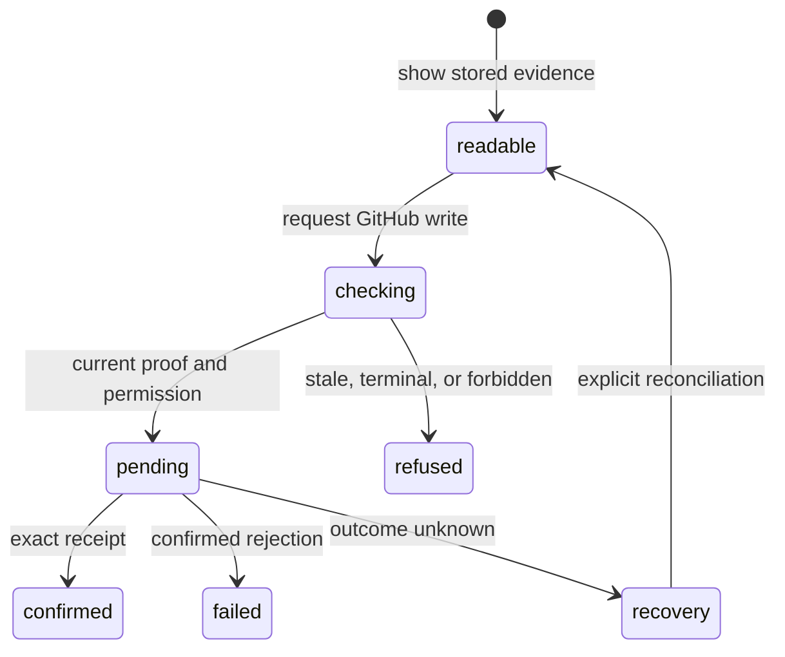

# Write safety and freshness

## Summary

Patchdesk separates readable evidence from permission to change GitHub. A Pull request or Review can remain visible when its remote evidence is stale, changed, terminal, or unavailable, but a GitHub write needs current Fresh evidence, the exact represented revision, the required permission, and the action's own preconditions. This rule is shared by metadata, conversations, pending reviews, and merge actions.

## The simple case

The maintainer reads a Review and chooses a GitHub action. Patchdesk checks the stored Review session, current head and base, canonical patch identity, remote state, and the narrow permission needed for that action. If the evidence is still current, the write is admitted and the screen shows a pending state.

If the pull request changed, closed, became terminal, lost permission, or cannot be read, Patchdesk refuses the write and keeps the readable evidence. If GitHub may have received the request but the result cannot be proved, Patchdesk enters recovery and locks related writes until an explicit check settles the outcome.

## The task, event by event

### Arrive

The screen labels remote evidence as Fresh, Revision changed, Remote state unavailable, or Terminal where the owner can determine it. Freshness describes what Patchdesk can prove about the represented revision; it does not itself grant write authority.

The Review workbench keeps one immutable represented revision. Its [session and revision rules](../foundations/review-session-and-revision.md) own how head, base, and canonical patch evidence are established. A stale or terminal Review remains readable, but write controls are absent or disabled.

### Leave unchanged

Reading a diff, conversation, pending-review ledger, metadata, or merge readiness does not write GitHub. A visible stale indicator does not mutate the Review or refresh it automatically. Leaving a readable Review preserves its stored evidence.

### Begin an action

The write owner checks the active profile, Review identity, represented session, current remote state, exact revision, permission, and action-specific payload. A direct comment needs its location and patch hash; a pending-review command needs its pending node and cumulative projection; merge needs current readiness and acknowledgement of required warnings.

The check happens before GitHub receives the request. When admitted, Patchdesk records the write intent, acquires the relevant Review or lifecycle lock, and exposes a write-pending state. The maintainer cannot use another conflicting writer until the outcome is settled.

### While the action runs

The screen keeps the action-specific pending state. A later remote revision, terminal transition, or lost precondition does not turn an old request into a write for the new target. The main process owns the check and write; renderer state cannot substitute for it.

An exact receipt or projection confirms only the requested effect. A malformed success is not success. A confirmed rejection is a retryable failure when the feature permits it. A timeout or transport result that cannot prove whether GitHub accepted the write becomes outcome unknown, keeps the intent, and pauses related mutation.

### Settle

A confirmed write updates the canonical Review projection and any recent-write evidence. A confirmed failure leaves the prior readable state and presents the feature's bounded recovery action. An uncertain write remains locked until Check GitHub again or an equivalent explicit reconciliation proves the remote state.

The [pending-review and Finish review flow](../review-workbench/pending-review-and-finish.md), [inline conversations](../review-workbench/inline-conversations.md), and [merge flow](../review-workbench/merge.md) own their receipts, action labels, and recovery controls. This document owns the shared boundary, not each feature's copy.

## Variants

| Variant | Before the action runs | While the action runs |
| --- | --- | --- |
| Workspace profile and GitHub account | The active profile and configured GitHub identity scope the Review and permission check. | A profile switch cannot adopt a pending write or receipt from another profile. |
| Pull request and Review state | Freshness, represented revision, open or terminal state, and pending-review state decide eligibility. | A changed head, base, patch, or remote state prevents stale adoption. |
| GitHub permissions and merge readiness | Read permission and write permission are separate. Merge readiness is a narrower precondition for merge. | GitHub rejects or changes readiness; Patchdesk settles from the authoritative response, not an optimistic control state. |
| Network, local tool, and Insight provider availability | Reads may show stored evidence without a provider; writes need GitHub and the action's local prerequisites. | Network uncertainty becomes recovery, while local or provider failures remain the owning feature's typed failure. |
| Input path: mouse, keyboard, or desktop menu | Visible buttons, keyboard commands, and supported menus reach the same write owner. | Input path cannot bypass the write gate, lock, or outcome classification. |

## Cancel and interrupt

| Event | Before the action runs | While the action runs |
| --- | --- | --- |
| Cancel, Stop, or Escape | Canceling an unsubmitted dialog leaves GitHub unchanged. | A GitHub write has no generic Stop; its pending or recovery state must settle. |
| Navigate to another Patchdesk screen, Review, Settings section, or workspace profile | Readable stale evidence can be left. | Write-pending blocks navigation; feature-local reads and Insights follow their own narrower rules. |
| Start another action or request a refresh | A new refresh can establish newer proof before another write. | Conflicting writers wait or refuse under the Review coordinator; an old response cannot settle a newer request. |
| GitHub, the network, a local tool, or an Insight provider fails or times out | A prerequisite failure refuses the write before GitHub is called. | Confirmed failure and outcome unknown are separate; unknown keeps the write locked for reconciliation. |
| Close Settings, reload the renderer, close the window, or quit Patchdesk | No write exists before admission. | A pending GitHub write blocks close where the navigation owner can enforce it; durable intent survives renderer loss. |
| The pull request, represented revision, pending review, permission, or other target changes elsewhere | A new observation can remove write eligibility. | Changed revision, terminal state, or pending node prevents adoption of a mixed result. |
| macOS focus, a file or folder picker, or another input path takes control | Focus loss does not submit a draft. | Focus loss does not cancel or confirm a GitHub write. |

## Interactions with other systems

**Workspace profile and identity.** Profile, host, repository, pull-request number, and viewer identity are part of the write boundary.

**Review revision and freshness.** The [Review session and revision foundation](../foundations/review-session-and-revision.md) owns Fresh, Revision changed, Remote state unavailable, and Terminal.

**Local persistence and recovery.** [Persistence and recovery](../foundations/persistence-and-recovery.md) owns intent journals, receipts, locks, and restart behavior for writes whose outcome is not known.

**GitHub permissions and write authority.** The main process checks the narrow permission and current preconditions for every GitHub write. A disabled button is not the authority boundary.

**Network, local tools, and Insight providers.** GitHub confirms remote effects. Local tools and Insights can supply context but cannot make a write current or authorized.

**Concurrent operations and locking.** Review and lifecycle coordinators serialize conflicting writes; synchronous renderer guards prevent duplicate same-action admission.

**Feedback, errors, and diagnostics.** Screens distinguish stale evidence, confirmed rejection, and outcome unknown. Diagnostics record bounded redacted lifecycle facts and never prove a write by themselves.

**Preferences, keyboard commands, and desktop integration.** Commands reuse the same write owner and guards as visible controls. Preferences never grant permission or freshness.

**Supported input and accessibility limits.** Keyboard and mouse write controls are supported. Touch, pen, and screen-reader behavior are outside the supported product surface.

## Edge cases

- A readable Review can be stale or terminal while every GitHub write is unavailable.
- Same head with a different base is a different represented revision.
- Incomplete or ambiguous revision evidence is Remote state unavailable, never a guessed Fresh state.
- A confirmed rejection may be retryable; an outcome-unknown write is not automatically retried.
- Malformed success cannot confirm a comment, pending review, metadata change, or merge.
- A pending review, direct summary, metadata, conversation, or merge action may have a feature-specific receipt, but all remain under the shared write boundary.
- A successful write does not itself prove later Review freshness; the owning feature observes GitHub again when required.
- An Insight completion never authorizes a GitHub write.

## Open questions and verification

- Live desktop verification is pending; no CDP pass was run for this document.
- Confirm the exact disabled or hidden control for each stale, terminal, forbidden, and outcome-unknown state.
- Confirm the visible navigation and window-close guard while each supported GitHub write is pending.
- Confirm the reconciliation copy after an uncertain comment, pending-review, metadata, or merge outcome.
- Confirm the boundary between a confirmed GitHub rejection and an unavailable remote read in each workbench surface.

Verified against Patchdesk application source commit `3100615`.
