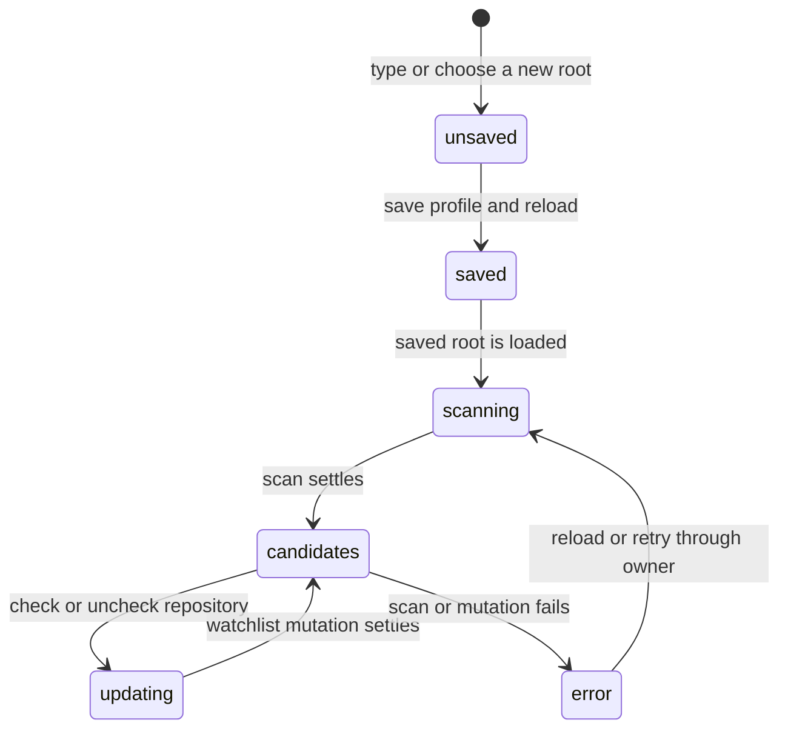

# Repository discovery

## Summary

Repository discovery scans the saved workspace roots for local Git checkouts with a supported remote, then shows the resulting candidates in Settings → Workspace. It helps the maintainer build a watchlist without typing repository identity by hand. Discovery is read-only; a candidate becomes watched only when the maintainer checks its row.

## The simple case

The maintainer opens Settings → Workspace and enters or chooses a folder under Workspace roots. A saved root shows a scan status. Patchdesk finds repositories below that root and lists each repository's owner/name and local checkout path. The root summary reports how many repositories were found and how many are already watched.

The maintainer checks an unwatched row. Patchdesk saves the repository identity and local path to the active profile, shows row-local pending feedback, and reloads the workspace. The repository remains selected in the watchlist on the next scan. Unchecking a watched row removes it without changing the profile's other fields.

## The task, event by event

### Arrive

The Workspace settings section is reached from the titlebar, Navigate, the native Settings menu, or the first-run card. It shows the current profile's Reviewing as identity, profile fields, and Workspace scope. Workspace roots and rule paths are editable list fields; root rows also have a Choose folder control.

Discovery starts from the saved profile, not directly from unsaved text. For each saved root, a checking line says `Scanning for repositories…`. A root that is currently typed but not saved says `Save the profile to scan this folder for repositories.` It does not claim that zero repositories were found.

### Leave unchanged

Reading a root's count or opening the repository checklist does not edit the profile. A scan does not add candidates to the watchlist or change the local path of a watched repository. Closing Settings with no dirty profile draft leaves all saved values unchanged.

A watched repository that is not returned by the current scan remains visible. It is grouped under `Watched outside current workspace roots` when its recorded local path matches no saved root, including when it has no local path.

### Begin an action

Saving a new or edited root first validates and writes the complete profile. After the workspace reload returns the saved profile, discovery requests its suggestions. Choosing a folder uses the native macOS folder picker; cancelling it leaves the typed root unchanged.

Checking a candidate begins a watchlist add with its host, owner, repository name, and discovered local path. Unchecking a watched row begins a watchlist removal. The checkbox state changes optimistically for that row and its control becomes unavailable while its request is pending.

### While the action runs

The scan returns one ready or failed outcome for each saved root. Each root's status is derived from that outcome and the saved watchlist. A successful root with no candidates says `No git repositories with GitHub remotes found in this folder.` A successful root with candidates shows a count such as `2 repositories found · 1 watched` and renders a checkbox for each repository under that root.

Each repository row owns its pending and error state. Different rows can update concurrently; a duplicate click on one pending row is ignored. A successful add or removal shows feedback for that action, then reloads the workspace so the saved profile and grouping become authoritative. A failed mutation returns the row to its confirmed checked state and shows an inline error.

The Workspace section groups returned entries by exact root or directory-boundary containment. A repository that matches duplicate or nested roots belongs to the first saved root. Entries matching no root go to the outside-roots group. Remote-origin read failures within a completed root scan are skipped rather than failing that root.

### Settle

After a successful scan, every saved root has either a candidate count, an explicit zero-found message, or the outside-roots group has the remaining watched entries. Discovery does not create durable records. Its next scan can change as local checkouts and remotes change.

After a successful watchlist add, the row is watched and the Pull requests screen can use that repository. After a successful removal, the row is no longer watched unless it is still returned as an unwatched discovery candidate. Other profile fields and other watched repositories remain intact.

If a saved-profile write fails, the profile draft remains dirty and the error appears as `Profile update failed`; discovery does not run against the unsaved root. If a root scan fails, that saved root says `Repository scan failed` and retains its watched rows with their inspect and remove controls. It shows no unverified discovered candidates. Other ready roots remain usable. A later reload or re-entry can try again.

## Variants

| Variant                                                | Before the action runs                                                                                                                                 | While the action runs                                                                                                                            |
| ------------------------------------------------------ | ------------------------------------------------------------------------------------------------------------------------------------------------------ | ------------------------------------------------------------------------------------------------------------------------------------------------ |
| Workspace profile and GitHub account                   | Discovery uses the active profile's saved roots and repository watchlist. The GitHub account identifies later Pull requests reads, not local scanning. | A profile save or switch can replace the roots and candidate set; a pending scan still belongs to the saved profile snapshot that started it.    |
| Pull request and Review state                          | Candidates have no Pull request or Review state yet. A watched row supplies repository scope for later listing.                                        | Adding a repository creates no Review session; removing one does not delete durable Review history.                                              |
| GitHub permissions and merge readiness                 | Discovery reads local Git metadata and does not require merge permission.                                                                              | Permission and merge readiness have no effect on the local scan or checkbox mutation; later GitHub reads can still fail.                         |
| Network, local tool, and Insight provider availability | The scan needs the local `find` and `git` commands through Patchdesk. Insight providers are unrelated.                                                 | A command timeout or route failure produces a scan error; an Insight run never starts, and a successful local scan does not prove GitHub access. |
| Input path: mouse, keyboard, or desktop menu           | Roots can be typed, chosen with the folder picker, or reached through Settings navigation.                                                             | Checkbox and Save actions have the same result regardless of mouse or keyboard input.                                                            |

Changing a root while its previous scan is visible makes that root unsaved until the profile is saved. The scan does not silently follow the unsaved draft.

## Cancel and interrupt

| Event                                                                                                 | Before the action runs                                                                                                                         | While the action runs                                                                                                                                             |
| ----------------------------------------------------------------------------------------------------- | ---------------------------------------------------------------------------------------------------------------------------------------------- | ----------------------------------------------------------------------------------------------------------------------------------------------------------------- |
| Cancel, Stop, or Escape                                                                               | Cancelling the folder picker makes no profile change. Removing an unsaved root row discards only that draft entry.                             | Discovery has no Stop control. A pending checkbox mutation has no Cancel control; it settles or fails on its own.                                                 |
| Navigate to another Patchdesk screen, Review, Settings section, or workspace profile                  | Clean navigation proceeds. A dirty root or profile draft invokes the normal Save, Discard, or Stay guard.                                      | Changing Settings sections keeps the mounted draft. A profile switch waits for or resolves its own dirty guard and can clear the discovery view after success.    |
| Start another action or request a refresh                                                             | Adding another root, editing a value, or opening a picker changes only the draft until Save.                                                   | A second scan can supersede the visible result through reload. Different repository rows can mutate concurrently; the same row cannot be submitted twice at once. |
| GitHub, the network, a local tool, or an Insight provider fails or times out                          | No remote GitHub call is needed to discover a local origin. A missing or unusable local command can make the scan return no usable candidates. | A route/parser failure shows `Could not scan this folder for repositories.` A row mutation failure stays inline and does not roll back other rows.                |
| Close Settings, reload the renderer, close the window, or quit Patchdesk                              | A clean close keeps saved roots and watchlist. A dirty draft requires a leave decision.                                                        | Scan status and optimistic row state are disposable. A saved mutation may finish before close only if the normal navigation/close guard permits it.               |
| The pull request, represented revision, pending review, permission, or other target changes elsewhere | Local discovery does not inspect a pull request or represented revision. Existing Review records are not targets of the scan.                  | A watchlist change can affect the next Pull requests request, but never rewrites a Review's represented revision or pending review.                               |
| macOS focus, a file or folder picker, or another input path takes control                             | The folder picker returns one selected absolute path or no change. Focus returns to the root row after a normal return.                        | Focus loss does not cancel scanning or a watchlist mutation. The picker cannot select a repository directly; it only changes the root draft.                      |

After a failed scan, the saved root and prior watchlist remain. After a failed row mutation, only that row shows the error and can be tried again. Unsaved roots remain unsaved across the current Settings session until the maintainer saves or discards them.

## Interactions with other systems

**Workspace profile and identity.** The saved workspace profile owns roots, watched repositories, and optional local paths. The scan reads that boundary and never invents a GitHub account or repository entry.

**Review revision and freshness.** Discovery has no revision or freshness state. A watched repository is only an input to a later Pull requests read; existing Review sessions remain pinned to their own represented revision.

**Local persistence and recovery.** Profile and watchlist changes are durable local configuration. Discovery candidates and scan statuses are re-creatable; a failed reload does not delete the saved watchlist.

**GitHub permissions and write authority.** Parsing a remote origin does not prove GitHub permission. Checking a row writes local watchlist configuration, not GitHub. Pull requests and Reviews perform their own access and freshness checks later.

**Network, local tools, and Insight providers.** The main process scans with bounded local `find` and `git config` commands. The renderer receives only validated host, owner, repository, and absolute local path values. Insight providers do not participate.

**Concurrent operations and locking.** Root scans are bounded concurrently. Repository mutations use per-repository pending guards, while profile/config writes use their own serialization. A slow row does not block a different row.

**Feedback, errors, and diagnostics.** Root rows distinguish unsaved, scanning, found, zero-found, and scan-failed states. Repository mutations show a spinner, success feedback, or an inline error; raw command output is not shown.

**Preferences, keyboard commands, and desktop integration.** The section is reachable through the shared Settings overlay and supports the native folder picker. The saved profile drives subsequent Pull requests requests after workspace reload.

**Supported input and accessibility limits.** Mouse and keyboard controls are in scope, including checkbox activation and folder selection. Touch, pen, and screen-reader behavior are outside the supported product surface.

## Edge cases

- A new root is not scanned until its profile is saved; an unsaved root explicitly reports that requirement.
- A saved root with no matching candidates reports zero found rather than showing an empty unlabeled checklist.
- Discovery skips watched repositories from its suggestion response, then merges watched entries back into the UI so they remain visible and checked.
- A watched repository with no recorded local path appears outside the current roots.
- A watched repository whose local path is outside every saved root appears in the outside-roots group and can still be removed.
- Only origins matching the supported `https://host/owner/repo` or `git@host:owner/repo` forms, with an optional `.git` suffix, become candidates.
- Invalid hosts, owners, repository names, or local paths are skipped from the candidate list rather than displayed as partial rows.
- Duplicate origins and duplicate repository identities are collapsed; a repository already watched is not suggested twice.
- The finder searches for `.git` directories only to depth four under each root. Repositories deeper than that are not found by this scan.
- Multiple roots are grouped in saved order using directory-boundary containment. A duplicate or nested match belongs to the first matching root.
- Each saved root reports a ready or failed scan outcome. A failed root retains watched rows but does not show unverified discovery candidates.
- A watched row's local path is the discovered checkout path when it is added; changing the root later does not rewrite that path automatically.

## Open questions and verification

- Live desktop verification is pending; no dev app or CDP pass was run for this document.
- Confirm the exact folder-picker focus return and whether Save remains focused after a root selection.
- Confirm the live desktop presentation and recovery timing when one of several roots fails.
- Confirm the intended behavior when a watched repository's checkout is moved or its remote origin changes after it was saved.
- Confirm that an in-flight watchlist mutation is allowed to settle during a Settings close and how the close guard presents that state.

Baseline drafted from Patchdesk application source commit `3100615`; follow-up behavior updated and verified through `c49045d`.
