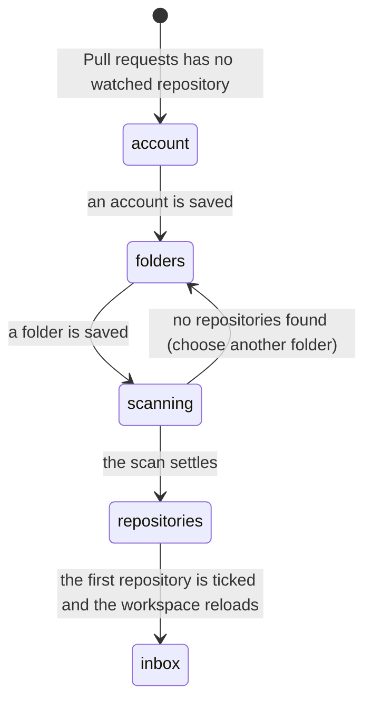

# Workspace setup on Pull requests

## Summary

When the active workspace watches no repository, the Pull requests screen shows workspace setup instead of the listing. The maintainer confirms the GitHub account and chooses the folders that hold the local checkouts, then ticks the repositories to review. Setup happens in place: it never opens Settings, and it uses the same two cards Settings → Workspace renders, saving through the same path.

## The simple case

On a new installation, Pull requests shows `Set up your workspace` with two numbered cards. `1. Reviewing as` states the account the GitHub CLI resolved, or offers a selector when several are authenticated. Saving an account is the first thing that happens; on a fresh install with no stored workspace, that save creates one and makes it active.

`2. Folders and repositories` appears once an account is saved. The maintainer presses Choose folder, picks the folder holding the checkouts, and Patchdesk scans it and lists what it found. Ticking the first repository saves the watchlist and reloads. The reloaded workspace watches something, so setup gives way to the inbox on its own. There is no button to press at the end.

## The task, event by event

### Arrive

The screen reaches this path when the workspace loaded successfully and watches no repository. The heading is `Set up your workspace`, above the line `Confirm the GitHub account, choose the folders that hold your checkouts, then tick the repositories to review.` The filter toolbar, the table, the pager, and the details panel are not rendered; setup replaces the screen rather than sitting above it. When the first inbox load never succeeded at all, the same setup appears under the screen's own `First run` header, with Refresh available.

One environment read serves the whole screen. `1. Reviewing as` renders what the GitHub CLI reports. Below it, and only when that read says Git is missing, one line says `Git is not installed. Install Git for this platform, then re-check.` Nothing else about local tools is shown, and Patchdesk installs and logs in to nothing.

Until an account is saved, the second card is replaced by the line `Choose an account first.` Discovery and the watchlist both need a saved workspace, which the account save is what creates.

### Leave unchanged

Reading the cards, waiting for the environment read, and pressing Re-check change no saved value. Cancelling the folder picker leaves the row as it was. Nothing here opens Settings.

### Begin an action

Choosing an account in `1. Reviewing as` saves it. When the GitHub CLI reports exactly one authenticated account, Patchdesk adopts it once by itself and saves it the same way. Manual GitHub account and host fields commit on blur and on Enter.

Choosing or typing a folder in `2. Folders and repositories` saves it, and the scan follows immediately. Ticking a repository writes it to the watchlist; unticking removes it. Re-check re-reads the environment.

### While the action runs

The control that committed says `Saving…` beneath itself, then `Saved`. A folder that has just been saved says `Scanning for repositories…` until its scan settles. A ticked row shows its own pending state; different rows can be ticked at the same time, and a second click on a pending row is ignored.

A save that fails leaves the previous saved value in place and reports the reason beside the control that caused it. Setup does not move on to the next card until the value it needs is actually saved.

### Settle

A saved account makes `2. Folders and repositories` appear. A saved folder settles into a repository count such as `2 repositories found · 1 watched`, the line `No git repositories with GitHub remotes found in this folder.`, or the `Repository scan failed` alert. A folder with nothing in it can be replaced by choosing another one.

Ticking the first repository saves the watchlist and reloads the workspace. That reloaded workspace watches a repository, which is the exact condition that ends this state, so the Pull requests listing replaces setup. Review-opening progress and errors stay scoped to their workspace, so a late result from another one cannot show a stale `Could not open review` alert over setup.

## Variants

| Variant                                                | Before the action runs                                                                                                                         | While the action runs                                                                                                          |
| ------------------------------------------------------ | ------------------------------------------------------------------------------------------------------------------------------------------------ | -------------------------------------------------------------------------------------------------------------------------------- |
| Workspace profile and GitHub account                   | A fresh install has no stored workspace, only a neutral one held in memory. The first account save writes it under the name Default.            | Every later save updates that workspace. The account is what discovery and the watchlist are scoped to.                        |
| Pull request and Review state                          | An empty watchlist produces this setup state, not a listing or a Review workbench.                                                              | No repository is read and no Review session is created until a repository is watched.                                          |
| GitHub permissions and merge readiness                 | Setup needs an authenticated account, not merge permission or a pull-request decision.                                                          | Saving is local. Repository permission failures appear later, on the first listing read.                                       |
| Network, local tool, and Insight provider availability | The GitHub CLI supplies the accounts. A missing Git shows its own line. Insight providers are not required and are not queried.                 | A scan uses local commands only. A failed environment read leaves the account card explaining the failure, with Re-check.       |
| Input path: mouse, keyboard, or desktop menu           | The cards are the same controls Settings renders, and are keyboard operable.                                                                    | Commit on Enter and commit on blur reach the same save. The macOS folder picker temporarily owns focus.                        |

Setup cannot be completed by confirming the environment alone. The watchlist stays empty until a repository is ticked.

## Cancel and interrupt

| Event                                                                                                 | Before the action runs                                                                                              | While the action runs                                                                                                                     |
| ----------------------------------------------------------------------------------------------------- | --------------------------------------------------------------------------------------------------------------------- | ------------------------------------------------------------------------------------------------------------------------------------------- |
| Cancel, Stop, or Escape                                                                               | There is no setup-wide Cancel or Stop. Escape has no effect here.                                                    | A save, a scan, and a watchlist write have no Stop control; each settles or fails on its own.                                              |
| Navigate to another Patchdesk screen, Review, Settings section, or workspace profile                  | Navigation proceeds; setup holds nothing unsaved. Settings → Workspace shows the same two cards.                     | Leaving does not cancel a request in flight. Returning re-reads the environment and the workspace.                                        |
| Start another action or request a refresh                                                             | Re-check and Refresh are separate reads. Neither edits the workspace.                                                | A newer Re-check owns the visible result. A reload after a save is what makes the next card correct.                                      |
| GitHub, the network, a local tool, or an Insight provider fails or times out                          | Setup is reachable without any successful GitHub read; the empty state is local.                                     | The affected control reports its own failure. Nothing retries by itself; Re-check and re-committing are explicit.                         |
| Close Settings, reload the renderer, close the window, or quit Patchdesk                              | Saved account, folders, and watchlist survive. Probe results do not.                                                 | A reload drops in-memory status. The next load starts from what was actually saved.                                                       |
| The pull request, represented revision, pending review, permission, or other target changes elsewhere | No pull-request target exists yet. Another workspace becoming active changes what setup is asked for.                | The next inbox load is authoritative for whether setup is still needed.                                                                   |
| macOS focus, a file or folder picker, or another input path takes control                             | Cancelling the folder picker changes nothing. Selecting a folder returns its absolute path and saves it.             | Focus loss does not cancel a scan or a watchlist write. Blur is itself a commit.                                                          |

After an interrupt the maintainer stays on Pull requests with whatever was saved. A ticked repository is durable configuration; a scan result is not.

## Interactions with other systems

**Workspace profile and identity.** Setup writes the same workspace Settings → Workspace writes, through the same editor. The account save on a fresh install is what creates the workspace.

**Review revision and freshness.** No Review session or represented revision exists in this state. Freshness begins after a watched pull request is loaded.

**Local persistence and recovery.** A workspace that was never persisted is neutral: Patchdesk holds it in memory rather than writing a record with no account. The first account save is what writes it, under the name Default. Account, folders, and watchlist are durable; environment and scan results are re-creatable.

**GitHub permissions and write authority.** Nothing here writes to GitHub. A resolved account proves only that the GitHub CLI reports it as authenticated.

**Network, local tools, and Insight providers.** One environment read supplies both the account list and the Git line. Folder scanning uses local commands. Insight providers are not consulted.

**Concurrent operations and locking.** Saves compose and the newest response wins. Watchlist writes are per repository, so one slow row does not block another.

**Feedback, errors, and diagnostics.** Every control reports its own state: `Saving…`, `Saved`, or the reason it failed. No credentials or raw command output are shown.

**Preferences, keyboard commands, and desktop integration.** Setup shares the Pull requests screen's Refresh behavior and uses the native folder picker.

**Supported input and accessibility limits.** Mouse and keyboard are in scope. Screen-reader behavior is outside the supported product claim.

## Edge cases

- A successful empty inbox response with an empty watchlist is not an error and makes no repository GitHub read.
- A workspace with no folder shows one blank folder row, so Choose folder is always available.
- The Git line appears only when the environment read says Git is missing. A missing or unauthenticated GitHub CLI is reported by the account card itself, not by a separate tools list.
- A folder whose scan finds nothing says so explicitly instead of showing an empty checklist.
- Setup never opens Settings, and Settings is not needed to finish it.
- A workspace that already watches a repository does not show setup, even when the latest read returns no pull request; that is a different settled state.
- A late Review-opening result from a prior workspace is ignored when the current one reaches setup.

## Open questions and verification

- Live desktop verification of the in-place flow is pending; the checklists in `verification/` still describe the previous card.
- Confirm the moment the listing replaces setup after the first repository is ticked, and where focus lands.
- Confirm what a fresh install shows between the account save and the first environment read settling.
- Confirm the presentation when the account save fails on a machine with no stored workspace.

Baseline drafted from Patchdesk application source commit `3100615`; in-place workspace setup described from `883fad2`.
