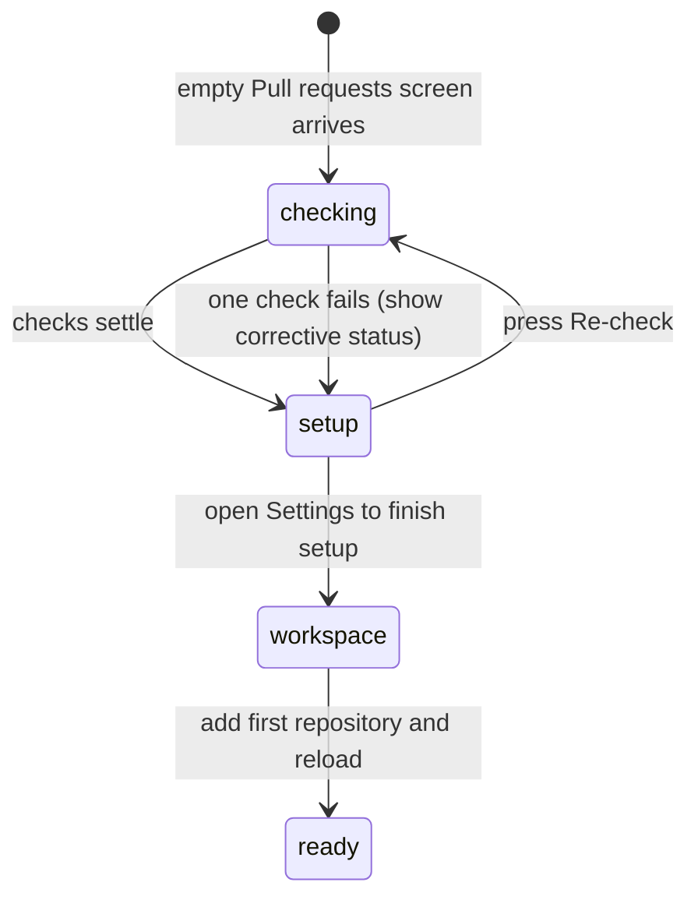

# The first-run setup checklist

## Summary

The first-run setup checklist is the Pull requests screen's starting path when Patchdesk has no watched repository to list. It lets the maintainer confirm GitHub access, check the local `git` and `gh` tools, and open Settings → Workspace to choose the account, workspace roots, and first repository. It is shown after a successful empty inbox response; a failed bootstrap uses the dashboard error instead.

## The simple case

On a new installation, Patchdesk opens Pull requests with a `First run` label and a Set up Patchdesk card. The card has three numbered steps: confirm GitHub access, check local tools, and add the first repository. The first two checks run as soon as the card appears. Their results are independent: GitHub access can be confirmed while a local tool check still needs attention.

The maintainer fixes missing tools or authentication in a terminal, presses Re-check, and reads the updated status. The card does not perform login or install anything. The third step is completed in Settings → Workspace: the maintainer saves a workspace root, checks a discovered checkout, and returns to a populated Pull requests screen after the watchlist reloads.

## The task, event by event

### Arrive

The screen reaches this path when the active profile has no rows to show and no repository-level read error has taken priority. The header says `First run`, the destination remains Pull requests, and Refresh is available. The setup card explains that the checks are local and that pending pull requests can load after setup.

Two read-only probes start on card mount. Confirm GitHub access asks the local API to resolve the active profile's authenticated GitHub account. Check local tools asks for the status of `git`, `gh`, and GitHub CLI authentication. Each line starts in a checking state. No token, account password, repository, or GitHub write is shown in the card.

### Leave unchanged

Reading the checklist, waiting for its probes, or pressing Refresh does not edit a profile or add a repository. Refresh reloads the workspace; if the active profile is still empty, the checklist returns with fresh probe requests. Opening Settings is the only checklist action that changes the maintainer's destination.

### Begin an action

Re-check increments one shared attempt for the two probes. Both requests start again, and their prior pass or failure lines are replaced by checking lines until each new response settles. The button itself does not run `gh auth login`, install Git, or change a profile.

The Open Settings to finish setup button targets the Workspace section. Settings owns the account, profile, root, and watchlist edits; the checklist remains an empty-state explanation rather than a second editor.

### While the action runs

The GitHub line says `Checking GitHub access…`. A successful access probe says `GitHub access confirmed.` A failed request or malformed response says `Could not check GitHub access.` An unauthenticated result says to run `gh auth login` for the GitHub account entered in Settings under Workspace, then re-check.

The local-tool lines independently show `Git is installed.` or a Git installation instruction, `GitHub CLI (gh) is installed.` or a GitHub CLI installation instruction, and—when `gh` is installed—whether the CLI is authenticated. If `gh` is missing, the checklist does not call that an authentication failure. If authentication cannot be determined, it says so instead of guessing.

The two probes may finish in either order. Re-checking while a prior attempt is pending starts a newer attempt; a response from the superseded attempt cannot replace the newer visible result. The card can remain open while the maintainer fixes the environment elsewhere.

### Settle

The checklist settles with a mixture of pass and corrective lines; one failed check does not hide the other result. A successful check does not mark setup complete by itself. The first repository is still added explicitly in Workspace settings.

After a repository is checked in the Workspace repository checklist, the watchlist change is saved and workspace data reloads. The next successful inbox response can render the normal Pull requests listing. Existing local profile and Review data remain available if a later GitHub read fails.

## Variants

| Variant | Before the action runs | While the action runs |
| --- | --- | --- |
| Workspace profile and GitHub account | The active profile supplies the GitHub host and expected account. A first-run Default profile may be ephemeral when no account was detected. | GitHub access is checked against the active profile; the checklist does not change the profile or credentials. |
| Pull request and Review state | An empty watchlist produces an empty setup state, not a Review workbench. | A repository is not read until it is explicitly watched; no Review state is created by the checks. |
| GitHub permissions and merge readiness | Setup needs an authenticated account check, not merge permission or a pull-request decision. | The checklist reports authentication and tool availability; merge readiness has no effect. |
| Network, local tool, and Insight provider availability | Git, `gh`, and GitHub CLI authentication determine the local-tool lines. Insight providers are not required for setup. | A missing tool, authentication failure, request failure, or timeout produces its own corrective line; no provider run starts. |
| Input path: mouse, keyboard, or desktop menu | The card's buttons use the same Workspace Settings destination as the rest of the app. | Re-check and Settings targeting do not change behavior based on input device. |

The checklist cannot be completed by confirming probes alone. The watchlist remains empty until a repository is selected explicitly in Workspace settings.

## Cancel and interrupt

| Event | Before the action runs | While the action runs |
| --- | --- | --- |
| Cancel, Stop, or Escape | There is no checklist-wide Cancel or Stop. Escape has no setup side effect. | There is no cancellation control for an in-flight probe; the card can be left while the request settles. |
| Navigate to another Patchdesk screen, Review, Settings section, or workspace profile | Opening Settings targets Workspace. Other navigation follows the normal clear navigation rules. | Leaving the card does not add a repository or cancel the local request; returning starts the component's probes again if it remounts. |
| Start another action or request a refresh | Refresh is a separate workspace read and does not edit setup. | Re-check starts a newer probe attempt. Refresh can reload the empty state while probe results remain owned by the mounted checklist. |
| GitHub, the network, a local tool, or an Insight provider fails or times out | The checklist is still reachable without a successful GitHub read because the empty inbox response is local state. | The affected probe settles to its generic failure or corrective status. The card does not retry automatically; Re-check is explicit. |
| Close Settings, reload the renderer, close the window, or quit Patchdesk | Closing a clean Settings overlay returns to the checklist. | A probe is not durable work. Reload or quit drops its in-memory status; the next mounted checklist starts fresh probes. |
| The pull request, represented revision, pending review, permission, or other target changes elsewhere | No pull request target exists yet. A profile or account change can alter the next workspace read. | Probe results do not authorize a Review or preserve a remote target. The next inbox load is authoritative for whether setup is still needed. |
| macOS focus, a file or folder picker, or another input path takes control | The Workspace folder picker is owned by Settings, not by this card. | Focus can leave the card while a probe runs; returning does not change its result. |

After an interrupt, the maintainer remains in the current destination unless navigation was accepted. Probe results are disposable UI state. A checked repository, by contrast, is a durable watchlist mutation owned by Workspace settings and is reloaded there.

## Interactions with other systems

**Workspace profile and identity.** The checklist reads the active profile's expected GitHub account. Settings → Workspace is the authority for changing that account or creating a valid profile.

**Review revision and freshness.** No Review session or represented revision exists in the empty state. Freshness begins only after a watched pull request is loaded.

**Local persistence and recovery.** Empty first-run detection can return a neutral profile without writing an invalid empty-account record. Probe status is not persisted; saved profile and watchlist changes are.

**GitHub permissions and write authority.** Confirmed access proves only that the configured CLI account can be resolved. It does not grant merge or Review-write authority, and the checklist performs no GitHub write.

**Network, local tools, and Insight providers.** The local API checks Git, `gh`, and CLI authentication. Insight providers are optional and are not queried by setup.

**Concurrent operations and locking.** Re-check attempts are generation-owned so an older response cannot overwrite a newer attempt. Watchlist changes use repository-local pending state in Workspace settings.

**Feedback, errors, and diagnostics.** Status lines distinguish checking, confirmed, missing, unauthenticated, unavailable, and probe failure. The setup card does not expose credentials or raw command output.

**Preferences, keyboard commands, and desktop integration.** The card's Settings button opens the Workspace section through the common Settings overlay. Refresh follows the Pull requests screen's explicit-refresh behavior.

**Supported input and accessibility limits.** Mouse and keyboard activation are in scope. The checklist is a sighted desktop surface; screen-reader behavior is outside the supported product claim.

## Edge cases

- A successful empty inbox response with an empty watchlist is not a GitHub error and does not call GitHub to list a repository.
- If `gh` is missing, the local-tool line says to install it; it does not say to authenticate.
- If `gh` is installed but not authenticated, both the local-tool check and the access check can show authentication guidance because they are separate probes.
- If GitHub access is available but Git is missing, the card still shows the access pass and the Git failure together.
- A malformed probe response is presented as a generic check failure; raw response details are not shown.
- Re-checking after `gh auth login` is required to replace a stale failure; the checklist does not watch the terminal.
- Adding a repository is not implicit discovery. The maintainer must save the root if needed and check the repository row.
- A profile with watched repositories can skip this card even when the latest repository read has no open pull requests; that is a different settled state.
- A stale open-review error can remain visible above the setup card after an earlier failed attempt to open a Review; verify whether that presentation should be cleared on a new first-run load.

## Open questions and verification

- Live desktop verification is pending; no dev app or CDP pass was run for this document.
- Confirm the visual order and focus when the two probes finish in opposite orders.
- Confirm that a renderer reload during an in-flight Re-check starts exactly one fresh pair of probes and leaves no stale status visible.
- Confirm the transition from the card to Settings → Workspace and back after the first watchlist add.
- Confirm whether the stale `Could not open review` banner should be cleared when the setup card is shown after a profile change; source currently allows it to remain.

Verified against Patchdesk application source commit `3100615`.
