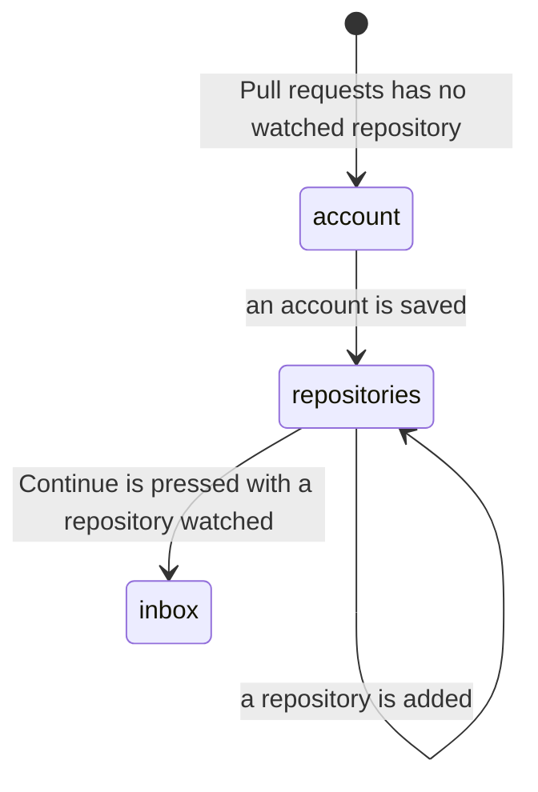

# Workspace setup on Pull requests

## Summary

When the active workspace watches no repository, the Pull requests screen shows workspace setup instead of the listing. The maintainer confirms the GitHub account, then adds the repositories to review by `owner/repo`. Setup happens in place: it never opens Settings, and it uses the same two cards Settings → Workspace renders, saving through the same path.

## The simple case

On a new installation, Pull requests shows `Set up your workspace` with two numbered cards. `1. Reviewing as` states the account the GitHub CLI resolved, or offers a selector when several are authenticated. Saving an account is the first thing that happens; on a fresh install with no stored workspace, that save writes the Default workspace, which becomes active.

`2. Repositories` appears once an account is saved. The maintainer types a repository such as `acme/api` into `Add a repository` and presses Add; each added repository saves at once, so several can be added in one pass. A repository's checkout is optional here and can be chosen from its row; see [Watched repositories and checkouts](watched-repositories.md). Once at least one repository is watched, a Continue button appears at the end of setup; pressing it opens the inbox.

## The task, event by event

```mermaid
stateDiagram-v2
    [*] --> account : Pull requests has no watched repository
    account --> repositories : an account is saved
    repositories --> repositories : a repository is added
    repositories --> inbox : Continue is pressed with a repository watched
```

### Arrive

The screen reaches this path when the workspace loaded successfully and watches no repository. The page heading is `Set up your workspace`, and it takes focus on arrival like every other destination's heading. The numbered cards below it carry the rest. The filter toolbar, the table, the pager, and the details panel are not rendered; setup replaces the screen rather than sitting above it. The titlebar and the [Visited pull requests column](../foundations/visited-pull-requests.md) stay beside it, as they do on every screen. On a fresh install the column is a blank frame until the account save creates the workspace; after that it reads the new workspace's Reviews and shows its empty line when there are none. When the first inbox load never succeeded at all, the same setup appears under the screen's own `First run` header, with Refresh available.

One environment read serves the whole screen. `1. Reviewing as` renders what the GitHub CLI reports. Below it, and only when that read says Git is missing, one line says `Git is not installed. Install Git for this platform, then re-check.` Nothing else about local tools is shown, and Patchdesk installs and logs in to nothing.

Until an account is saved, the second card is replaced by the line `Choose an account first.` The watchlist needs a saved workspace, which the account save is what creates.

### Leave unchanged

Reading the cards, waiting for the environment read, and pressing Re-check change no saved value. Cancelling a checkout's folder picker leaves the row as it was. Nothing here opens Settings.

### Begin an action

Choosing an account in `1. Reviewing as` saves it. When the GitHub CLI reports exactly one authenticated account, Patchdesk adopts it once by itself and saves it the same way. Manual GitHub account and host fields commit on blur and on Enter.

Add in `2. Repositories` writes the repository to the watchlist; Stop watching removes it. Re-check re-reads the environment.

### While the action runs

The control that committed says `Saving…` beneath itself, then `Saved`. Add is disabled while its request runs. A repository row shows its own pending state while its request runs.

A save that fails leaves the previous saved value in place and reports the reason beside the control that caused it. Setup does not move on to the next card until the value it needs is actually saved.

### Settle

A saved account makes `2. Repositories` appear. An added repository appears in the watched list with `No checkout chosen` until a checkout is chosen.

Setup stays on screen after the first repository is watched and ends when the maintainer presses Continue, at which point the Pull requests listing replaces it. Review-opening progress and errors stay scoped to their workspace, so a late result from another one cannot show a stale `Could not open review` alert over setup.

## Variants

| Variant                                                | Before the action runs                                                                                                               | While the action runs                                                                                                     |
| ------------------------------------------------------ | ------------------------------------------------------------------------------------------------------------------------------------ | ------------------------------------------------------------------------------------------------------------------------- |
| Workspace profile and GitHub account                   | A fresh install has no stored workspace, only a neutral one held in memory. The first account save writes it under the name Default. | Every later save updates that workspace. The account is what the watchlist is scoped to.                                   |
| Pull request and Review state                          | An empty watchlist produces this setup state, not a listing or a Review workbench.                                                   | No repository is read and no Review session is created until a repository is watched.                                     |
| GitHub permissions and merge readiness                 | Setup needs an authenticated account, not merge permission or a pull-request decision.                                               | Saving is local. Repository permission failures appear later, on the first listing read.                                  |
| Network, local tool, and Insight provider availability | The GitHub CLI supplies the accounts. A missing Git shows its own line. Insight providers are not required and are not queried.      | Adding reads no folder. A failed environment read leaves the account card explaining the failure, with Re-check.          |
| Input path: mouse, keyboard, or desktop menu           | The cards are the same controls Settings renders, and are keyboard operable.                                                         | Commit on Enter and commit on blur reach the same save. Choose checkout's macOS folder picker temporarily owns focus.      |

## Cancel and interrupt

| Event                                                                                                 | Before the action runs                                                                                   | While the action runs                                                                                             |
| ----------------------------------------------------------------------------------------------------- | -------------------------------------------------------------------------------------------------------- | ----------------------------------------------------------------------------------------------------------------- |
| Cancel, Stop, or Escape                                                                               | There is no setup-wide Cancel or Stop. Escape has no effect here.                                        | A save and a watchlist write have no Stop control; each settles or fails on its own.                              |
| Navigate to another Patchdesk screen, Review, Settings section, or workspace profile                  | Navigation proceeds; setup holds nothing unsaved. Settings → Workspace shows the same two cards.         | Leaving does not cancel a request in flight. Returning re-reads the environment and the workspace.                |
| Start another action or request a refresh                                                             | Re-check and Refresh are separate reads. Neither edits the workspace.                                    | A newer Re-check owns the visible result. A reload after a save is what makes the next card correct.              |
| GitHub, the network, a local tool, or an Insight provider fails or times out                          | Setup is reachable without any successful GitHub read; the empty state is local.                         | The affected control reports its own failure. Nothing retries by itself; Re-check and re-committing are explicit. |
| Close Settings, reload the renderer, close the window, or quit Patchdesk                              | Saved account, watchlist, and checkouts survive. Probe results do not.                                   | A reload drops in-memory status. The next load starts from what was actually saved.                               |
| The pull request, represented revision, pending review, permission, or other target changes elsewhere | No pull-request target exists yet. Another workspace becoming active changes what setup is asked for.    | The next inbox load is authoritative for whether setup is still needed.                                           |
| macOS focus, a file or folder picker, or another input path takes control                             | Cancelling Choose checkout's folder picker changes nothing.                                              | Focus loss does not cancel a watchlist write. Blur is itself a commit.                                            |

## Interactions with other systems

**Workspace profile and identity.** Setup writes the same workspace Settings → Workspace writes, through the same editor. The account save on a fresh install is what creates the workspace.

**Review revision and freshness.** No Review session or represented revision exists in this state. Freshness begins after a watched pull request is loaded.

**Local persistence and recovery.** A workspace that was never persisted is neutral: Patchdesk holds it in memory rather than writing a record with no account. The first account save is what writes it, under the name Default. Account, watchlist, and checkouts are durable; environment results are re-creatable.

**GitHub permissions and write authority.** Nothing here writes to GitHub. A resolved account proves only that the GitHub CLI reports it as authenticated.

**Network, local tools, and Insight providers.** One environment read supplies both the account list and the Git line. Patchdesk reads no folder during setup. Insight providers are not consulted.

**Concurrent operations and locking.** Saves compose and the newest response wins. Watchlist writes are per repository, so one slow row does not block another.

**Feedback, errors, and diagnostics.** Every control reports its own state: `Saving…`, `Saved`, or the reason it failed. No credentials or raw command output are shown.

**Preferences, keyboard commands, and desktop integration.** Setup shares the Pull requests screen's Refresh behavior; Choose checkout uses the native folder picker.

**Supported input and accessibility limits.** Mouse and keyboard are in scope. Screen-reader behavior is outside the supported product claim.

## Edge cases

- The Git line appears only when the environment read says Git is missing. A missing or unauthenticated GitHub CLI is reported by the account card itself, not by a separate tools list.
- A workspace that already watches a repository does not show setup, even when the latest read returns no pull request; that is a different settled state.
- A late Review-opening result from a prior workspace is ignored when the current one reaches setup.
- A workspace that stopped watching its last repository still lists the Reviews it opened in the Visited pull requests column beside setup, and a row there opens that Review.

## Open questions and verification

- The in-place setup flow still needs a live check with an empty watchlist. The checklists in `verification/` describe the previous card.
- Confirm how the Visited pull requests column looks beside setup on a fresh install.
- Confirm where focus lands when Continue replaces setup with the listing.
- Confirm what a fresh install shows between the account save and the first environment read settling.
- Confirm the presentation when the account save fails on a machine with no stored workspace.

Baseline drafted from Patchdesk application source commit `3100615`; revised and verified against `737c515c`.
