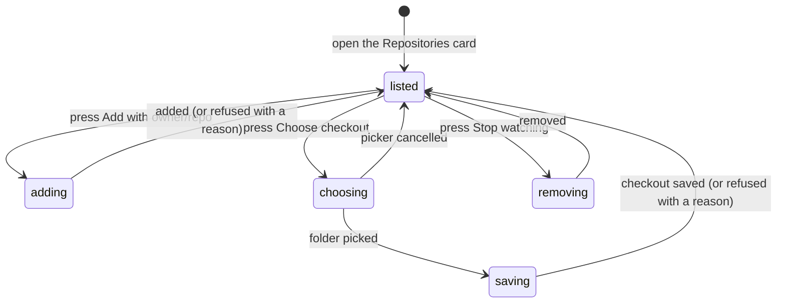

# Watched repositories and checkouts

## Summary

The Repositories card lists the repositories a workspace watches and the local checkout the maintainer chose for each. Settings → Workspace and the Pull requests setup flow both render it. The maintainer adds a repository by typing `owner/repo`, and chooses its checkout with the macOS folder picker when a local Review needs one. Patchdesk never searches the disk for checkouts, so it never walks folders such as Music, Photos, or Documents and never triggers the macOS privacy prompts that walk caused before #641.

## The simple case

The maintainer opens Settings → Workspace, types `acme/api` into `Add a repository`, and presses Add. The repository appears in the watched list with `No checkout chosen`, and the Pull requests screen can list its pull requests at once.

To open local Reviews, the maintainer presses Choose checkout on the row and picks the folder that holds the clone. Patchdesk checks that the folder sits inside a git checkout whose `origin` is `acme/api`, saves the checkout's top-level folder, and the row shows that path. The same choice is offered by the Local review button the first time it is pressed for a repository with no checkout; see [Opening a local Review](../pull-requests/opening-a-local-review.md#arrive).

## The task, event by event

### Arrive

The card is titled `Repositories` in Settings and `2. Repositories` in the setup flow, under the description `Pull requests are listed from watched repositories. A local review needs the repository's checkout.` It holds the `Add a repository` field with its Add button, then the watched repositories. Each row names `owner/repo`, the checkout path or `No checkout chosen`, a Choose checkout button, and a Stop watching button. A workspace that watches nothing says `No repositories watched yet.`

Opening the card reads the saved workspace only. It runs no command and opens no folder.

### Leave unchanged

Reading the list, typing in the field without pressing Add, and cancelling the folder picker change nothing. Closing Settings asks nothing, because every action saves at once.

A profile saved by v0.0.12 or earlier can still list workspace roots. Patchdesk loads it with its watched repositories and their checkouts unchanged, ignores the roots, and saves the list back empty on the next save of that workspace, so a v0.0.12 build can still open it. It does not turn them into checkouts.

### Begin an action

Add accepts `owner/repo`, trimmed, on the workspace's GitHub host. Input that is not exactly two valid GitHub names separated by one `/` shows `Enter a repository as owner/repo.` and sends nothing. A repository already watched shows `<owner>/<repo> is already watched.` and sends nothing. Otherwise Patchdesk adds it to the watchlist.

Choose checkout opens the macOS folder picker at the repository's current checkout, when it has one. Picking a folder sends it to the main process. Stop watching removes the repository from the watchlist.

Each request names the workspace whose repositories the card is showing, so a control used while a workspace switch is still loading changes that workspace, not the one arriving.

### While the action runs

Add is disabled while its request runs. A row shows a spinner while its own Choose checkout or Stop watching request runs, and its two buttons are disabled; other rows stay usable.

The main process accepts a chosen folder only when `git rev-parse --show-toplevel` finds a checkout around it and that checkout's `origin` names the repository, in HTTPS or SSH form. It saves the checkout's top-level folder with symlinks resolved.

### Settle

A successful add, checkout, or removal reloads the workspace, so the card and the Pull requests repository picker agree. An added repository has no checkout. A saved checkout replaces any earlier one for that repository.

A refused checkout keeps the saved one and says why beneath the row: `That folder is not inside a git checkout.` or `That checkout's origin is not <owner>/<repo>.` A failed add keeps the typed text and shows the reason beneath the field. A failed removal keeps the row and shows the reason beneath it.

## Variants

| Variant                                                | Before the action runs                                                                                                       | While the action runs                                                                                |
| ------------------------------------------------------ | ---------------------------------------------------------------------------------------------------------------------------- | ---------------------------------------------------------------------------------------------------- |
| Workspace profile and GitHub account                   | The workspace supplies the host an added repository uses. The card needs a saved workspace; setup asks for an account first. | Each request names the workspace on screen; a switch in flight cannot redirect it.                   |
| Pull request and Review state                          | Adding creates no Review. A repository with no checkout still lists its pull requests.                                       | Removing a repository does not delete its Reviews. Changing a checkout does not move an open Review. |
| GitHub permissions and merge readiness                 | Adding reads nothing from GitHub, so a mistyped or private repository is only found out by the first listing read.           | No effect.                                                                                           |
| Network, local tool, and Insight provider availability | Adding needs no network. Choose checkout needs `git`.                                                                        | A `git` failure refuses the folder as not a checkout.                                                |
| Input path: mouse, keyboard, or desktop menu           | The field submits on Enter or Add. Every button is keyboard operable.                                                        | The macOS folder picker owns focus until it returns.                                                 |

## Cancel and interrupt

| Event                                                                                                 | Before the action runs                                                            | While the action runs                                                                         |
| ----------------------------------------------------------------------------------------------------- | --------------------------------------------------------------------------------- | --------------------------------------------------------------------------------------------- |
| Cancel, Stop, or Escape                                                                               | Cancelling the folder picker saves nothing.                                       | Requests have no Stop control; each settles or fails on its own.                              |
| Navigate to another Patchdesk screen, Review, Settings section, or workspace profile                  | Navigation proceeds; nothing is held unsaved. Typed text in the field is dropped. | A request in flight still settles for the workspace it named. The next load is authoritative. |
| Start another action or request a refresh                                                             | Rows are independent.                                                             | A busy row's buttons are disabled; other rows and Add stay usable.                            |
| GitHub, the network, a local tool, or an Insight provider fails or times out                          | No effect on reading the card.                                                    | A storage failure keeps the saved state and shows the reason beside the control.              |
| Close Settings, reload the renderer, close the window, or quit Patchdesk                              | Saved repositories and checkouts survive.                                         | A request in flight is not waited for; the next load shows what was saved.                    |
| The pull request, represented revision, pending review, permission, or other target changes elsewhere | No effect.                                                                        | No effect; the card does not read pull requests.                                              |
| macOS focus, a file or folder picker, or another input path takes control                             | The folder picker opens only when Choose checkout is pressed.                     | Focus loss does not cancel a request.                                                         |

## Interactions with other systems

**Workspace profile and identity.** The workspace owns its watched repositories and their checkouts; [Workspace profile and identity](../foundations/workspace-profile-and-identity.md) owns the profile boundary. The card changes nothing else in the workspace.

**Review revision and freshness.** A checkout is where local Reviews are read and kept. Pointing a repository at a different checkout makes Reviews stored against the old one stop resolving, and retention removes them like a gone source.

**Local persistence and recovery.** Watched repositories and checkouts are saved in the workspace profile file. A v0.0.12 profile with workspace roots loads, and its next save writes the list back empty.

**GitHub permissions and write authority.** Nothing here writes to GitHub.

**Network, local tools, and Insight providers.** Choose checkout runs two read-only `git` commands in the chosen folder. Nothing else here runs a command.

**Concurrent operations and locking.** Requests are per row. Profile writes use the main process's own serialization.

**Feedback, errors, and diagnostics.** Each row and the Add field report their own failure. No raw command output is shown.

**Preferences, keyboard commands, and desktop integration.** Choose checkout uses the macOS folder picker through the main process.

**Supported input and accessibility limits.** Mouse and keyboard are in scope.

## Edge cases

- A subfolder of a checkout is accepted; the saved path is the checkout's top-level folder.
- A linked worktree of the repository is accepted as its checkout, because its `origin` matches.
- A second clone of the repository is accepted; the checkout the maintainer chose last wins.
- Repository names are compared exactly as GitHub names appear in the `origin` URL; a checkout whose `origin` differs only in letter case is refused.
- A mistyped or inaccessible `owner/repo` is watched anyway; the Pull requests screen reports the read failure.
- A repository control used before a workspace has loaded reports `Workspace still loading.` and sends nothing.
- A moved checkout is chosen again with Choose checkout; its Reviews reopen on the same sessions.

## Open questions and verification

- Live checks WATCH-01 to WATCH-05 in [verification](../verification/pull-requests.md#first-runwatched-repositoriesmd) are pending.
- Confirm where focus lands after the folder picker returns.
- Adding by `owner/repo` does not check the repository exists. Confirm whether Add should read it from GitHub first.

Drafted for #641 from Patchdesk application source `5a870640` with the change on `fix/641-remove-checkout-scan`; not yet verified live.
