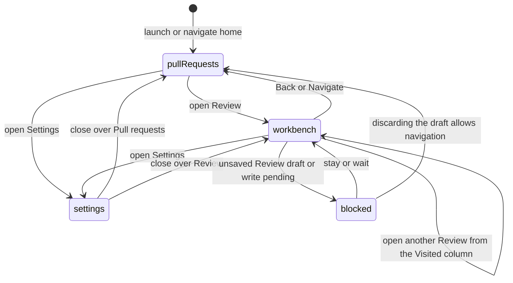

# Navigation and overlays

## Summary

Patchdesk has two primary destinations: the Pull requests screen and a Review workbench identified by its Review. Around them sits persistent app chrome: the titlebar and the [Visited pull requests column](visited-pull-requests.md), which stay in place while the destination changes. Settings opens above either destination and does not replace it. Navigation preserves safe screen position, moves focus when the destination changes, and refuses to discard an unsaved Review draft or abandon a GitHub write whose result is still pending.

## The simple case

The app opens on the last saved destination. The maintainer selects a pull request and enters its Review workbench, then uses the Back control or Navigate to return to Pull requests. A row in the Visited pull requests column moves straight from one Review workbench to another without passing through Pull requests. The document title and titlebar name the current destination. From either destination, entering a GitHub pull-request URL or compact `owner/repository#number` reference in Navigate adds one action to open that pull request.

Settings opens from the titlebar, Navigate, ⌘,, or the native application menu. It defaults to General unless the caller targets a section. Closing it reveals the same destination and returns focus to the control that opened it.

Within a Review workbench, Patchdesk saves the active top-level tab, navigator section, and selected file for that Review. Reloading or relaunching restores valid saved values without applying one Review's position to another.

## The task, event by event

### Arrive

On launch, Patchdesk reads the saved destination. An absent, malformed, or unrecognized value falls back to Pull requests. A workbench destination includes the Review ID; Patchdesk loads the Review before rendering the full workbench.

When the restored Review's record no longer exists, such as after the retention sweep removed it, Patchdesk returns quietly to Pull requests and saves that as the destination, so the next launch does not ask for the same Review again. No alert appears. Any other load failure, and any failure for a Review opened during this session, still shows the `Could not open review` notice.

The app title becomes `Pull requests · Patchdesk` or `Review workbench · Patchdesk`. After a true destination change, Patchdesk focuses the first `h1` inside the main content. A Skip to content link targets the same main region.

When Settings opens, it remembers an opener for focus return. A caller can target General, Workspace, Review, Data & recovery, or Logs. Direct calls without a section open General.

### Leave unchanged

Choosing the current destination again does nothing. Closing a clean Settings overlay keeps the underlying destination, clears the session-only Settings restore marker, and returns focus to the opener.

Closing Navigate without choosing a command records no destination change. Text that is not a pull-request reference adds no pull-request action. Opening a Settings section, reading it, and closing it does not change the underlying Review or Pull requests state.

### Begin an action

Opening a Review stores its validated workbench projection and changes the destination to that Review's workbench key. The Review code loads only after Patchdesk has a canonical Review projection.

Back, Navigate, a Visited pull requests row, Pull request presets, switching workspace, and commands from the native menu call the same destination owners as visible buttons. A clean destination request saves its key and clears the workbench payload when leaving the workbench. A recognized pull-request reference adds `Open owner/repository#number`; activating it checks the active workspace's watchlist before using the same Review opener as the Pull requests screen.

Opening Settings is refused when navigation state is not clear. ⌘K and the titlebar Settings control are also disabled or ignored. The native close path reads the same navigation state from the renderer.

### While the action runs

While Review preparation or route code is loading, Patchdesk shows a loading status. A route-load failure replaces it with a workbench load error and Retry; Retry creates a fresh route loader attempt without changing the Review identity.

Workbench position updates save the active tab, navigator section, and selected path under the Review ID. Selected paths are limited to 2,000 characters. Settings section changes write a session-only restore marker while the overlay remains open.

When the renderer reports anything other than a clear navigation state, Patchdesk parks the requested destination behind the leave dialog. A pending GitHub write offers only Wait for completion. An unsaved local Review draft offers Stay on this review or Discard changes and leave. Settings never parks a destination: its sections save their own values as they are changed.

### Settle

A successful destination change updates the screen, stored destination key, title, and focus. Leaving the workbench drops its loaded renderer projection, while durable Review state remains local. Moving from one Review workbench to another drops the first Review's projection at once, so its diff never renders under the second Review's name; until the second Review loads, the main content shows the Pull requests screen with the titlebar busy bar labeled `Loading review…`.

Closing Settings normally clears its reload marker and restores opener focus. If the renderer reloads while Settings is open, the overlay reopens on the saved section. A fresh app launch does not reopen Settings because the marker uses session storage.

Closing the desktop window or quitting while state is clear proceeds. An unsaved Review draft opens a native warning that can keep the app open or discard the latest unsaved edit. A pending GitHub write prevents close and tells the maintainer to wait for the final result.

## Variants

| Variant | Before the action runs | While the action runs |
| --- | --- | --- |
| Workspace profile and GitHub account | The active profile appears in the titlebar and scopes destinations that load data. | Applying another workspace clears the loaded workbench, resets the Pull requests request, and returns to Pull requests. |
| Pull request and Review state | A workbench destination needs a Review ID and a loadable local projection. | Revision and remote-state changes update the workbench without changing its destination key unless the Review itself changes. |
| GitHub permissions and merge readiness | Navigation and Settings do not require GitHub write permission. | Permission changes affect controls in the destination, not navigation itself. A pending write still blocks leaving until settlement. |
| Network, local tool, and Insight provider availability | Previously stored destinations and view positions are local. Loading their content can still fail. | A route or data-load failure shows local Retry where provided. Settings remains an overlay over the last rendered destination. |
| Input path: mouse, keyboard, or desktop menu | Back, titlebar controls, Navigate, ⌘K, ⌘,, and native menu actions reach the same owners. | The blocked state disables or ignores Settings and Navigate commands regardless of input path. |

Changing input path does not bypass navigation state. A native window close uses a native prompt because the renderer can no longer be trusted to remain visible during desktop shutdown.

## Cancel and interrupt

| Event | Before the action runs | While the action runs |
| --- | --- | --- |
| Cancel, Stop, or Escape | Closing Navigate or a clean Settings overlay keeps the current destination. A leave guard returns to the current task when cancelled. | Cancel cannot override write pending. A draft guard can stay or discard before continuing. |
| Navigate to another Patchdesk screen, Review, Settings section, or workspace profile | Same-destination requests do nothing. Clean destination and section changes proceed. | A parked destination waits behind the Review that owns the guard. Switching workspace has its own latest-request guard and returns to Pull requests only after success. |
| Start another action or request a refresh | Refresh acts inside Pull requests and does not create a destination. Opening Settings overlays the destination. | Refresh or route loading can show the shared busy bar. Navigation guards remain owned by the Review's draft or write state. |
| GitHub, the network, a local tool, or an Insight provider fails or times out | Stored route and position reads do not need them. Destination content can show a read failure after arrival. | Review route import failure offers Retry. Data failures remain within the active destination unless a profile switch succeeds. |
| Close Settings, reload the renderer, close the window, or quit Patchdesk | Settings closes and clears restore state without a question. Reload restores the last destination and valid position. | Closing with an unsaved Review draft requires confirmation. Write pending prevents close. Renderer reload can restore destination and Settings section but not arbitrary unsaved text. |
| The pull request, represented revision, pending review, permission, or other target changes elsewhere | The workbench can open with readonly or changed state when its Review still exists. | Remote changes alter feature controls and freshness. They do not apply another Review's saved position. |
| macOS focus, a file or folder picker, or another input path takes control | Normal Settings close returns focus to the opener. Destination changes focus the new screen heading. | Native dialogs and pickers temporarily own focus. Hand verification must confirm focus after every native return path. |

After interruption, Patchdesk keeps the current destination unless it explicitly accepted a new one. Saved position is convenience state; it never authorizes an action or proves the loaded Review is current.

## Interactions with other systems

**Workspace profile and identity.** Profile selection is global navigation context. A successful switch reloads Pull requests under the selected profile and clears the in-memory workbench.

**Review revision and freshness.** A Review destination stays keyed to the Review across revisions. The workbench projection owns freshness; navigation only owns where it is shown.

**Local persistence and recovery.** Destination, per-Review position, and the Visited pull requests column's collapse choice use local storage and survive relaunch. Open Settings section uses session storage and survives reload only. Invalid values are ignored or partially degraded.

**GitHub permissions and write authority.** Navigation never grants write authority. It blocks departure during a pending write so the main process can report the final GitHub result.

**Network, local tools, and Insight providers.** They affect content inside a destination. Navigation shell, saved position, and Settings overlay state are local.

**Concurrent operations and locking.** Draft and write-pending states are one renderer navigation state, reported by the Review workbench. Workspace and Review owners still use their own request generations and main-process locks.

**Feedback, errors, and diagnostics.** Loading statuses and route errors appear in main content. Native close warnings explain whether unsaved local text or a GitHub result is at risk.

**Preferences, keyboard commands, and desktop integration.** ⌘K opens Navigate and ⌘, opens Settings when navigation is clear. The first titlebar control collapses or expands the Visited pull requests column. Native menu Settings and Refresh actions raise the window before delivery. Window bounds persist separately from workbench position.

Navigate accepts a plain GitHub pull-request URL, a URL with trailing path, query, or fragment content after the pull-request number, or a compact reference. Issue and commit URLs remain ordinary search text and add no pull-request action.

**Supported input and accessibility limits.** Keyboard and mouse navigation are in scope. Destination changes focus the new `h1`; screen-reader behavior is not a supported product claim.

## Edge cases

- A saved workbench position applies only to its Review ID.
- Corrupt position data is ignored. One malformed field can drop while other valid fields still restore.
- Removed tab or section names from an older build do not block restoration of still-valid fields.
- Settings restore values longer than 48 characters and selected paths longer than 2,000 characters are clamped before validation.
- A second app launch focuses or recreates the existing Patchdesk window rather than opening a second working instance.
- Closing the only window on macOS does not necessarily quit the app; activating the app can recreate or focus the workbench window.
- Settings cannot open while navigation is blocked, including through ⌘, or the native menu.
- Only the Review workbench reports navigation state, and only as a pending GitHub write or clear. No surface reports an unsaved draft, so the Stay on this review and Discard changes and leave choices are not reachable in the default app.
- The Navigate palette closes before it dispatches a destination or Pull requests action.
- A pull-request palette action is available from both Pull requests and a Review workbench. An unwatched repository returns to Pull requests and shows the existing refusal without sending an opening request.
- A launch that restores a Review whose record was removed lands on Pull requests with no alert. A Review opened in this session that fails to load still shows `Could not open review`.
- A workbench-to-workbench change never shows the previous Review's content while the next one loads, and a failed load does not leave it on screen.

## Open questions and verification

- A read-only live pass on 2026-09-14 confirmed that Settings opened from the titlebar or from Navigate returns focus to that opener on Close or Escape, and that Escape closes Settings.
- The same pass read focus after three destination changes and did not find it on the new `h1`. An independent review found that result inconclusive: the CDP window reported `document.visibilityState` as hidden and ran no animation frames, and Patchdesk moves heading focus in the next animation frame. The claim above stands on source until a pass runs in a visible window.
- Latent defect: a re-render that hands the shell a new destination value before that frame runs cancels the scheduled focus, and the shell never schedules it again, because it recorded the destination as focused when it scheduled the frame. The heavy first paint of a Review workbench makes that re-render plausible. No test covers heading focus. See [B-14](../bug-triage.md#b-14-a-re-render-can-cancel-heading-focus-after-a-destination-change).
- Confirm focus after leave-guard cancellation and native close cancellation.
- Confirm that Escape and clicking outside Settings clear the restore marker on a clean close.
- Confirm the exact visible restore after a renderer reload from each workbench tab, navigator section, and selected file.
- The quiet launch return and the workbench-to-workbench transition were not observed live: the test workspace held no removed Review, and every Review loaded too fast to see the intermediate screen.

Baseline drafted from Patchdesk application source commit `3100615`; global pull-request palette behavior updated for issue #84; revised and verified against `dd613996`.
