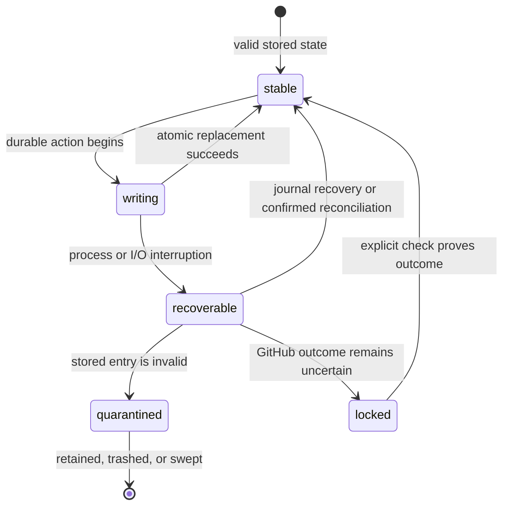

# Persistence and recovery

## Summary

Patchdesk separates configuration, durable Review data, disposable cache, and logs so recovery and cleanup can make narrow promises. Writes replace complete files atomically, reject credential-shaped content, and quarantine corrupt records. Journals and stored operation intents let Patchdesk recover interrupted preparation, Insights, merges, and other GitHub writes without guessing or repeating an uncertain write.

## The simple case

Profiles and global preferences live under `~/.config/patchdesk`. Reviews, sessions, retained Insights, write intents, diagnostics, prepared artifacts, and logs live under `~/.local/share/patchdesk`. Re-creatable inbox data, avatars, and represented-review worktrees live under `~/.cache/patchdesk`.

Patchdesk writes one complete replacement file, syncs it, and renames it over the previous value. Readers validate the JSON and its domain shape before the value can affect the product.

After an interruption, Patchdesk reads durable journals and operation records. It finishes cleanup, quarantines invalid state, marks orphaned runs failed, or requires GitHub reconciliation. The maintainer sees a safe explicit status rather than a permanently spinning action.

## The task, event by event

### Arrive

Startup creates the local API, recovers Insight run state, recovers preparation journals and Review state through their owners, sweeps retained storage, and opens the window only after the local service passes its health check. If the local service cannot start, Patchdesk shows a native error and exits without beginning a Review or GitHub write.

Missing configuration is a normal first-run state. Missing optional Review records can be an empty state. Invalid JSON, invalid domain values, sensitive content, or inconsistent artifacts are failures and never become rendered product state.

### Leave unchanged

Reading stored state does not rewrite it. Reading a Review, opening Settings, loading cached inbox data, or listing diagnostics can leave every durable record unchanged.

Closing the app while no owned operation is pending stops the local service, flushes logs, and exits. Renderer-only view state can persist separately through local or session storage.

### Begin an action

Before a durable artifact write, Patchdesk creates the containing directory with private permissions and writes to a new sibling temporary file. It refuses to serialize values that contain credential-like keys or token-shaped strings.

Review preparation writes a journal before it creates a worktree or prepared artifact. A GitHub write persists intent before the network call. Merge, pending-review, direct-summary, metadata, conversation, and published-feedback flows retain enough identity to classify a later remote read.

Cleanup actions take the profile lifecycle lock. Clear cache targets re-creatable cache children. Clear local review data scans sessions, quarantines invalid entries, protects running state, and removes only sessions that are safe to discard.

### While the action runs

An artifact write syncs the temporary file, closes it, renames it over the target, and best-effort syncs the directory. Failure removes the temporary file and leaves the previous complete target intact where possible.

Preparation records each owned path before use. Recovery validates every deletion target against the expected profile and session roots before it removes anything. A path that cannot be proved owned blocks cleanup rather than widening deletion.

Active Reviews, active Insights, locked pending or summary reviews, pending merges, and live preparation journals protect their sessions from cleanup. Cache and local-data operations serialize with profile preparation and recovery.

### Settle

A successful write makes one complete parsed value authoritative. A failed write returns a storage failure; it never loads the partial temporary file as the target.

An interrupted Insight that has no live child at startup becomes a failed, retryable run with unexpected-failure classification. An interrupted preparation resumes cleanup or completion from its journal before another attempt begins.

An invalid stored session or Review moves to quarantine when its owner can safely identify it. Quarantine keeps the bad evidence out of the app while preserving it for diagnosis or later trash.

An uncertain GitHub write remains locked after restart. Recovery reads GitHub and classifies exact intent evidence. Absence of proof does not become permission to repeat the write.

## Variants

| Variant | Before the action runs | While the action runs |
| --- | --- | --- |
| Workspace profile and GitHub account | Config and durable data are namespaced by profile. Credentials are resolved at use time and are not stored. | Profile lifecycle locking prevents cleanup from racing preparation under the same namespace. |
| Pull request and Review state | Active open Reviews and current sessions are protected. Terminal and orphaned sessions can become retention candidates. | A Review lock protects one Review's writes and recovery classification. Revision identity remains part of every stored operation. |
| GitHub permissions and merge readiness | Storage can remain readable without current GitHub permission. Recovery that needs remote proof requires a current authenticated read. | Permission or network failure keeps uncertain writes locked; it does not convert them to confirmed failure. |
| Network, local tool, and Insight provider availability | Local configuration and Review data do not need the network to be read. Re-creating cache or reconciling operations can need GitHub, Git, or a provider. | A child or tool failure records a typed operation result where possible. Storage and diagnostic failures remain separate. |
| Input path: mouse, keyboard, or desktop menu | Data and recovery controls reach the same storage owner. | Input path cannot bypass protection of running sessions or the confirmation for destructive cleanup. |

The directory class, not the file extension, defines whether data is durable or disposable. A represented-review worktree is cache even though it is a Git checkout; the Review session and patch that identify it are durable data.

## Cancel and interrupt

| Event | Before the action runs | While the action runs |
| --- | --- | --- |
| Cancel, Stop, or Escape | Cancelling a cleanup confirmation records nothing. | A pending destructive cleanup keeps its confirmation open on failure. Insight Stop requests durable cancellation through the run owner. |
| Navigate to another Patchdesk screen, Review, Settings section, or workspace profile | Durable state remains. Renderer-only drafts follow their feature guard. | Scope locks and identifiers prevent a late storage or recovery result from replacing another profile or Review. |
| Start another action or request a refresh | Independent reads can proceed. Conflicting mutations acquire Review or profile lifecycle locks. | Locked actions queue or refuse rather than interleave unsafe durable changes. |
| GitHub, the network, a local tool, or an Insight provider fails or times out | Local reads can still succeed. Recovery needing remote proof remains unavailable or locked. | Confirmed failures record retryable state. Uncertain remote writes keep their intent and require a later check. |
| Close Settings, reload the renderer, close the window, or quit Patchdesk | Stable durable state survives. Clean shutdown flushes logs and stops the local service. | Journals and operation records survive process loss. Startup recovery classifies them before normal use. |
| The pull request, represented revision, pending review, permission, or other target changes elsewhere | Stored evidence remains bound to its recorded revision and identity. | Recovery adopts authoritative GitHub state only when it matches the stored intent; it never merges conflicting drafts. |
| macOS focus, a file or folder picker, or another input path takes control | No effect on durable state. | Focus loss does not cancel file writes, recovery, or cleanup. Native Trash is used only for explicit quarantined-entry deletion where available. |

After interruption, Patchdesk prefers a retained locked or quarantined record over silent loss or duplicate external action. Recovery status must tell the maintainer whether retry is safe.

## Interactions with other systems

**Workspace profile and identity.** Workspace profile identifiers namespace config, Review data, cache, diagnostics, and recovery. Stored profiles contain expected account names but no tokens.

**Review revision and freshness.** Sessions, Insights, patches, worktrees, and write intents carry Review and revision identity. Recovery cannot move evidence to another revision.

**Local persistence and recovery.** This document owns the directory classes, atomic-write rule, quarantine rule, retention, and recovery stance.

**GitHub permissions and write authority.** Durable intent exists before a write. Recovery requires positive remote evidence and never retries an uncertain request automatically.

**Network, local tools, and Insight providers.** Cache can be re-created from these sources. Durable state records their accepted result, not their credentials.

**Concurrent operations and locking.** Review locks serialize Review mutations. Profile lifecycle locks serialize preparation, recovery sweeps, and cleanup. Lock order is fixed so recovery cannot deadlock normal open or refresh flows.

**Feedback, errors, and diagnostics.** Storage failures are typed and redacted. Diagnostics are best effort and never turn a successful recovery into failure. The append-only JSONL log records process and lifecycle evidence.

**Preferences, keyboard commands, and desktop integration.** Renderer local storage holds destination and view preferences outside the XDG-style app directories. Explicit quarantined deletion uses macOS Trash when available.

**Supported input and accessibility limits.** Storage behavior is input-independent. Destructive controls and confirmations target keyboard and mouse use.

## Edge cases

- Patchdesk uses XDG-style folders and does not use `~/Library` for its own config, data, cache, or log records.
- Stored values with secret-, authorization-, cookie-, or password-like keys are rejected even if their other fields are valid.
- Token-shaped strings are rejected on both read and write, so a credential accidentally written by another version is not loaded.
- Directory and file permissions are private where Patchdesk creates them.
- Corrupt JSON and structurally invalid values are different storage failures but neither reaches the renderer as trusted state.
- A crash-left active Insight with no live child becomes retryable failed, not permanently running.
- An open pull request does not prove an uncertain merge failed; the merge operation remains locked.
- Clear cache keeps durable Review history. Clear local review data keeps active Reviews, running Insights, locked writes, pending merges, and diagnostics.
- The retention sweep targets terminal or orphaned sessions older than 14 days and quarantine entries older than 30 days. Per-item failure does not fail startup.

## Open questions and verification

- Live desktop verification is pending because this task did not run with the required herdr dev and log panes.
- Confirm the exact Settings copy and post-action destination after Clear cache and Clear local review data succeed or fail.
- Confirm startup presentation after an interrupted preparation, orphaned Insight run, uncertain GitHub write, corrupt session, and corrupt Review.
- Confirm that cache clearing re-creates represented-review worktrees when an older Review opens again and clearly reports any missing local checkout.
- Confirm native Trash behavior and recovery options for quarantined entries; the current Settings surface does not expose every lower-level storage-management action.

Verified against Patchdesk application source commit `3100615`.
