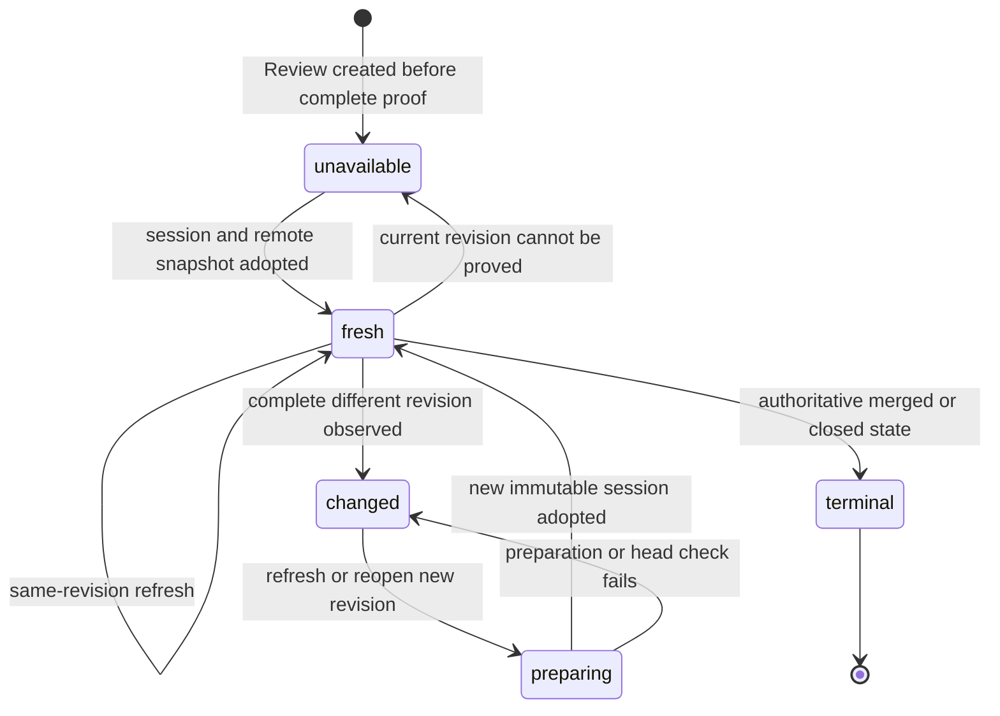

# Review session and revision

## Summary

A Review is the maintainer's continuing evaluation of one pull request under one workspace profile. A Review session is the immutable local evidence for one exact head and base revision within that Review. Patchdesk can refresh GitHub-owned state for the same session, prepare a new session when the revision changes, or keep older evidence readable while blocking writes when current proof is missing.

## The simple case

The maintainer opens an open pull request. Patchdesk reads its head and base, prepares a canonical patch and represented-review worktree, saves one session, and marks the Review Fresh after it has a represented remote snapshot.

Later, Refresh reads GitHub again. If the head and base are unchanged, Patchdesk keeps the same immutable session and updates GitHub-owned conversation, checks, metadata, merge evidence, and other remote state.

If the revision changed, Patchdesk prepares a new session and advances the Review to it only after preparation and a second revision check succeed. Earlier session evidence stays bound to the revision it described.

## The task, event by event

### Arrive

A Review identity contains the active profile, GitHub host, owner, repository, and pull-request number. Its stable Review ID follows that identity. The Review points to one current session ID and current head SHA.

A session adds head SHA, base SHA, pull-request snapshot, prepared context, patch path, optional canonical patch hash, represented-review worktree, and local GitHub-write evidence. Its ID is deterministic for that full key. Reopening the same prepared revision reuses the stored session.

A new Review begins Remote state unavailable with reason reconciliation incomplete. It becomes Fresh only after Patchdesk adopts a represented remote snapshot for the prepared session.

### Leave unchanged

Opening an already prepared session does not rewrite its revision-bound artifacts. Reading a Review, older Insight, patch, or conversation does not claim that GitHub is still current.

Leaving the workbench preserves the durable Review and sessions. Position persistence is separate convenience state described in [Navigation and overlays](navigation-and-overlays.md).

### Begin an action

Preparation reads the current pull request and requires both head and base. It derives the deterministic session ID, then serializes work for that profile and session. When a valid session already exists, it resumes it instead of rebuilding.

For a new session, Patchdesk creates a recovery journal, prepares a represented-review worktree or metadata-only fallback, fetches comments, checks, diff, and canonical comparison evidence, writes prepared artifacts, then reads the pull request again before committing the session.

Explicit refresh loads the active profile, Review, and current session, verifies that their identities agree, then reads the current pull request and the remote content used by the workbench.

### While the action runs

Preparation checks the revision before work and again after artifacts are written. A head or base change aborts the attempt and cleans up recorded partial artifacts. The previous Review session remains current.

Refresh reads the pull request before parallel remote reads and again afterward. If the two revision identities differ, Patchdesk returns head changed and does not adopt the candidate as current state.

Remote snapshot candidates are content-addressed before Review adoption. Decorative avatar caching is best effort and cannot fail the refresh.

If refresh sees a different stable revision, it prepares and saves that new session. It verifies the prepared session matches the revision already read before advancing the Review.

### Settle

A same-revision success updates the represented remote snapshot, refreshed time, and freshness while keeping the current immutable session.

A new-revision success moves the Review to the new session and head, records the new represented snapshot, and marks the Review Fresh. It does not copy prior local draft or comparison state into the new immutable session unless a specific reconciliation flow owns that evidence.

Incomplete base, diff, comparison, GitHub read, or reconciliation evidence settles as Remote state unavailable. Complete evidence of a different head, base, and canonical patch settles as Revision changed. Patchdesk does not call incomplete evidence a change.

Authoritative non-open evidence marks the Review merged or closed. Terminal state is durable and idempotent; later attempts do not reopen it.

## Variants

| Variant | Before the action runs | While the action runs |
| --- | --- | --- |
| Workspace profile and GitHub account | Review identity includes profile and repository. Profile credentials must resolve for GitHub reads. | A profile mismatch, missing profile, or wrong account prevents preparation or refresh from adopting state. |
| Pull request and Review state | Open, Fresh, Revision changed, Remote state unavailable, and terminal states decide available actions. | A head or base change during preparation or refresh aborts adoption. Stable new revision evidence can produce a new session. |
| GitHub permissions and merge readiness | Read access is required for preparation and refresh. Write permission is separate. | Checks, merge policy, and metadata can change in the remote snapshot without changing the immutable session revision. |
| Network, local tool, and Insight provider availability | GitHub and local Git are needed for full preparation. Missing or unavailable local checkout can produce a metadata-only session warning. | GitHub read or storage failure leaves the prior represented state in place. Insight providers have no role in proving revision identity. |
| Input path: mouse, keyboard, or desktop menu | Opening a recommended action or requesting refresh reaches the same Review owner. | Duplicate or conflicting Review mutations serialize by Review and profile lifecycle. |

The represented revision is never inferred from screen timing or request start time. It comes from head, base, and canonical patch evidence read for the same candidate.

## Cancel and interrupt

| Event | Before the action runs | While the action runs |
| --- | --- | --- |
| Cancel, Stop, or Escape | Leaving an already loaded workbench does not delete the Review. Preparation controls do not expose a generic partial-session commit. | Preparation failure or cancellation cleans journaled partial artifacts. Insight Stop affects the run, not the Review session itself. |
| Navigate to another Patchdesk screen, Review, Settings section, or workspace profile | Durable Reviews remain stored. A profile switch clears only the loaded renderer workbench. | Scope keys prevent a late response from replacing a different Review. Durable preparation can recover from its own journal. |
| Start another action or request a refresh | One explicit refresh can begin when the Review owner permits it. | Review operations serialize. Refresh and GitHub writes do not mutate the same Review concurrently without the coordinator lock. |
| GitHub, the network, a local tool, or an Insight provider fails or times out | Missing read evidence prevents preparation or marks current proof unavailable. | Failure keeps the prior session and Review evidence. Partial preparation is cleaned or recovered. Insight-provider failure does not change freshness. |
| Close Settings, reload the renderer, close the window, or quit Patchdesk | The durable Review and sessions survive. | Journals and stores provide recovery for committed preparation phases. Renderer loss does not itself advance freshness. |
| The pull request, represented revision, pending review, permission, or other target changes elsewhere | The next observation or refresh can mark Revision changed, unavailable, or terminal. | A second pull-request read detects a change during the operation and rejects adoption. Pending-review reconciliation occurs only under the Review lock. |
| macOS focus, a file or folder picker, or another input path takes control | No effect on represented revision. | Focus loss does not cancel preparation or refresh and is not revision evidence. |

After an interrupted refresh, the previous represented snapshot remains the last known readable state. The feature must label its freshness and cannot authorize a write from an incomplete candidate.

## Interactions with other systems

**Workspace profile and identity.** Profile is part of Review and session identity. The same pull request under another profile is a different Review namespace.

**Review revision and freshness.** This document owns the state words and transitions. Other documents link here rather than defining Fresh, Revision changed, unavailable, or terminal again.

**Local persistence and recovery.** Review, session, remote snapshot, prepared artifacts, and preparation journal are separate durable records. A corrupt stored session is quarantined before preparation retries it.

**GitHub permissions and write authority.** Readable evidence does not grant write authority. The write gate requires the Review and current session to match and the Review to be Fresh.

**Network, local tools, and Insight providers.** GitHub comparison rendering owns canonical revision proof. A local worktree supplies bounded inspection but cannot replace GitHub's canonical identity. Insights consume a session; they do not establish it.

**Concurrent operations and locking.** Session preparation serializes by profile and deterministic session ID. Review refresh serializes by profile and Review ID. Profile lifecycle locking protects cross-session preparation and recovery.

**Feedback, errors, and diagnostics.** User-facing failures distinguish authentication, GitHub read, head changed, terminal, storage, and not found where the surface supports it. Detailed preparation tags also enter redacted logs or diagnostics.

**Preferences, keyboard commands, and desktop integration.** View position can persist across sessions but never affects session identity or freshness.

**Supported input and accessibility limits.** Revision safety is independent of input path. Visible state and retry controls target keyboard and mouse use.

## Edge cases

- Same head with a different base is a different revision.
- A canonical patch hash can be absent when proof cannot be produced without making preparation more fragile; later write authority must still fail closed where it needs that proof.
- A stored valid session resumes without rebuilding its immutable artifacts.
- A corrupt session is quarantined before a new preparation attempt.
- Missing local path or unusable checkout can produce metadata-only preparation with a visible local-checkout warning.
- A pull request that changes during remote reads returns head changed and does not adopt the mixed snapshot.
- Closed does not automatically mean merged. Authoritative merge outcome distinguishes merged from closed unmerged.
- Terminal transition is one-way; later terminal observations are harmless.
- Refresh clears recent own-write observation baselines only after it fully re-baselines the represented remote state.

## Open questions and verification

- Live desktop verification is pending because this task did not run with the required herdr dev and log panes.
- Confirm the exact copy and available actions for Fresh, Revision changed, Remote state unavailable reasons, and terminal merged or closed states.
- Confirm preparation progress and retry behavior for missing local path, unavailable local checkout, GitHub authentication failure, storage failure, and head change.
- Confirm that older Insights and diffs remain readable after a new session becomes current and are labeled with their represented revision.
- Confirm the visible boundary between same-revision remote reconciliation and new-revision preparation.

Verified against Patchdesk application source commit `3100615`.
