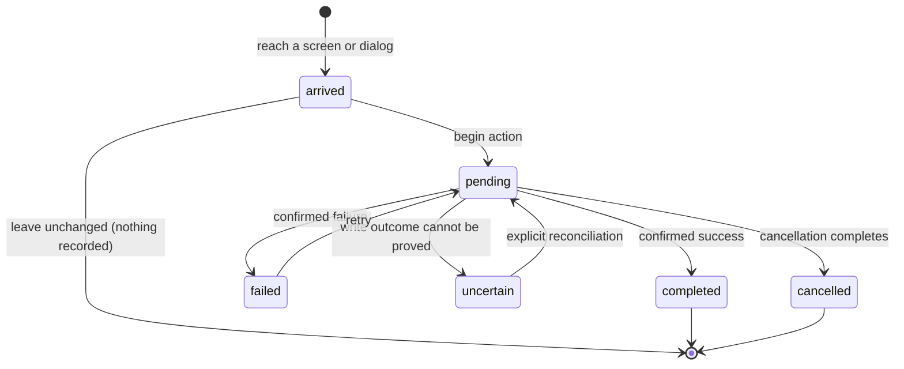

# Task lifecycle and interruption

## Summary

A task is one maintainer interaction that starts from visible state and settles with a confirmed result, cancellation, or explicit recovery state. Patchdesk does not force every task through one global queue. Each feature owns its action state, while shared navigation guards, the titlebar busy bar, and main-process locks coordinate the parts that cross screens or write durable state.

## The simple case

The maintainer arrives at a screen or dialog, reviews its current state, and begins an action. Patchdesk gives immediate feedback: a button disables, a label changes, a spinner or titlebar bar appears, or a new pending state is rendered.

The action either settles immediately or waits for local work, GitHub, a tool, or an Insight provider. On success, Patchdesk updates the confirmed projection the screen renders. On failure, it keeps enough prior state for the maintainer to understand what failed and whether retry is safe.

Nothing is recorded when the maintainer leaves an untouched surface. When a draft or write makes leaving unsafe, Patchdesk blocks the destination or asks for an explicit choice.

## The task, event by event

### Arrive

Patchdesk renders the latest confirmed state it has for the selected workspace profile and destination. A screen can also show that the remote state is stale, unavailable, changed, or terminal. Those states affect which actions are present or enabled before the maintainer begins anything.

Arrival can include a read. The Pull requests screen loads a repository listing, the Review workbench loads a local projection, Settings probes local tools, and pickers load GitHub choices. A read failure belongs to the surface that requested it; it does not turn every other feature into an error state.

### Leave unchanged

Leaving an untouched screen, closing a clean dialog, cancelling a picker before selection, or closing an unconfirmed run dialog records nothing. Patchdesk can still preserve view preferences such as destination, selected Settings section for reload restoration, navigator width, or theme. Those preferences are not the task's domain result.

If the surface is dirty or owns a write whose final result has not arrived, leaving is no longer the unchanged path. The navigation guard handles it as an interrupt.

### Begin an action

The action owner checks local prerequisites before starting. It can reject empty input, malformed values, missing provider configuration, an unavailable Review, absent permissions, stale revision evidence, or an existing conflicting operation without sending the requested work.

Accepted actions expose a pending state. Feature controls use labels such as Saving…, Switching…, Opening Review…, Starting…, Cancelling…, or Checking GitHub again…. Some tracked loading actions also start the thin indeterminate bar at the bottom of the titlebar.

The titlebar bar counts overlapping tracked actions. The first action supplies its accessible label, and the bar stays until the last tracked action settles. It does not mean every control in the app is locked.

### While the action runs

The feature decides what remains available. A save can leave form fields editable while disabling duplicate submission. An Insight run allows reading retained content and offers Stop after the run has an ID. A GitHub write can place the workbench in `write pending`, which disables Settings and quick navigation until the final result arrives.

Task owners use a target, request ID, run ID, generation, or Review key to keep older responses from replacing newer state. Starting another allowed action does not make this protection optional: only the response that still owns the current scope can settle it.

Long operations can report progress by polling confirmed durable state. A polling or status-read failure is distinct from proof that the underlying operation failed. The feature keeps the run or recovery identity needed to check again.

### Settle

A confirmed success replaces or patches the screen with the latest validated projection. The action-specific pending control clears. The titlebar bar clears only when no other tracked loading action remains.

A confirmed failure shows an action-local error and retains the prior confirmed state or editable draft. Retry is available only when the same action is safe to repeat.

Cancellation settles only when the owner confirms the cancelled state. Requesting cancellation is still pending; the Stop control can change to Cancelling… while the child or service shuts down.

An uncertain GitHub write settles differently from a failure. Patchdesk locks related writes and offers an explicit GitHub check or manual resolution. It never repeats the original write automatically.

## Variants

| Variant | Before the action runs | While the action runs |
| --- | --- | --- |
| Workspace profile and GitHub account | The active profile scopes local data, repositories, credentials, and the Review key. | A profile switch can obsolete earlier profile-scoped responses. Applying it clears the loaded workbench and reloads the Pull requests screen. |
| Pull request and Review state | Freshness, represented revision, and terminal state decide whether revision-bound actions are available. | A remote change can turn the action into cancellation, supersession, readonly evidence, or recovery depending on its owner. |
| GitHub permissions and merge readiness | Reads can remain available without write permission. Each write checks its narrower permission and current preconditions. | Permission or readiness can change before the write completes; post-write or recovery reads determine the settled state. |
| Network, local tool, and Insight provider availability | Missing tools, credentials, catalog entries, or network access can prevent an action from starting. | Timeout, process exit, loss of network, or malformed output settles as a typed failure unless the action's outcome is genuinely uncertain. |
| Input path: mouse, keyboard, or desktop menu | Different controls can request the same action owner. Navigation and Settings commands share the same blocked-state checks. | Input path does not change ownership. Duplicate commands are ignored, coalesced, queued, or rejected by the owning feature. |

Variant values are read at the boundary that needs them. A run configuration is captured when the run starts. Freshness and write permission are rechecked when a GitHub write needs current proof. View preferences can update independently.

## Cancel and interrupt

| Event | Before the action runs | While the action runs |
| --- | --- | --- |
| Cancel, Stop, or Escape | Cancelling a clean dialog records nothing. Cancelling a dirty guard returns to the draft. | Stop requests cancellation only for features that expose it. The task remains pending until cancellation settles. Escape cannot bypass a dirty-draft or write-pending guard. |
| Navigate to another Patchdesk screen, Review, Settings section, or workspace profile | Clean navigation proceeds. Dirty state parks the requested destination behind a choice. | A pending GitHub write blocks navigation. Feature-local reads or Insights can define narrower behavior, but a stale response cannot update a different Review. |
| Start another action or request a refresh | Independent reads can overlap. Conflicting actions can be disabled or refused before request. | Tracked loading actions share the titlebar bar. Review and lifecycle coordinators serialize conflicting durable mutations. |
| GitHub, the network, a local tool, or an Insight provider fails or times out | A prerequisite failure prevents start and presents a corrective message where possible. | A confirmed failure becomes retryable or terminal according to the feature. An uncertain GitHub outcome locks writes instead. |
| Close Settings, reload the renderer, close the window, or quit Patchdesk | Clean overlays close normally. Unsaved renderer-only drafts can be lost on reload or quit unless their feature documents name persistence. | Durable operations recover from journals or stored state where implemented. Insight children receive cancellation on app shutdown. Renderer-only pending UI state is not itself proof of operation outcome. |
| The pull request, represented revision, pending review, permission, or other target changes elsewhere | The next current read can disable or redirect the action. | Revision changes can supersede Insights and block writes. GitHub pending-review reconciliation adopts GitHub rather than merging two drafts. |
| macOS focus, a file or folder picker, or another input path takes control | Focus change alone does not begin or cancel a task. Native pickers can return a chosen value or nothing. | Focus loss does not prove cancellation. Feature documents record whether focus return, keyboard state, or window closure has special behavior. |

After an interrupt, Patchdesk stays on the current surface unless navigation was explicitly allowed. The feature must state what was kept: confirmed projection, dirty draft, retained Insight, pending identity, write lock, or recovery journal.

## Interactions with other systems

**Workspace profile and identity.** Every task is scoped to the active profile when it reads local state or GitHub. Profile switching has its own latest-request ownership and reload step.

**Review revision and freshness.** Review tasks use represented-revision identity. Reads can show old evidence; writes require current proof and Insights stay revision-bound.

**Local persistence and recovery.** Durable owners store enough state to resume or classify interrupted work. Renderer-only drafts and spinners are not durable evidence.

**GitHub permissions and write authority.** The main process owns every GitHub write. Renderer intent, visible freshness, or a disabled button never substitutes for the write gate.

**Network, local tools, and Insight providers.** These boundaries return confirmed results, failures, timeouts, and sometimes uncertain outcomes. The user-facing feature owns their presentation.

**Concurrent operations and locking.** Reference counts coordinate shared loading feedback. Request generations prevent stale UI settlement. Review and lifecycle coordinators serialize durable mutations.

**Feedback, errors, and diagnostics.** Controls expose action-local pending and failure states. Diagnostics record bounded, redacted lifecycle evidence without turning logs into product state.

**Preferences, keyboard commands, and desktop integration.** Preferences can change outside a domain task. Desktop-menu and keyboard commands use the same action owners and navigation guards as visible buttons.

**Supported input and accessibility limits.** The task model covers keyboard and mouse. Patchdesk does not claim screen-reader, touch, or pen behavior.

## Edge cases

- Two independent tracked reads can overlap; the titlebar bar clears only after both settle.
- The titlebar bar shows the label supplied by the first overlapping tracked action, not a live list of every action.
- A feature can be pending without using the titlebar bar, and the titlebar bar can be visible while the current feature remains interactive.
- A request can succeed after the maintainer has moved to a different scope. Generation and Review-key checks prevent that response from replacing current state.
- Starting cancellation and completing cancellation are separate states.
- A status-read failure does not prove that a long-running child or GitHub action failed.
- A confirmed request failure can be retryable; an uncertain GitHub write must not be retried.
- Closing or reloading can discard renderer-only drafts even when durable Review state remains safe.

## Open questions and verification

- Live desktop verification is pending because this task did not run with the required herdr dev and log panes.
- Confirm which tracked operations expose the titlebar bar and whether the first action's label remains understandable when a second action outlives it.
- Confirm the visible and focus behavior of navigation commands while `dirty_draft` and `write_pending` guards are active.
- Feature documents must verify their own Escape behavior. This foundation defines the required categories but does not assume every Base UI dialog routes Escape through the same owner.
- Confirm app shutdown messaging while an Insight cancellation is in progress; the durable cancellation path is documented in code, but the visible shutdown timing is not.

Verified against Patchdesk application source commit `3100615`.
