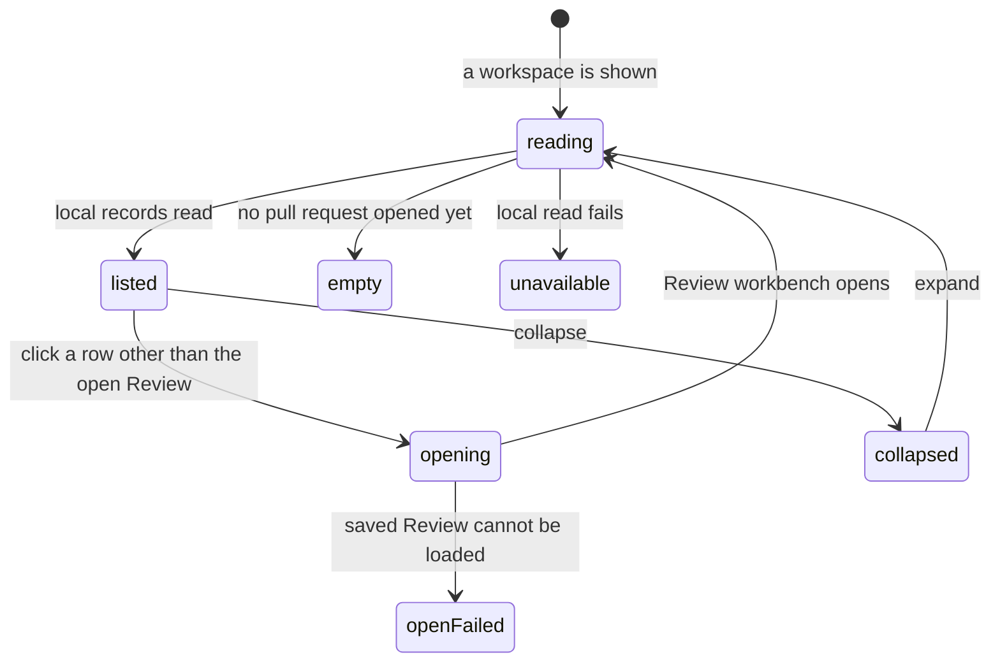

# Visited pull requests

## Summary

The Visited pull requests column lists the pull requests the maintainer has opened in the active workspace, most recently opened first, up to 20 rows. It sits left of the main content on the Pull requests screen, on every Review workbench, and beside workspace setup, and it stays in place while the destination changes. It reads only Patchdesk's local Review records, so it makes no GitHub request and works offline. One click on a row opens that pull request's Review workbench. A toggle at the left of the titlebar collapses and expands the column, and that choice is kept on this machine.

## The simple case

The maintainer opens a pull request from the Pull requests screen. When its Review workbench appears, the pull request is at the top of the column under `Today`, with its title and, beneath it, its number and how long ago it was opened, such as `#119 · now`.

Later, from any screen, the maintainer clicks a row and lands in that Review workbench. There is no select step: the first click opens. The row of the Review already on screen is highlighted and does nothing when clicked. A pull request that has merged or closed carries a dated marker such as `merged, seen 3d`.

The column is where the maintainer resumes work. Finding work that is new to them stays the job of the [Pull requests screen](../pull-requests/repository-listing.md): a pull request appears in the column only after it has been opened once.

## The task, event by event

### Arrive

The column has a header strip and a scrolling list. The column sits directly on the window background, like the titlebar, with no border, so the main pane is the one raised surface. The row of the open Review has a solid grey fill, a bold title, and a bar at its left edge; a hovered row takes a lighter fill. The strip shows the active workspace's label in capitals and the word `recent`. The list groups rows under `Today`, `Yesterday`, `This week`, and `Earlier`. The groups are local calendar days, not elapsed hours: a pull request opened this morning reads Today whatever the hour, Yesterday is the previous calendar day, This week covers two to six days back, and Earlier holds everything older. A heading appears only above the first row of its group, and a group with no row is not named.

Each row shows the pull request's title, cut off to fit, with the full title on hover. The line beneath it shows a reference and the age of the last open, labelled `opened`, such as `#119 · opened 5m`. The reference is `#119` when every listed row belongs to one repository, `patchdesk#119` when the rows span repositories under one owner, and `owner/patchdesk#119` when they span owners. The rule looks at the rows on screen, not the watchlist, so a repository the maintainer has stopped watching keeps its rows. The age is compact, such as `now`, `42s`, `5m`, `4h`, or `2d`, then weeks from 28 days; hovering it shows the exact time.

A merged pull request carries `merged, seen 3d` and a closed one carries `closed, seen 12d` at the right of that line, in the same muted grey as the rest of the line, each after a small dot: purple for merged, grey for closed. The two words keep the two ages apart: `opened` is the maintainer's last open, and `seen` is when Patchdesk last saw the state. An open pull request carries no marker. The marker comes from the stored Review, never from a live GitHub read, which is why it is dated.

A pull request the maintainer watches carries an eye mark on that same line, titled `Watched`, before any terminal marker. [Repository listing](../pull-requests/repository-listing.md) owns Watch and Unwatch; the column only reflects the choice.

> Technical note: the date on a marker is when Patchdesk first observed the terminal state. A merge reconciled by startup recovery is dated from GitHub's own merge time instead, so it can read older than Patchdesk's sighting. A terminal Review is never observed again, so the date never moves.

A Review stored before Patchdesk recorded opens has no title and no open time. Its row uses the reference as its label and shows no age, and it is ordered by the time its record was last updated until the next time it is opened.

The column has three settled states besides its rows. With no Review in the workspace it says `Opened pull requests appear here.` When the local read fails it says `Could not load recent pull requests.` and offers no Retry. Until the first read answers, the list is blank, with no loading indicator.

While a workspace switch is in flight, and on a fresh install before the first account save creates a workspace, the header strip has no label and the list is blank.

### Leave unchanged

Reading the column, scrolling it, and hovering a title or an age record nothing. Clicking the row of the Review already on screen, or pressing Enter or Space on it, does nothing: that row is where navigation would land. Opening Settings leaves the column as it was beneath the overlay.

### Begin an action

Clicking a row, or pressing Enter or Space on a focused row, asks for that Review's workbench as the destination. Arrow Down and Arrow Up move focus to the next or previous row without asking for anything; at the first and last row they do nothing. The request uses the same [navigation guard](navigation-and-overlays.md#begin-an-action) as Back and Navigate. When navigation is clear the destination changes at once. An unsaved Review draft or a pending GitHub write parks the request behind the leave dialog.

A row has no select step and no pending state of its own, unlike a [Pull requests row](../pull-requests/opening-a-review.md), which shows `Opening…` while it works.

The collapse toggle is the first control in the titlebar. Its label reads `Collapse the pull requests you have opened` or `Expand the pull requests you have opened`. Pressing it hides or shows the whole column at once, with no narrow rail left behind, and saves the choice immediately. Expanding reads the list again.

### While the action runs

Leaving one Review workbench for another drops the first Review's content straight away, so its diff never stays on screen under the second Review's name. Until the next Review loads, the main content shows the Pull requests screen or its loading skeleton, the titlebar names the Review workbench, and the titlebar busy bar is labeled `Loading review…`. The clicked row is already highlighted as the open Review.

The load uses the saved Review record, the same path a Pull requests row uses for a saved Review. Unlike that row, it has no fallback that reopens the pull request by its GitHub identity when the record is missing.

A second request for the same Review while it loads joins the load already running rather than sending another.

### Settle

A successful load shows the Review workbench and records the open. The column reads its list again, and the row moves to the top of `Today` with the age `now`. Every path that opens a Review has the same effect: a Pull requests row, a Navigate pull-request action, a Visited row, and the launch restore of a saved workbench destination.

> Technical note: only a real open stamps the time. The reloads after a publish, a merge, or a finished Insight run re-read the workbench already on screen and neither stamp an open nor re-read the column. The title and open time are written on a best-effort basis, so a failure to record them never fails the open.

A failed load shows the Pull requests screen's `Could not open review` notice with `Could not open the saved review.` and the reason. The destination stays on the requested Review: the titlebar still names the Review workbench and shows Back, and that Review's row stays highlighted and inert. The exception is the launch restore of a Review whose record no longer exists, which returns quietly to Pull requests; [Navigation and overlays](navigation-and-overlays.md#arrive) owns it.

A failed list read keeps its failure line until the column reads again: after a workspace switch, after any Review opens, or after the column is collapsed and expanded.

## Variants

| Variant                                                | Before the action runs                                                                                                                                                                         | While the action runs                                                                                                                                                             |
| ------------------------------------------------------ | ---------------------------------------------------------------------------------------------------------------------------------------------------------------------------------------------- | --------------------------------------------------------------------------------------------------------------------------------------------------------------------------------- |
| Workspace profile and GitHub account                   | The column lists only the active workspace's Reviews and names that workspace in its header. The collapse choice is shared by every workspace.                                               | A workspace switch blanks the header and list until the new workspace loads, then reads its list. An answer for the workspace being left is discarded.                           |
| Pull request and Review state                          | Open pull requests carry no marker; merged and closed ones carry a dated marker, and a watched one carries an eye mark. The row of the Review on screen is highlighted and inert.                                                   | Titles and markers are as stored when the column last read. A pull request renamed, merged, or closed since then reads as before until the column reads again.                  |
| GitHub permissions and merge readiness                 | Listing needs no GitHub permission. Rows show no checks, readiness, or permission state.                                                                                                     | Opening loads the local Review. Permission and readiness affect controls inside the workbench, not the column.                                                                   |
| Network, local tool, and Insight provider availability | The list needs no network, GitHub CLI, or Insight provider, and works offline.                                                                                                                | A local storage failure shows the failure line. One unreadable Review record is skipped and the rest are listed.                                                                  |
| Input path: mouse, keyboard, or desktop menu           | Rows open on click, Enter, or Space. The toggle works by mouse or keyboard. No desktop menu command or shortcut reaches the column. The column is one Tab stop after the titlebar controls, and Arrow Down and Arrow Up move between rows inside it. | Every input path reaches the same navigation guard. Skip to content moves focus past the column to the main content.                                                              |

## Cancel and interrupt

| Event                                                                                                 | Before the action runs                                                                                                                                  | While the action runs                                                                                                                                                               |
| ----------------------------------------------------------------------------------------------------- | ------------------------------------------------------------------------------------------------------------------------------------------------------- | ----------------------------------------------------------------------------------------------------------------------------------------------------------------------------------- |
| Cancel, Stop, or Escape                                                                               | There is nothing to cancel. Escape has no effect on the column.                                                                                          | A Review load has no Stop control. Cancelling the leave dialog keeps the current destination.                                                                                       |
| Navigate to another Patchdesk screen, Review, Settings section, or workspace profile                  | Back, Navigate, and Pull requests leave the column in place; the highlight follows the destination. A workspace switch reads the new workspace's list. | A newer destination, such as another row or Back, takes over, and the earlier load's answer is not shown. A workspace switch discards the load.                                     |
| Start another action or request a refresh                                                             | Refresh on the Pull requests screen does not re-read the column.                                                                                        | A second request for the same Review joins the running load. Another row starts its own destination change.                                                                         |
| GitHub, the network, a local tool, or an Insight provider fails or times out                          | Listing does not use them.                                                                                                                              | A load failure shows `Could not open review` and leaves the destination on the requested Review.                                                                                   |
| Close Settings, reload the renderer, close the window, or quit Patchdesk                              | The collapse choice survives reload and relaunch. The list is read again on the next load.                                                              | A reload during a load restores the stored destination, which already names the requested Review, and loads it again as a launch restore.                                          |
| The pull request, represented revision, pending review, permission, or other target changes elsewhere | GitHub changes reach a row only after Patchdesk observes them and the column reads again. The retention sweep removes a terminal Review's record 14 days later. | A record removed while its load runs makes the load fail with the notice above.                                                                                                     |
| macOS focus, a file or folder picker, or another input path takes control                             | Focus loss has no effect on the column.                                                                                                                 | Focus loss does not cancel a load.                                                                                                                                                 |

After an interrupt the column keeps the list it last read. Nothing in it is a draft, so nothing can be lost.

## Interactions with other systems

**Workspace profile and identity.** The column is scoped to the active [workspace profile](workspace-profile-and-identity.md). It never lists another workspace's Reviews and cannot open a Review outside the active workspace.

**Review revision and freshness.** Rows carry no freshness. A row opens the Review, and the workbench then owns [freshness and the represented revision](review-session-and-revision.md). A merged or closed marker is a stored observation, not proof of current state.

**Local persistence and recovery.** The list is read from durable Review records, which now also hold the pull request's title and the time it was last opened. The collapse choice is stored in the window's local storage. [Persistence and recovery](persistence-and-recovery.md) owns the retention sweep and the skipping of unreadable records.

**GitHub permissions and write authority.** The column performs no GitHub read or write. A pending GitHub write blocks a row click the same way it blocks any navigation.

**Network, local tools, and Insight providers.** None are used to list rows. Opening a Review can still surface failures the load itself reports.

**Concurrent operations and locking.** A newer list read supersedes an earlier one, whose answer is discarded. Loads of one Review share one operation.

**Feedback, errors, and diagnostics.** The column shows an empty line or a failure line, and a failed open appears on the Pull requests screen. Unreadable records are counted in a redacted Diagnostic and never named in the column.

**Preferences, keyboard commands, and desktop integration.** The collapse choice is a per-machine view preference. The column has no shortcut and no menu entry.

**Supported input and accessibility limits.** Rows and the toggle are keyboard operable. The column carries one Tab stop, which lands on the row of the Review on screen where there is one and on the first row otherwise; Arrow Down and Arrow Up move between rows. The row of the Review on screen is announced as the current page and stays focusable. Patchdesk does not claim screen-reader, touch, or pen support.

> Technical note: the column reads `GET /v1/sidebar/reviews` for the active profile. The route lists every Review record under the profile, orders them by last open (falling back to last update for older records), and returns the first 20. It is not polled; it re-reads on a workspace switch, on every Review open, and when the column mounts.

## Edge cases

- A pull request never opened in Patchdesk does not appear, however recently it changed on GitHub.
- The column holds 20 rows. There is no page past them; the oldest visit drops off when a new one arrives.
- Opening a pull request always moves it to the top, so it is never the row pushed out.
- The age is computed when the column draws and no timer advances it; it catches up whenever the column draws again.
- A row whose Review has no stored title uses its reference as its label, and a row with no recorded open shows no age.
- A stored empty title counts as no title rather than failing the whole list.
- A repository removed from the watchlist keeps its rows until retention removes their records.
- The eye mark reads the workspace's watched list, not the row's stored Review, so watching a pull request from anywhere marks its row without the column reading again.
- The toggle hides the column completely; collapsing and expanding reads the list again.
- On a fresh install the column draws its frame with no label and no empty line until the first account save creates the workspace.
- The column is present beside workspace setup and beside a Pull requests load failure.

## Open questions and verification

- A read-only live pass on 2026-09-14 confirmed: the column on the Pull requests screen and on five Review workbenches; `Today`, `This week`, and `Earlier` headings; a just-opened pull request moving to the top of Today; single-click and Enter opening a row with no select step and no per-row pending state; the open Review's row ignoring Enter; the toggle's alternating label; and the collapse choice surviving a renderer reload.
- Not observed live: the empty line, the failure line, the blank state before the first read, cross-repository references, whether the collapse choice holds across a workspace switch, a double click on a row, a Navigate pull-request action adding its row, and the watched eye mark.
- Suspected defect: after a failed load from the column, the destination stays on the missing Review. The titlebar names the Review workbench over the Pull requests screen, the stored destination still names that Review, and its row is inert, so the maintainer cannot retry from the column. See [B-15](../bug-triage.md#b-15-a-failed-load-from-a-visited-row-leaves-the-destination-on-the-missing-review).
- Suspected defect: Clear local review data and the retention sweep remove Review records without the column reading again. Removed rows stay listed until the next open or workspace switch, and clicking one leads to the failed-load state above. See [B-16](../bug-triage.md#b-16-the-visited-pull-requests-column-keeps-rows-for-removed-reviews).
- Confirm whether the blank column on a fresh install, with no label and no empty line, is intended.
- The workbench-to-workbench transition could not be slowed enough live to see the Pull requests screen or skeleton beneath the busy bar; every Review in the test workspace loaded at once.

Drafted from `dd613996` and verified against Patchdesk application source commit `737c515c`; live observations from the 2026-09-14 read-only pass.
