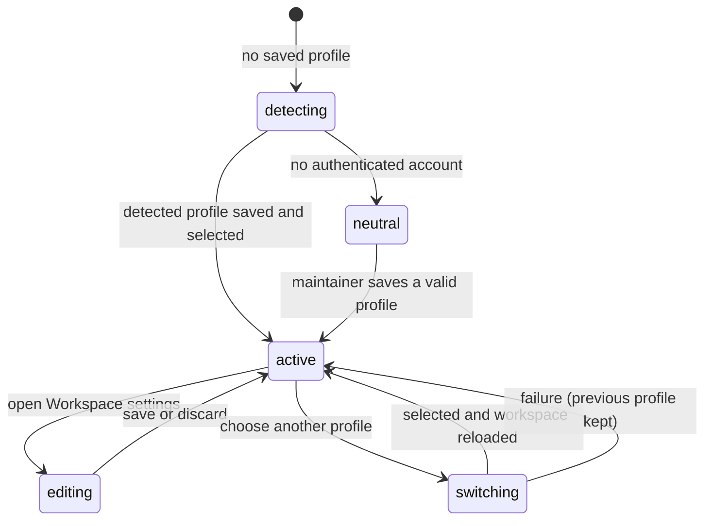

# Workspace profile and identity

## Summary

A workspace profile is Patchdesk's local boundary around one maintainer identity and one set of repositories. It names the GitHub host and account, local workspace roots, instruction-file paths, watched repositories, and the active-profile choice. A profile never stores a GitHub token or model credential.

## The simple case

On first run, Patchdesk tries to build a Default profile from the active GitHub CLI account and the maintainer's home directory. When it finds a real account, it saves and selects the profile. When it cannot find one, it shows an unsaved neutral profile so the setup checklist can ask the maintainer to authenticate.

The maintainer edits or creates profiles in Settings → Workspace. Saved workspace roots are scanned for repositories with GitHub remotes. The maintainer explicitly checks which discovered repositories to watch.

The active profile scopes the Pull requests screen, local Reviews, represented-review worktrees, diagnostics, GitHub identity, and per-profile Insight preferences.

## The task, event by event

### Arrive

Patchdesk lists saved profiles. If none exist, it probes `gh` for the current authenticated login with a five-second bound and derives the home directory as the initial workspace root when that path is valid.

The detected profile uses ID `default`, label Default, host `github.com`, no rule paths, no watched repositories, and the normal merge-warning acknowledgement policy. A failed account probe leaves the account empty and the profile unpersisted.

### Leave unchanged

Reading a profile, probing Reviewing as, or scanning saved roots does not add a repository or change the active profile. Discovery suggestions remain suggestions until the maintainer checks one.

Closing a clean profile editor, cancelling a folder picker, and choosing the already active profile record nothing.

### Begin an action

Saving validates the full profile at the main-process boundary. IDs, host, account, owners, roots, rule paths, repository identity, and optional local paths must satisfy their domain formats. The [workspace profile editor](../settings/workspace-profile-editor.md) owns form behavior and dirty-draft rules.

Checking an unwatched repository requests a watchlist add with host, owner, repository name, and optional local path. Unchecking a watched repository requests removal. Discovery itself never performs either action.

Choosing a different active profile saves only that profile ID to global config. The renderer marks the target and entry point as pending.

### While the action runs

Profile selection and global Settings writes serialize their config changes so one cannot silently erase the other. Renderer requests carry generation ownership: an older selection response cannot replace a newer target or newer error.

Duplicate selection requests for the same target share one request. The latest entry point owns settlement and visible error presentation.

Repository checklist rows show optimistic checked state per repository while their own request runs. A failed mutation returns that row to its confirmed state and presents an action-local error.

### Settle

A successful profile save writes normalized local data. Updating profile fields preserves existing watched repositories because the editor request does not own that list.

A successful profile switch clears the loaded Review workbench, resets the Pull requests request to its initial open-state filter, applies the chosen profile, and reloads workspace data. A failed switch keeps the prior active profile and preserves the Settings draft.

A successful watchlist change reloads the workspace so the saved profile, root grouping, and Pull requests repository choices agree.

## Variants

| Variant | Before the action runs | While the action runs |
| --- | --- | --- |
| Workspace profile and GitHub account | The profile selects the host, expected login, roots, owners, rules, and watchlist. | The requested profile does not become active until selection and reload succeed. |
| Pull request and Review state | Profiles scope Reviews and sessions. A workbench from one profile is not reused under another. | Applying a profile switch clears the loaded workbench and returns to Pull requests. |
| GitHub permissions and merge readiness | Profile creation needs a valid login format, not current repository permission. Discovery reads local remotes. | Later GitHub reads expose authentication or permission failures under the selected profile. |
| Network, local tool, and Insight provider availability | First-run and Reviewing as use `gh`; root discovery uses local `git` metadata. Insight providers are unrelated. | Tool or storage failure keeps the previous confirmed profile or watchlist state and shows a retryable error. |
| Input path: mouse, keyboard, or desktop menu | The titlebar and Settings selectors share the same profile-switch owner. | The latest entry point owns pending and failure feedback; input path does not change the selected target. |

Profile identity is stable local configuration, not a credential snapshot. Patchdesk resolves the token from `gh` when a GitHub operation needs it and checks that the resolved account matches the profile.

## Cancel and interrupt

| Event | Before the action runs | While the action runs |
| --- | --- | --- |
| Cancel, Stop, or Escape | Cancelling profile editing follows the dirty-draft rules. Discovery has no side effect to cancel. | Profile and watchlist requests have no Stop control. A failure preserves prior confirmed state. |
| Navigate to another Patchdesk screen, Review, Settings section, or workspace profile | Clean navigation proceeds. A dirty profile draft guards profile switching and Settings close. | A second profile target can supersede an earlier response. Applying the winner returns to Pull requests. |
| Start another action or request a refresh | Discovery, account re-check, and listing refresh are independent reads. | Config mutations serialize. Per-repository watchlist state prevents one row's result from settling another row. |
| GitHub, the network, a local tool, or an Insight provider fails or times out | Missing or unauthenticated `gh` leaves first-run identity neutral and gives corrective copy. | Selection and save storage failures keep the previous active state. Discovery failure shows a scan error without changing the watchlist. |
| Close Settings, reload the renderer, close the window, or quit Patchdesk | A clean profile state closes normally; a dirty draft requires a decision. | Saved profile and active selection survive restart. Unsaved form text does not have documented restart persistence. |
| The pull request, represented revision, pending review, permission, or other target changes elsewhere | Review changes do not alter profile configuration. Another app instance is normally prevented. | Watchlist or profile storage changed outside Patchdesk is not merged with the in-memory draft. The next reload becomes authoritative. |
| macOS focus, a file or folder picker, or another input path takes control | The folder picker returns one path or no change. | Focus loss does not cancel save, selection, discovery, or watchlist mutation. |

After a switch failure, the prior profile remains active. After an editor discard, the draft returns to its last saved baseline. After a watchlist failure, the affected repository remains in its confirmed watched or unwatched state.

## Interactions with other systems

**Workspace profile and identity.** This foundation owns the profile boundary. Reviewing as compares configured identity with currently authenticated `gh` accounts but does not itself authorize a GitHub write.

**Review revision and freshness.** Reviews, sessions, caches, and worktrees are profile-scoped. Profile switching changes the namespace, not a Review's represented revision.

**Local persistence and recovery.** Profiles and last selected profile live in local config. Concurrent config writes serialize. Missing first-run config is an empty state, not corruption.

**GitHub permissions and write authority.** A profile supplies expected identity. Every later GitHub operation still resolves credentials and checks its own permission and freshness.

**Network, local tools, and Insight providers.** `gh` supplies account evidence, local Git metadata supplies discovery, and macOS supplies folder selection. Provider configuration is stored separately.

**Concurrent operations and locking.** Latest-request ownership protects profile switching. Config mutation serialization prevents selection and preference updates from overwriting each other.

**Feedback, errors, and diagnostics.** Reviewing as distinguishes checking, missing CLI, unauthenticated, multiple accounts, and configured-account mismatch. Failed profile selection records a retryable recovery diagnostic.

**Preferences, keyboard commands, and desktop integration.** The active profile selector appears in the titlebar and Workspace settings. A successful switch restores the Pull requests destination with that profile's view preference baseline.

**Supported input and accessibility limits.** Profile and repository controls support keyboard and mouse. Native folder selection is a macOS interaction.

## Edge cases

- No authenticated account means the detected Default profile remains ephemeral and is not auto-selected on disk.
- First-run detection is memoized for the process, but the explicit Re-check action forces a new account probe.
- An empty watchlist produces a successful empty Pull requests state and makes no repository GitHub call.
- A watched repository can have no local path or can sit outside all saved workspace roots.
- Discovery can find repositories without watching them; no suggestion enters the watchlist automatically.
- Duplicate repository identity is rejected even if local paths differ.
- Updating a watched repository's local path does not change its GitHub identity.
- Profile field updates preserve the watchlist; watchlist updates preserve other profile fields.

## Open questions and verification

- Live desktop verification is pending because this task did not run with the required herdr dev and log panes.
- Confirm the exact first-run transition when `gh auth login` completes while Patchdesk remains open and the maintainer presses Re-check.
- Confirm profile-switch focus and titlebar feedback from both the header selector and Settings selector.
- Confirm root grouping and watched-outside-roots presentation against real repositories, including a repository with no saved local path.
- Cross-process edits to profile files are not described as a supported workflow. Confirm whether the next reload should warn or silently adopt them.

Verified against Patchdesk application source commit `3100615`.
