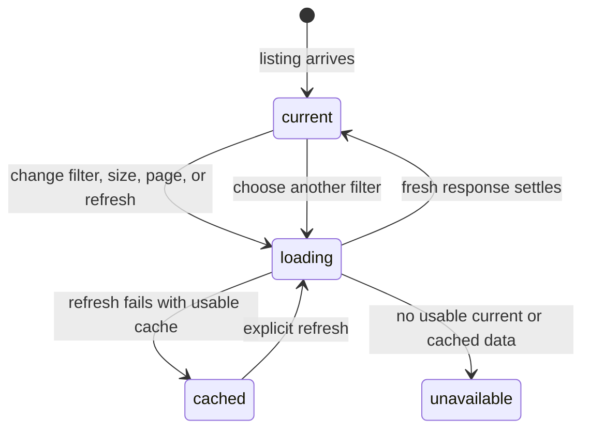

# Pull request filters, pagination, and refresh

## Summary

The Pull requests filter bar controls which GitHub pull requests the Selected repository returns and how many appear on each page. It offers Open or Merged state, repository labels, the Awaiting review from you preset, rows per page, Previous and Next, and an explicit GitHub refresh. Filters are sent to GitHub; Patchdesk does not filter or sort only the loaded page.

## The simple case

The Pull requests screen opens with the active profile's saved state and page-size preferences, defaulting to Open and 25 rows. The maintainer chooses a label or turns on Awaiting review from you. Patchdesk asks GitHub for the new query, clears the old page cursor, and holds the old rows behind a loading state until the answer arrives.

The maintainer moves through pages with Previous and Next. The opaque page token is kept by Patchdesk and is never interpreted in the renderer. Pressing the GitHub freshness badge or the screen's refresh command asks for the same current query again. A successful read is Current; a failed read can leave cached rows with a visible degraded status.

## The task, event by event

### Arrive

The filter bar shows the saved state (`Open` or `Merged`), the Awaiting review from you toggle, and a lazy label-filter button once a Selected repository is known. Rows per page offers 10, 25, and 50, with 25 as the default. The count is GitHub's repository-wide match count when a fresh search provides it; otherwise it honestly says how many rows are on this page.

The freshness badge says GitHub: Current, Aged, Partial, Cached after refresh failure, Stale, or Unavailable. It is also the explicit refresh control. The badge never refreshes itself.

### Leave unchanged

Opening the label menu reads the Selected repository's labels but does not change the listing until a checkbox is selected. Closing it without a selection has no effect. Clicking a disabled Previous or Next control does nothing. Reading the count or freshness badge without activating it does not issue a request.

### Begin an action

Changing state, page size, labels, or Awaiting review from you updates the requested filter, persists the profile-scoped presentation choice, clears the page cursor, and starts a new read. Labels are repeated as bounded label values; the preset is sent as `user-review-requested:@me`.

Next stores the current opaque token in a bounded Previous stack and requests the returned next token. Previous pops that stack and requests the earlier token. Refresh repeats the current repository, filter, size, and page request without changing those choices.

### While the action runs

The filter control reflects the requested state immediately. The row list, row count, and review details show loading placeholders instead of old rows under the new filter. Previous and Next are disabled during refresh. A lazy label read shows Loading labels…, then labels, an empty-label message, or a repository-specific failure.

The main process validates state, page size, repository, labels, preset, and opaque token. A page token is valid only for the same repository, state, page size, sorted labels, and Awaiting review from you value. Any mismatch is an invalid page request rather than a silent reuse of a cursor from another search.

Only an unfiltered, open, complete first-page fresh read is saved as the reusable inbox cache. Filtered or merged results are not written into that cache because a later offline read could mistake them for the whole open listing.

### Settle

A fresh response replaces the rows, match count, repository outcome, and freshness snapshot. A partial response remains readable but names its incomplete state. The page controls reflect whether a valid next token exists and whether a previous token is available.

When GitHub authentication fails, Patchdesk can serve the unfiltered open cache. A cache under four hours is marked Cached after refresh failure; an older cache is Stale; no cache or an unavailable merged read is Unavailable. The maintainer can ask for a new read, but Patchdesk does not retry automatically.

## Variants

| Variant | Before the action runs | While the action runs |
| --- | --- | --- |
| Workspace profile and GitHub account | Filter and page-size preferences are stored per active profile and apply to its Selected repository. | A profile switch resolves the new profile's saved filters and reloads under its Selected repository. |
| Pull request and Review state | Open and Merged are separate GitHub searches. Labels and Awaiting review from you further constrain the search. | Existing Review indicators are not merged into a new filter response until that response settles. |
| GitHub permissions and merge readiness | Filters do not grant write or merge authority. | Authentication, forbidden, rate-limit, and read failures affect freshness and available rows, not the filter definition. |
| Network, local tool, and Insight provider availability | Filter controls and saved preferences are local; GitHub is needed for results. | A failed read can use only an eligible cache. Insight providers are never needed for listing. |
| Input path: mouse, keyboard, or desktop menu | Filter controls and refresh are available through the screen; desktop Refresh reaches the same owner. | The request and cursor-reset rules are identical for every input path. |

Changing a repository clears labels but not the Awaiting review from you preset. Changing any search-defining filter or size invalidates the current page cursor.

## Cancel and interrupt

| Event | Before the action runs | While the action runs |
| --- | --- | --- |
| Cancel, Stop, or Escape | Closing the label menu or leaving a select without a choice has no effect. | There is no Stop button for a listing request; the old rows are held until the request settles or is superseded. |
| Navigate to another Patchdesk screen, Review, Settings section, or workspace profile | Clean navigation leaves filter state in local preferences. | Navigation does not authorize or cancel a GitHub read; a profile switch invalidates the old request generation. |
| Start another action or request a refresh | A new filter choice starts its own query and clears the cursor. | A newer request owns the visible result. Matching concurrent reads can share one in-flight operation; different filters and pages cannot. |
| GitHub, the network, a local tool, or an Insight provider fails or times out | A filter can be selected without network access. | The response becomes a confirmed read failure, eligible cached result, or Unavailable state according to the cache and outcome. |
| Close Settings, reload the renderer, close the window, or quit Patchdesk | Saved filter and page-size preferences can be restored after reload. | In-flight listing state is discarded; the next load starts from saved preferences and a valid current repository. |
| The pull request, represented revision, pending review, permission, or other target changes elsewhere | A filter describes a future GitHub search, not a pinned revision. | The new response recomputes row indicators and freshness; no old page token is reused after a search change. |
| macOS focus, a file or folder picker, or another input path takes control | Focus loss while a menu is closed changes nothing. | Focus loss does not cancel the query or change persisted filter state. |

After a failed refresh, cached rows remain inspectable but carry a non-current freshness state. An invalid token or changed query resets the task to a fresh first-page request rather than guessing at a cursor.

## Interactions with other systems

**Workspace profile and identity.** Every query is scoped to the active profile and its Selected repository.

**Review revision and freshness.** Listing freshness describes the GitHub snapshot for rows; opening a Review performs its own represented-revision preparation and checks.

**Local persistence and recovery.** Filter, size, Selected repository, selected identity, and inspector choices are local preferences. The reusable inbox cache is separate and only covers an unfiltered open first page.

**GitHub permissions and write authority.** Listing is read-only. A Current or cached result does not authorize a Review write or merge.

**Network, local tools, and Insight providers.** GitHub provides rows and labels. Local `git` and Insight providers do not participate in listing.

**Concurrent operations and locking.** Equivalent reads coalesce by profile, repository, filter, size, and page token. Generation checks keep late results from older requests off screen.

**Feedback, errors, and diagnostics.** The screen distinguishes loading, Current, Aged, Partial, cached-after-failure, Stale, Unavailable, and repository-specific errors. It does not show raw page tokens.

**Preferences, keyboard commands, and desktop integration.** State, size, labels, Awaiting review from you, and repository choices restore per profile. Refresh can be invoked from the freshness badge or desktop command.

**Supported input and accessibility limits.** Mouse and keyboard filter, paging, and refresh are supported. Touch, pen, and screen-reader behavior are outside the product claim.

## Edge cases

- State is only Open or Merged; page size is only 10, 25, or 50.
- Labels are fetched lazily from the whole repository, not inferred from the loaded page.
- Up to five labels are accepted, each no longer than 50 characters; labels containing quotes or control characters are rejected.
- Awaiting review from you composes with state and labels and carries across repository changes.
- Changing state, size, repository, labels, or the preset clears the current page cursor.
- A page token longer than 16,384 characters or a repository cursor longer than 4,096 characters is invalid.
- Previous history is bounded to the most recent 20 page tokens.
- A successful empty filtered result can mean no matching labels, while a no-open-pull-requests outcome means the repository itself has none for that state.
- A cache never stands in for a merged listing; without a current read, merged is Unavailable.
- GitHub's match count is not the loaded page row count. Cached and failed results may omit the count.

## Open questions and verification

- Live desktop verification is pending; no CDP pass was run for this document.
- Confirm the visual difference between Current, Aged, Partial, Cached after refresh failure, Stale, and Unavailable in the running app.
- Confirm keyboard focus after label selection, page changes, and freshness-badge refresh.
- Confirm whether a stale cache should remain actionable for opening Reviews while merge-oriented actions are disabled.
- Confirm the behavior when a page token expires remotely even though its local shape still validates.

Verified against Patchdesk application source commit `3100615`.
