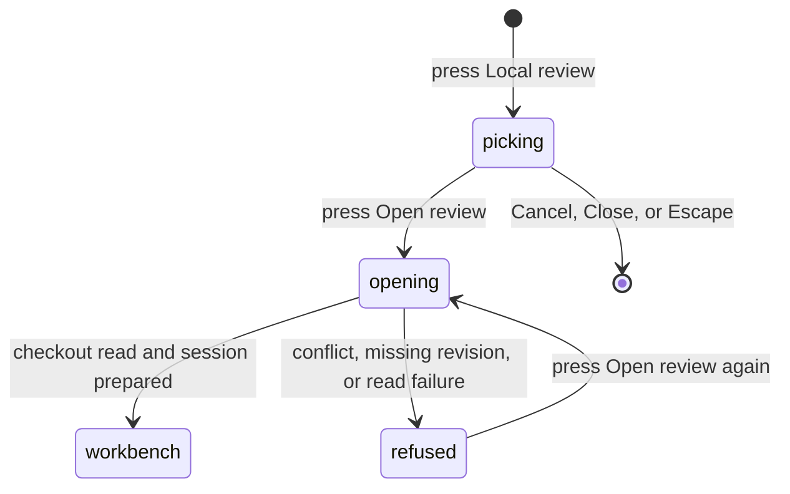

# Opening a local Review

## Summary

Opening a local Review turns a change that has no pull request yet into a readable Review workbench. The maintainer reaches it from the Local review button on the Pull requests screen, beside the Repository picker, and it appears only when the Selected repository has a local checkout in the active workspace profile. The maintainer picks a _Review source_: the working tree against `HEAD`, a local branch against a base branch, or one commit. Patchdesk reads the checkout, prepares a _Review session_ for that exact revision, and opens the workbench on the Diff tab. Opening changes nothing in the maintainer's checkout and performs no GitHub read or write.

## The simple case

The maintainer selects a repository that has a local checkout and presses Local review. The Open a local review dialog names the repository and offers three tabs: Working tree, Branch, and Commit. Working tree is selected, with the note `Staged, unstaged, and untracked changes against HEAD.` The maintainer presses Open review. The button reads Opening… and the shared busy indicator reads Opening Review… while Patchdesk records the working tree and prepares the session.

When preparation succeeds, the dialog closes and the Review workbench opens on the Diff tab. The heading names the source, for example `Working tree on feat/449-local-review-source`. Every staged, unstaged, and untracked file that `.gitignore` does not exclude appears in the file tree and the diff, each untracked file marked NEW.

## The task, event by event

### Arrive

The Local review button sits in the Pull requests header between the Repository picker and the freshness badge. It appears only when the workspace profile lists the Selected repository with a local checkout path; a repository without one shows no button. Pressing it opens the dialog with the Working tree tab selected and the Branch fields set to an empty Branch and a Base branch of `main`.

### Leave unchanged

Switching tabs, typing in the fields, pressing Cancel, pressing Close, or pressing Escape reads nothing and writes nothing. The dialog is created fresh each time it opens, so a cancelled draft does not return.

Open review stays disabled until the chosen tab is complete: Branch needs both a branch and a base branch, and Commit needs a SHA of 4 to 64 hexadecimal characters, full or abbreviated, in either case. Spaces around a value are ignored.

### Begin an action

Pressing Open review sends the source to the main process. Patchdesk checks that the repository is in the active profile with a local checkout, then reads the source from that checkout:

- **Working tree.** Patchdesk records the checkout as a _Local snapshot_, a commit object built from every staged, unstaged, and untracked file against `HEAD`. The branch `HEAD` names, or `detached HEAD`, identifies the Review, so switching branches opens a different Review.
- **Branch.** The branch tip is compared with its merge base with the base branch. Commits made on the base branch after the branch point do not appear.
- **Commit.** The commit is compared with its first parent. A root commit is compared with an empty tree, so every file it adds appears as new.

> Technical note: the Local snapshot is built in a temporary copy of the checkout's index and committed with a fixed author, committer, date, and message, so the same content on the same `HEAD` always has the same SHA. The maintainer's index, branches, and working files are never written. The snapshot's objects go into the repository's object store and are reachable only from a ref under `refs/patchdesk/local/` (ADR 0050).

### While the action runs

The dialog stays open. Open review reads Opening…, Cancel is disabled, the Close button is hidden, and Escape and clicks outside the dialog are ignored until the attempt settles. The shared busy indicator reads Opening Review….

Patchdesk prepares the session for the resolved head and base: it pins the head under a managed ref, checks it out as a separate represented-review worktree under the app cache, and writes the patch. The same profile lock and Review lock that serialize pull-request opening serialize this work.

> Technical note: the patch is `git diff --binary` between the base and head, written with `a/` and `b/` paths and no colour whatever the checkout's diff configuration says, and hashed as written. That hash is the session's patch identity.

### Settle

On success the dialog closes and the Review workbench replaces the Pull requests screen, on the Diff tab. The workbench differs from a pull-request Review:

- The heading names the source: `Working tree on <branch>`, `Working tree on detached HEAD`, `Branch <branch> against <base>`, or `Commit <first eight characters>`.
- The tab strip shows Diff and Insights; there is no Conversation tab.
- The header shows the Scope gauge and a line with the repository, the first eight characters of the head, the freshness label, and when it was checked. There are no Checks or Merge chips, no Open on GitHub or Watch button, no Start a review or Finish review button, and no Refresh button.
- The Diff tab behaves as described in [Files, diff, and navigation](../review-workbench/files-diff-and-navigation.md), including expanding unchanged context around a hunk. Its Commits section lists no commits and its Threads section lists no threads.

Opening the same source again with unchanged content lands on the same Review session. An edit to any file, or a new `HEAD`, prepares a new session, and the same Review moves to it.

On failure the dialog stays open with a `Review not opened` alert that gives the reason in one sentence:

| Cause                                                                                  | Sentence                                                    |
| -------------------------------------------------------------------------------------- | ----------------------------------------------------------- |
| The working tree's index holds an unresolved merge conflict                            | `The working tree has unresolved merge conflicts.`          |
| The branch, base branch, merge base, or commit does not exist, or `HEAD` has no commit | `This checkout has no such branch, base branch, or commit.` |
| The repository is no longer in the profile with a local checkout                       | `This repository has no local checkout in the workspace.`   |
| Any other read, storage, or worktree failure                                           | `Patchdesk could not read the local checkout.`              |

The fields keep their values, and pressing Open review again retries.

## Variants

| Variant                                                | Before the action runs                                                                                                                                    | While the action runs                                                                                                         |
| ------------------------------------------------------ | --------------------------------------------------------------------------------------------------------------------------------------------------------- | ----------------------------------------------------------------------------------------------------------------------------- |
| Workspace profile and GitHub account                   | The button appears only for a Selected repository the active profile lists with a local checkout. The GitHub account is not used.                         | The attempt belongs to the profile that was active when it started; the workbench opens only if that profile is still active. |
| Pull request and Review state                          | No pull request is needed. A source opened before resumes its Review; a new source creates one.                                                           | The resolved head and base fix the session. A different source spec is a different Review.                                    |
| GitHub permissions and merge readiness                 | No effect. A local Review has no GitHub permission or merge readiness.                                                                                    | No effect. Nothing is read from or written to GitHub.                                                                         |
| Network, local tool, and Insight provider availability | `git` must be available. The network and Insight providers are not needed.                                                                                | A failing `git` command or unwritable app storage settles as `Patchdesk could not read the local checkout.`                   |
| Input path: mouse, keyboard, or desktop menu           | The button and dialog take mouse and keyboard input; the tabs move with the arrow keys and select with Enter or Space. There is no menu or palette entry. | Enter in a field submits the form once. Input to the dialog is ignored until the attempt settles.                             |

## Cancel and interrupt

| Event                                                                                                 | Before the action runs                                            | While the action runs                                                                                                                                   |
| ----------------------------------------------------------------------------------------------------- | ----------------------------------------------------------------- | ------------------------------------------------------------------------------------------------------------------------------------------------------- |
| Cancel, Stop, or Escape                                                                               | Cancel, Close, and Escape close the dialog with no effect.        | Cancel is disabled and Escape is ignored. The attempt runs to completion or failure.                                                                    |
| Navigate to another Patchdesk screen, Review, Settings section, or workspace profile                  | Closing the dialog and navigating have no effect on the checkout. | A profile switch leaves the prepared session on disk but does not open its workbench.                                                                   |
| Start another action or request a refresh                                                             | Refreshing the Repository listing does not affect the dialog.     | Openings of the same Review wait for each other; each resolves the checkout as it was when it started.                                                  |
| GitHub, the network, a local tool, or an Insight provider fails or times out                          | No effect.                                                        | A `git` failure or timeout settles with a refusal in the dialog; nothing partial is adopted.                                                            |
| Close Settings, reload the renderer, close the window, or quit Patchdesk                              | No effect.                                                        | The preparation journal removes a partly prepared session at the next start. A snapshot commit already written stays in the object store, unreferenced. |
| The pull request, represented revision, pending review, permission, or other target changes elsewhere | No effect until Open review is pressed.                           | An edit after Patchdesk has read the working tree is not in this session; opening again records it as a new session.                                    |
| macOS focus, a file or folder picker, or another input path takes control                             | No effect.                                                        | No effect on the attempt.                                                                                                                               |

## Interactions with other systems

**Workspace profile and identity.** A local Review is keyed by the profile, the repository, and the source spec. The repository must be in the profile with a local checkout path at the time of opening.

**Review revision and freshness.** The session pins a head and base as [Review session and revision](../foundations/review-session-and-revision.md) describes for pull requests. For a working tree the head is the Local snapshot and the base is `HEAD`; for a branch, the tip and the merge base; for a commit, the commit and its first parent. Opening recomputes the source, so a just-opened local Review is Fresh.

**Local persistence and recovery.** The Review, its session, the patch, and the worktree are stored with the pull-request Reviews and recovered by the same journal. A saved destination naming a local Review reopens the stored session at launch without reading the checkout again. A local Review does not appear in the Visited pull requests column or in the Repository listing.

**GitHub permissions and write authority.** No GitHub read or write happens. The checkout is read; the only writes to the repository are the snapshot objects, the managed ref, and the worktree registration.

**Network, local tools, and Insight providers.** Only local `git` is needed.

**Concurrent operations and locking.** The Review lock and the profile lock serialize openings of the same Review and preparations in the same profile.

**Feedback, errors, and diagnostics.** Progress shows in the dialog and the shared busy indicator. Failures stay in the dialog; a failed preparation is recorded in the Review diagnostics.

**Preferences, keyboard commands, and desktop integration.** A successful open becomes the saved destination, as for a pull-request Review. The Diff tab's view preferences apply unchanged.

**Supported input and accessibility limits.** Mouse and keyboard only. Touch, pen, and screen-reader behavior are outside the product claim.

## Edge cases

- A detached `HEAD` opens a Review named `Working tree on detached HEAD`, distinct from every branch's working-tree Review.
- A working tree with no changes opens a session whose patch is empty.
- A root commit opens with every file as NEW.
- Two branches whose names differ only in characters that cannot appear in a folder name still open two different Reviews.
- A branch whose history shares nothing with the base branch is refused with the missing-revision sentence.
- Files that `.gitignore` excludes never appear, even when they are open in an editor.
- A patch larger than Patchdesk's 2 MiB command output limit is refused with `Patchdesk could not read the local checkout.`

## Open questions and verification

- Live pass on 2026-09-25 over CDP 9233: a working-tree Review on the Patchdesk checkout showed an untracked probe file as NEW on the Diff tab; `shasum` of the checkout's index and `git status --short` were identical before and after; opening again with unchanged content left one session.
- The header's freshness label reads `Up to date with GitHub` on a local Review, which is wrong for a source GitHub never saw. Wording and freshness for local Reviews belong to #450.
- The Insights tab is shown, but an Insight run on a local Review is refused until #450; what the tab shows on that refusal was not checked.
- Refresh of a local Review, and Apply, Commit, Push, and Open PR, are not built (#451, #452).
- The empty-patch workbench, the conflict refusal, the branch and commit sources, and the failure sentences were checked in service and component tests, not live.
- Managed refs and worktrees of local sessions are not removed after a successful open; cleanup is not described here because it does not exist yet.

Drafted from Patchdesk application source commit `502acfd8`. The live pass ran on `88434b1b`, which lacks two later fixes: the patch command's config-proof flags (`eaa6f3e0`) and the index copy that keeps its mtime (`502acfd8`).
