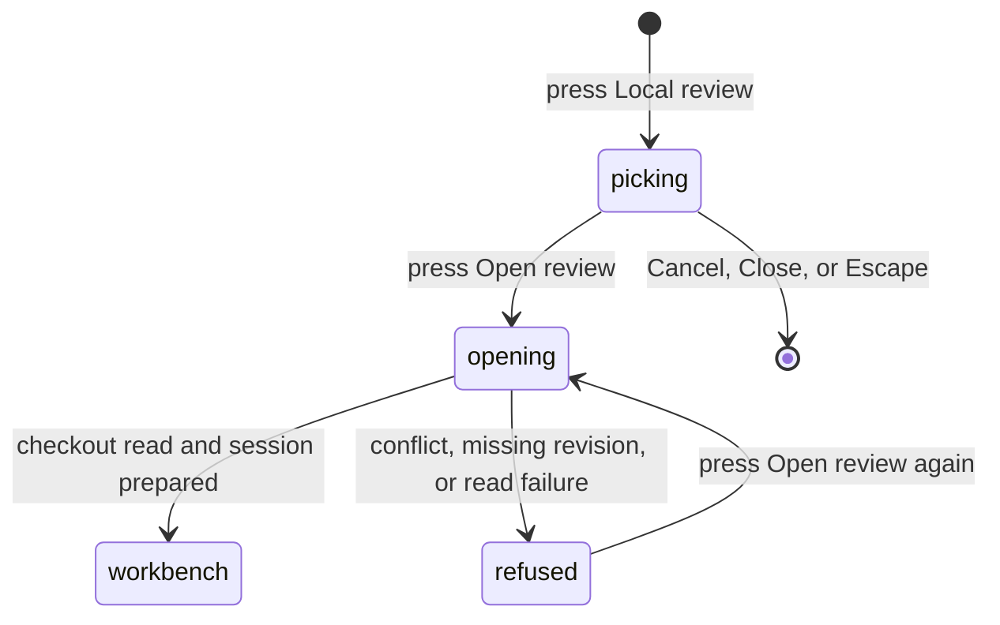

# Opening a local Review

## Summary

Opening a local Review turns a change that has no pull request yet into a readable Review workbench. The maintainer reaches it from the Local review button on the Pull requests screen, beside the Repository picker, and it appears only when the Selected repository has a local checkout in the active workspace profile. The maintainer picks a _Review source_: the working tree against `HEAD`, a local branch against a base branch, or one commit. Patchdesk reads the checkout, prepares a _Review session_ for that exact revision, and opens the workbench on the Diff tab. Opening changes no file, index, or branch in the maintainer's checkout and performs no GitHub read or write; Patchdesk keeps the snapshot as git objects, a `refs/patchdesk/local/` ref, and a worktree in its cache. A coding agent can open and refresh the same Review over MCP; see [A coding agent over MCP](coding-agent-over-mcp.md).

## The simple case

The maintainer selects a repository that has a local checkout and presses Local review. The Open a local review dialog names the repository and offers three tabs: Working tree, Branch, and Commit. Working tree is selected, with the note `Staged, unstaged, and untracked changes against HEAD.` The maintainer presses Open review. The button reads Opening… and the shared busy indicator reads Opening Review… while Patchdesk records the working tree and prepares the session.

When preparation succeeds, the dialog closes and the Review workbench opens on the Diff tab. The heading names the source, for example `Working tree on feat/449-local-review-source`. Every staged, unstaged, and untracked file that `.gitignore` does not exclude appears in the file tree and the diff, each untracked file marked NEW.

## The task, event by event

### Arrive

The Local review button sits in the Pull requests header between the Repository picker and the freshness badge. It appears only when the workspace profile lists the Selected repository with a local checkout path; a repository without one shows no button. Pressing it opens the dialog with the Working tree tab selected and the Branch fields set to an empty Branch and a Base branch of `main`.

When the repository has linked worktrees (`git worktree add`), the Working tree tab also shows a **Checkout** select listing the configured checkout and each live linked worktree, as `<folder> · <branch>` or `<folder> · detached HEAD`. It defaults to the configured checkout and is hidden when there is only one checkout. Patchdesk's own review worktrees are never listed. The Branch and Commit tabs always read the configured checkout.

### Leave unchanged

Switching tabs, typing in the fields, pressing Cancel, pressing Close, or pressing Escape reads nothing and writes nothing. The dialog is created fresh each time it opens, so a cancelled draft does not return.

Open review stays disabled until the chosen tab is complete: Branch needs both a branch and a base branch, and Commit needs a SHA of 4 to 64 hexadecimal characters, full or abbreviated, in either case. Spaces around a value are ignored.

### Begin an action

Pressing Open review sends the source to the main process. Patchdesk checks that the repository is in the active profile with a local checkout, then reads the source from that checkout:

- **Working tree.** Patchdesk records the chosen checkout as a _Local snapshot_, a commit object built from every staged, unstaged, and untracked file against `HEAD`. The branch `HEAD` names, or `detached HEAD`, identifies the Review, so switching branches opens a different Review. A linked worktree is a different Review from the configured checkout on the same branch, with its own sessions and drafts, and its heading ends with `in <folder>`.
- **Branch.** The branch tip is compared with its merge base with the base branch. Commits made on the base branch after the branch point do not appear.
- **Commit.** The commit is compared with its first parent. A root commit is compared with an empty tree, so every file it adds appears as new.

> Technical note: the Local snapshot is built in a temporary copy of the checkout's index and committed with a fixed author, committer, date, and message, so the same content on the same `HEAD` always has the same SHA. The maintainer's index, branches, and working files are never written. The snapshot's objects go into the repository's object store and are reachable only from a ref under `refs/patchdesk/local/` (ADR 0050).

### While the action runs

The dialog stays open. Open review reads Opening…, Cancel is disabled, the Close button is hidden, and Escape and clicks outside the dialog are ignored until the attempt settles. The shared busy indicator reads Opening Review….

Patchdesk prepares the session for the resolved head and base: it pins the head under a managed ref, checks it out as a separate represented-review worktree under the app cache, and writes the patch. The same profile lock and Review lock that serialize pull-request opening serialize this work.

> Technical note: the patch is `git diff --binary` between the base and head, written with `a/` and `b/` paths and no colour whatever the checkout's diff configuration says, and hashed as written. That hash is the session's patch identity.

### Settle

On success the dialog closes and the Review workbench replaces the Pull requests screen, on the Diff tab. The workbench differs from a pull-request Review:

- The heading names the source: `Working tree on <branch>`, `Working tree on detached HEAD`, `Branch <branch> against <base>`, or `Commit <first eight characters>`.
- The tab strip shows Diff and Insights; there is no Conversation tab.
- The header shows the Scope gauge and a line with the repository and the revision it represents: `Local snapshot <first eight characters> · read from the local checkout` for a working tree, `Branch tip <…>` for a branch, and `Commit <…>` for a commit. It makes no claim about GitHub: there is no freshness label or checked time, no Checks or Merge chips, no Open on GitHub or Watch button, and no Start a review or Finish review button. The line ends with a **Refresh** button that reads the checkout again; see [Refresh](#refresh).
- The Diff tab behaves as described in [Files, diff, and navigation](../review-workbench/files-diff-and-navigation.md), including expanding unchanged context around a hunk. Its Commits section lists no commits, its Threads section lists no threads, and selecting lines opens a note composer instead of an inline comment; see [Maintainer notes](#maintainer-notes).
- The Insights tab runs Brief, Walkthrough, and Analysis as described in [Insights on a local Review](#insights-on-a-local-review).

Opening the same source again with unchanged content lands on the same Review session. An edit to any file, or a new `HEAD`, prepares a new session, and the same Review moves to it.

On failure the dialog stays open with a `Review not opened` alert that gives the reason in one sentence:

| Cause                                                                                  | Sentence                                                    |
| -------------------------------------------------------------------------------------- | ----------------------------------------------------------- |
| The working tree's index holds an unresolved merge conflict                            | `The working tree has unresolved merge conflicts.`          |
| The branch, base branch, merge base, or commit does not exist, or `HEAD` has no commit | `This checkout has no such branch, base branch, or commit.` |
| The repository is no longer in the profile with a local checkout                       | `This repository has no local checkout in the workspace.`   |
| Any other read, storage, or worktree failure                                           | `Patchdesk could not read the local checkout.`              |

The fields keep their values, and pressing Open review again retries.

## Insights on a local Review

Brief, Walkthrough, and Analysis run on a local Review from the same run dialog, with the same provider, model, effort, and language choices, as on a pull request Review. Each run is bound to the local session's head, base, and patch hash, so a run on a working tree analyzes the Local snapshot, including untracked files. A result is retained and read back the same way; a later session makes it Outdated.

What differs is what a local Review has no source for:

- The model's context carries the repository's rule files and the changed-file list, but no pull request comments and no check results. Patchdesk makes no GitHub read to start the run.
- Analysis shows its Findings and their evidence hunks, with Dismiss and Copy as markdown prompt. There is no Add to review, no Add all, no Finish with the Analysis summary, and no CI badge, because a local Review has no pull request to write to or checks to report. A mapped Finding offers Add to draft instead; see [Local drafts](#local-drafts). On a working tree, a Finding that carries a suggestion also offers an Apply checkbox; see [Apply suggestions to the working tree](#apply-suggestions-to-the-working-tree). A Finding that is not mapped to the diff reads Unavailable.
- Walkthrough shows no discussion note, because a local Review has no Conversation.
- Brief draws Flow, Shape, Blast radius, and Start here. Blast radius counts names by text search at the session head, which for a working tree is the Local snapshot, so a name the uncommitted change adds is found. Brief has no Description vs diff block for any Review (ADR 0040), and no citation names a commit. A current Brief offers **Copy as PR description** in its Provenance card; see [Copy Brief as PR description](#copy-brief-as-pr-description).
- A settled run posts `<Insight> finished` or `<Insight> failed`, naming the source title and checkout folder, under the same silence rule as a pull request Review (#496); see [Notifications](coding-agent-over-mcp.md#notifications).

## Change intent

A local Review can hold a **Change intent**: what the change is meant to do, usually the task or spec the coding agent was given (#467, ADR 0051). Analysis reads it as the change's stated goal. A goal the intent names and the patch does not deliver is a P2 Finding, and so is a change the patch makes and the intent does not mention. With no intent, Analysis records an unresolved item instead. Brief and Walkthrough do not read it.

The header shows the intent on its own line under the revision line: the first line of the text, `Spec: <path>` for a spec file, or `No change intent`. Beside it, **Change intent** opens a dialog with two tabs. **Text** takes Markdown of at most 64 KiB; **Spec file** takes a path inside the repository, such as `docs/spec.md`. **Save** stays disabled while the field is empty, **Clear** removes the intent, and **Cancel** or Escape closes the dialog without a change. A merged or closed Review shows the line without the button.

Saving writes only the Review record. A refused save keeps the dialog open with its text and one sentence under `Change intent not saved`:

| Cause                                                          | Sentence                                                                                   |
| -------------------------------------------------------------- | ------------------------------------------------------------------------------------------ |
| Blank text, text over 64 KiB, or a path outside the repository | `Enter text of at most 64 KiB, or a file path inside the repository such as docs/spec.md.` |
| The text holds what looks like a credential                    | `The text contains what looks like a credential. Remove it and save again.`                |
| Another action on the Review is running                        | `Another action on this review is running. Try again when it finishes.`                    |
| Any other failure                                              | `The change intent was not saved.`                                                         |

A spec file is read when Analysis starts, from the reviewed revision (the Local snapshot on a working tree), never from the working tree, so an edit after the snapshot reaches Analysis only after Refresh. When the file cannot be used, the run does not start and the run dialog says why:

| Cause                                         | Sentence                                                                                                           |
| --------------------------------------------- | ------------------------------------------------------------------------------------------------------------------ |
| No file at that path in the reviewed revision | `The spec file is not in the reviewed revision. Fix the path in Change intent, or add the file and press Refresh.` |
| Larger than 64 KiB                            | `The spec file is larger than 64 KiB. Shorten it, or enter the goal as text in Change intent.`                     |
| Not UTF-8 text                                | `The spec file is not UTF-8 text. Point Change intent at a Markdown or text file.`                                 |
| Holds what looks like a credential            | `The spec file contains what looks like a credential. Remove it and press Refresh.`                                |

An Analysis run on a Review with an intent names it after the provider and model: `Checked against: change intent`, or `Checked against: spec <path>`. When the intent was edited, replaced, or cleared after the run, the line adds `Intent changed since this run`; a spec file counts as unchanged while its path is the same, because its bytes belong to the revision the run already names. Refresh and opening the Review again keep the intent.

> Technical note: the intent is stored on the Review record, and each Analysis records the source and the sha256 of the text it read. It goes into `review-input.md` between `BEGIN CHANGE INTENT` and `END CHANGE INTENT`; changing it rebuilds that file at the next Analysis start.

## Local drafts

A local Review reviews a coding agent's work before any pull request exists. The Findings the maintainer wants the agent to address, and the maintainer's own notes on diff lines, go to a **Local draft** list kept on the Review (ADR 0050, ADR 0051), and the list is copied to the agent as one prompt.

On a local Review with a current Analysis, every open, mapped Finding shows **Add to draft**. Pressing it adds the Finding to the list; the row then shows a `Drafted` badge and **Remove from draft**, and Dismiss is no longer offered on it. Adding the same Finding twice keeps one entry. The Analysis card counts a drafted Finding as handled, the same as a dismissed one: one drafted and one dismissed Finding read `2 of 2 handled`.

The **Local drafts** card below the Findings names the count (`1 draft for the coding agent`) and lists each draft by title (a note by its text) and `path:line`, with a `Suggestion` badge when the Finding's suggestion resolved in the session's patch or a `Note` badge on a maintainer note, and a **Remove** button whose accessible name names the kind and lines, `Remove note at path:line from drafts` or `Remove finding at path:line from drafts`, so a note and a Finding draft on the same lines stay distinct. With no drafts it reads `Select diff lines to add a note, or add a finding to draft, to collect your feedback for the coding agent.` The card sits under the Findings; with no Analysis, the Analysis view shows it under Generate analysis once the list has at least one draft.

With at least one draft, the card offers **Copy as agent prompt**. It copies one Markdown prompt composed in the main process: the heading `# Address review comments`, a one-line instruction to address each comment, then under `## Comments` one numbered section per draft, ordered by file path and then line. Each section has the draft's title on one line, with line breaks and runs of spaces collapsed (`Note from the maintainer` for a note), a `File:` line naming `path:line` or `path:start-end` (noting old-side line numbers), its comment or note text, and, when a Finding draft has one, its suggestion in a fenced block after `Suggested replacement for path:line:`. After a Refresh, a draft whose lines changed adds `- Status: these lines changed since this comment; the maintainer is checking whether the change addresses it.` under its `File:` line, and a draft under Needs attention adds `- Status: these lines are no longer where this comment was made, so the line numbers are from an earlier version.` A Finding draft marked Applied in Patchdesk is left out. The button reads `Copied` once the clipboard write succeeds, and `The drafts could not be copied.` appears under it when it fails. The layout follows the Analysis card's Copy as markdown prompt.

Adding and removing write only the Review record in the app's data folder. They read nothing from the checkout and are not refused when the working tree has changed since the session. Each request names the session the workbench shows, and the main process refuses it when the Review has since moved to another session. Each draft stores the Finding's location, the diff lines around it, its comment (the suggested comment, or the explanation), its suggestion, and the session, Analysis run, and Finding it came from, so it stays readable after the Analysis is replaced.

Drafts belong to the Review, not the session. Opening the Review again lists them. When Refresh, Apply, or opening the Review again moves it to a new session, every draft is carried to that session as [Refresh](#refresh) describes; the earlier Analysis reads Outdated and offers no Add to draft.

| Cause                                                                                     | Sentence in the Local drafts card                                                                                     |
| ----------------------------------------------------------------------------------------- | --------------------------------------------------------------------------------------------------------------------- |
| Another action on the Review is running                                                   | `Another action on this review is running. Try again when it finishes.`                                               |
| The Finding is no longer current, mapped, or open, or the Review moved to another session | `The review changed or this finding can no longer be drafted. Press Refresh, then run Analysis on the current files.` |
| The Finding's comment or suggestion holds what looks like a credential                    | `This finding's comment contains what looks like a credential, which Patchdesk never stores.`                         |
| Any other failure                                                                         | `The draft list was not changed.`                                                                                     |

### Maintainer notes

On a local Review's Diff tab, clicking a line number, dragging across line numbers, or pressing the `+` in the gutter opens a **Note composer** under the lines, headed `path:line · a note for the coding agent`. **Add note** (or ⌘/Ctrl+Enter) saves it; Escape or **Cancel** closes the composer, asking `Discard this note?` when it holds text. **Add note** stays disabled while the text is blank. On a merged or closed Review the composer does not open.

A saved note appears inline under its lines with a `Note` badge, its text, **Edit note**, and **Remove note**, and it is listed in the Local drafts card. **Edit note** turns the card into a text field with **Save note** and **Cancel**; ⌘/Ctrl+Enter saves and Escape cancels. A Finding draft offers no edit (ADR 0051).

A note is stored with its lines, the diff lines around them, its text, and the session it was written against. The main process checks the lines against the session's patch and refuses text holding what looks like a credential, so a refused note keeps the composer open with its text and the reason under it. Adding, editing, and removing a note write only the Review record, like the other Local draft actions.

A note is shown inline only on the session its anchor belongs to. Refresh carries it to the new session when its lines can be placed there, and the inline card then shows its state badge; a note under Needs attention is listed only in the Local drafts card.

| Cause                                                                            | Sentence under the note's text field                                                                  |
| -------------------------------------------------------------------------------- | ----------------------------------------------------------------------------------------------------- |
| Another action on the Review is running                                          | `Another action on this review is running. Try again when it finishes.`                               |
| The lines are not in the session's patch, or the Review moved to another session | `The review changed or these lines are not in the current diff. Press Refresh and select them again.` |
| The note was removed before the edit arrived                                     | `This note was removed. Press Refresh.`                                                               |
| The text holds what looks like a credential, which Patchdesk never stores        | `The note contains what looks like a credential. Remove it and save again.`                           |
| Any other failure                                                                | `The note was not saved.`                                                                             |

## Refresh

**Refresh** at the end of a local Review's header line reads the Review's source from the checkout again, the same way opening does, under the Review lock. There is no timer and no file watcher: the workbench changes only when the maintainer presses Refresh, opens the Review again, or applies suggestions (ADR 0032, ADR 0050). The button reads `Refreshing…` while the read runs.

When the content is unchanged, Refresh lands on the same session and nothing changes. When it changed, Refresh prepares a new session, the header shows the new `Local snapshot <first eight characters>`, the Analysis, Brief, and Walkthrough read Outdated, and Apply is no longer offered until a new Analysis runs.

Every move to a new session places each Local draft first, then says what happened to its lines (ADR 0002, ADR 0050, ADR 0051):

- **Placed.** The drafted lines and the diff lines around them appear exactly once in the new patch, and the draft moves there. Otherwise, the lines around the draft are each found exactly once in the new version of the file, read from the new session's own worktree, with at least one line between them, and the draft moves to the lines between them. For a draft on a file's first or last line, the start or end of the file stands in for the missing lines on that side, so the draft is placed when the lines on its other side still match.
- **Needs attention.** Neither holds: the file is gone, or the lines around the draft changed, appear more than once, or have nothing left between them. The draft keeps its original lines and session and stays listed.

A placed draft reads **Changed since your note** when the lines under it differ from the lines the maintainer saw when writing it, and **Unchanged** otherwise. A draft that changed keeps that label on later moves, because it describes the change since the note was written.

A note on removed (old-side) lines is placed only by an exact match in the new patch, because the new version of the file no longer has those lines; otherwise it needs attention. A draft placed by the lines around it can sit on lines that are no longer in the new patch, for example after the agent reverted its change; it is then listed only in the Local drafts card and not shown inline on the Diff tab.

No draft is discarded. A Finding draft keeps its suggestion only when the new patch still holds, at the draft's lines, the exact lines the suggestion replaces, and the suggestion holds no code fence; otherwise the suggestion is dropped and the draft stays. Each draft in the Local drafts card, and each note shown inline, carries a badge: `Unchanged`, `Changed since your note`, `Needs attention`, or `Applied in Patchdesk`. A draft added on the current session has no badge until the next move.

| Cause                                                                              | Sentence under the workbench                                                                |
| ---------------------------------------------------------------------------------- | ------------------------------------------------------------------------------------------- |
| A working-tree Review whose checkout is now on another branch or a detached `HEAD` | `The checkout is on <branch>. Switch to <branch> to reopen this review.` (or `Detach HEAD`) |
| Another action on the Review is running                                            | `Another action on this review is running. Refresh when it finishes.`                       |
| The working tree's index holds an unresolved merge conflict                        | `The working tree has unresolved merge conflicts.`                                          |
| The branch, base branch, or commit is gone                                         | `This checkout no longer has the branch, base branch, or commit this review reads.`         |
| Any other read or storage failure                                                  | `Patchdesk could not read the local checkout.`                                              |

A refused Refresh changes nothing: the Review stays on its session with its drafts as they were.

## Copy Brief as PR description

A current Brief on a local Review shows **Copy as PR description** under Regenerate in its Provenance card. Pressing it asks the main process for the retained Brief as Markdown and copies it; the button reads `Copied` for a moment once the clipboard write succeeds, and `The description could not be copied.` appears under it when it fails. An Outdated Brief does not offer it.

The Markdown has, in order: `## Flow` with one `### <Kind>: <title>` section per Flow view and its tree in a `diff` fence, `## Shape` with each changed file's status, line counts, and note, `## Blast radius` with the names mentioned outside the change, removed names still mentioned, and changed files no test mentions, and `## Start here` with the lead and the reading order. A section with nothing to say is left out.

Each Flow step that shows citation chips in the reader carries its hunks as `(path:line)`, the line being the hunk's first line on the new side; a hunk of a deleted file is written as its path alone. A citation with no hunk location is left out.

## Apply suggestions to the working tree

On a working-tree Review with a current Analysis, a Finding whose suggestion resolves in the session's patch shows an **Apply** checkbox beside Dismiss, and the Needs attention card shows an Apply bar above the Findings. With no open Finding whose suggestion resolves, the bar is left out, unless it still has an unsettled Apply to check or a message from the last Apply to show. The maintainer ticks one or more Findings; the button reads `Apply 1 suggestion` or `Apply <n> suggestions` and stays disabled while nothing is ticked. Pressing it opens a confirmation that lists every selected Finding by title and location. **Apply to working tree** writes; Cancel, Escape, or a click outside writes nothing.

Patchdesk first reads the checkout again. When the working tree differs from the session the Analysis ran on, nothing is written, the Review records that its revision changed, and the bar shows `The working tree changed after this Analysis ran. Press Refresh, then run Analysis on the current files.` beside the button. Otherwise it rebuilds each change from the retained Analysis and the file's current bytes, runs `git apply` on the checkout, and confirms every file reached its expected content. The maintainer's index is not written and nothing is staged.

On success the Review moves to a new session for the changed working tree and the workbench opens on it. A drafted Finding that the Apply wrote is marked `Applied in Patchdesk`; the other drafts are carried as [Refresh](#refresh) describes. The earlier Analysis reads Outdated: its Findings stay readable and offer no Apply, and applying more needs a new run.

| Cause                                                                                                                                               | Sentence beside the button                                                                                 |
| --------------------------------------------------------------------------------------------------------------------------------------------------- | ---------------------------------------------------------------------------------------------------------- |
| The working tree changed after the run                                                                                                              | `The working tree changed after this Analysis ran. Press Refresh, then run Analysis on the current files.` |
| Two selected suggestions change the same line                                                                                                       | `Two selected suggestions change the same lines. Select only one of them.`                                 |
| A file no longer holds the replaced lines, or is not UTF-8                                                                                          | `A file no longer holds the lines a suggestion replaces. Press Refresh.`                                   |
| `git apply --check` refuses the patch                                                                                                               | `git apply refused the change. Nothing was written.`                                                       |
| A path leaves the checkout or passes through a symlink                                                                                              | `A file is outside the checkout or behind a symlink. Nothing was written.`                                 |
| Git would convert line endings, expand `ident`, run a filter, or re-encode a changed file (`.gitattributes`, `core.autocrlf=true`, `core.eol=crlf`) | `Git would convert line endings or run a filter on a changed file. Apply this change in your editor.`      |
| Another action on the Review is running                                                                                                             | `Another action on this review is running. Try again when it finishes.`                                    |

When Patchdesk cannot prove the outcome, for example the app quits while `git apply` runs, the bar replaces Apply with `An Apply may have changed files. Check them before applying more.` and a **Check files** button. Checking, and every app start, compares each file's sha256 with the hashes recorded before the write: every file at its new content confirms the Apply and prepares the next session; every file at its old content clears the lock; anything else keeps the lock and reads `An Apply left the files in an unexpected state.` Patchdesk never runs `git apply` again on its own. Each decision is logged to `patchdesk.jsonl` with topic `local-apply` and message `Local apply recovery decided`. A Refresh or reopen that moves the Review to a new session also ends the lock, since the Apply's suggestions cannot be applied to the new session: it reads the hashes once, marks the drafted Findings applied when every file is at its new content, and logs `Local apply settled by a move to another session`. A Refresh that finds the checkout unchanged keeps the lock.

> Technical note: the operation record in the Review's folder (`local-apply-operation.json`) stores each file's path and pre- and post-image sha256 before `git apply` runs, and is marked outcome-unknown immediately before it (ADR 0050, ADR 0035). Branch and commit Reviews offer no Apply.

## Variants

| Variant                                                | Before the action runs                                                                                                                                    | While the action runs                                                                                                         |
| ------------------------------------------------------ | --------------------------------------------------------------------------------------------------------------------------------------------------------- | ----------------------------------------------------------------------------------------------------------------------------- |
| Workspace profile and GitHub account                   | The button appears only for a Selected repository the active profile lists with a local checkout. The GitHub account is not used.                         | The attempt belongs to the profile that was active when it started; the workbench opens only if that profile is still active. |
| Pull request and Review state                          | No pull request is needed. A source opened before resumes its Review; a new source creates one.                                                           | The resolved head and base fix the session. A different source spec is a different Review.                                    |
| GitHub permissions and merge readiness                 | No effect. A local Review has no GitHub permission or merge readiness.                                                                                    | No effect. Nothing is read from or written to GitHub.                                                                         |
| Network, local tool, and Insight provider availability | `git` must be available. The network and Insight providers are not needed.                                                                                | A failing `git` command or unwritable app storage settles as `Patchdesk could not read the local checkout.`                   |
| Input path: mouse, keyboard, or desktop menu           | The button and dialog take mouse and keyboard input; the tabs move with the arrow keys and select with Enter or Space. There is no menu or palette entry. | Enter in a field submits the form once. Input to the dialog is ignored until the attempt settles.                             |

## Cancel and interrupt

| Event                                                                                                 | Before the action runs                                            | While the action runs                                                                                                                                   |
| ----------------------------------------------------------------------------------------------------- | ----------------------------------------------------------------- | ------------------------------------------------------------------------------------------------------------------------------------------------------- |
| Cancel, Stop, or Escape                                                                               | Cancel, Close, and Escape close the dialog with no effect.        | Cancel is disabled and Escape is ignored. The attempt runs to completion or failure.                                                                    |
| Navigate to another Patchdesk screen, Review, Settings section, or workspace profile                  | Closing the dialog and navigating have no effect on the checkout. | A profile switch leaves the prepared session on disk but does not open its workbench.                                                                   |
| Start another action or request a refresh                                                             | Refreshing the Repository listing does not affect the dialog.     | Openings of the same Review wait for each other; each resolves the checkout as it was when it started.                                                  |
| GitHub, the network, a local tool, or an Insight provider fails or times out                          | No effect.                                                        | A `git` failure or timeout settles with a refusal in the dialog; nothing partial is adopted.                                                            |
| Close Settings, reload the renderer, close the window, or quit Patchdesk                              | No effect.                                                        | The preparation journal removes a partly prepared session at the next start. A snapshot commit already written stays in the object store, unreferenced. |
| The pull request, represented revision, pending review, permission, or other target changes elsewhere | No effect until Open review is pressed.                           | An edit after Patchdesk has read the working tree is not in this session; opening again records it as a new session.                                    |
| macOS focus, a file or folder picker, or another input path takes control                             | No effect.                                                        | No effect on the attempt.                                                                                                                               |

## Interactions with other systems

**Workspace profile and identity.** A local Review is keyed by the profile, the repository, and the source spec. The repository must be in the profile with a local checkout path at the time of opening.

**Review revision and freshness.** The session pins a head and base as [Review session and revision](../foundations/review-session-and-revision.md) describes for pull requests. For a working tree the head is the Local snapshot and the base is `HEAD`; for a branch, the tip and the merge base; for a commit, the commit and its first parent. Opening recomputes the source, so a just-opened local Review is Fresh.

**Local persistence and recovery.** The Review, its session, the patch, and the worktree are stored with the pull-request Reviews and recovered by the same journal. A saved destination naming a local Review reopens the stored session at launch without reading the checkout again. A local Review does not appear in the Repository listing. The [Visited pull requests](../foundations/visited-pull-requests.md) column shows one row per repository with local Reviews; its click opens the working tree of the branch the checkout is on now, so it reaches only working-tree Reviews. A branch or commit Review is reopened from this picker: the same source opens the same Review with its drafts.

**GitHub permissions and write authority.** No GitHub read or write happens. The checkout is read; the only writes to the repository are the snapshot objects, the managed ref, and the worktree registration.

**Network, local tools, and Insight providers.** Opening needs only local `git`. An Insight run needs its provider, as on a pull request Review, and no GitHub access.

**Concurrent operations and locking.** The Review lock and the profile lock serialize openings of the same Review and preparations in the same profile.

**Feedback, errors, and diagnostics.** Progress shows in the dialog and the shared busy indicator. Failures stay in the dialog; a failed preparation is recorded in the Review diagnostics.

**Preferences, keyboard commands, and desktop integration.** A successful open becomes the saved destination, as for a pull-request Review. The Diff tab's view preferences apply unchanged.

**Supported input and accessibility limits.** Mouse and keyboard only. Touch, pen, and screen-reader behavior are outside the product claim.

## Edge cases

- A detached `HEAD` opens a Review named `Working tree on detached HEAD`, distinct from every branch's working-tree Review.
- Switching branch and opening the working tree again, from this picker or the column's local row, opens that branch's own working-tree Review with its own drafts; switching back reopens the first one. Drafts never cross branches.
- A working tree with no changes opens a session whose patch is empty.
- A root commit opens with every file as NEW.
- Two branches whose names differ only in characters that cannot appear in a folder name still open two different Reviews.
- A branch whose history shares nothing with the base branch is refused with the missing-revision sentence.
- Files that `.gitignore` excludes never appear, even when they are open in an editor.
- A patch larger than Patchdesk's 2 MiB command output limit is refused with `Patchdesk could not read the local checkout.`

## Open questions and verification

- Live pass on 2026-09-25 over CDP 9233: a working-tree Review on the Patchdesk checkout showed an untracked probe file as NEW on the Diff tab; `shasum` of the checkout's index and `git status --short` were identical before and after; opening again with unchanged content left one session.
- Live pass on 2026-09-25 over CDP 9233 (#450): on a working-tree Review of the Patchdesk checkout with an untracked probe file, Analysis (Codex CLI account, `gpt-6-luna`, high) returned a P2 Finding anchored to the probe file's line 9 with no Add to review command, and Brief (medium) rendered Flow, Shape, Blast radius counted at the snapshot SHA, and Start here. The header read `Local snapshot 66316662 · read from the local checkout`. Walkthrough was not run live.
- The Analysis prompt's first line still asks the model to review a pull request; its stated-goal check names the pull request description or, on a local Review, the Change intent (#467).
- Commit, Push, Open PR, and handoff to a pull request Review were dropped on 2026-09-25.
- Live pass on 2026-09-25 over CDP 9233 (#452): a working-tree Review of the Patchdesk checkout with an untracked probe file; Analysis (Codex CLI account, `gpt-6-luna`, high) returned a P2 Finding with a suggestion at `tmp-local-refresh-probe.ts:4`. The Finding was added to draft and a note added at line 12 on session `…sha-17ece124…`. After line 4 was fixed in the file, Apply was refused with the changed-tree sentence; Refresh moved the Review to session `…sha-060d6ddd…`, the Analysis read Outdated with no Apply, the card listed the Finding as `Changed since your note` (suggestion dropped) and the note as `Unchanged`, and Copy as agent prompt carried the status line for the Finding only. Evidence: `/tmp/patchdesk-452/`.
- Live pass on 2026-09-25 over CDP 9233 (#451): a working-tree Review of the Patchdesk checkout with an untracked probe file; Analysis (Codex CLI account, `gpt-6-luna`, high) returned a P1 Finding at `tmp-local-review-probe.ts:3` with a suggestion. Apply was refused with the changed-tree sentence after the probe was edited, and after the edit was undone and the Review reopened, Apply changed exactly line 3; `git status --short` and the index `shasum` were identical before and after.
- Live pass on 2026-09-25 over CDP 9233 (#451 Local drafts): a working-tree Review with an untracked probe file; Analysis (Codex CLI account, `gpt-6-luna`, high) returned a P1 and a P2 Finding. Add to draft on the P1 stored one draft with its fingerprint and suggestion in `review.json`; opening the Review again listed it; Dismiss on the P2 read `2 of 2 handled`; Remove emptied the list and removed `localDrafts` from the record. Copy as markdown prompt copied the P1. After a caller was added to the probe, a Brief (medium) with a call tree copied as a PR description with each step cited as `tmp-local-drafts-probe.ts:1`: the untracked file is one hunk starting at line 1.
- Live pass on 2026-09-25 over CDP 9233 (#451 agent prompt): after a new Analysis run, one drafted Finding copied as an agent prompt with its `path:line` and comment; that run's Finding carried no suggestion, so the fenced suggestion block was checked in `tests/domain/local-draft-agent-prompt.test.ts`, not live. The pass also showed the Apply bar on an Analysis whose Findings carry no suggestion.
- A draft from an earlier session staying listed after the session changes was checked in `tests/services/local-draft-service.test.ts`, not live.
- The outcome-unknown lock and Check files were checked in service and component tests, not live: interrupting the app between the two marks cannot be timed by hand.
- Live pass on 2026-09-25 over CDP 9233 (#462 maintainer notes): a working-tree Review with an untracked probe file and no Analysis. A note on `notes-probe.ts:3` rendered inline, was edited in place, was still inline after opening the Review again, and copied as `### 2. Note from the maintainer` beside a note from an earlier session; Remove in the card and Remove note inline emptied the list and removed `localDrafts` from `review.json`. Dragging across line numbers over CDP opened the composer on the last line only, so a range note was checked in `tests/services/local-draft-service.test.ts`, not live.
- Live pass on 2026-09-26 over CDP 9233 (#467 Change intent): a working-tree Review of the Patchdesk checkout with an untracked probe that sums order lines without rejecting negative values and adds an unrequested `formatTotal`. With a text intent asking for a RangeError on negative values and nothing else, Analysis (Codex CLI account, `gpt-6-luna`, high) returned P2 `Negative line values do not raise RangeError` and P2 on `formatTotal`, with `Checked against: change intent`; editing the text added `Intent changed since this run`. A spec-file intent on a missing path refused the next start in the run dialog. Reopening with an intent was not run live. Evidence: `/tmp/patchdesk-467/`.
- Live pass on 2026-09-26 over CDP 9233 (#489): the Checkout select listed `patchdesk · feat/489-multi-checkout` and `pd-ux-pass · docs/product-description-ux-pass`, and none of the 45 worktrees under `~/.cache/patchdesk`. Opening `pd-ux-pass` showed `Working tree on docs/product-description-ux-pass in pd-ux-pass`; `git status` in both checkouts was identical before and after. A second clone, a directory outside the repository, and a removed worktree were checked in `tests/services/local-review-opening.test.ts` and `tests/services/local-review-retention.test.ts`, not live. Evidence: `/tmp/patchdesk-489/`.
- The empty-patch workbench, the conflict refusal, the branch and commit sources, and the failure sentences were checked in service and component tests, not live.
- Since #474, moving a local Review to a new session removes the sessions it moved past, and the background sweep removes their refs and worktrees; see the retention rules in the CHANGELOG entry for #474.

Drafted from Patchdesk application source commit `502acfd8`; the Insights section from `7d9a660a`. The live pass ran on `88434b1b`, which lacks two later fixes: the patch command's config-proof flags (`eaa6f3e0`) and the index copy that keeps its mtime (`502acfd8`).
