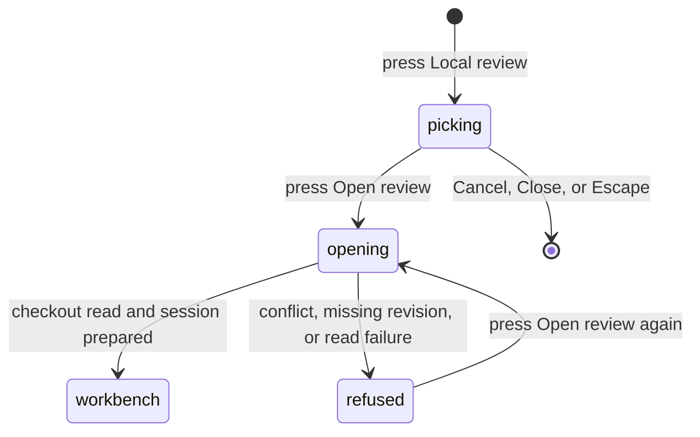

# Opening a local Review

## Summary

Opening a local Review turns a change that has no pull request yet into a readable Review workbench. The maintainer reaches it from the Local review button on the Pull requests screen, beside the Repository picker, and it appears only when the Selected repository has a local checkout in the active workspace profile. The maintainer picks a _Review source_: the _shared Review_ of the checked-out branch against a base branch, which shows the branch's commits and the checkout's uncommitted changes as one diff and can narrow it to either, or one commit. Patchdesk reads the checkout, prepares a _Review session_ for that exact revision, and opens the workbench on the Diff tab. Opening changes no file, index, or branch in the maintainer's checkout and performs no GitHub read or write; Patchdesk keeps the snapshot as git objects, a `refs/patchdesk/local/` ref, and a worktree in its cache. A coding agent can open and refresh the same Review over MCP; see [A coding agent over MCP](coding-agent-over-mcp.md).

## The simple case

The maintainer selects a repository that has a local checkout and presses Local review. The Open a local review dialog names the repository and offers two tabs: Shared and Commit. Shared is selected, with the note `Every change on <branch> since it left the base branch, committed or not: commits, staged, unstaged, and untracked files.` The **Base branch** select holds the nearest branch, with the reason under it, such as `nearest branch: main, 3 commits back`. The maintainer presses Open review. The button reads Opening… and the shared busy indicator reads Opening Review… while Patchdesk records the working tree and prepares the session.

When preparation succeeds, the dialog closes and the Review workbench opens on the Diff tab. The heading names the branch and the base, for example `feat/449-local-review-source against main`. Every file the branch's commits changed since it left `main`, and every staged, unstaged, and untracked file that `.gitignore` does not exclude, appears in the file tree and the diff, each new file marked NEW.

## The task, event by event

```mermaid
stateDiagram-v2
    [*] --> picking : press Local review
    picking --> opening : press Open review
    opening --> workbench : checkout read and session prepared
    opening --> refused : conflict, missing revision, or read failure
    refused --> opening : press Open review again
    picking --> [*] : Cancel, Close, or Escape
```

### Arrive

The Local review button sits in the Pull requests header between the Repository picker and the freshness badge. It appears only when the workspace profile lists the Selected repository with a local checkout path; a repository without one shows no button. Pressing it opens the dialog with the Shared tab selected. Patchdesk reads the checkout's local and remote-tracking branches; `Reading the branches…` shows until they arrive, and `Patchdesk could not read the checkout's branches.` replaces the picker when the read fails.

The Base branch picker is a search field over one list with two groups, **Local branches** (every other local branch) and **Remote branches** (every remote-tracking branch, such as `origin/main`, without `origin/HEAD`), each the most recently committed first. Typing filters both groups at once, so `main` shows `main` under Local branches and `origin/main` under Remote branches; a group with no match is hidden, and `No branches match.` shows when neither has one (#591). It preselects the inferred base, always a local branch: of the branches whose merge base with `HEAD` is behind `HEAD`, the one with the fewest commits from that merge base to `HEAD`. A tie goes to the repository's default branch, then to the most recently committed branch. The reason line shows only while the inferred base is selected. The maintainer may pick any listed branch instead. When no branch is behind `HEAD`, for example when every other branch was created at `HEAD`, nothing is preselected and the field reads `Search branches`. When the checked-out branch is the only branch, local or remote-tracking, the picker is replaced by `<branch> is the only branch, so there is no base to compare it with. Create the base branch, or open one commit.` When the branch already has open shared Reviews, a line under the picker names their bases: `<branch> has open reviews against main, develop.`

> Technical note: the default branch is `origin/HEAD`, else the `init.defaultBranch` setting, else `main` when that branch exists. The base is stored as a full ref, `refs/heads/<name>` or `refs/remotes/<remote>/<name>`, so a local branch named `origin/main` and the remote-tracking `origin/main` are different bases and different Reviews. Refs are read as they are on disk; Patchdesk does not fetch.

When the repository has linked worktrees (`git worktree add`), the Shared tab also shows a **Checkout** select listing the configured checkout and each live linked worktree, as `<folder> · <branch>` or `<folder> · detached HEAD`. It defaults to the configured checkout and is hidden when there is only one checkout. Picking another checkout reads that checkout's branches and drops a base picked by hand. Patchdesk's own review worktrees are never listed. The Commit tab always reads the configured checkout.

### Leave unchanged

Switching tabs, picking a base, typing in the fields, pressing Cancel, pressing Close, or pressing Escape writes nothing. Opening the dialog and picking a checkout read that checkout's branches and write nothing. The dialog is created fresh each time it opens, so a cancelled draft does not return.

Open review stays disabled until the chosen tab is complete: Shared needs a base branch, and Commit needs a SHA of 4 to 64 hexadecimal characters, full or abbreviated, in either case. Spaces around a value are ignored.

### Begin an action

Pressing Open review sends the source to the main process. Patchdesk checks that the repository is in the active profile with a local checkout, then reads the source from that checkout:

- **Shared.** Patchdesk records the chosen checkout as a _Local snapshot_, a commit object built from every staged, unstaged, and untracked file on top of `HEAD`, and compares it with the merge base of `HEAD` and the base branch. A remote-tracking base is read as the last fetch left it, so on `main` against `origin/main` the diff holds the commits not yet pushed and the uncommitted changes. The diff holds the branch's commits and its uncommitted changes together; commits made on the base branch after the branch point do not appear. The branch `HEAD` names, or `detached` on a detached `HEAD`, and the base branch identify the Review, so switching branches or picking another base opens a different Review. A linked worktree is a different Review from the configured checkout on the same branch, with its own sessions and drafts, and its heading ends with `in <folder>`. When the checkout is on another branch than the dialog read, the open is refused instead of opening that branch's Review.
- **Commit.** The commit is compared with its first parent. A root commit is compared with an empty tree, so every file it adds appears as new.

> Technical note: the Local snapshot is built in a temporary copy of the checkout's index and committed with a fixed author, committer, date, and message, so the same content on the same `HEAD` always has the same SHA. The maintainer's index, branches, and working files are never written. The snapshot's objects go into the repository's object store and are reachable only from a ref under `refs/patchdesk/local/` (ADR 0050).

### While the action runs

The dialog stays open. Open review reads Opening…, Cancel is disabled, the Close button is hidden, and Escape and clicks outside the dialog are ignored until the attempt settles. The shared busy indicator reads Opening Review….

Patchdesk prepares the session for the resolved head and base: it pins the head under a managed ref, checks it out as a separate represented-review worktree under the app cache, and writes the patch. The same profile lock and Review lock that serialize pull-request opening serialize this work.

> Technical note: the patch is `git diff --binary` between the base and head, written with `a/` and `b/` paths and no colour whatever the checkout's diff configuration says, and hashed as written. That hash is the session's patch identity.

### Settle

On success the dialog closes and the Review workbench replaces the Pull requests screen, on the Diff tab. The workbench differs from a pull-request Review:

- The heading names the source: `<branch> against <base>`, `Detached HEAD against <base>`, or `Commit <first eight characters>`.
- The tab strip shows Diff and Insights; there is no Conversation tab.
- The header shows the selected Patch view's Scope gauge and line counts under a Local review status group, and a line with the repository and the revision it represents: `<View> view · Local snapshot <first eight characters> · <branch> against <base> · read from the local checkout` for a shared Review, where `<View>` names the [Patch view](#patch-views) the diff shows, and `Commit <…> · read from the local checkout` for a commit. It makes no claim about GitHub: there is no freshness label or checked time, no Checks or Merge chips, no Open on GitHub or Watch button, and no Start a review or Finish review button. The line ends with a **Refresh** button that reads the checkout again; see [Refresh](#refresh).
- The Diff tab behaves as described in [Files, diff, and navigation](../review-workbench/files-diff-and-navigation.md), including expanding unchanged context around a hunk. Its navigator reads Browse, [Commits](#commits), and [Notes](#local-drafts) on a shared Review, and Browse and Notes on a commit Review; there is no Threads section. Selecting lines opens a note composer instead of an inline comment; see [Maintainer notes](#maintainer-notes).
- The Insights tab runs Brief, Walkthrough, and Analysis as described in [Insights on a local Review](#insights-on-a-local-review).

Opening the same source again with unchanged content lands on the same Review session. An edit to any file, a new commit, or a new merge base prepares a new session, and the same Review moves to it.

On failure the dialog stays open with a `Review not opened` alert that gives the reason in one sentence:

| Cause                                                                                  | Sentence                                                                                                                                                                                                                              |
| -------------------------------------------------------------------------------------- | ------------------------------------------------------------------------------------------------------------------------------------------------------------------------------------------------------------------------------------- |
| The working tree's index holds an unresolved merge conflict                            | `The working tree has unresolved merge conflicts.`                                                                                                                                                                                    |
| The working tree has more than 5,000 untracked files                                   | `The working tree has more than 5,000 untracked files, more than Patchdesk snapshots. Add <paths> to .gitignore or remove them, then try again.`, naming up to five of the largest untracked folders or files                         |
| The working tree's untracked files hold more than 100 MiB                              | `The working tree has more than 100 MiB of untracked files, more than Patchdesk snapshots. Add <paths> to .gitignore or remove them, then try again.`, naming up to five of the largest untracked folders or files                    |
| The patch, or on a shared Review any of its three views, is larger than 2 MiB          | `The change is larger than the 2 MiB patch Patchdesk can read. The largest changes are in <files>. Leave generated files out, or review it in smaller parts.`                                                                         |
| The branch, base branch, merge base, or commit does not exist, or `HEAD` has no commit | `This checkout has no such branch, base branch, or commit.`                                                                                                                                                                           |
| The repository's configured checkout folder no longer exists, as after a move on disk  | `Patchdesk cannot find this repository's checkout at <path>. If you moved it, open Settings → Workspace and, under Repositories, add the folder that holds it now if it is not listed, then untick the repository and tick it again.` |
| The checkout is on another branch than the dialog read                                 | `The checkout is on <branch>. Switch to <branch> to reopen this review.` (or `Detach HEAD`)                                                                                                                                           |
| The repository is no longer in the profile with a local checkout                       | `This repository has no local checkout in the workspace.`                                                                                                                                                                             |
| Any other read, storage, or worktree failure                                           | `Patchdesk could not read the local checkout.`                                                                                                                                                                                        |

The fields keep their values, and pressing Open review again retries.

## Patch views

A shared Review holds three **Patch views** of one session, and the `Patch view` control at the left of the diff toolbar switches between them (#556, ADR 0050):

- **Combined.** Every change since the branch left the base, committed or not. Its tooltip reads `Merge base to Local snapshot`.
- **Committed.** The branch's commits only: `Merge base to checkout HEAD`.
- **Uncommitted.** The staged, unstaged, and untracked changes only: `Checkout HEAD to Local snapshot`.

The Review opens on Combined, and the picked view stays across Refresh. The control is hidden while a commit is picked in the [Commits](#commits) section, and Browse or Notes brings it back on the view shown before. Patchdesk writes all three patches when it prepares the session, so a switch reads a stored file: it runs no git, reads nothing from the checkout, and moves neither the Review nor its session. An edit to the checkout after opening shows in no view until Refresh. While a view is read, the pane shows `Loading the <View> view…`; when the read fails, it shows `The <View> view could not be loaded.` with the control above it, so the maintainer can switch back.

A switch changes what the Diff tab reads:

- The file tree, the diff, and the Scope picker's buckets and counts follow the shown view, and a switch clears a picked Scope bucket. If the selected file is absent from the new view, Browse and the Selected diff move to a file in that view. They also reconcile after Refresh changes the patch or after leaving a commit slice. An empty view says there are no changed files and keeps the Patch view control available.
- Viewed marks belong to the view they were made on. A file marked Viewed on Committed is not marked on Combined, and its mark is there again after a switch back. If another mark is waiting to save when you switch views and mark a file there, both views finish saving their own marks. A refused save restores that view's stored marks so you can retry. On Refresh, a mark stays only when that file's patch is identical in the same view of the new session; a changed file loses its mark. Mark all viewed marks the shown view's files.
- Findings show inline, and in the file tree's counts, on Combined only. Opening a file or a Finding in the diff from Insights switches to Combined first, because their line numbers are Combined's.

A note keeps its ID, text, and state on every view. It shows inline on the view it was written on, and on any other view whose tree on the note's side holds the same file content, when its lines sit inside a hunk of that view; otherwise only the Notes section lists it, with the reason (ADR 0051). A note never moves to the other side. For example, a note on an uncommitted line of `b.ts` shows on Uncommitted and Combined, whose new sides are both the Local snapshot, and not on Committed, whose new side is `HEAD`. After the agent commits that line and the maintainer presses Refresh, the note shows on Combined and Committed.

Notes can be added on every view, and each records the view it was written on. When the maintainer switches views while a note composer holds unsaved text, the text is kept: a `Saved draft` bar above the diff reads `Select a new diff line to restore the saved draft.`, and the next selected line opens the composer with that text. Dismiss draft drops it. The same happens when the maintainer leaves the Diff tab, picks a commit, or presses a Refresh that moves the Review to a new session while the composer is open. If **Add note** is still saving during the switch, the bar waits for the result: a refused save offers the text as a Saved draft, while a successful save adds the note without offering a duplicate draft. Selecting the same line again keeps the text in a restored composer.

Brief, Walkthrough, and Analysis always run on Combined. On a shared Review the run dialog reads `<Insight> for this revision. It runs on the Combined view.` While Committed or Uncommitted is selected, an Insight's `Generated …` line ends ` · Combined view`, and Apply is disabled with `This Analysis ran on the Combined view. Switch to Combined to apply its suggestions.` beside it.

> Technical note: the session folder holds `patch.diff` (Combined), `patch-committed.diff`, and `patch-uncommitted.diff`, each with its own sha256, and the Viewed marks in `viewed-files.json`, `viewed-files-committed.json`, and `viewed-files-uncommitted.json`. An Apply request that names another view is refused `view_mismatch` before the freshness check, and nothing is written.

## Commits

A shared Review's **Commits** section lists the branch's commits: every commit from the merge base to the checkout `HEAD` the session was captured on, newest first (#557, ADR 0050). The tab's badge counts them. Each row shows the commit's subject, then its author, the first eight characters of its SHA, and its age; the checkout `HEAD` carries a `HEAD` badge. A merge is listed, and so is each commit it brought in. The uncommitted changes are not a commit and are not listed. With no commits since the base, the section reads `No commits since the base.` Patchdesk keeps the newest 250: a longer branch reads `Newest 250 of <N>` above the list, and the badge shows the total.

Opening Commits selects the newest commit. A selected commit's patch replaces the diff: a commit against its first parent, so a merge shows only what it brought in, and a root commit from a merged unrelated history against an empty tree, so every file it adds is new. A commit with no file changes opens as a zero-file slice with its commit metadata; Browse returns to the prior view. The bar above the toolbar names the commit with its author, short SHA, age, position such as `2 of 5`, file count, and added and removed lines, and reads `Notes show on a Patch view, not on a single commit.` The slice shows no notes, no Findings, no note composer, and no Patch view control. Browse or Notes returns to the full diff on the view shown before. Selecting a commit moves neither the Review nor its session and changes no draft. When the patch cannot be read, the pane shows `This commit diff could not be loaded.` and the Review stays as it was.

The list is read once, when Patchdesk prepares the session, so it changes only when Refresh or opening the Review again moves it to a new session. A failed listing refuses the open like any other read failure. A commit Review has no Commits section, because its diff already is that commit, and neither do working-tree and branch Reviews stored before the shared Review.

> Technical note: Patchdesk lists the commits with `git rev-list --topo-order` and reads each commit's patch in the session's worktree under the app cache, never in the checkout; the empty tree's ID is computed without writing an object. The session record stores the newest 250 commits and the total. A request for a SHA outside that list is refused `foreign_commit`.

## Insights on a local Review

Brief, Walkthrough, and Analysis run on a local Review from the same run dialog, with the same provider, model, effort, and language choices, as on a pull request Review. Each run is bound to the local session's head, base, and patch hash, so a run on a shared Review analyzes the Local snapshot, including untracked files. A result is retained and read back the same way; a later session makes it Outdated.

What differs is what a local Review has no source for:

- The model's context carries the repository's rule files and the changed-file list, but no pull request comments and no check results. Patchdesk makes no GitHub read to start the run.
- Analysis shows its Findings and their evidence hunks, with Dismiss and Copy as markdown prompt. There is no Add to review, no Add all, no Finish with the Analysis summary, and no CI badge, because a local Review has no pull request to write to or checks to report. A mapped Finding offers Add to draft instead; see [Local drafts](#local-drafts). On a shared Review, a Finding that carries a suggestion also offers an Apply checkbox; see [Apply suggestions to the working tree](#apply-suggestions-to-the-working-tree). A Finding that is not mapped to the diff reads Unavailable.
- Walkthrough shows no discussion note, because a local Review has no Conversation.
- On a shared Review every run reads the Combined view, whichever [Patch view](#patch-views) the diff shows.
- Brief draws Flow, Shape, Blast radius, and Start here. Blast radius counts names by text search at the session head, which for a shared Review is the Local snapshot, so a name the uncommitted change adds is found. Brief has no Description vs diff block for any Review (ADR 0040), and no citation names a commit. A current Brief offers **Copy as PR description** in its Provenance card; see [Copy Brief as PR description](#copy-brief-as-pr-description).
- A settled run posts `<Insight> finished` or `<Insight> failed`, naming the source title and checkout folder, under the same silence rule as a pull request Review (#496); see [Notifications](coding-agent-over-mcp.md#notifications).

## Change intent

A local Review can hold a **Change intent**: what the change is meant to do, usually the task or spec the coding agent was given (#467, ADR 0051). Analysis reads it as the change's stated goal. A goal the intent names and the patch does not deliver is a P2 Finding, and so is a change the patch makes and the intent does not mention. With no intent, Analysis records an unresolved item instead. Brief and Walkthrough do not read it.

The header shows the intent on its own line under the revision line: the first line of the text, `Spec: <path>` for a spec file, or `No change intent`. Beside it, **Change intent** opens a dialog with two tabs. **Text** takes Markdown of at most 64 KiB; **Spec file** takes a path inside the repository, such as `docs/spec.md`. **Save** stays disabled while the field is empty, **Clear** removes the intent, and **Cancel** or Escape closes the dialog without a change. A merged or closed Review shows the line without the button.

Saving writes only the Review record. A refused save keeps the dialog open with its text and one sentence under `Change intent not saved`:

| Cause                                                          | Sentence                                                                                   |
| -------------------------------------------------------------- | ------------------------------------------------------------------------------------------ |
| Blank text, text over 64 KiB, or a path outside the repository | `Enter text of at most 64 KiB, or a file path inside the repository such as docs/spec.md.` |
| The text holds what looks like a credential                    | `The text contains what looks like a credential. Remove it and save again.`                |
| Another action on the Review is running                        | `Another action on this review is running. Try again when it finishes.`                    |
| Any other failure                                              | `The change intent was not saved.`                                                         |

A spec file is read when Analysis starts, from the reviewed revision (the Local snapshot on a shared Review), never from the working tree, so an edit after the snapshot reaches Analysis only after Refresh. When the file cannot be used, the run does not start and the run dialog says why:

| Cause                                                                                                                    | Sentence                                                                                                                                                         |
| ------------------------------------------------------------------------------------------------------------------------ | ---------------------------------------------------------------------------------------------------------------------------------------------------------------- |
| No file at that path in the reviewed revision                                                                            | `The spec file is not in the reviewed revision. Fix the path in Change intent, or add the file and press Refresh.`                                               |
| Larger than 64 KiB                                                                                                       | `The spec file is larger than 64 KiB. Shorten it, or enter the goal as text in Change intent.`                                                                   |
| Not UTF-8 text                                                                                                           | `The spec file is not UTF-8 text. Point Change intent at a Markdown or text file.`                                                                               |
| Holds what looks like a credential                                                                                       | `The spec file contains what looks like a credential. Remove it and press Refresh.`                                                                              |
| Git rewrites it on checkout: Git LFS, a clean/smudge filter, `ident`, `working-tree-encoding`, or line-ending conversion | `Git rewrites the spec file on checkout (LFS, a filter, or line endings), so Patchdesk cannot read its committed text. Enter the goal as text in Change intent.` |

The sentence goes away once the Change intent changes, Refresh moves the Review to a new snapshot, or the run dialog opens again.

An Analysis run on a Review with an intent names it after the provider and model: `Checked against: change intent`, or `Checked against: spec <path>`. When the intent was edited, replaced, or cleared after the run, the line adds `Intent changed since this run`; a spec file counts as unchanged while its path is the same, because its bytes belong to the revision the run already names. Refresh and opening the Review again keep the intent.

> Technical note: the intent is stored on the Review record, and each Analysis records the source and the sha256 of the text it read. It goes into `review-input.md` between `BEGIN CHANGE INTENT` and `END CHANGE INTENT`; changing it rebuilds that file at the next Analysis start.

## Local drafts

A local Review reviews a coding agent's work before any pull request exists. The Findings the maintainer wants the agent to address, and the maintainer's own notes on diff lines, go to a **Local draft** list kept on the Review (ADR 0050, ADR 0051), and the list is copied to the agent as one prompt.

On a local Review with a current Analysis, every open, mapped Finding shows **Add to draft**. Pressing it adds the Finding to the list; the row then shows a `Drafted` badge and **Remove from draft**, and Dismiss is no longer offered on it. Adding the same Finding twice keeps one entry. The Analysis card counts a drafted Finding as handled, the same as a dismissed one: one drafted and one dismissed Finding read `2 of 2 handled`.

The list is the **Notes** section of the Diff tab's navigator, in place of the Threads section a pull request Review has (#557). The Insights tab does not show it. The tab's badge counts the drafts, and the section names the count (`1 draft for the coding agent`). Each row shows a note's text or a Finding's title, then badges: `Note` or `Finding`, `Suggestion` when the Finding's suggestion resolved in the session's patch, the view it was written on (`Combined`, `Committed`, or `Uncommitted`) on a shared Review, and its state after a move to a new session. Then comes its `path:line`, with **Remove** below the note rather than beside its text. The count and **Copy as agent prompt** each have their own row at the default navigator width. A **Remove** button's accessible name names the kind and lines, `Remove note at path:line from drafts` or `Remove finding at path:line from drafts`, so a note and a Finding draft on the same lines stay distinct. With no drafts the section reads `Select diff lines to add a note, or add a finding to draft, to collect your feedback for the coding agent.`

A row whose draft the shown diff renders inline is a button named `Show note at path:line in the diff` or `Show finding at path:line in the diff`. Pressing it clears a Scope filter, leaves a commit slice, selects the file, and marks the lines, and the Notes section stays open. A Scope filter that hides the file does not change the row. The diff's note cards and the list place drafts by the same rule, so a note shows inline exactly when its row is a button. Any other row says under its location why the diff does not show it, and selecting it moves nothing:

| Cause                                                                                                            | Sentence under the row                                                      |
| ---------------------------------------------------------------------------------------------------------------- | --------------------------------------------------------------------------- |
| The draft belongs to an earlier session: it needed attention after a Refresh, or its Finding was applied         | `Its lines are from before the last Refresh, so the diff does not show it.` |
| The shown view's tree on the note's side holds another version of the file                                       | `The <View> view shows another version of this file.`                       |
| The shown view has no hunk around the note's lines, including an empty view                                      | `The <View> view does not show these lines.`                                |
| A Finding draft while Committed or Uncommitted is shown                                                          | `Findings show in the Combined view only.`                                  |
| The current Analysis does not render the Finding: no current Analysis, another run, or the Finding is not mapped | `The current Analysis does not show this Finding in the diff.`              |

With at least one draft, the section offers **Copy as agent prompt**. It copies one Markdown prompt composed in the main process: the heading `# Address review comments`, a one-line instruction to address each comment, then under `## Comments` one numbered section per draft, ordered by file path and then line. Each section has the draft's title on one line, with line breaks and runs of spaces collapsed (`Note from the maintainer` for a note), a `File:` line naming `path:line` or `path:start-end` (noting old-side line numbers), its comment or note text, and, when a Finding draft has one, its suggestion in a fenced block after `Suggested replacement for path:line:`. After a Refresh, a draft whose lines changed adds `- Status: these lines changed since this comment; the maintainer is checking whether the change addresses it.` under its `File:` line, and a draft under Needs attention adds `- Status: these lines are no longer where this comment was made, so the line numbers are from an earlier version.` A Finding draft marked Applied in Patchdesk is left out. The button reads `Copied` once the clipboard write succeeds, and `The drafts could not be copied.` appears under it when it fails. The layout follows the Analysis card's Copy as markdown prompt.

Adding and removing write only the Review record in the app's data folder. They read nothing from the checkout and are not refused when the working tree has changed since the session. Each request names the session the workbench shows, and the main process refuses it when the Review has since moved to another session. Each draft stores the Finding's location, the diff lines around it, its comment (the suggested comment, or the explanation), its suggestion, and the session, Analysis run, and Finding it came from, so it stays readable after the Analysis is replaced.

Drafts belong to the Review, not the session. Opening the Review again lists them. When Refresh, Apply, or opening the Review again moves it to a new session, every draft is carried to that session as [Refresh](#refresh) describes; the earlier Analysis reads Outdated and offers no Add to draft.

| Cause                                                                                     | Sentence in the Notes section and on the Analysis tab                                                                 |
| ----------------------------------------------------------------------------------------- | --------------------------------------------------------------------------------------------------------------------- |
| Another action on the Review is running                                                   | `Another action on this review is running. Try again when it finishes.`                                               |
| The Finding is no longer current, mapped, or open, or the Review moved to another session | `The review changed or this finding can no longer be drafted. Press Refresh, then run Analysis on the current files.` |
| The Finding's comment or suggestion holds what looks like a credential                    | `This finding's comment contains what looks like a credential, which Patchdesk never stores.`                         |
| Any other failure                                                                         | `The draft list was not changed.`                                                                                     |

### Maintainer notes

On a local Review's Diff tab, clicking a line number, dragging across line numbers, or pressing the `+` in the gutter opens a **Note composer** under the lines, headed `path:line · a note for the coding agent`. **Add note** (or ⌘/Ctrl+Enter) saves it; Escape or **Cancel** closes the composer, asking `Discard this note?` when it holds text. **Add note** stays disabled while the text is blank. On a merged or closed Review the composer does not open.

A saved note appears inline under its lines with a `Note` badge, its text, **Edit note**, and **Remove note**, and it is listed in the Notes section. **Edit note** turns the card into a text field with **Save note** and **Cancel**; ⌘/Ctrl+Enter saves and Escape cancels. A Finding draft offers no edit (ADR 0051).

A note is stored with its lines, the diff lines around them, its text, and the session it was written against. The main process checks the lines against the patch of the view the diff shows and refuses text holding what looks like a credential, so a refused note keeps the composer open with its text and the reason under it. Adding, editing, and removing a note write only the Review record, like the other Local draft actions.

A note is shown inline only on the session its anchor belongs to, and on a shared Review only in the [Patch views](#patch-views) that show its lines. Refresh carries it to the new session when its lines can be placed there, and the inline card then shows its state badge; a note under Needs attention is listed only in the Notes section.

| Cause                                                                        | Sentence under the note's text field                                                                  |
| ---------------------------------------------------------------------------- | ----------------------------------------------------------------------------------------------------- |
| Another action on the Review is running                                      | `Another action on this review is running. Try again when it finishes.`                               |
| The lines are not in the shown patch, or the Review moved to another session | `The review changed or these lines are not in the current diff. Press Refresh and select them again.` |
| The note was removed before the edit arrived                                 | `This note was removed. Press Refresh.`                                                               |
| The text holds what looks like a credential, which Patchdesk never stores    | `The note contains what looks like a credential. Remove it and save again.`                           |
| Any other failure                                                            | `The note was not saved.`                                                                             |

## Refresh

**Refresh** at the end of a local Review's header line reads the Review's source from the checkout again, the same way opening does, under the Review lock. The workbench changes only when the maintainer presses Refresh, opens the Review again, or applies suggestions (ADR 0032, ADR 0050). The button reads `Refreshing…` while the read runs.

An open shared Review checks its checkout when the window gains focus and every 90 seconds while the window is visible. When the checkout no longer matches the session shown, for example after an edit in a terminal, a new untracked file, or a commit, the header shows **Updates available**. The check does not move the Review: the diff, the Notes list, and a half-written note stay as they are until Refresh. When the checkout returns to the shown content, the label goes away. A checkout now on another branch shows no label, because Refresh refuses it. A commit Review is not checked, because its commit cannot change. A failed read shows no label.

> Technical note: the check compares a fingerprint of the checkout, made from `HEAD`, the merge base, a hash of `git diff HEAD --binary`, and each untracked file's `git hash-object` hash, with the one recorded when the session was prepared; each Refresh or open that lands on a session records the fingerprint it read there, so Refresh clears the label even when the snapshot is unchanged, as after `git add` of a new file. It writes nothing to the repository, passes `--no-optional-locks` so it never takes `index.lock`, and holds the Review lock only to read the Review record. A session prepared before this check existed is fingerprinted on its first check. A failed read is logged once to `patchdesk.jsonl` under `local-review-updates` (#611, ADR 0050 "Freshness").

When the content is unchanged, Refresh lands on the same session and nothing changes. When it changed, Refresh prepares a new session, the header shows the new `Local snapshot <first eight characters>`, the Analysis, Brief, and Walkthrough read Outdated, and Apply is no longer offered until a new Analysis runs.

Every move to a new session places each Local draft first, then says what happened to its lines (ADR 0002, ADR 0050, ADR 0051):

- **Placed.** The drafted lines and the diff lines around them appear exactly once in the new patch, and the draft moves there. Otherwise, the lines around the draft are each found exactly once in the new version of the file, read from the new session's own worktree, with at least one line between them, and the draft moves to the lines between them. For a draft on a file's first or last line, the start or end of the file stands in for the missing lines on that side, so the draft is placed when the lines on its other side still match.
- **Needs attention.** Neither holds: the file is gone, or the lines around the draft changed, appear more than once, or have nothing left between them. The draft keeps its original lines and session and stays listed.

A placed draft reads **Changed since your note** when the lines under it differ from the lines the maintainer saw when writing it, and **Unchanged** otherwise. A draft that changed keeps that label on later moves, because it describes the change since the note was written.

A note on removed (old-side) lines is placed only by an exact match in the new patch, because the new version of the file no longer has those lines; otherwise it needs attention. A draft placed by the lines around it can sit on lines that are no longer in the new patch, for example after the agent reverted its change; it is then listed only in the Notes section and not shown inline on the Diff tab.

No draft is discarded. A Finding draft keeps its suggestion only when the new patch still holds, at the draft's lines, the exact lines the suggestion replaces, and the suggestion holds no code fence; otherwise the suggestion is dropped and the draft stays. Each draft in the Notes section, and each note shown inline, carries a badge: `Unchanged`, `Changed since your note`, `Needs attention`, or `Applied in Patchdesk`. A draft added on the current session has no badge until the next move.

On a shared Review each draft is carried against the new session's patch of the view it was written on, a Finding draft against Combined. The new version of the file comes from the Local snapshot for Combined and Uncommitted, and from the checkout's `HEAD` commit for Committed. The draft keeps the view it was written on. If Git cannot read that `HEAD` file, Refresh refuses with `Patchdesk could not read the local checkout.` and keeps the Review on its prior session with its draft states unchanged. A file genuinely absent at `HEAD` still follows the Needs attention rule.

| Cause                                                                                 | Sentence under the workbench                                                                                                                                                                                                          |
| ------------------------------------------------------------------------------------- | ------------------------------------------------------------------------------------------------------------------------------------------------------------------------------------------------------------------------------------- |
| A shared Review whose checkout is now on another branch or a detached `HEAD`          | `The checkout is on <branch>. Switch to <branch> to reopen this review.` (or `Detach HEAD`)                                                                                                                                           |
| Another action on the Review is running                                               | `Another action on this review is running. Refresh when it finishes.`                                                                                                                                                                 |
| The working tree's index holds an unresolved merge conflict                           | `The working tree has unresolved merge conflicts.`                                                                                                                                                                                    |
| The working tree has more than 5,000 untracked files                                  | `The working tree has more than 5,000 untracked files, more than Patchdesk snapshots. Add <paths> to .gitignore or remove them, then try again.`                                                                                      |
| The working tree's untracked files hold more than 100 MiB                             | `The working tree has more than 100 MiB of untracked files, more than Patchdesk snapshots. Add <paths> to .gitignore or remove them, then try again.`                                                                                 |
| The patch, or on a shared Review any of its three views, is larger than 2 MiB         | `The change is larger than the 2 MiB patch Patchdesk can read. The largest changes are in <files>. Leave generated files out, or review it in smaller parts.`                                                                         |
| The branch, base branch, or commit is gone                                            | `This checkout no longer has the branch, base branch, or commit this review reads.`                                                                                                                                                   |
| The repository's configured checkout folder no longer exists, as after a move on disk | `Patchdesk cannot find this repository's checkout at <path>. If you moved it, open Settings → Workspace and, under Repositories, add the folder that holds it now if it is not listed, then untick the repository and tick it again.` |
| Any other read or storage failure                                                     | `Patchdesk could not read the local checkout.`                                                                                                                                                                                        |

A refused Refresh changes nothing: the Review stays on its session with its drafts as they were.

A working-tree or branch Review stored before the shared Review (#555) shows no Refresh button: nothing reads its checkout again.

A repository moved on disk keeps its local Reviews. Once its path is saved again in Settings, opening it returns the same Review on the same session when the content is unchanged, and Patchdesk runs `git worktree repair` so the Review's cache worktree reads from the moved repository.

## Copy Brief as PR description

A current Brief on a local Review shows **Copy as PR description** under Regenerate in its Provenance card. Pressing it asks the main process for the retained Brief as Markdown and copies it; the button reads `Copied` for a moment once the clipboard write succeeds, and `The description could not be copied.` appears under it when it fails. An Outdated Brief does not offer it.

The Markdown has, in order: `## Flow` with one `### <Kind>: <title>` section per Flow view and its tree in a `diff` fence, `## Shape` with each changed file's status, line counts, and note, `## Blast radius` with the names mentioned outside the change, removed names still mentioned, and changed files no test mentions, and `## Start here` with the lead and the reading order. A section with nothing to say is left out.

Each Flow step that shows citation chips in the reader carries its hunks as `(path:line)`, the line being the hunk's first line on the new side; a hunk of a deleted file is written as its path alone. A citation with no hunk location is left out.

## Apply suggestions to the working tree

On a shared Review with a current Analysis, a Finding whose suggestion resolves in the session's patch shows an **Apply** checkbox beside Dismiss, and the Needs attention card shows an Apply bar above the Findings. With no open Finding whose suggestion resolves, the bar is left out, unless it still has an unsettled Apply to check or a message from the last Apply to show. The maintainer ticks one or more Findings; the button reads `Apply 1 suggestion` or `Apply <n> suggestions` and stays disabled while nothing is ticked. Pressing it opens a confirmation that lists every selected Finding by title and location. **Apply to working tree** writes; Cancel, Escape, or a click outside writes nothing.

Patchdesk first reads the checkout again. When the working tree differs from the session the Analysis ran on, nothing is written, the Review records that its revision changed, and the bar shows `The working tree changed after this Analysis ran. Press Refresh, then run Analysis on the current files.` beside the button. Otherwise it rebuilds each change from the retained Analysis and the file's current bytes, runs `git apply` on the checkout, and confirms every file reached its expected content. The maintainer's index is not written and nothing is staged.

On success the Review moves to a new session for the changed working tree and the workbench opens on it. A drafted Finding that the Apply wrote is marked `Applied in Patchdesk`; the other drafts are carried as [Refresh](#refresh) describes. The earlier Analysis reads Outdated: its Findings stay readable and offer no Apply, and applying more needs a new run.

| Cause                                                                                                                                                                                                      | Sentence beside the button                                                                                 |
| ---------------------------------------------------------------------------------------------------------------------------------------------------------------------------------------------------------- | ---------------------------------------------------------------------------------------------------------- |
| The working tree changed after the run                                                                                                                                                                     | `The working tree changed after this Analysis ran. Press Refresh, then run Analysis on the current files.` |
| Two selected suggestions change the same line                                                                                                                                                              | `Two selected suggestions change the same lines. Select only one of them.`                                 |
| A file no longer holds the replaced lines, or is not UTF-8                                                                                                                                                 | `A file no longer holds the lines a suggestion replaces. Press Refresh.`                                   |
| Every selected suggestion matches the lines it replaces                                                                                                                                                    | `The selected suggestions match the current lines. Nothing was written.`                                   |
| `git apply --check` refuses the patch                                                                                                                                                                      | `git apply refused the change. Nothing was written.`                                                       |
| A path leaves the checkout or passes through a symlink                                                                                                                                                     | `A file is outside the checkout or behind a symlink. Nothing was written.`                                 |
| Git would convert line endings, expand `ident`, run a filter, or re-encode a changed file (`.gitattributes`, `core.autocrlf=true`, `core.eol=crlf`), including a file that already holds CRLF line endings | `Git would convert line endings or run a filter on a changed file. Apply this change in your editor.`      |
| Another action on the Review is running                                                                                                                                                                    | `Another action on this review is running. Try again when it finishes.`                                    |
| Committed or Uncommitted is the selected [Patch view](#patch-views)                                                                                                                                        | `This Analysis ran on the Combined view. Switch to Combined to apply its suggestions.`                     |

When Patchdesk cannot prove the outcome, for example the app quits while `git apply` runs, the bar replaces Apply with `An Apply may have changed files. Check them before applying more.` and a **Check files** button. Checking, and every app start, compares each file's sha256 with the hashes recorded before the write: every file at its new content confirms the Apply and prepares the next session; every file at its old content clears the lock; anything else keeps the lock and reads `An Apply left the files in an unexpected state.` Patchdesk never runs `git apply` again on its own. Each decision is logged to `patchdesk.jsonl` with topic `local-apply` and message `Local apply recovery decided`. A Refresh or reopen that moves the Review to a new session also ends the lock, since the Apply's suggestions cannot be applied to the new session: it reads the hashes once, marks the drafted Findings applied when every file is at its new content, and logs `Local apply settled by a move to another session`. A Refresh that finds the checkout unchanged keeps the lock.

> Technical note: the operation record in the Review's folder (`local-apply-operation.json`) stores each file's path and pre- and post-image sha256 before `git apply` runs, and is marked outcome-unknown immediately before it (ADR 0050, ADR 0035). Commit Reviews, and working-tree or branch Reviews stored before the shared Review, offer no Apply.

## Variants

| Variant                                                | Before the action runs                                                                                                                                    | While the action runs                                                                                                         |
| ------------------------------------------------------ | --------------------------------------------------------------------------------------------------------------------------------------------------------- | ----------------------------------------------------------------------------------------------------------------------------- |
| Workspace profile and GitHub account                   | The button appears only for a Selected repository the active profile lists with a local checkout. The GitHub account is not used.                         | The attempt belongs to the profile that was active when it started; the workbench opens only if that profile is still active. |
| Pull request and Review state                          | No pull request is needed. A source opened before resumes its Review; a new source creates one.                                                           | The resolved head and base fix the session. A different source spec is a different Review.                                    |
| GitHub permissions and merge readiness                 | No effect. A local Review has no GitHub permission or merge readiness.                                                                                    | No effect. Nothing is read from or written to GitHub.                                                                         |
| Network, local tool, and Insight provider availability | `git` must be available. The network and Insight providers are not needed.                                                                                | A failing `git` command or unwritable app storage settles as `Patchdesk could not read the local checkout.`                   |
| Input path: mouse, keyboard, or desktop menu           | The button and dialog take mouse and keyboard input; the tabs move with the arrow keys and select with Enter or Space. There is no menu or palette entry. | Enter in a field submits the form once. Input to the dialog is ignored until the attempt settles.                             |

## Cancel and interrupt

| Event                                                                                                 | Before the action runs                                            | While the action runs                                                                                                                                   |
| ----------------------------------------------------------------------------------------------------- | ----------------------------------------------------------------- | ------------------------------------------------------------------------------------------------------------------------------------------------------- |
| Cancel, Stop, or Escape                                                                               | Cancel, Close, and Escape close the dialog with no effect.        | Cancel is disabled and Escape is ignored. The attempt runs to completion or failure.                                                                    |
| Navigate to another Patchdesk screen, Review, Settings section, or workspace profile                  | Closing the dialog and navigating have no effect on the checkout. | A profile switch leaves the prepared session on disk but does not open its workbench.                                                                   |
| Start another action or request a refresh                                                             | Refreshing the Repository listing does not affect the dialog.     | Openings of the same Review wait for each other; each resolves the checkout as it was when it started.                                                  |
| GitHub, the network, a local tool, or an Insight provider fails or times out                          | No effect.                                                        | A `git` failure or timeout settles with a refusal in the dialog; nothing partial is adopted.                                                            |
| Close Settings, reload the renderer, close the window, or quit Patchdesk                              | No effect.                                                        | The preparation journal removes a partly prepared session at the next start. A snapshot commit already written stays in the object store, unreferenced. |
| The pull request, represented revision, pending review, permission, or other target changes elsewhere | No effect until Open review is pressed.                           | An edit after Patchdesk has read the working tree is not in this session; opening again records it as a new session.                                    |
| macOS focus, a file or folder picker, or another input path takes control                             | No effect.                                                        | No effect on the attempt.                                                                                                                               |

## Interactions with other systems

**Workspace profile and identity.** A local Review is keyed by the profile, the repository, and the source spec. The repository must be in the profile with a local checkout path at the time of opening.

**Review revision and freshness.** The session pins a head and base as [Review session and revision](../foundations/review-session-and-revision.md) describes for pull requests. For a shared Review the head is the Local snapshot and the base is the merge base of `HEAD` and the base branch; for a commit, the commit and its first parent. Opening recomputes the source, so a just-opened local Review is Fresh.

**Local persistence and recovery.** The Review, its session, the patch, and the worktree are stored with the pull-request Reviews and recovered by the same journal. A saved destination naming a local Review reopens the stored session at launch without reading the checkout again. A local Review does not appear in the Repository listing. The [Visited pull requests](../foundations/visited-pull-requests.md) column shows one row per repository with local Reviews; its click opens the one open shared Review of the branch the checkout is on now, or this dialog when that branch has none or has shared Reviews against more than one base. A commit Review is reopened from this picker: the same source opens the same Review with its drafts. Working-tree and branch Reviews stored before the shared Review are listed in neither place. If their repository path is missing, retention keeps their Review records and cache worktrees, including Reviews without notes, and records the skip once in Review activity. Once the path returns, the usual 14-day and no-drafts retention rule applies.

**GitHub permissions and write authority.** No GitHub read or write happens. The checkout is read; the only writes to the repository are the snapshot objects, the managed ref, and the worktree registration.

**Network, local tools, and Insight providers.** Opening needs only local `git`. An Insight run needs its provider, as on a pull request Review, and no GitHub access.

**Concurrent operations and locking.** The Review lock and the profile lock serialize openings of the same Review and preparations in the same profile.

**Feedback, errors, and diagnostics.** Progress shows in the dialog and the shared busy indicator. Failures stay in the dialog; a failed preparation is recorded in the Review diagnostics.

**Preferences, keyboard commands, and desktop integration.** A successful open becomes the saved destination, as for a pull-request Review. The Diff tab's view preferences apply unchanged.

**Supported input and accessibility limits.** Mouse and keyboard only. Touch, pen, and screen-reader behavior are outside the product claim.

## Edge cases

- A detached `HEAD` opens a Review named `Detached HEAD against <base>`. A branch literally named `detached` opens the same Review.
- Switching branch and opening again, from this picker or the column's local row, opens that branch's own shared Review with its own drafts; switching back reopens the first one. Drafts never cross branches.
- After the agent commits a line the maintainer noted, Refresh keeps the note inline on that line, because the commit stays in the diff (#491).
- A branch created at `HEAD`, or ahead of it, is listed as a base but never preselected.
- A branch with no commits since its base and no uncommitted changes opens a session whose patch is empty.
- A root commit opens with every file as NEW.
- Two branches whose names differ only in characters that cannot appear in a folder name still open two different Reviews.
- A base branch whose history shares nothing with `HEAD` is refused with the missing-revision sentence.
- Files that `.gitignore` excludes never appear, even when they are open in an editor.
- A patch larger than Patchdesk's 2 MiB command output limit is refused `patch_too_large`, naming the largest changed files (#493). On a shared Review this holds for each of the three Patch views, and the files named are those of the view over the limit (#556).
- When the agent commits a change and then undoes it in the working tree, Combined shows no change to that file while Committed and Uncommitted show opposite patches. A note on it stays listed, and switching views does not mark it Needs attention.
- A branch that merged an unrelated history lists that history's root commit, and selecting it shows every file the root adds as new (#557).
- On a branch with more than 250 commits since the base, the Commits badge shows the total, the list holds the newest 250, and a selected commit's position counts against the total, such as `3 of 400`.

## Open questions and verification

- Live checks of earlier local Reviews covered snapshots, Findings, Apply, notes, Change intent, and checkout choice, but not the full shared Review opening flow.
- Patch views were checked live: a note on an uncommitted line appeared in Combined and Uncommitted, not Committed; a refused note could be restored after switching views. Viewed marks stayed separate by view and Refresh carried marks for unchanged files. Commits and Notes remain unverified live; see [LOCAL-48 to LOCAL-54](../verification/pull-requests.md).
- Apply recovery is covered by tests, not a timed interruption in the app. Confirm empty patches, conflict refusal, commit source, failure messages, range notes, and reopening with Change intent live. CDP dragging selected only the last line; service tests cover ranges.
- The Analysis prompt still calls a local Review a pull request, though it uses Change intent for its goal check.
- Remote-tracking bases (#591) are covered by service, MCP, and dialog tests; the grouped search and a pruned remote base still need a live check.

Drafted from Patchdesk application source commits `502acfd8`, `7d9a660a`, `d893476a`, `8cb71ffa`, and `de713f03`. Note recovery was checked against `fce8d4d7`, Viewed save queues against `d2df8aca`, and Viewed carry against `501871ef`. The checkout update check (#611) was drafted from `cc6bbc56` with its implementation, and remote-tracking bases (#591) from `1447906d` with theirs.
