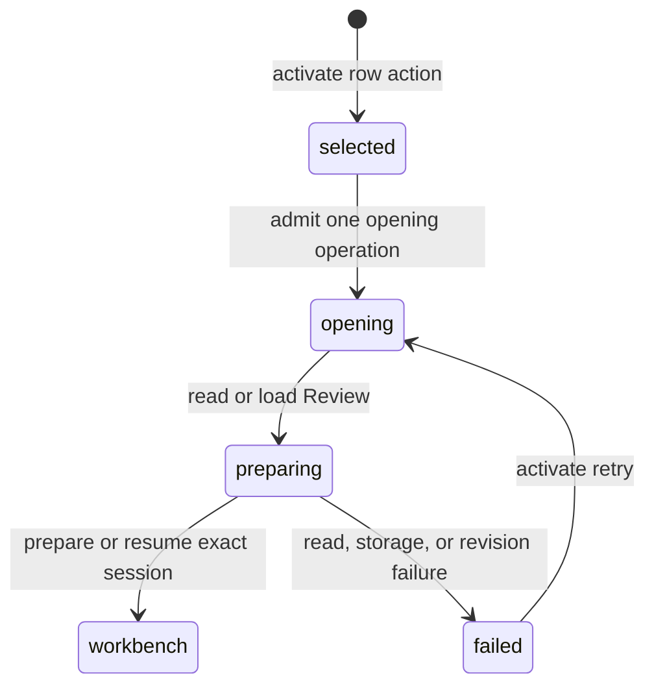

# Opening a Review

## Summary

Opening a Review turns one Pull requests row into a readable Review workbench. The maintainer can start a new Review, load a saved Review session, or view a merged pull request. Patchdesk reads and prepares an immutable represented revision, local context, checks, comments, and diff before changing screens. Opening is read-only and performs no GitHub write.

## The simple case

The maintainer opens a row from its title, a double-click on the row, Enter on the focused row, the inspector's Open button, or the command palette. A pull request can also be opened without finding its row, by pasting its GitHub link anywhere on the Pull requests screen outside a text field. A single row click only selects. Patchdesk shows Opening… and a shared Opening Review… busy indicator. It reads the pull request and prepares or resumes the Review session for the exact revision.

When preparation succeeds, the app navigates to the keyed Review workbench. The workbench receives the pull-request context, represented revision, diff, checks, comments, and any retained Insights. If a saved Review cannot be loaded, Patchdesk retries by Pull request identity so a missing local record can be healed.

## The task, event by event

### Arrive

The row supplies profile, host, owner, repository, and pull-request number, and one Open action serves every row state. An unreviewed row opens as a new Review. A row with a saved Review loads that saved Review ID first. A merged row uses the terminal-only opening path. The app retains the row identity while the request runs.

A pasted link supplies the same identity without a row. Patchdesk reads the pasted text, keeps it only if it names one pull request, and checks that identity against the active profile's watched repositories before anything is opened. An accepted paste opens as a new Review under the same operation owner the row uses, so a pull request already opening is not opened a second time.

### Leave unchanged

Selecting a row, reading its inspector, or opening the details panel does not prepare a Review. No session, worktree, or GitHub write is created by inspection alone. A duplicate activation of the same row in the same event turn is ignored.

### Begin an action

The first accepted activation marks that row busy, records its Opening… state, clears prior opening feedback, and starts the corresponding local API request. Saved-review opening first requests the durable Review projection. New and merged openings send the Pull request identity; merged opening also asserts the terminal-only path.

The main process resolves the profile, reads current pull-request identity and revision evidence, and either resumes the matching session or begins preparation for a new one. The session ID includes the profile, repository, pull-request number, head, base, and revision identity.

### While the action runs

Opening reads the pull request again at preparation checkpoints. It obtains comments, checks, and diff data, writes the represented patch and prepared context, and prepares a managed worktree when the watched repository has a local path. Without a usable local checkout, the workbench can use a GitHub snapshot and names the local-checkout limitation.

Preparation rechecks the pull request and revision before committing the session. A changed head, changed terminal state, unavailable GitHub read, storage failure, worktree failure, or context failure prevents a partial session from being adopted. The operation is serialized for the profile and session identity, and its journal can recover an interrupted preparation.

The row and inspector show Opening… only for that row. Other rows can be opened concurrently, each with its own operation state. The shared busy indicator remains until every tracked opening settles.

### Settle

A successful preparation commits the Review session and enters its Review workbench. A saved session reports resumed behavior to the workbench; a new session has the freshly prepared represented revision. The Pull requests screen records a short Review opened notice when it remains mounted.

A failed opening clears the row's busy state and shows `Could not open review` with the preparation reason. Loading a saved Review can fall back to `/v1/reviews/open` by row identity. If both load and fallback fail, the row remains in the listing and no workbench is opened. An invalid workbench projection is treated as failure rather than navigating to an unvalidated screen.

## Variants

| Variant | Before the action runs | While the action runs |
| --- | --- | --- |
| Workspace profile and GitHub account | The active profile supplies identity, host, roots, and optional local checkout. | Preparation stays under that profile's lock; a profile switch cannot adopt its late result. |
| Pull request and Review state | Unreviewed, saved-review, updated-review, and merged rows choose different opening routes. | New preparation pins one exact revision. Merged opening requires the pull request to remain non-open through final checks. |
| GitHub permissions and merge readiness | Opening is read-only and does not require merge readiness. | GitHub authentication, read, or permission failures stop preparation; no write is attempted. |
| Network, local tool, and Insight provider availability | A local checkout enables worktree mode; otherwise a snapshot mode may be used. Insights are retained if available but are not required to open. | GitHub reads, local Git preparation, storage, and context generation can fail independently; the opening settles with a named failure. |
| Input path: mouse, keyboard, or desktop menu | The row title, a double-click, Enter, the inspector's Open button, the command palette, and a pasted pull-request link use the same operation owner; a single row click only selects, and a paste into a text field stays an ordinary paste. | The row-local busy state and its feedback apply across entry points, including for a pull request opened from a pasted link that a listed row also names. |

The chosen opening route is fixed at admission. A remote change discovered during preparation does not silently switch a normal opening into a merged opening or adopt a different head.

## Cancel and interrupt

| Event | Before the action runs | While the action runs |
| --- | --- | --- |
| Cancel, Stop, or Escape | Escape or leaving the row unactivated makes no change. | No row Stop control is provided. Preparation must settle or fail safely; its journal handles interruption. |
| Navigate to another Patchdesk screen, Review, Settings section, or workspace profile | Clean navigation can leave the listing. | Navigation and profile-switch guards apply; an inactive or superseded opening cannot navigate to a workbench. |
| Start another action or request a refresh | Another row can be selected without opening the first. | Different rows can prepare concurrently. The same row and saved Review key admit only one pending opening. Refresh can replace the listing while preparation continues. |
| GitHub, the network, a local tool, or an Insight provider fails or times out | No preparation starts until the action is accepted. | The operation reports a read, authentication, storage, worktree, or revision failure. A later explicit activation can retry a confirmed failure. |
| Close Settings, reload the renderer, close the window, or quit Patchdesk | No durable work exists before activation. | The preparation journal protects partial files and worktrees; the renderer does not promise to keep its Opening… label after reload. |
| The pull request, represented revision, pending review, permission, or other target changes elsewhere | The row's revision is only last-known listing evidence. | A head or state change aborts adoption. The old session remains unchanged and the new revision must be opened explicitly. |
| macOS focus, a file or folder picker, or another input path takes control | Focus changes without activation have no effect. | Focus loss does not authorize or cancel preparation; native input belongs to the workbench only after navigation. |

After failure, no partially prepared session is presented as current. Recovery removes or quarantines incomplete artifacts as required, and the row remains available for a fresh explicit attempt.

## Interactions with other systems

**Workspace profile and identity.** Opening validates the profile and Pull request identity before preparing a session.

**Review revision and freshness.** The opening workflow creates or resumes one Review session for one represented revision; later refresh owns revision changes.

**Local persistence and recovery.** Journals record prepared artifacts and worktrees until a session commits. Interrupted preparation is recoverable rather than silently adopted.

**GitHub permissions and write authority.** Opening performs reads only. Review and merge writes require separate workbench actions and current evidence.

**Network, local tools, and Insight providers.** GitHub supplies remote context; local Git can provide a managed worktree; Insights are optional retained workbench content.

**Concurrent operations and locking.** Profile and session locks serialize conflicting preparation. Renderer operation keys isolate rows and reject duplicate same-row requests.

**Feedback, errors, and diagnostics.** Opening progress is row-local plus shared busy feedback. Failures name the affected repository and pull request without exposing credentials.

**Preferences, keyboard commands, and desktop integration.** Keyboard and command-palette entry points use the same opening behavior. Successful navigation becomes the Review workbench destination.

**Supported input and accessibility limits.** Mouse and keyboard activation are supported. Touch, pen, and screen-reader behavior are outside the product claim.

## Edge cases

- A pasted link to a repository outside the active profile's watchlist is refused, in the same place a failed opening is reported, with `Not opened: owner/repo is not a watched repository.` No request is sent and no offer to add the repository is made.
- Pasted text that does not name a pull request is left alone: nothing is opened, no message is shown, and the paste behaves as it always did.
- A saved Review load failure can fall back to opening by Pull request identity.
- A merged row uses a terminal-only route and refuses adoption if any final state read says it is open.
- A saved session at the exact current revision resumes; a new revision creates a different session rather than mutating the old one.
- The canonical patch identity is based on GitHub's compare rendering; local rendering is not allowed to prove revision identity.
- A watched repository without a usable local checkout can still open in metadata-only or snapshot mode with a visible limitation.
- A malformed workbench response does not navigate.
- A missing or invalid saved Review does not erase the Pull request row.
- Opening one row leaves unrelated rows interactive, but the busy row's title, double-click, and inspector Open button are inert.
- A failure after partial preparation is cleaned through the journal before the operation settles.
- A stale listing can still be readable while opening performs its own current reads and may reject the target.

## Open questions and verification

- Live desktop verification is pending; no CDP pass was run for this document.
- Confirm Opening… focus and the busy indicator when opening from the row, inspector, keyboard, and command palette.
- Confirm the visible difference between resumed and newly prepared sessions.
- Confirm the metadata-only warning when a watched repository has no usable local checkout.
- Confirm the error and retry experience after a saved-review load fails and identity fallback also fails.
- Confirm cleanup and visible behavior when preparation sees a changed head between its first and final reads.

Verified against Patchdesk application source commit `3100615`; scoped select-then-open entry points and single Open action behavior updated through `838a47e`.
