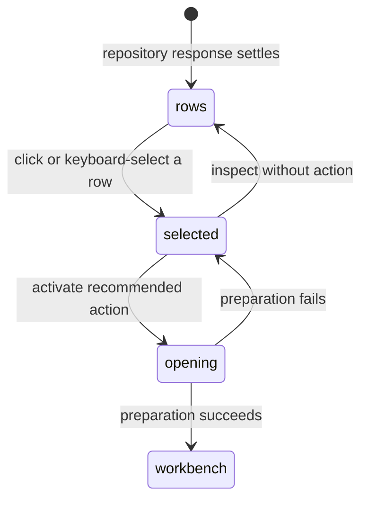

# The repository listing

## Summary

The repository listing is the Pull requests screen's GitHub-ordered page of pull-request rows for the Selected repository. Each row shows the pull request's identity, title, labels, author, branch direction, change size, CI state, update time, Review indicators, and one recommended action. Patchdesk adds local Review context but does not reorder or re-count GitHub's result.

## The simple case

The maintainer scans the rows from GitHub. A row names its pull request number and title, shows Draft or Merged when applicable, and provides labels, author, changed files, additions, deletions, checks, and relative update time. Selecting a row opens its Review details inspector, which gives the exact head, checks, Review status, and primary action.

Rows that have never been reviewed offer Run review. A row with a saved Review whose head changed offers Open Review so the maintainer can inspect the existing represented revision and refresh it. A merged row offers View merged pull request. Ready-to-merge is a category derived from fresh, passing, mergeable evidence. A matching current Review remains the primary Open Review action, and the row separately exposes read-only Open merge readiness when the readiness evidence is fresh.

## The task, event by event

### Arrive

The listing receives one page already filtered and ordered by GitHub. The header and filter bar identify the Selected repository and current query. The row list is a keyboard-operable listbox; the selected row is highlighted and the Review details inspector is open by default when the viewport allows it.

Rows show the title and number, author, labels, Draft or Merged badge, Brief badge when a retained Brief exists for the current head, change statistics, CI icon, and relative update age. Missing change statistics show an em dash rather than a fabricated zero. The inspector adds branch direction, current head, checks, labels, last-review head, and local Review status.

### Leave unchanged

Reading a row, opening the inspector, or moving selection does not write to GitHub. Arrow keys move selection and focus; Tab does not step through every row. Closing or hiding the inspector changes only local presentation preference.

### Begin an action

Clicking a row selects it and activates its recommended action. Enter activates the selected row. The inspector's primary button and the command-palette Open selected pull request command use the same action owner.

The action is selected from the row's remote state, Review summary, categories, and listing freshness. Merged rows go to terminal-only opening. A saved Review ID is loaded when available; an unreviewed row is prepared as a new Review.

### While the action runs

The active row is disabled and says Opening…; the inspector button and shared busy indicator show the same progress. Other rows remain interactive, and each row has its own opening state. A repeated activation for the same row is ignored while its operation is pending.

The row's indicators remain read-only facts from the settled listing. A cached listing can show local content but strips merge-readiness actions, because cache data cannot make a current merge-shaped claim. Forbidden and rate-limited repository outcomes show corrective copy without a retry button.

### Settle

A successful opening enters the keyed Review workbench. A failure leaves the row selected, re-enables it, and shows `Could not open review` with the local reason. A saved-review load failure can fall back to opening by the row's Pull request identity, which heals a missing or obsolete local record.

Merged rows remain readable through the terminal-only route. They do not enter active-work categories, and the listing does not turn them into merge or Review-write targets.

## Variants

| Variant                                                | Before the action runs                                                                                               | While the action runs                                                                                                                        |
| ------------------------------------------------------ | -------------------------------------------------------------------------------------------------------------------- | -------------------------------------------------------------------------------------------------------------------------------------------- |
| Workspace profile and GitHub account                   | Rows and local Review indicators are scoped to the active profile and Selected repository.                           | The opening request carries the active profile identity and cannot be replaced by another profile's late result.                             |
| Pull request and Review state                          | Open, merged, draft, current-review, updated-review, and unreviewed states change badges and recommended action.     | The selected row keeps its settled indicators while Review preparation pins its own revision.                                                |
| GitHub permissions and merge readiness                 | Mergeability and checks contribute to the Ready to merge category; they do not make listing read-only rows writable. | Read/auth failures stop preparation; opening itself never performs a GitHub write.                                                           |
| Network, local tool, and Insight provider availability | A row can show local indicators without an Insight provider.                                                         | Preparation may use GitHub, local checkout tools, and storage; a failure is row-local and retryable through another activation when allowed. |
| Input path: mouse, keyboard, or desktop menu           | Mouse, Arrow keys + Enter, inspector button, and command palette reach the same row action.                          | The row-local disabled state applies regardless of input path.                                                                               |

The row action is computed at listing time. A remote change after the list settles is handled by opening and Review freshness, not by silently rewriting the old row.

## Cancel and interrupt

| Event                                                                                                 | Before the action runs                                                 | While the action runs                                                                                                                 |
| ----------------------------------------------------------------------------------------------------- | ---------------------------------------------------------------------- | ------------------------------------------------------------------------------------------------------------------------------------- |
| Cancel, Stop, or Escape                                                                               | Escape or moving away without activation leaves the listing unchanged. | There is no row-level Stop control; the preparation settles or fails.                                                                 |
| Navigate to another Patchdesk screen, Review, Settings section, or workspace profile                  | Selection and inspector state can be left without a write.             | Navigation follows the Review workbench and pending-operation guard; a late opening result cannot land against an inactive request.   |
| Start another action or request a refresh                                                             | Selecting another row changes local selection only.                    | Different rows can prepare concurrently; the same row cannot be opened twice. Refresh creates a newer listing and may remove the row. |
| GitHub, the network, a local tool, or an Insight provider fails or times out                          | Indicators remain last-known until a new read.                         | The row shows an action-local failure. Repository-level forbidden and rate-limited reads have no immediate retry affordance.          |
| Close Settings, reload the renderer, close the window, or quit Patchdesk                              | Clean listing state can be restored from preferences.                  | In-flight preparation follows the normal window/write safety rules; row progress itself is not durable.                               |
| The pull request, represented revision, pending review, permission, or other target changes elsewhere | Row indicators describe the last settled listing.                      | Preparation rechecks identity and revision and can refuse adoption when the head or remote state changes.                             |
| macOS focus, a file or folder picker, or another input path takes control                             | Focus changes without activation have no effect.                       | Focus loss does not authorize or cancel Review preparation.                                                                           |

After a row-open failure, the row remains inspectable and can be activated again when the underlying failure is retryable. A successful opening leaves the listing for the Review workbench.

## Interactions with other systems

**Workspace profile and identity.** Profile and repository identity scope every row and local Review lookup.

**Review revision and freshness.** Row freshness is a listing fact. The Review workbench owns represented revisions and refresh transitions.

**Local persistence and recovery.** Selected row and inspector state are local preferences. Review sessions and preparation artifacts are durable only after the opening workflow commits them.

**GitHub permissions and write authority.** Listing rows are read-only. Checks and mergeability inform indicators but never authorize a write.

**Network, local tools, and Insight providers.** GitHub supplies row data; local sessions supply Review and Brief indicators. Insight availability affects only whether the Brief badge can appear.

**Concurrent operations and locking.** Row openings are keyed by stable row identity. The inbox refresh coordinator separates reads by all query fields and page token.

**Feedback, errors, and diagnostics.** Badges, icons, inspector details, opening progress, and action-local errors describe the row without exposing raw API details.

**Preferences, keyboard commands, and desktop integration.** Selection, inspector visibility, and selected identity persist per profile. Arrow keys, Enter, and command palette activation are supported.

**Supported input and accessibility limits.** Keyboard and mouse row navigation are supported. Touch, pen, and screen-reader behavior are outside the product claim.

## Edge cases

- A row with no change statistics shows an em dash, not zero.
- Labels are shown from GitHub; a Brief badge appears only for a retained Brief bound to the current head.
- Merged rows show Merged and View merged pull request and have no active-work category.
- The Updated since review indicator can coexist with an Open Review action because it opens the prior represented session before refresh.
- Ready to merge requires Fresh listing data, a current saved Review, mergeable state, and passing checks.
- A ready row keeps Open Review as its primary action and separately exposes read-only Open merge readiness only from fresh evidence. Cached rows omit that secondary action.
- A selected row disappears after a filter or refresh; the inspector then falls back to the next available row or its empty prompt.
- Opening one row does not disable unrelated rows.
- A saved Review may be missing or obsolete; opening can recover by Pull request identity.
- Rate-limited and forbidden repository outcomes are explanatory and do not offer a retry button.

## Open questions and verification

- Live desktop verification is pending; no CDP pass was run for this document.
- Confirm row selection, inspector focus, and Arrow key wrapping in a real window.
- Confirm the exact visible behavior when a selected row disappears during refresh.
- Confirm which cached listing actions remain available in the running workbench.

Baseline drafted from Patchdesk application source commit `3100615`; follow-up behavior updated and verified through `c49045d`.
