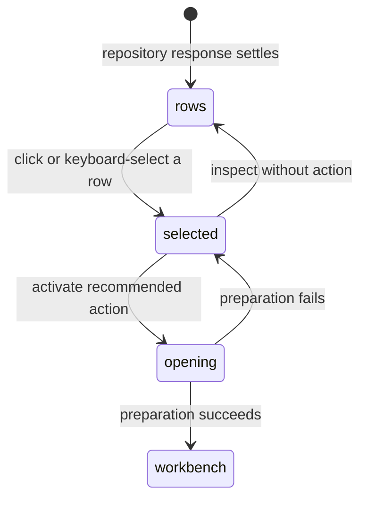

# The repository listing

## Summary

The repository listing is the Pull requests screen's GitHub-ordered page of pull-request rows for the Selected repository. Each row shows the pull request's identity, title, labels, author, branch direction, change size, CI state, update time, and Review indicators; the Review details inspector adds an Insights line and one Open action. Patchdesk adds local Review context but does not reorder or re-count GitHub's result.

## The simple case

The maintainer scans the rows from GitHub. A row names its pull request number and title, shows Draft or Merged when applicable, and provides labels, author, changed files, additions, deletions, checks, and relative update time. Selecting a row shows it in the Review details inspector, which leads with the row's Review status and then gives its facts, scope, labels, Insights, and one Open action.

The Insights line shows one read-only chip per Insight, Brief, Analysis, and Walkthrough, reading Ready when Patchdesk retains that Insight for the row's current head, Outdated when it is retained for an earlier head, and Not run otherwise. Insights run from the Review workbench, where their results are read; the inspector does not start them.

Below the Insights line, **Watch** asks Patchdesk to watch an open pull request (ADR 0045); the button then reads **Unwatch**. A watched row carries an eye mark beside its badges, and so does its row in the [Visited pull requests](../foundations/visited-pull-requests.md) column. The inspector hides Watch for a merged pull request. The Review header offers the same toggle on an open Review, and the ⌘K palette offers Watch or Unwatch for a pull request reference typed into it. If the palette resolves a merged or closed pull request, Patchdesk refuses the watch and names that state. Watching reads the pull request once from GitHub and changes nothing there. A workspace watches at most 20 pull requests; a 21st Watch is refused with that limit named beside the button.

While Patchdesk runs it checks watched pull requests on the interval set in Settings → General → Notifications and posts one macOS notification per change: a new comment or review, a changed review decision, changed checks, new commits, or the pull request merging or closing, after which it is no longer watched. If GitHub cannot read one watch, the other watches in the same check continue and the inaccessible watch remains for the next interval. A change also puts a dot on the **GitHub:** freshness badge until the next refresh; the rows themselves still change only when you refresh. No notification is posted while the pull request's Review is open in the workbench. Clicking one opens the pull request the way pasting it into the palette does.

Every row opens through the same single Open action. What opening does depends on the row's state: a row that has never been reviewed has a new Review prepared for its current head, a row with a saved Review resumes that Review, and a merged row opens read-only. Ready to merge remains a category derived from fresh, passing, mergeable evidence, but it is not an action. The inspector shows that evidence among the row's facts, and merge readiness itself is reached from PR overview inside the Review workbench.

## The task, event by event

### Arrive

The listing receives one page already filtered and ordered by GitHub. The header and filter bar identify the Selected repository and current query. The row list is a keyboard-operable listbox; the selected row is highlighted and the Review details inspector is open by default when the viewport allows it.

Rows show the title and number, author, labels, Draft or Merged badge, Brief badge when a retained Brief exists for the current head, change statistics, CI icon, and relative update age. The CI icon and the inspector's checks fact read **No checks** when GitHub reports no checks on the head, and **Unknown** only when Patchdesk could not read or classify them. The author appears with their GitHub avatar when Patchdesk holds it in the local avatar cache, and with an initials circle otherwise. Missing change statistics show an em dash rather than a fabricated zero. A row whose head moved since the maintainer last left its Review shows a **New** mark; new comments, reviews, labels, and checks alone do not light it, and a pull request never left in a Review shows none. The inspector adds branch direction, current head, checks, labels, Insight readiness chips, last-review head, and local Review status.

### Leave unchanged

Reading a row, opening the inspector, or moving selection does not write to GitHub. Arrow keys move selection and focus; Tab does not step through every row. Closing or hiding the inspector changes only local presentation preference. The inspector toggle at the end of the filter bar shows a panel icon and a tooltip naming its action, Hide review details or Show review details.

### Begin an action

Clicking a row selects it and shows it in the inspector; it does not open anything. Opening starts from the row title, which is styled as a link on hover and carries the full title as a tooltip, from a double-click anywhere on the row, from Enter on the focused row, from the inspector's Open button, or from the command-palette Open selected pull request command. They all use the same action owner.

The opening route is selected from the row's remote state and Review summary. Merged rows go to terminal-only opening. A saved Review ID is loaded when available; an unreviewed row is prepared as a new Review.

### While the action runs

The active row is marked busy and says Opening…; its title and its double-click are inert, and the inspector button and shared busy indicator show the same progress. Other rows remain interactive, and each row has its own opening state. A repeated activation for the same row is ignored while its operation is pending.

The row's indicators remain read-only facts from the settled listing. A cached listing can show local content, and the inspector says the GitHub data is cached, because cache data cannot make a current merge-shaped claim. Forbidden and rate-limited repository outcomes show corrective copy without a retry button.

### Settle

A successful opening enters the keyed Review workbench. A failure leaves the row selected, clears its busy state, and shows `Could not open review` with the local reason. [Opening a Review](opening-a-review.md#settle) owns the other outcomes, including the quiet launch restore. A saved-review load failure can fall back to opening by the row's Pull request identity, which heals a missing or obsolete local record.

Merged rows remain readable through the terminal-only route. They do not enter active-work categories, and the listing does not turn them into merge or Review-write targets.

## Variants

| Variant                                                | Before the action runs                                                                                                                                              | While the action runs                                                                                                                        |
| ------------------------------------------------------ | ------------------------------------------------------------------------------------------------------------------------------------------------------------------- | -------------------------------------------------------------------------------------------------------------------------------------------- |
| Workspace profile and GitHub account                   | Rows and local Review indicators are scoped to the active profile and Selected repository.                                                                          | The opening request carries the active profile identity and cannot be replaced by another profile's late result.                             |
| Pull request and Review state                          | Open, merged, draft, current-review, updated-review, and unreviewed states change badges, icon colour, and what opening does.                                       | The selected row keeps its settled indicators while Review preparation pins its own revision.                                                |
| GitHub permissions and merge readiness                 | Mergeability and checks contribute to the Ready to merge category; they do not make listing read-only rows writable.                                                | Read/auth failures stop preparation; opening itself never performs a GitHub write.                                                           |
| Network, local tool, and Insight provider availability | A row can show local indicators without an Insight provider.                                                                                                        | Preparation may use GitHub, local checkout tools, and storage; a failure is row-local and retryable through another activation when allowed. |
| Input path: mouse, keyboard, or desktop menu           | A single click only selects. The row title, a double-click, Arrow keys + Enter, the inspector's Open button, and the command palette all reach the same row action. | The row-local busy state applies regardless of input path.                                                                                   |

The opening route is computed at listing time. A remote change after the list settles is handled by opening and Review freshness, not by silently rewriting the old row.

## Cancel and interrupt

| Event                                                                                                 | Before the action runs                                                 | While the action runs                                                                                                                 |
| ----------------------------------------------------------------------------------------------------- | ---------------------------------------------------------------------- | ------------------------------------------------------------------------------------------------------------------------------------- |
| Cancel, Stop, or Escape                                                                               | Escape or moving away without activation leaves the listing unchanged. | There is no row-level Stop control; the preparation settles or fails.                                                                 |
| Navigate to another Patchdesk screen, Review, Settings section, or workspace profile                  | Selection and inspector state can be left without a write.             | Navigation follows the Review workbench and pending-operation guard; a late opening result cannot land against an inactive request.   |
| Start another action or request a refresh                                                             | Selecting another row changes local selection only.                    | Different rows can prepare concurrently; the same row cannot be opened twice. Refresh creates a newer listing and may remove the row. |
| GitHub, the network, a local tool, or an Insight provider fails or times out                          | Indicators remain last-known until a new read.                         | The row shows an action-local failure. Repository-level forbidden and rate-limited reads have no immediate retry affordance.          |
| Close Settings, reload the renderer, close the window, or quit Patchdesk                              | Clean listing state can be restored from preferences.                  | In-flight preparation follows the normal window/write safety rules; row progress itself is not durable.                               |
| The pull request, represented revision, pending review, permission, or other target changes elsewhere | Row indicators describe the last settled listing.                      | Preparation rechecks identity and revision and can refuse adoption when the head or remote state changes.                             |
| macOS focus, a file or folder picker, or another input path takes control                             | Focus changes without activation have no effect.                       | Focus loss does not authorize or cancel Review preparation.                                                                           |

After a row-open failure, the row remains inspectable and can be activated again when the underlying failure is retryable. A successful opening leaves the listing for the Review workbench.

## Interactions with other systems

**Workspace profile and identity.** Profile and repository identity scope every row and local Review lookup.

**Review revision and freshness.** Row freshness is a listing fact. The Review workbench owns represented revisions and refresh transitions.

**Local persistence and recovery.** Selected row and inspector state are local preferences. Review sessions and preparation artifacts are durable only after the opening workflow commits them. A row opened successfully appears at the top of the [Visited pull requests column](../foundations/visited-pull-requests.md), which reopens that Review without its listing row.

**GitHub permissions and write authority.** Listing rows are read-only. Checks and mergeability inform indicators but never authorize a write.

**Network, local tools, and Insight providers.** GitHub supplies row data; local sessions supply Review and Brief indicators. Insight availability affects only whether the Brief badge can appear.

**Concurrent operations and locking.** Row openings are keyed by stable row identity. The inbox refresh coordinator separates reads by all query fields and page token.

**Feedback, errors, and diagnostics.** Badges, icons, inspector details, opening progress, and action-local errors describe the row without exposing raw API details.

**Preferences, keyboard commands, and desktop integration.** Selection, inspector visibility, and selected identity persist per profile. Arrow keys, Enter, and command palette activation are supported.

**Supported input and accessibility limits.** Keyboard and mouse row navigation are supported. Touch, pen, and screen-reader behavior are outside the product claim.

## Edge cases

- A row with no change statistics shows an em dash, not zero.
- Labels are shown from GitHub; a Brief badge appears only for a retained Brief bound to the current head.
- Merged rows show a Merged badge, the inspector's status card says Merged, and they have no active-work category.
- The Updated since review indicator sits with the inspector's Updates available status, which names the reviewed head and the current head, because opening resumes the prior represented session before refresh.
- Ready to merge requires Fresh listing data, a current saved Review, mergeable state, and passing checks.
- A ready row shows its Ready to merge evidence among the inspector's facts and opens like any other row. A cached row shows the cached-data notice instead, because a cache cannot make a current merge-shaped claim.
- The pull-request icon at the start of a row is coloured by state: green for an open pull request, muted for a draft, and the primary colour for a merged one.
- The inspector's Scope row appears only when a retained Review supplies scope. It shows the gauge above a legend naming each bucket and its file count.
- A row whose head moved since its Insight ran reads Outdated until the Review is opened and the Insight is run again.
- A selected row disappears after a filter or refresh; the inspector then falls back to the next available row or its empty prompt.
- Opening one row leaves unrelated rows interactive.
- A saved Review may be missing or obsolete; opening can recover by Pull request identity.
- Rate-limited and forbidden repository outcomes are explanatory and do not offer a retry button.
- Watching a pull request whose repository later leaves the workspace keeps it watched; the check reads the pull request by reference.
- A Watch refused by GitHub, such as for a pull request the account cannot read, leaves the button on Watch with a short error beside it.

## Open questions and verification

- Live pass on 2026-09-14 confirmed the inspector's Insights line and the Scope gauge with bucket counts. The Request buttons it also saw were removed with [#351](https://github.com/kwanpham2195/patchdesk/issues/351).
- Confirm row selection, inspector focus, and Arrow key wrapping in a real window.
- Confirm the exact visible behavior when a selected row disappears during refresh.
- Confirm which cached listing actions remain available in the running workbench.
- Confirm the title hover affordance, double-click, and Enter each open exactly once in a real window.

Baseline drafted from Patchdesk application source commit `3100615`; verified against `737c515c`.
