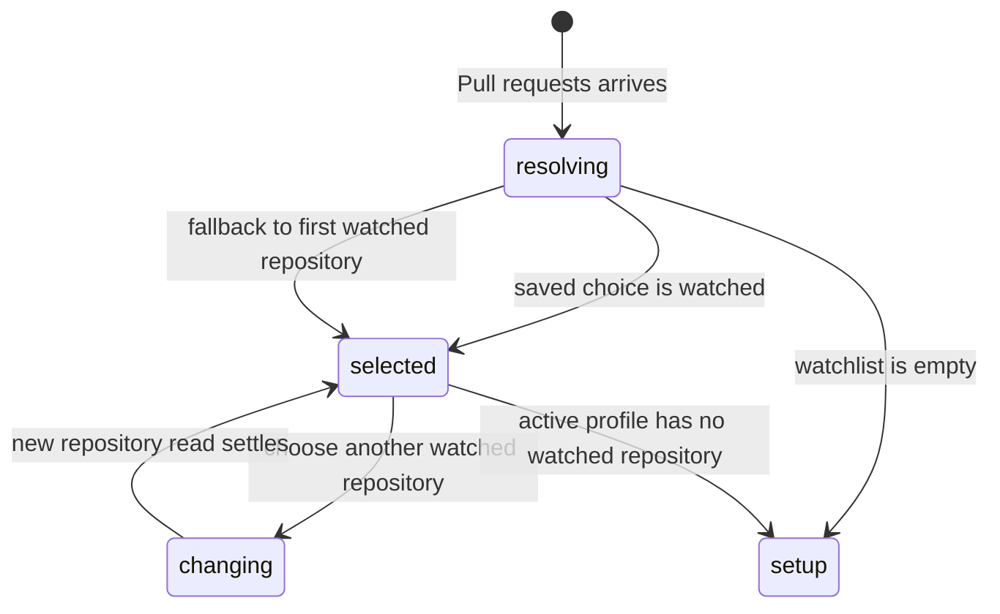

# The Selected repository

## Summary

The Selected repository is the Pull requests screen's single repository scope. The maintainer chooses one watched repository from the profile's watchlist, and every state filter, label filter, count, page, refresh, and row action applies to that repository. The choice is available in the Pull requests header whenever the active profile has at least one watched repository.

## The simple case

After the active profile loads, Patchdesk restores that profile's last Selected repository when it is still watched. If the saved choice is missing or no longer watched, the first watched repository becomes selected. The header names the repository, and its GitHub pull requests load one page at a time.

The maintainer opens the repository picker and chooses another watched repository. Patchdesk clears the old repository's label filter, resets pagination, and reads the new repository. The selection is saved per profile. A profile with no watched repositories hides the picker and shows the first-run setup path instead.

## The task, event by event

### Arrive

The active profile determines the watchlist. The picker lists each watched repository as `owner/repository`, including a profile with exactly one repository so the screen's scope remains visible. A saved choice is used only if its host, owner, and repository identity still appears in the current watchlist.

The initial request leaves the repository out until the renderer has learned the active profile's watchlist. The local service resolves the active profile and falls back to its first watched repository for that bootstrap request. Later requests send the Selected repository explicitly.

### Leave unchanged

Opening the picker and closing it without choosing a different item changes nothing. Choosing the already selected repository is a no-op. Reading rows, selecting a row for inspection, or opening a Review does not change the Selected repository.

### Begin an action

Choosing a different repository immediately changes the header selection and starts a read for that repository. The page cursor and selected labels are cleared because they belong to the former repository. The `Awaiting review from you` preset, state filter, and rows-per-page choice carry over.

The selection is saved under the active profile before the new read settles. A repository removed in Settings is reconciled to the first remaining watched repository, or to no repository when the watchlist becomes empty.

### While the action runs

The filter bar reflects the requested repository while the row list holds a loading state. Previous rows are not presented as rows from the new repository. The local API rejects a repository that is not in the active profile's watchlist before attempting a GitHub read.

The picker remains a local scope control. A failed read leaves the last confirmed content or the appropriate repository error visible; it does not silently select an unwatched repository. A profile switch clears the workbench and returns the Pull requests screen to that profile's repository resolution.

### Settle

A successful read shows the new repository's rows, GitHub freshness, count, filters, and page controls. The new choice remains selected after reload for that profile. Changing back to the earlier repository restores that profile's stored repository choice only if it is still watched.

If the watchlist is empty, the picker disappears and the Pull requests screen uses the first-run setup card. Existing Review data is not deleted when a repository leaves the watchlist.

## Variants

| Variant | Before the action runs | While the action runs |
| --- | --- | --- |
| Workspace profile and GitHub account | The active profile owns the watchlist and its per-profile Selected repository preference. | A profile switch invalidates the old repository scope and resolves the new profile's choice after reload. |
| Pull request and Review state | The picker selects repository scope, not a Pull request or Review. | Existing row or Review state is not reused under the new repository. |
| GitHub permissions and merge readiness | Selection does not require merge permission. | Permission failures belong to the repository read; they do not make an unwatched repository selectable. |
| Network, local tool, and Insight provider availability | The picker and saved preference are local. Loading rows still needs GitHub access. | A failed read preserves the local selection and reports the repository read outcome; Insights do not run. |
| Input path: mouse, keyboard, or desktop menu | Mouse and keyboard can open the same repository picker; Pull requests navigation can also be reached from the desktop menu. | The selected identity and reset behavior are the same for every input path. |

Changing repository scope does not carry over labels or a page token, but it does carry the state filter, page size, and Awaiting review from you preference.

## Cancel and interrupt

| Event | Before the action runs | While the action runs |
| --- | --- | --- |
| Cancel, Stop, or Escape | Closing the picker without a choice leaves the current selection unchanged. | There is no repository-read Stop control; the loading read settles or is superseded. |
| Navigate to another Patchdesk screen, Review, Settings section, or workspace profile | Clean navigation proceeds. A profile switch uses the normal profile-switch guard. | Navigation does not turn old rows into new scope; a successful profile switch resets the screen. |
| Start another action or request a refresh | Opening a row or refreshing acts on the current repository. | A newer repository choice owns the request; an older response cannot replace it. Refresh uses the latest request. |
| GitHub, the network, a local tool, or an Insight provider fails or times out | A saved selection can still be displayed without a successful current read. | The read reports authentication, forbidden, rate-limit, or temporary failure for the selected repository. |
| Close Settings, reload the renderer, close the window, or quit Patchdesk | The per-profile selection is local view state and can be restored after relaunch. | In-flight rows and filter state are not durable operation work; the next load resolves from saved preferences and the current watchlist. |
| The pull request, represented revision, pending review, permission, or other target changes elsewhere | A repository choice does not pin a Pull request revision. | Remote changes affect row freshness and actions, not which watched repository is selected. |
| macOS focus, a file or folder picker, or another input path takes control | Focus leaving the picker without a selection has no effect. | Focus loss does not change the selected identity or cancel its read. |

After a failed or superseded read, the active scope remains the last requested watched repository. A removed repository is repaired by watchlist reconciliation rather than sent to the server as an invalid target.

## Interactions with other systems

**Workspace profile and identity.** The picker reads only the active profile's watched repositories and saves the choice per profile.

**Review revision and freshness.** Repository selection chooses the source scope; freshness and represented-revision rules belong to the resulting rows and Review workbench.

**Local persistence and recovery.** The selected repository is presentation preference. It can fall back safely when malformed or no longer watched; Review history remains separate local data.

**GitHub permissions and write authority.** Selection performs no GitHub write and does not imply permission to review or merge.

**Network, local tools, and Insight providers.** Only the repository read needs GitHub. Local tools and Insight providers have no role in choosing the scope.

**Concurrent operations and locking.** Matching reads can coalesce in the refresh coordinator. Renderer generations prevent an older repository response from landing against a newer selection.

**Feedback, errors, and diagnostics.** The header keeps the scope visible while row-level or repository-level read feedback explains failures.

**Preferences, keyboard commands, and desktop integration.** The profile-scoped choice restores on later visits; desktop navigation reaches the same Pull requests owner.

**Supported input and accessibility limits.** Keyboard and mouse selection are supported. Touch, pen, and screen-reader behavior are outside the product claim.

## Edge cases

- A profile with one watched repository still shows the repository picker.
- An empty watchlist hides the picker and routes the screen to first-run setup.
- A stored repository no longer in the watchlist falls back to the first watched repository.
- An empty watchlist resolves to no repository and does not make a repository GitHub call.
- A repository change clears labels and the page cursor but preserves state, page size, and Awaiting review from you.
- A local profile edit can remove the selected repository while a read is in flight; reconciliation selects a valid replacement before sending the next request.
- A repository outside the active watchlist is rejected even if the GitHub account can access it.
- Host is part of repository identity, so the same owner/name on two GitHub hosts are different choices.

## Open questions and verification

- Live desktop verification is pending; no CDP pass was run for this document.
- Confirm picker focus and the visible loading transition when changing between two watched repositories.
- Confirm the exact restore when a selected repository is removed in Settings while Pull requests is visible.
- Confirm whether a failed new-repository read should retain the requested picker value or visibly revert to the previous confirmed value.

Verified against Patchdesk application source commit `3100615`.
