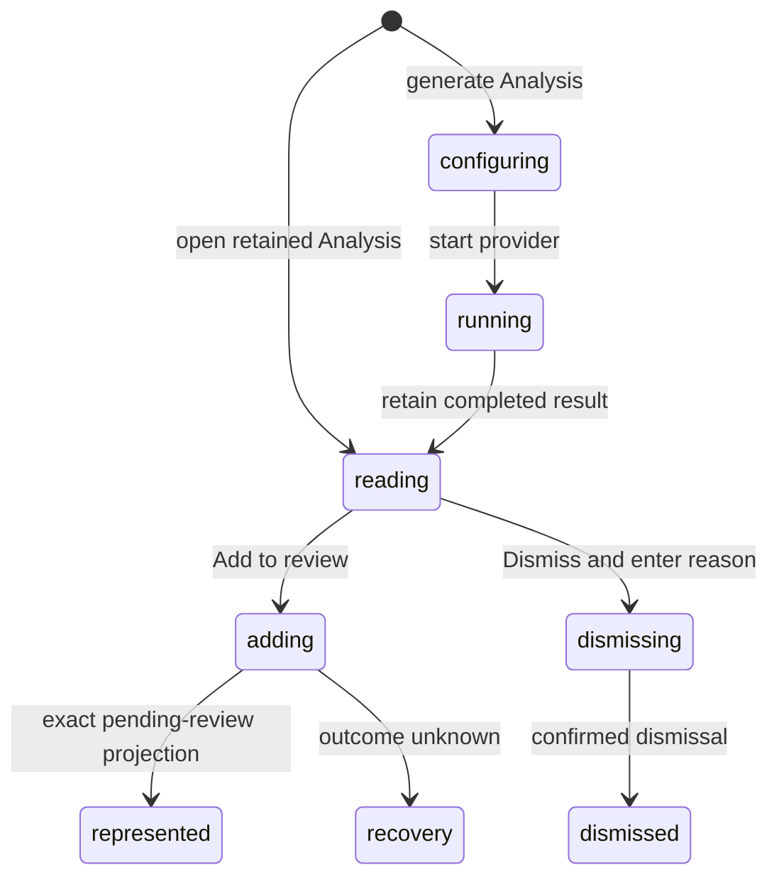

# Analysis

## Summary

Analysis presents a model-backed review of the represented patch as generated prose, Findings, mapped evidence, supporting details, and an optional review summary. The maintainer reaches it in Insights. Reading is always separate from acting: a Finding reaches GitHub only after the maintainer explicitly adds its suggested comment to the pending review, and a Finding is dismissed only after an explicit reason and confirmation.

## The simple case

The maintainer generates or opens a retained Analysis, reads its summary, expands a Finding's complete containing hunk, and inspects grouped supporting evidence. For an actionable Finding mapped to the represented diff, they choose Add to review. Patchdesk starts or extends the pending review with the original suggested comment, then labels the Finding pending review or published from the exact receipt-derived state. The maintainer can instead choose Dismiss, provide a reason, and confirm.

## The task, event by event

### Arrive

Analysis opens in the Insights tab for the represented Review session. Generated Markdown keeps its original structure while the reader applies safe rendering. Each Finding can show title, severity, explanation, suggested comment, mapped file and line range, disposition, and supporting details grouped by reviewer purpose.

Evidence detail stays collapsed until requested. Expanding it reveals the complete containing hunk and highlights the mapped Finding range. Duplicate supporting details are removed before grouping.

### Leave unchanged

Reading, expanding evidence, switching Findings, or leaving Insights records nothing on GitHub. Generated prose and suggestions are not commands. Closing a Dismiss form before confirmation leaves the Finding actionable.

### Begin an action

Generate analysis or Regenerate opens the shared Insight run dialog with the saved Analysis provider, model, and reasoning preference. Add to review appears only when the Finding has a location on the represented diff and the projected Analysis action state is actionable.

Add to review sends the Finding's original suggested comment together with its Analysis run ID, Finding ID, session ID, head SHA, patch hash, and diff anchor. Dismiss requires a non-blank reason and an explicit Confirm dismissal action.

Finish with Analysis can open Finish review with an Analysis-built summary. It prefills only the modal-local review summary and leaves Comment selected; it does not silently submit or change pending comments.

### While the action runs

Each Finding owns its pending and error state. Add or Dismiss is admitted once synchronously for that Finding, while another Finding can remain usable. Reverse settlement of concurrent Finding actions does not move an error or confirmation to the wrong Finding.

Add to review passes through the detect-before-write gate and pending-review coordinator. A malformed success or unknown outcome never marks the Finding confirmed. Dismissal applies only the exact returned Finding ID and status.

### Settle

An exact pending-review projection updates the canonical workbench immediately without an advisory full Review load. A Finding becomes pending review only when the projection's unresolved Finding identity matches the run, Finding, session, head, patch, and pending-review node. It becomes published only from matching recent-write evidence.

A confirmed dismissal patches the retained Analysis locally and removes its Add action. A deterministic failure keeps the Finding retryable and preserves its reason. Unknown pending-review outcome locks mutation and delegates settlement to Check GitHub again or manual GitHub inspection.

## Variants

| Variant | Before the action runs | While the action runs |
| --- | --- | --- |
| Workspace profile and GitHub account | Profile rules and provider configuration shape generation; the configured GitHub identity owns later review writes. | A profile switch leaves the session. A result or receipt from the former session cannot confirm the new Review. |
| Pull request and Review state | Retained Analysis can be read for terminal or outdated Reviews. Add to review needs an open, Fresh, patch-backed Review and available pending-review state. | Revision or terminal change discovered before the write prevents it. Generated evidence stays bound to the old represented revision. |
| GitHub permissions and merge readiness | Analysis generation needs no GitHub write permission. Add to review needs comment authority; merge readiness is separate. | A permission rejection leaves the Finding actionable and does not change merge readiness. |
| Network, local tool, and Insight provider availability | Reading a retained Analysis needs no provider. Generation needs an available provider; Add to review needs GitHub. | Provider failure leaves the retained Analysis. GitHub uncertainty pauses writes without relabeling the Finding as published. |
| Input path: mouse, keyboard, or desktop menu | Reader, evidence controls, dialogs, and buttons support mouse and keyboard. | Both paths use row-local admission guards. Desktop menus do not add or dismiss Findings. |

## Cancel and interrupt

| Event | Before the action runs | While the action runs |
| --- | --- | --- |
| Cancel, Stop, or Escape | Closing run or dismissal controls before confirmation records nothing. | Stop affects only the Insight run. A GitHub pending-review write has no Stop after submission. |
| Navigate to another Patchdesk screen, Review, Settings section, or workspace profile | Reading can leave without a guard. A dismissal draft is renderer-local. | A GitHub write reports write-pending and blocks navigation until settlement. A provider run remains bound to its session. |
| Start another action or request a refresh | Independent Findings can be inspected; only eligible actions appear. | Same-Finding duplicates are ignored. Reverse completion of different Findings preserves cumulative confirmed state. |
| GitHub, the network, a local tool, or an Insight provider fails or times out | Retained output stays readable when generation is unavailable. | Deterministic errors stay row-local and retryable. Unknown GitHub outcome locks pending-review mutation. |
| Close Settings, reload the renderer, close the window, or quit Patchdesk | Settings changes defaults for the next run. Retained Analysis and confirmed dispositions are durable. | Run identity and unknown-write recovery survive renderer reload; dismissal text does not have documented restart persistence. |
| The pull request, represented revision, pending review, permission, or other target changes elsewhere | A mismatched revision or missing pending review removes Add eligibility. | Exact cumulative projections prevent a lower, stale receipt from erasing a newer confirmed Finding. |
| macOS focus, a file or folder picker, or another input path takes control | Focus can move among Findings and evidence without acting. | Focus loss does not cancel a run or write. Focus return after a row error needs live verification. |

## Interactions with other systems

**Workspace profile and identity.** The profile supplies local rules, provider defaults, and GitHub identity. Generated content is not identity proof.

**Review revision and freshness.** Analysis provenance and every actionable Finding are tied to the represented session, head, and patch. Update detection can make the artifact read-only.

**Local persistence and recovery.** Retained Analysis and confirmed dismissal dispositions are saved. Pending-review receipts and unknown outcomes use the Review's durable recovery state.

**GitHub permissions and write authority.** Add to review is the explicit authority boundary. The suggested comment is never sent merely because it was generated or displayed.

**Network, local tools, and Insight providers.** Generation uses the selected provider and local Review context. Acting on a Finding is a separate GitHub operation.

**Concurrent operations and locking.** Row-local guards, cumulative projection checks, and the Review coordinator prevent duplicate or out-of-order confirmation.

**Feedback, errors, and diagnostics.** Pending, pending review, published, dismissed, failed, and recovery-required are distinct. Raw prompts, provider events, and unbounded errors do not enter the renderer projection.

**Preferences, keyboard commands, and desktop integration.** Analysis remembers provider, model, and reasoning defaults. No desktop menu shortcut accepts a Finding.

**Supported input and accessibility limits.** Findings, evidence, fields, and dialogs support keyboard and mouse. Patchdesk does not claim screen-reader, touch, or pen support.

## Edge cases

- A Finding outside the represented diff has no Add to review action.
- Two concurrent adds that settle in reverse order preserve both confirmed Findings.
- A stale lower receipt missing its target cannot overwrite a newer pending-review projection.
- Malformed success produces recovery-required state, not optimistic confirmation.
- An outcome-unknown failure can carry a valid recovery projection; Patchdesk uses it only if it exactly confirms the requested comment.
- Dismissal detail stays hidden until requested, and a failed dismissal preserves its reason.
- Supporting details are deduplicated and grouped without rewriting generated prose.
- A retained Analysis remains readable while GitHub writes are paused.

## Open questions and verification

- Live desktop verification is pending. Confirm evidence expansion, highlighted range, row focus, and error placement.
- Confirm whether a non-empty dismissal reason is guarded when switching Insights readers or leaving the Review.
- Confirm progress and Stop presentation for provider timeout versus explicit cancellation.
- Confirm the visible wording for an Analysis that is retained but no longer current for the remote pull request.

Verified against Patchdesk application source commit `3100615`.
