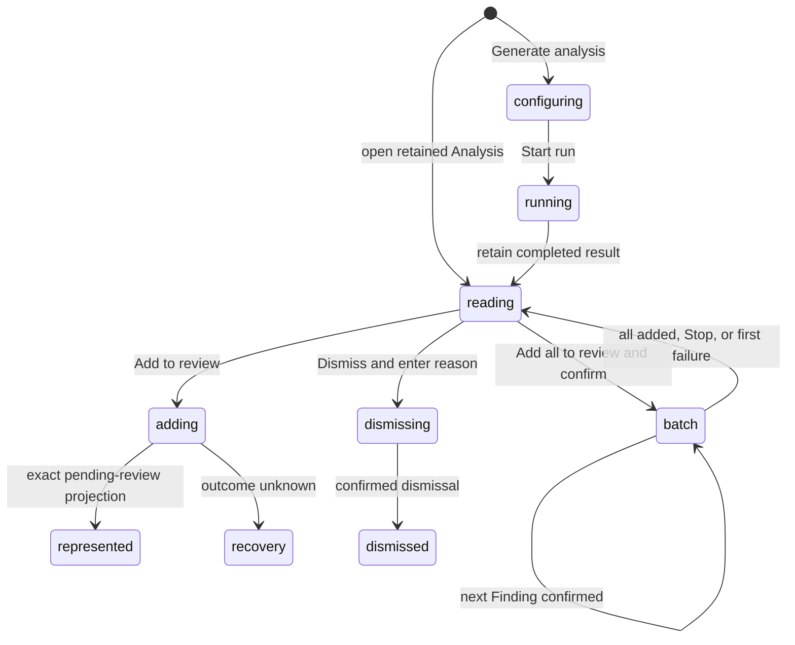

# Analysis

## Summary

Analysis presents a model-backed review of the represented patch. It leads with a verdict card, then lists Findings grouped by severity, a summary of what changed, a Verification checklist, and supporting details. The maintainer reaches it from the Analysis tab or card in Insights. Reading is always separate from acting: a Finding reaches GitHub only after the maintainer explicitly adds its suggested comment to the pending review, and a Finding is dismissed only after an explicit reason and confirmation. A Finding may also carry exact replacement code for the lines it cites. Patchdesk shows that replacement before the maintainer acts and publishes it, under the same single explicit action, as a GitHub suggested change.

## The simple case

The maintainer generates or opens a retained Analysis. If none exists, a borderless empty state centers the Analysis icon, the heading "No analysis yet", a one-line explanation, and the Generate analysis action in the available reader space. With a retained Analysis, they read the verdict card, then the Findings that need attention, expand a Finding's complete containing hunk, and tick off the Verification steps as they check them. For an actionable Finding mapped to the represented diff, they choose Add to review. Patchdesk starts or extends the pending review with the original suggested comment, then labels the Finding Added or Published from the exact receipt-derived state. A Finding carrying a verified replacement reads Add suggestion to review instead, and what reaches GitHub is that Finding's comment followed by one suggestion block. The maintainer can instead choose Dismiss, provide a reason, and confirm. With several actionable Findings, Add all to review adds them in one confirmed batch.

## The task, event by event

### Arrive

Analysis opens in the Insights slot for the represented Review session. Above the reader, the shared Insight header says when the Analysis was generated ("Generated 7 h ago", or "Outdated · generated 7 h ago"), and the provider and model, with a secondary Regenerate button while the Insight is current.

The reader shows its cards in a fixed order.

- **Verdict card.** A verdict badge reads Ready to approve, Changes requested, or Comment recommended. Beside it, one badge reads "X of Y handled", or "No findings" when Analysis generated none, and one badge gives the CI state as Passing, Failing, Pending, Skipped, or Unknown; Failing is drawn as destructive. A heading follows the verdict: "The change is ready for your final review.", "Resolve the blocking findings before approval.", or "Review the highlighted concern before you finish." The generated summary sits below the heading. When Patchdesk allows finishing with an Analysis summary, the card carries a Finish review button.
- **Findings card.** Its title is Needs attention, No findings need attention, or No findings. Below the title, "X of Y handled" counts the Findings added to the review, published, or dismissed. Its header carries Copy as markdown prompt, and Add all to review when at least one Finding can be added.
- **What changed.** The generated change summary describes the patch in one to three sentences. The verdict card's summary explains the decision in one or two sentences without repeating the change summary.
- **Verification.** One checkbox per generated verification step, under "N of M checked." The card is absent when Analysis generated no steps. If a tick cannot be saved, the step unticks again and the card says "Verification ticks could not be saved."
- **Supporting details.** A collapsed card that counts its details and groups, with Show details. The groups are Reviewer callouts, Open questions, and Assumptions. Duplicate supporting details are removed before grouping.

Findings are grouped by severity. P0 and P1 Findings are listed first and always shown. P2 and P3 Findings sit behind a collapsed Lower severity disclosure that counts them. When every Finding is in one group, all of them are listed with no disclosure. Each Finding shows its severity badge, title, explanation, and file and line. A state badge reads Added, Published, Locked, or Unavailable when Patchdesk has no action state for it; an actionable Finding has no badge because its Add to review and Dismiss buttons show that state. A dismissed Finding collapses to one line with its severity, title, and "Dismissed:" followed by its reason. Clicking the line, or pressing Enter or Space on it, expands the explanation and file and line. When the Analysis is current and the Finding maps to the represented diff, the file and line is a link that opens the Diff at that location.

When generation returns zero Findings, the Findings card is titled No findings and says "Nothing to add or dismiss." Generated Markdown keeps its original structure while the reader applies safe rendering. New Analyses limit the change summary to 600 characters, the verdict summary to 400, and each Finding's title and explanation to 120 and 800. Saved Analyses from before these limits remain readable.

A Finding that carries a verified replacement also shows a Suggested change panel under its file and line, above View evidence. The panel heads itself with the file and the new-side line range, then draws the replacement with the same diff view the evidence uses: the cited lines removed, the replacement added. It is read-only and resizable, mounts no editor, and offers no action of its own.

> Technical note: Patchdesk keeps a generated replacement only after checking it against the represented patch. The Finding has to be mapped on the new side, its whole cited range has to sit in one hunk of that patch, the code has to carry no Markdown fence, and it has to be at most 4096 bytes. A replacement that fails the check is dropped on its own and the Finding is kept.

Evidence detail stays collapsed until requested. View evidence reveals the complete containing hunk and highlights the mapped Finding range.

### Leave unchanged

Reading, expanding evidence, opening Lower severity, switching Findings, or leaving Insights records nothing on GitHub. Generated prose and suggestions are not commands. Copy as markdown prompt copies the Findings that are not dismissed, the change summary, and the verification steps as a Markdown prompt for a local coding agent, and records nothing on GitHub; it reads Copied for about 1.5 seconds and is disabled when every Finding is dismissed. A Finding that carries a replacement contributes it to that prompt as a fenced code block under "Suggested replacement for" its file and lines. Closing a Dismiss form before confirmation leaves the Finding actionable.

Ticking a Verification checkbox records nothing on GitHub. Patchdesk saves the tick locally with the retained Analysis, so it survives switching Insight tabs, leaving and reopening the Review, and restarting the app. Ticks stay editable on a merged or closed Review. A regenerated Analysis starts with every step unticked.

> Technical note: each tick saves one step to the Analysis Insight record in the Review's local data (`insights/analysis.json`), keyed by the retained run. Completing a new Analysis run drops the old ticks, and they are removed with the Review directory, like the retained Analysis itself.

### Begin an action

Generate analysis or Regenerate opens the shared Insight run dialog described in [Brief](brief.md#begin-an-action), seeded with the saved Analysis provider, model, and reasoning preference. Both are disabled unless an Insight provider is available; on a merged or closed Review, neither Generate analysis nor Regenerate is drawn.

Add to review appears only when the Analysis is current, the Review is open, the Finding has a location on the represented diff, the projected Analysis action state is actionable, and GitHub writes are not paused. Dismiss appears on open Findings of a current Analysis on an open Review, except Findings already Added or Published.

Add all to review appears under the same conditions as Add to review, when at least one Finding qualifies: not Added, Published, Dismissed, or Locked. It opens one confirmation that lists every Finding it will add, in reading order, with its severity, title, and file and line. Cancel sends nothing. Add all adds each listed Finding through the same single-Finding path as its own Add to review or Add suggestion to review, so each one records its own intent before its own write.

Add to review sends the Finding's original suggested comment together with its Analysis run ID, Finding ID, session ID, head SHA, patch hash, and diff anchor. On a Finding with a verified replacement the same control reads Add suggestion to review and sends less: the Analysis run and Finding identity and the revision the reader expects, with no comment text and no anchor. Dismiss opens a small form titled Dismiss finding; Confirm dismissal stays disabled until the reason is non-blank.

Finish review in the verdict card opens Finish review with an Analysis-built summary. It prefills only the modal-local review summary and leaves Comment selected; it does not silently submit or change pending comments.

A Finding card's Open in Analysis opens Insights on the Analysis reader, opens Lower severity when the target is a P2 or P3 Finding, and scrolls to and focuses that Finding's row.

### While the action runs

Each Finding owns its pending and error state. Add to review reads Adding… and Confirm dismissal reads Dismissing… while their requests run. Add or Dismiss is admitted once synchronously for that Finding, while another Finding can remain usable. Reverse settlement of concurrent Finding actions does not move an error or confirmation to the wrong Finding.

During Add all to review, the Findings card reads "Adding N of M…" with a Stop adding button, the Finding being written reads Adding…, and every other Finding action and the Add all button are disabled. Patchdesk treats the batch as a GitHub write in flight: leaving the Review waits for it, and Finish review and inline review comments stay disabled. Stop adding lets the in-flight write finish and sends nothing more. The batch also stops before its next write if a new Analysis run replaces the one it started from.

Add to review passes through the detect-before-write gate and pending-review coordinator. A malformed success or unknown outcome never marks the Finding confirmed. Dismissal applies only the exact returned Finding ID and status.

Add suggestion to review takes the same path, with the comment composed away from the reader. Patchdesk rereads the retained Analysis and the represented patch, rechecks the run, session, head SHA, and patch hash, takes the replaced lines and the anchor from the patch itself, and writes the Finding's suggested comment or explanation followed by one fenced `suggestion` block holding the exact replacement. A Finding whose range no longer resolves in the represented patch sends nothing.

A generation run follows the lifecycle described in [Brief](brief.md#while-the-action-runs), including the running panel and the Codex activity trace a Codex CLI account run shows in it.

### Settle

An exact pending-review projection updates the canonical workbench immediately without an advisory full Review load. A Finding becomes pending review only when the projection's unresolved Finding identity matches the run, Finding, session, head, patch, and pending-review node. It becomes published only from matching recent-write evidence. A suggestion is confirmed against the comment Patchdesk composed and returned, not against text the reader assembled, and its cited range is preserved whole whether the write started the pending review or appended to one. Once the review is submitted, GitHub renders that comment as a suggested change the pull request author can commit or add to a batch; Patchdesk neither applies it nor tracks what the author does with it.

A confirmed dismissal patches the retained Analysis locally and collapses the Finding to its one-line dismissed row. Nothing in the reader restores a dismissed Finding. A failed Finding action shows "The Finding action could not be saved. Try again." under that Finding, keeps it retryable, and preserves the dismissal reason. Unknown pending-review outcome locks mutation and delegates settlement to Check GitHub again or manual GitHub inspection; a locked Finding says "Locked: GitHub comment unconfirmed."

Add all to review stops at the first failure and rolls nothing back. Findings already added stay Added; the failed Finding shows its own error, or its locked or recovery state when the outcome is unknown; the Findings after it stay actionable. When the failed Finding is P2 or P3, Lower severity opens so its error is visible.

A Finding that no longer maps to the represented diff, or an Add while the pending review needs recovery, sends nothing and says the Finding no longer matches the current diff or pending review, with Check GitHub again or refresh as the next step. A malformed or stale response to Add or Dismiss is worded as unconfirmed: the row says GitHub did not confirm the Finding action and to check GitHub before retrying. The row keeps that sentence until the maintainer starts another action on the same Finding.

## Variants

| Variant                                                | Before the action runs                                                                                                                                                                                                                                                                                                                                                                            | While the action runs                                                                                                                |
| ------------------------------------------------------ | ------------------------------------------------------------------------------------------------------------------------------------------------------------------------------------------------------------------------------------------------------------------------------------------------------------------------------------------------------------------------------------------------- | ------------------------------------------------------------------------------------------------------------------------------------ |
| Workspace profile and GitHub account                   | Profile rules and provider configuration shape generation; the configured GitHub identity owns later review writes.                                                                                                                                                                                                                                                                               | A profile switch leaves the session. A result or receipt from the former session cannot confirm the new Review.                      |
| Pull request and Review state                          | Retained Analysis can be read for terminal or outdated Reviews. Generate analysis and Regenerate need an open Review; on a merged or closed Review, a muted line above the reader says so; Generate analysis, Regenerate, Add to review, and Dismiss are not drawn. Add to review needs an open, Fresh, patch-backed Review and available pending-review state. An outdated Analysis shows no Add, Dismiss, evidence, or Diff link. | Revision or terminal change discovered before the write prevents it. Generated evidence stays bound to the old represented revision. |
| GitHub permissions and merge readiness                 | Analysis generation needs no GitHub write permission. Add to review needs comment authority; merge readiness is separate.                                                                                                                                                                                                                                                                         | A permission rejection leaves the Finding actionable and does not change merge readiness.                                            |
| Network, local tool, and Insight provider availability | Reading a retained Analysis needs no provider. Generation needs an available provider; Add to review needs GitHub.                                                                                                                                                                                                                                                                                | Provider failure leaves the retained Analysis. GitHub uncertainty pauses writes without relabeling the Finding as published.         |
| Input path: mouse, keyboard, or desktop menu           | Reader, evidence controls, checkboxes, dialogs, and buttons support mouse and keyboard.                                                                                                                                                                                                                                                                                                           | Both paths use row-local admission guards. Desktop menus do not add or dismiss Findings.                                             |

## Cancel and interrupt

| Event                                                                                                 | Before the action runs                                                                                                                  | While the action runs                                                                                                                                  |
| ----------------------------------------------------------------------------------------------------- | --------------------------------------------------------------------------------------------------------------------------------------- | ------------------------------------------------------------------------------------------------------------------------------------------------------ |
| Cancel, Stop, or Escape                                                                               | Closing run or dismissal controls before confirmation records nothing.                                                                  | Cancel affects only the Insight run. The Dismiss form cannot close while its request runs. A GitHub pending-review write has no Stop after submission. |
| Navigate to another Patchdesk screen, Review, Settings section, or workspace profile                  | Reading can leave without a guard. A dismissal draft is renderer-local and is lost on leaving the reader; Verification ticks are saved. | A GitHub write reports write-pending and blocks navigation until settlement. A provider run remains bound to its session.                              |
| Start another action or request a refresh                                                             | Independent Findings can be inspected; only eligible actions appear.                                                                    | Same-Finding duplicates are ignored. Reverse completion of different Findings preserves cumulative confirmed state.                                    |
| GitHub, the network, a local tool, or an Insight provider fails or times out                          | Retained output stays readable when generation is unavailable.                                                                          | Deterministic errors stay row-local and retryable. Unknown GitHub outcome locks pending-review mutation.                                               |
| Close Settings, reload the renderer, close the window, or quit Patchdesk                              | Settings changes defaults for the next run. Retained Analysis, confirmed dispositions, and Verification ticks are durable.              | Run identity and unknown-write recovery survive renderer reload; dismissal text does not have documented restart persistence.                          |
| The pull request, represented revision, pending review, permission, or other target changes elsewhere | A mismatched revision or missing pending review removes Add eligibility.                                                                | Exact cumulative projections prevent a lower, stale receipt from erasing a newer confirmed Finding.                                                    |
| macOS focus, a file or folder picker, or another input path takes control                             | Focus can move among Findings and evidence without acting.                                                                              | Focus loss does not cancel a run or write. Focus return after a row error needs live verification.                                                     |

## Interactions with other systems

**Workspace profile and identity.** The profile supplies local rules, provider defaults, and GitHub identity. Generated content is not identity proof.

**Review revision and freshness.** Analysis provenance and every actionable Finding are tied to the represented session, head, and patch. Update detection can make the artifact read-only.

**Local persistence and recovery.** Retained Analysis and confirmed dismissal dispositions are saved with their reasons, so a dismissed row shows its reason after a restart. Pending-review receipts and unknown outcomes use the Review's durable recovery state. Verification ticks are saved with the retained Analysis. The Lower severity disclosure is not saved.

**GitHub permissions and write authority.** Add to review is the explicit authority boundary. The suggested comment is never sent merely because it was generated or displayed. Add suggestion to review is that same boundary for a replacement: reading the preview publishes nothing. Patchdesk never edits the replacement, never changes the local worktree or the pull request branch, and never publishes a suggestion without the maintainer's click, as [ADR 0015](../../adr/0015-authorize-finding-review-commands-from-analysis.md) and [ADR 0048](../../adr/0048-publish-finding-suggestions-from-the-main-process.md) record.

**Network, local tools, and Insight providers.** Generation uses the selected provider and local Review context. Acting on a Finding is a separate GitHub operation. The verdict card's CI badge reflects the represented checks and needs no provider.

**Concurrent operations and locking.** Row-local guards, cumulative projection checks, and the Review coordinator prevent duplicate or out-of-order confirmation.

**Feedback, errors, and diagnostics.** Pending, pending review, published, dismissed, failed, and recovery-required are distinct. A Codex CLI account run's command trace and one reasoning line enter the renderer projection, bounded as [ADR 0043](../../adr/0043-project-a-bounded-codex-activity-trace.md) records; raw prompts, command output, raw provider events, and unbounded errors do not.

**Preferences, keyboard commands, and desktop integration.** Analysis remembers provider, model, and reasoning defaults. No desktop menu shortcut accepts a Finding.

**Supported input and accessibility limits.** Findings, evidence, checkboxes, fields, and dialogs support keyboard and mouse. Patchdesk does not claim screen-reader, touch, or pen support.

## Edge cases

- An empty Analysis uses the same centered structure as empty Brief and Walkthrough readers.
- A Finding outside the represented diff has no Add to review action and no Diff link.
- Lower severity appears only when the Analysis has both P0 or P1 and P2 or P3 Findings.
- Opening a P2 or P3 Finding from a Finding card opens Lower severity even when the maintainer had closed it.
- The handled count uses the same handled rule as merge readiness, so the verdict card and the readiness card agree. A locked Finding is not handled.
- Verification ticks belong to one retained Analysis: a regenerated Analysis starts unticked, and a failed save unticks the step and says so.
- Two concurrent adds that settle in reverse order preserve both confirmed Findings.
- A stale lower receipt missing its target cannot overwrite a newer pending-review projection.
- Malformed success produces recovery-required state, not optimistic confirmation.
- An outcome-unknown failure can carry a valid recovery projection; Patchdesk uses it only if it exactly confirms the requested comment.
- Dismissal detail stays hidden until requested, and a failed dismissal preserves its reason.
- Supporting details are deduplicated and grouped without rewriting generated prose.
- A retained Analysis remains readable while GitHub writes are paused; Add to review and Finish review are hidden while Dismiss stays.
- Zero generated Findings show No findings; this is distinct from a result where every Finding has already been handled.
- A replacement Patchdesk cannot verify against the represented patch is dropped on its own. The Finding keeps its explanation, evidence, and ordinary Add to review action, and only the Suggested change panel and the suggestion label are absent.
- A Finding whose cited lines span two hunks of the represented patch has no single range GitHub accepts, so it carries no suggestion however exact its replacement is.
- Replacement code containing a Markdown fence is refused rather than escaped, because a fence line would close the published suggestion block early.

## Open questions and verification

- The 2026-09-14 live pass confirmed the empty state and the disabled Generate analysis on a merged Review. No retained Analysis existed in the live workspace, so the verdict card, severity grouping, Verification checklist, and Finding actions were checked from source only.
- [UX-10](../ux-friction.md#ux-10-verification-ticks-are-lost-without-warning) is resolved by saving the ticks ([#352](https://github.com/kwanpham2195/patchdesk/issues/352)); the earlier "Ticks are not saved" wording is gone. On 2026-09-24 a tick on disposable pull request #345 survived a switch to Brief and a renderer reload, seen over CDP.
- Fixed: a merged or closed Review draws neither Generate analysis nor Regenerate and keeps the reason line on screen. See [B-11](../bug-triage.md#b-11-generate-and-regenerate-are-disabled-on-a-merged-or-closed-review-with-no-reason).
- Confirm evidence expansion, highlighted range, row focus after Open in Analysis, and error placement.
- Confirm whether a non-empty dismissal reason is guarded when switching Insights readers or leaving the Review.
- Confirm progress and Cancel presentation for provider timeout versus explicit cancellation.
- A 2026-09-23 Analysis on disposable pull request #345 kept its verdict summary separate from What changed. Both Findings put the symptom and cause in their explanations and had no separate scenario or impact text. This pass does not establish that every model run will follow the wording guidance.
- Confirm the outdated Analysis wording against a retained Analysis on a moved revision.
- Confirmed on a disposable pull request (2026-09-23, #341): a single-line suggestion kept its range and GitHub offered Apply suggestion and Add suggestion to batch after the review was submitted. The multi-line range is still proved only by adapter tests ([ANALYSIS-03-B to ANALYSIS-03-D](../verification/insights-and-cross-cutting.md#review-workbenchanalysismd)).
- An empty replacement would read as a deletion suggestion. Patchdesk refuses one until GitHub's behavior for it is proved on a disposable pull request.

Baseline drafted from Patchdesk application source commit `3100615`; revised and verified against `737c515c`. The Finding suggestion behavior is revised against `c47a211f`: its Suggested change panel and Add suggestion to review label were seen in the running app on a fixture Analysis, and on 2026-09-23 a single-line suggestion was published from a real Analysis on disposable pull request #341, submitted, and rendered by GitHub with Apply suggestion. The verification rules and the multi-line range are read from source and tests and are not live-verified. The Analysis prose limits are revised against `0add29ea`; a new Analysis on disposable pull request #345 was retained and viewed over CDP on 2026-09-23.
