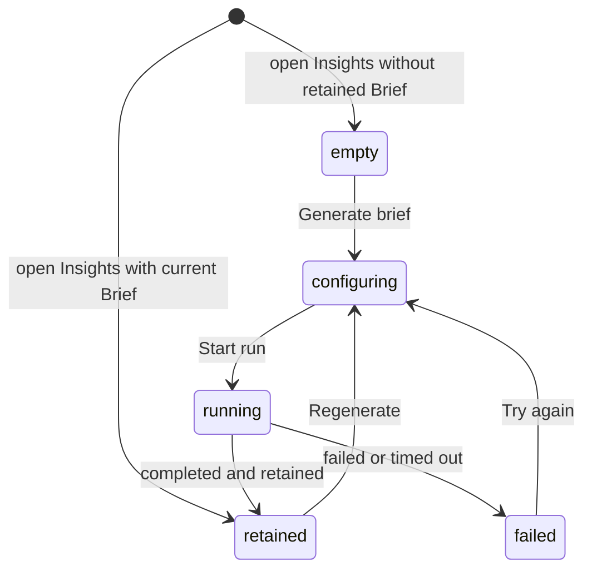

# Brief

## Summary

Brief gives the maintainer a reading orientation for the represented Review before detailed inspection. It combines model-drawn Flow views, deterministic change shape and reach, and a suggested reading order, retained for the exact Review session. Brief is the first tab in the Insight tab strip, and Insights opens on it unless only a later Insight has a retained result. A retained Brief remains readable even when a new Insight run cannot start. Generating or regenerating a Brief requires an open Review.

## The simple case

The maintainer chooses Insights and lands on Brief, or chooses its tab. Patchdesk shows what changed, how the files group by directory, which hunk supports each changed step, what the change may reach, and where to start reading. If no current Brief exists, a borderless empty state centers the Brief icon, the heading "No brief yet", a one-line explanation, and the Generate brief action in the available reader space. The maintainer generates one with an available provider and model. A retained Brief can open the Walkthrough for the same revision or offer to generate one.

## The task, event by event

### Arrive

Brief occupies the Insights slot for the represented Review. The Insight tab strip reads Brief, Walkthrough, Analysis, each with its status badge. Insights opens on the first of Brief, Walkthrough, and Analysis that has a retained result, and on Brief when none has one; a restored or explicitly chosen Insight wins over that rule.

A retained result is laid out in two columns on a wide window and one column on a narrow one. The main column holds up to three Flow views, one per kind, the grouped Shape tree, and four Reach rows. The side column holds the Start here card, a read-only copy of the Scope card, and the Provenance card.

The Provenance card lists the Revision as a short commit hash, when the Brief was Generated as a local date and time, the Provider and model when the run recorded them, and Citations as "all citations verified" or "some citations could not be verified". The card ends with a Regenerate button.

Above the reader, the shared Insight header says Current or Outdated and how long ago the Brief was retained. Unlike the Analysis and Walkthrough headers, it does not repeat the provider and model, because the Provenance card states them. The header also carries its own Regenerate button, so a current Brief shows Regenerate in two places.

Older retained Briefs can lack Reach or Start here because those fields did not exist when the artifact was stored. Patchdesk omits an absent legacy block without inventing data. When Reach was attempted but could not answer, the reader says "Reach was not counted:" and names the reason.

### Leave unchanged

Reading, opening a citation popover, copying a Flow view, and leaving the tab do not start a provider or change GitHub. Opening an existing Walkthrough also leaves the Brief artifact unchanged. Closing the Insight run dialog before Start run records nothing.

### Begin an action

Generate brief, either Regenerate button, Try again on a failed run, and Run for latest revision on an outdated Brief all open the Insight run dialog. The dialog is titled Run Brief, Regenerate Brief, or Run Brief again. It has three controls: Provider, with the choices API key and Codex CLI account; Model, a searchable list of the provider's models; and Reasoning, the effort levels the chosen model supports. Choosing Codex CLI account shows Load Codex models, because Codex models load only after that explicit action; once loaded, Refresh models replaces it. Closing the dialog while Codex models are loading cancels that dialog's ownership of the request without reporting Codex as unavailable; reopening can load the models again. Saved Brief preferences seed the dialog where available. Start run stays disabled until a model is chosen.

Generate brief and both Regenerate buttons are disabled unless the Review is open and at least one Insight provider is available. A merged or closed Review shows them disabled. When no provider is available, the reader says "No model configured. Add a provider API key, then reload." When only the API key provider has no model, it says "No API-key model configured. Open a run and pick Codex CLI account."

Each API key model in the Model list shows its pi-ai list price as input and output USD per million tokens, for example `$5.00 / $25.00`. The dialog repeats the selected model's list price and says billing may differ. A Codex CLI account model, or a router such as `openrouter/openrouter/auto` whose price varies per request, shows no price.

Starting the run binds it to the current profile, Review session, represented head, and patch. Regeneration does not erase the retained Brief before a replacement completes.

### While the action runs

Start run changes to Starting…, and the dialog cannot be closed until the start request answers. If the start request fails, the dialog shows "Insight run did not start." with "Brief could not start. Check the run options and try again."

Once the run exists, the reader shows "Brief is running" with a spinner and, below it, how long ago the run started. It reads "Preparing…" instead until Codex starts the turn. A retained Brief stays visible below that state. The header shows an icon button named Cancel Brief in place of Regenerate; while cancellation is requested it shows a spinner and is named Cancelling Brief….

A Codex CLI account run also shows what it is doing. Below the start time it shows the last line of the model's reasoning summary, when the model sends one, and a **Commands** list with one row per command Codex ran: its exit status, **declined**, or a spinner while it runs; the command as plain text; and its duration. Codex asks Patchdesk before it runs any command. Patchdesk accepts commands requested from inside the represented worktree and declines network, stdin-write, file-change, permission, and outside-worktree requests. An API key run shows only the spinner and start time. When the run fails, times out, or is cancelled, the failure notice keeps the last command list until another run starts or the renderer reloads.

> Technical note: commands are shortened to 200 characters, with paths inside the represented worktree made relative and the home directory shown as `~`, before they leave the main process. Command output is never shown. The trace is held in memory only; see [ADR 0043](../../adr/0043-project-a-bounded-codex-activity-trace.md). The command approval boundary is recorded in [ADR 0016](../../adr/0016-use-the-local-codex-cli-account.md).

Patchdesk polls the run by its durable identity. Cancel requests cancellation, but final state still comes from the run status. A transient status-read failure does not discard run identity: the reader says "Brief status refresh failed; still running."

Provider unavailability, invocation failure, timeout, invalid output, or cancellation settles without replacing the retained Brief. The generated content itself is not used to authorize GitHub writes.

### Settle

On success, Patchdesk retains the new Brief for this session and renders its structured sections.

Flow draws up to three diff-styled views, one per kind — call_tree with real function or method signatures like `validateManualDays(command, suggestion)`, control_flow as short pseudocode lines like `on(save)`, and component as a UI tree like `<SessionToolbar>` — each marking a step added, removed, or unchanged in a marker-column row with tree guides, so the maintainer can see whether the change added a step, dropped one, or reordered around it. Hunk citations are best effort — a changed step with a cited hunk shows a chip that opens the hunk; a changed step the model could not place in the diff is kept, drawn with a muted marker and no chip, and the Brief reads as partially verified. A tree left with no surviving changed step is dropped, and Flow itself is absent when no view survives. Each view carries a kind badge and its own Copy as diff action, copying that view back out as fenced diff text for pasting elsewhere. The button reads Copied for about 1.5 seconds after the clipboard accepts the text.

Shape groups files by directory and collapses a directory after twelve files into a counted remainder. Evidence uses its shortest meaningful identifier while preserving full paths in titles. Reach states how counts were produced.

Start here gives a lead sentence and an ordered list of files, each with an optional reason. Its button reads Open walkthrough when a current Walkthrough exists for this revision and Generate walkthrough otherwise.

A failed run shows one warning block that names the failure category, such as a timeout, a rate limit, or a result the app could not read. Most failures offer **Try again**. When the represented Review's local files are missing or no longer match its revision, the warning offers **Re-prepare Review** instead; this rebuilds the same Review through the durable refresh lifecycle, then opens the run dialog for explicit confirmation, and never runs automatically when the Review opens. When a retained Brief exists the warning says its evidence is still readable and the Brief stays below. A failed Codex run keeps its bounded command trace below the action; long commands stay on one truncated row with the duration visible and retain their full text on hover. A Brief retained for an earlier revision shows "Brief is outdated" with both revisions and Run for latest revision.

## Variants

| Variant                                                | Before the action runs                                                                                                                                                                                                                                                                                 | While the action runs                                                                                                 |
| ------------------------------------------------------ | ------------------------------------------------------------------------------------------------------------------------------------------------------------------------------------------------------------------------------------------------------------------------------------------------------ | --------------------------------------------------------------------------------------------------------------------- |
| Workspace profile and GitHub account                   | The active profile selects local rules, checkout context, and available provider configuration.                                                                                                                                                                                                        | A profile change leaves the Review; the old run stays bound to its original session.                                  |
| Pull request and Review state                          | Brief can be read for represented open or terminal Reviews. Generation requires an open Review, a valid current session, and patch context; on a merged or closed Review, a muted line above the reader says generation needs an open Review and describes the disabled Generate brief and Regenerate. | A newer remote revision does not rewrite the artifact; the result remains evidence for the represented revision.      |
| GitHub permissions and merge readiness                 | Brief reading and generation do not require GitHub write permission or merge readiness.                                                                                                                                                                                                                | The run cannot approve, comment, or merge. Its output becomes actionable only through separate explicit controls.     |
| Network, local tool, and Insight provider availability | Retained sections can be read without a provider. Generation needs an available provider; with none, the reader names the missing configuration and the generate controls stay disabled.                                                                                                               | Provider, network, local-tool, timeout, or output failure leaves the prior retained Brief intact and retryable.       |
| Input path: mouse, keyboard, or desktop menu           | Insights tabs, reader controls, run dialog, and citation chips support mouse and keyboard.                                                                                                                                                                                                             | Cancel, close, and retry use the same run identity from either input path. Desktop menus do not start an Insight run. |

## Cancel and interrupt

| Event                                                                                                 | Before the action runs                                                                                                                                                  | While the action runs                                                                                                                                   |
| ----------------------------------------------------------------------------------------------------- | ----------------------------------------------------------------------------------------------------------------------------------------------------------------------- | ------------------------------------------------------------------------------------------------------------------------------------------------------- |
| Cancel, Stop, or Escape                                                                               | Cancel or Escape in the run dialog before Start run records nothing.                                                                                                    | The dialog cannot close while Start run is pending. Cancel in the header requests run cancellation; Escape does not declare a provider process stopped. |
| Navigate to another Patchdesk screen, Review, Settings section, or workspace profile                  | A retained Brief can be left without a guard.                                                                                                                           | Navigation does not transfer the run to another Review. Returning can resume status from its durable identity when still represented.                   |
| Start another action or request a refresh                                                             | One Insight type exposes one current run control. A Walkthrough request is a separate Insight action.                                                                   | Duplicate starts are rejected while the run owns the slot. GitHub refresh can mark updates without changing run provenance.                             |
| GitHub, the network, a local tool, or an Insight provider fails or times out                          | GitHub read failure can limit source context; retained content stays readable.                                                                                          | Run failure, cancellation, or timeout is bounded and retryable. GitHub write recovery does not hide the Brief reader.                                   |
| Close Settings, reload the renderer, close the window, or quit Patchdesk                              | Settings can change defaults for the next run without changing the retained artifact.                                                                                   | Run identity and retained artifacts are durable, but live verification must confirm progress presentation after reload or app restart.                  |
| The pull request, represented revision, pending review, permission, or other target changes elsewhere | Updates can make the represented Review non-current while its Brief stays readable as revision-bound evidence. A merge or close disables Generate brief and Regenerate. | Completion is retained only for its original session and cannot silently become the newer revision's Brief.                                             |
| macOS focus, a file or folder picker, or another input path takes control                             | Focus can move through Flow views, citation chips, and dialog controls without generating.                                                                              | Focus loss does not stop the provider. Focus restoration after closing the run dialog needs live verification.                                          |

## Interactions with other systems

**Workspace profile and identity.** Profile rules and local context inform the run. GitHub viewer identity does not make generated content authoritative.

**Review revision and freshness.** The Brief is retained against one Review session and represented revision. Its Walkthrough link opens a Walkthrough only when one stands for that same revision.

**Local persistence and recovery.** Run identity, status, and retained Insight artifacts survive renderer replacement. A new run does not erase a previously retained result until success.

**GitHub permissions and write authority.** Brief is read-only. It cannot send comments, submit a review, or merge.

**Network, local tools, and Insight providers.** Generation uses the chosen provider and the local Insight runtime. The run dialog names the providers API key and Codex CLI account. Deterministic reach and patch evidence depend on prepared Review context.

**Concurrent operations and locking.** One run identity owns its Insight slot. Provider polling and Cancel settle through the coordinator rather than competing component state.

**Feedback, errors, and diagnostics.** Progress, retained result, unavailable provider, failed start, failed run, cancelled run, timeout, and invalid result are separate outcomes. A Codex CLI account run projects its command trace and one reasoning line into the renderer; prompts, command output, and raw provider events are not projected ([ADR 0043](../../adr/0043-project-a-bounded-codex-activity-trace.md)).

**Preferences, keyboard commands, and desktop integration.** Saved provider, model, and reasoning values seed later Brief runs. No desktop menu shortcut generates Brief.

**Supported input and accessibility limits.** The structured reader and dialog support keyboard and mouse. Patchdesk does not claim screen-reader, touch, or pen support.

## Edge cases

- An older Brief can omit Reach and Start here without showing an error.
- A failed Reach calculation explains the omission; a legacy absence is silent.
- A Brief retained before hunk previews existed keeps plain citation chips with no preview.
- A Brief retained before Flow existed has no Flow block.
- A second tree of the same kind is not shown; Flow keeps at most one view per kind.
- A component view is shown only when the patch changes user-interface files.
- A changed Flow step without a hunk citation stays visible with a muted marker and no chip.
- Directories with more than twelve files collapse the remainder into a count.
- Evidence chips use short identifiers but keep the full path available in the title. A hunk chip opens a popover showing the cited hunk as a rendered diff; the chip stays plain text when the hunk is too large to preview.
- A retained Brief remains readable when no provider can start a new run.
- An empty Brief uses the same centered structure as empty Walkthrough and Analysis readers.
- A current Brief shows Regenerate both in the header and in the Provenance card. An outdated or failed Brief hides the header button, while the Provenance card's button stays.
- The Scope card in the side column cannot filter the Diff; its rows are plain text.
- Generate walkthrough is offered only when no current Walkthrough stands for the revision; otherwise Open walkthrough is shown.
- On a merged or closed Review, Generate brief and Regenerate are disabled, while Try again, Run for latest revision, and Start here's Generate walkthrough still open the run dialog.
- A status-read failure retains the run identity so polling can resume.

## Open questions and verification

- The 2026-09-14 live pass confirmed landing on Brief, the empty state, the disabled Generate brief on merged Reviews and the enabled one on an open Review, and the run dialog's Provider (API key, Codex CLI account), Model, and Reasoning controls, and Cancel. No retained Brief existed in the live workspace, so the reader layout, Provenance card, and both Regenerate buttons were checked from source only.
- Suspected defect, confirmed live and by an independent review: a disabled Generate brief or Regenerate on a merged or closed Review shows no reason on screen, while the header tells the maintainer the Review remains readable. The open-only rule is intended. See [B-11](../bug-triage.md#b-11-generate-and-regenerate-are-disabled-on-a-merged-or-closed-review-with-no-reason).
- Suspected defect: Try again, Run for latest revision, and Start here's Generate walkthrough are not disabled on a merged or closed Review, while the service rejects a run for such a Review. What the maintainer sees after Start run there is unconfirmed. See [B-19](../bug-triage.md#b-19-try-again-and-related-run-controls-stay-enabled-on-a-merged-or-closed-review).
- The raw machine timestamp in the running state, one of the slips in [B-22](../bug-triage.md#b-22-small-copy-and-rendering-slips), is fixed: the panel draws a relative time and no longer says partial results are not shown. The new wording is not yet live-verified.
- Confirm the visible distinction between Cancel requested, cancelled, failed, and timed out runs.
- Confirm whether switching to another Insight reader while Brief runs keeps its progress discoverable.
- Confirm focus after closing the run dialog.

Baseline drafted from Patchdesk application source commit `dd613996`; verified against `737c515c`, including the Codex activity trace and the model list prices; command approval behavior revised from source commit `2e2fac4c` and not live-verified.
