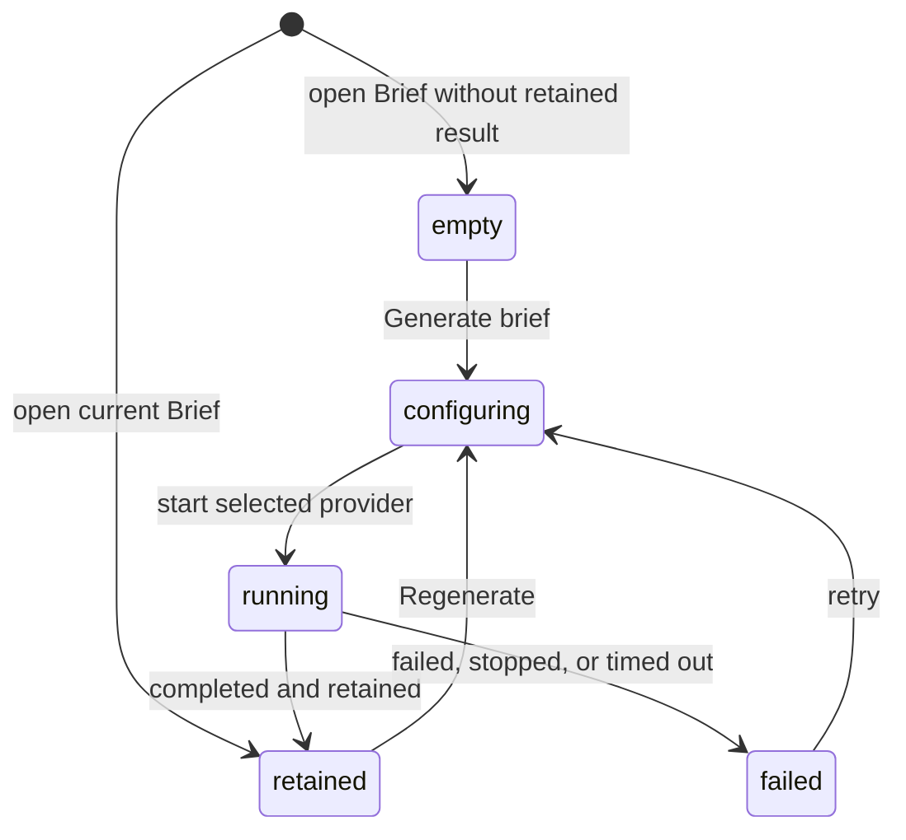

# Brief

## Summary

Brief gives the maintainer a reading orientation for the represented Review before detailed inspection. It combines model-drawn Flow views, deterministic change shape and reach, and a suggested reading order, retained for the exact Review session. The maintainer reaches it in Insights. A retained Brief remains readable even when a new Insight run cannot start.

## The simple case

The maintainer chooses Insights and opens Brief. Patchdesk shows what changed, how the files group by directory, which hunk supports each changed step, what the change may reach, and where to start reading. If no current Brief exists, a borderless empty state centers the Brief icon, explanation, and Generate brief action in the available reader space. The maintainer generates one with an available provider and model. A retained Brief can open the Walkthrough for the same revision or offer to generate one.

## The task, event by event

### Arrive

Brief occupies the Insights slot for the represented Review. A retained result can contain up to three Flow views, one per kind, a grouped Shape tree, Start here reading order, four Reach rows, and citations.

Older retained Briefs can lack Reach or Start here because those fields did not exist when the artifact was stored. Patchdesk omits an absent legacy block without inventing data. When Reach was attempted but could not answer, the reader says why.

### Leave unchanged

Reading, expanding the file skeleton, inspecting evidence, and leaving the tab do not start a provider or change GitHub. Opening an existing Walkthrough also leaves the Brief artifact unchanged.

### Begin an action

Generate brief or Regenerate opens the Insight run dialog. The maintainer chooses an available provider, model, and supported reasoning level. Saved Brief preferences seed the dialog where available.

Each API key model in the Model list shows its pi-ai list price as input and output USD per million tokens, for example `$5.00 / $25.00`. The confirmation line repeats the selected model's price and says account billing may differ. A Codex CLI account model, or a router such as `openrouter/openrouter/auto` whose price varies per request, shows no price.

Starting the run binds it to the current profile, Review session, represented head, and patch. Regeneration does not erase the retained Brief before a replacement completes.

### While the action runs

Patchdesk polls the run by its durable identity. The reader keeps the retained Brief visible where one exists and presents progress separately. Stop requests cancellation, but final state still comes from the run status. A transient status-read failure does not discard run identity; polling can retry.

A Codex CLI account run also shows what it is doing. The panel reads **Preparing a bounded run…** until Codex starts the turn, then how long ago the run started. Below that it shows the last line of the model's reasoning summary, when the model sends one, and a **Commands** list with one row per command Codex ran: its exit status, **declined**, or a spinner while it runs; the command as plain text; and its duration. Codex asks Patchdesk before it runs any command, and Patchdesk allows only read-only inspection inside the represented worktree, so a command outside that list shows as **declined** and the run carries on without it. An API key run shows only the spinner and start time. When the run fails, times out, or is stopped, the failure notice keeps the last command list until another run starts or the renderer reloads.

> Technical note: commands are shortened to 200 characters, with paths inside the represented worktree made relative and the home directory shown as `~`, before they leave the main process. Command output is never shown. The trace is held in memory only; see [ADR 0043](../../adr/0043-project-a-bounded-codex-activity-trace.md). The command allowlist, and the one exception a global Codex `Allow` rule makes to it, are recorded in [ADR 0016](../../adr/0016-use-the-local-codex-cli-account.md).

Provider unavailability, invocation failure, timeout, invalid output, or cancellation settles as a failed or stopped run without replacing the retained Brief. The generated content itself is not used to authorize GitHub writes.

### Settle

On success, Patchdesk retains the new Brief for this session and renders its structured sections.

Flow draws up to three diff-styled views, one per kind — call_tree with real function or method signatures like `validateManualDays(command, suggestion)`, control_flow as short pseudocode lines like `on(save)`, and component as a UI tree like `<SessionToolbar>` — each marking a step added, removed, or unchanged in a marker-column row with tree guides, so the maintainer can see whether the change added a step, dropped one, or reordered around it. Hunk citations are best effort — a changed step with a cited hunk shows a chip that opens the hunk; a changed step the model could not place in the diff is kept, drawn with a muted marker and no chip, and the Brief reads as partially verified. A tree left with no surviving changed step is dropped, and Flow itself is absent when no view survives. Each view carries a kind badge and its own Copy as diff action, copying that view back out as fenced diff text for pasting elsewhere.

Shape groups files by directory and collapses a directory after twelve files into a counted remainder. Evidence uses its shortest meaningful identifier while preserving full paths in titles. Reach states how counts were produced.

## Variants

| Variant | Before the action runs | While the action runs |
| --- | --- | --- |
| Workspace profile and GitHub account | The active profile selects local rules, checkout context, and available provider configuration. | A profile change leaves the Review; the old run stays bound to its original session. |
| Pull request and Review state | Brief can be read for represented open or terminal Reviews. Generation requires an open Review, a valid current session, and patch context; on a merged or closed Review, a muted line above the reader says generation needs an open Review and describes the disabled Generate brief and Regenerate. | A newer remote revision does not rewrite the artifact; the result remains evidence for the represented revision. |
| GitHub permissions and merge readiness | Brief reading and generation do not require GitHub write permission or merge readiness. | The run cannot approve, comment, or merge. Its output becomes actionable only through separate explicit controls. |
| Network, local tool, and Insight provider availability | Deterministic retained sections can be read without a provider. Generation needs an available configured provider and its local runtime or API access. | Provider, network, local-tool, timeout, or output failure leaves the prior retained Brief intact and retryable. |
| Input path: mouse, keyboard, or desktop menu | Insights tabs, reader controls, run dialog, and evidence links support mouse and keyboard. | Stop, close, and retry use the same run identity from either input path. Desktop menus do not start an Insight run. |

## Cancel and interrupt

| Event | Before the action runs | While the action runs |
| --- | --- | --- |
| Cancel, Stop, or Escape | Closing the run dialog before Start records nothing. | Stop requests run cancellation. Escape closes only controls that permit closing; it does not declare a provider process stopped. |
| Navigate to another Patchdesk screen, Review, Settings section, or workspace profile | A retained Brief can be left without a guard. | Navigation does not transfer the run to another Review. Returning can resume status from its durable identity when still represented. |
| Start another action or request a refresh | One Insight type exposes one current run control. A Walkthrough request is a separate Insight action. | Duplicate starts are rejected while the run owns the slot. GitHub refresh can mark updates without changing run provenance. |
| GitHub, the network, a local tool, or an Insight provider fails or times out | GitHub read failure can limit source context; retained content stays readable. | Run failure, cancellation, or timeout is bounded and retryable. GitHub write recovery does not hide the Brief reader. |
| Close Settings, reload the renderer, close the window, or quit Patchdesk | Settings can change defaults for the next run without changing the retained artifact. | Run identity and retained artifacts are durable, but live verification must confirm progress presentation after reload or app restart. |
| The pull request, represented revision, pending review, permission, or other target changes elsewhere | Updates can make the represented Review non-current while its Brief stays readable as revision-bound evidence. | Completion is retained only for its original session and cannot silently become the newer revision's Brief. |
| macOS focus, a file or folder picker, or another input path takes control | Focus can move through grouped files, evidence, and dialog controls without generating. | Focus loss does not stop the provider. Focus restoration after closing the run dialog needs live verification. |

## Interactions with other systems

**Workspace profile and identity.** Profile rules and local context inform the run. GitHub viewer identity does not make generated content authoritative.

**Review revision and freshness.** The Brief is retained against one Review session and represented revision. Its Walkthrough link is offered only when a Walkthrough stands for that same revision.

**Local persistence and recovery.** Run identity, status, and retained Insight artifacts survive renderer replacement. A new run does not erase a previously retained result until success.

**GitHub permissions and write authority.** Brief is read-only. It cannot send comments, submit a review, or merge.

**Network, local tools, and Insight providers.** Generation uses the chosen provider and the local Insight runtime. Deterministic reach and patch evidence depend on prepared Review context.

**Concurrent operations and locking.** One run identity owns its Insight slot. Provider polling and Stop settle through the coordinator rather than competing component state.

**Feedback, errors, and diagnostics.** Progress, retained result, unavailable provider, failed run, stopped run, timeout, and invalid result are separate outcomes. A Codex CLI account run projects its command trace and one reasoning line into the renderer; prompts, command output, and raw provider events are not projected ([ADR 0043](../../adr/0043-project-a-bounded-codex-activity-trace.md)).

**Preferences, keyboard commands, and desktop integration.** Saved provider, model, and reasoning values seed later Brief runs. No desktop menu shortcut generates Brief.

**Supported input and accessibility limits.** The structured reader and dialog support keyboard and mouse. Patchdesk does not claim screen-reader, touch, or pen support.

## Edge cases

- An older Brief can omit Reach and Start here without showing an error.
- A failed Reach calculation explains the omission; a legacy absence is silent.
- A Brief retained before hunk previews existed keeps plain citation chips with no preview.
- A Brief retained before Flow existed has no Flow block.
- A second tree of the same kind is not shown; Flow keeps at most one view per kind.
- A component view is shown only when the patch changes user-interface files.
- A changed Flow step without a hunk citation stays visible with a muted marker and no chip.
- Directories with more than twelve files collapse the remainder into a count.
- Evidence chips use short identifiers but keep the full path available in the title. A hunk chip opens a popover showing the cited hunk as a rendered diff; the chip stays plain text when the hunk is too large to preview.
- A retained Brief remains readable when no provider can start a new run.
- An empty Brief uses the same centered structure as empty Walkthrough and Analysis readers.
- Generate Walkthrough is offered only when no current Walkthrough stands for the revision; otherwise Open walkthrough is shown.
- A status-read failure retains the run identity so polling can resume.

## Open questions and verification

- Live desktop verification is pending. Confirm reading order, collapsed Shape behavior, focus, and progress wording.
- Confirm the visible distinction between Stop requested, stopped, failed, and timed out runs.
- Confirm whether switching to another Insight reader while Brief runs keeps its progress discoverable.
- Confirm the exact provider-unavailable guidance for each installed runtime state.

Verified against Patchdesk application source commit `3100615`.
