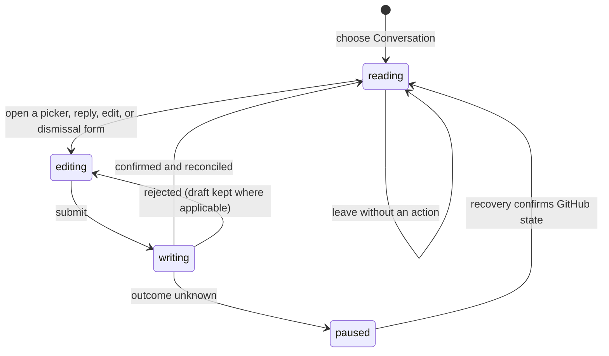

# Conversation and pull request metadata

## Summary

The Conversation view presents the pull request description, issue comments, review summaries, general review threads, and the pull request's labels, assignees, and requested reviewers. The maintainer reaches it from the Conversation tab of an open Review. Reading remains available for represented terminal Reviews and during write recovery; GitHub controls appear only when the current Review and the exact action are writable.

## The simple case

The maintainer opens Conversation, reads the description and timeline, and uses the metadata rail to add or remove labels, assignees, or reviewers. They can reply to an open thread, resolve or unresolve it, edit or delete a comment they authored, and dismiss an eligible published review. Patchdesk shows a confirmed write immediately, records it for later reconciliation, then refreshes the represented GitHub state without making the same mutation twice.

## The task, event by event

### Arrive

Conversation opens inside the represented Review without changing the Review revision. A non-empty pull request description counts as conversation content even when the timeline has no entries. Markdown is rendered through Patchdesk's safe shared renderer. Authors use cached avatars when available and initials otherwise.

The metadata rail shows current labels, assignees, and requested reviewers. Each management control loads its current candidates on demand. Suggested reviewers are grouped before other candidates. GitHub eligibility, current membership, and limits determine which entries can be changed.

### Leave unchanged

Reading, expanding content, opening and closing a picker, or changing tabs records nothing on GitHub. Cancelling a reply, edit, or dismissal keeps the represented conversation unchanged. Returning to Diff or Insights preserves the Review but does not promise to preserve every open row editor.

### Begin an action

Reply and edit require non-blank text. Deleting a published comment uses a separate confirmation. Resolving toggles an eligible thread between open and resolved. Dismissing a review requires a reason and explicit confirmation.

Metadata actions are exact: add or remove named labels, add or remove named assignees, assign the configured viewer, request reviewers, or remove reviewers. Patchdesk accepts only a receipt that confirms the requested action and resulting membership.

### While the action runs

The affected row or picker becomes busy and rejects a same-tick duplicate. A reply can appear immediately after GitHub confirms it. An edit keeps its draft until confirmation, and a failed edit or reply leaves the draft available for retry. Other independent rows can remain usable, but a represented-revision check already in progress settles before a GitHub write is sent.

### Settle

A confirmed reply, edit, delete, thread-state change, dismissal, or metadata change is recorded as a recent write and reconciled into the canonical Review projection. A read-back failure does not turn a durable confirmation into a failed write. A deterministic rejection leaves represented state intact and shows a bounded error.

If Patchdesk cannot tell whether GitHub applied the write, all GitHub writes pause. Conversation stays readable and Refresh stays available. Check GitHub again can clear the pause when one exact remote result is found; ambiguous recovery requires manual inspection on GitHub.

## Variants

| Variant | Before the action runs | While the action runs |
| --- | --- | --- |
| Workspace profile and GitHub account | Candidate lists and self-assignment use the active profile's host and configured viewer identity. | Changing profile leaves the Review only after the normal navigation guard permits it. A receipt for another viewer cannot confirm Assign self. |
| Pull request and Review state | Open represented Reviews can expose writes. Merged or closed Reviews remain readable but hide write controls. | A remote terminal transition discovered before the write prevents it; one discovered afterward is reconciled as new represented state. |
| GitHub permissions and merge readiness | Each control depends on GitHub eligibility and permission. Merge readiness does not itself block metadata writes. | A permission failure is shown for the action and does not imply that another metadata category is writable. |
| Network, local tool, and Insight provider availability | Conversation reading uses saved and refreshed GitHub data. Insight providers are unrelated. | Network or `gh` failure can block candidate loading, mutation, or reconciliation. A confirmed write remains confirmed when later observation fails. |
| Input path: mouse, keyboard, or desktop menu | Tabs, buttons, pickers, text fields, and dialogs support mouse and keyboard. | Submit and cancel controls keep the same action guard for either input path. The desktop menu does not directly write conversation data. |

## Cancel and interrupt

| Event | Before the action runs | While the action runs |
| --- | --- | --- |
| Cancel, Stop, or Escape | Closing a picker or editor records nothing. Delete and dismiss need explicit confirmation. | A GitHub write has no Stop control after submission. Row controls stay guarded until it settles. |
| Navigate to another Patchdesk screen, Review, Settings section, or workspace profile | Clean reading can leave immediately. A non-empty editor contributes to the Review's dirty navigation state where wired. | Navigation is blocked while the Review reports a write pending. After settlement, the latest canonical projection owns the destination. |
| Start another action or request a refresh | Independent reads can run, but every GitHub write passes through the shared detect-before-write gate. | A same-row duplicate is ignored. Refresh and other writers wait for or reconcile with the active operation rather than guessing its result. |
| GitHub, the network, a local tool, or an Insight provider fails or times out | Candidate or refresh failures leave represented content readable. | Confirmed rejection is retryable; an unknown outcome pauses all GitHub writes. Insight-provider failure has no effect on direct conversation actions. |
| Close Settings, reload the renderer, close the window, or quit Patchdesk | Settings is an overlay and does not replace the Review. Reload restores the saved Review position, not transient editor text. | Durable uncertain-write state survives reload and restores the write pause. Close and quit behavior during an ordinary in-flight row write needs live verification. |
| The pull request, represented revision, pending review, permission, or other target changes elsewhere | Detect updates can mark the Review as having a newer revision before a direct write starts. | The exact write receipt and subsequent observation decide settlement. Stale data cannot silently confirm a different membership or thread result. |
| macOS focus, a file or folder picker, or another input path takes control | Focus can move among the timeline, metadata rail, and dialogs without writing. | Focus loss does not cancel a request. Focus return after a failed picker or editor action needs live verification. |

## Interactions with other systems

**Workspace profile and identity.** The active profile supplies host, repository scope, and viewer identity. Viewer-authored comments receive Edit and Delete controls only when the projection confirms ownership.

**Review revision and freshness.** Reading belongs to the represented revision. Direct thread and comment writes additionally require a Fresh revision and a known patch hash; pull-request metadata writes require an open Review and recovery clearance.

**Local persistence and recovery.** Confirmed writes enter a recent-write journal so a slower GitHub read cannot temporarily erase them. Unknown outcomes persist as a durable recovery operation.

**GitHub permissions and write authority.** Patchdesk never treats a visible control as proof of success. Exact typed receipts and remote membership confirm each write.

**Network, local tools, and Insight providers.** GitHub reads and writes use the local GitHub boundary. Cached avatars can render without a new network read. Insight providers do not participate.

**Concurrent operations and locking.** The Review coordinator orders detection and writes. Row-local guards prevent duplicate submissions; durable recovery locks every GitHub writer.

**Feedback, errors, and diagnostics.** Errors stay next to the editor, row, or recovery banner. Missing or malformed thread data can keep comments readable while explaining why Reply or Resolve is unavailable.

**Preferences, keyboard commands, and desktop integration.** The selected outer tab and saved Review position can be restored. No native menu command performs a metadata mutation.

**Supported input and accessibility limits.** Named regions, controls, fields, and dialogs support keyboard and mouse use. Patchdesk does not claim screen-reader, touch, or pen support.

## Edge cases

- A malformed thread ID does not hide readable comments; it withholds thread-level Reply and Resolve.
- An invalid comment timestamp is represented by an unavailable-replies notice rather than silently dropping the comment.
- A published reply stays visible when the next detached read fails and is replaced when authoritative thread data includes the same comment ID.
- A confirmed deletion stays removed even when follow-up reconciliation fails.
- Comment-only cards explain why thread controls are unavailable. They can still expose comment-level actions when confirmed.
- A failed cached avatar falls back to initials and can retry when the cached data URI changes.
- A stale or terminal Review hides direct conversation writers without hiding its represented content.

## Open questions and verification

- Live desktop verification is pending. Confirm focus return after closing metadata pickers, failed editors, delete confirmation, and review dismissal.
- Confirm which transient row editors survive switching among Conversation, Diff, and Insights.
- Confirm that the dirty-navigation guard covers every non-empty reply and edit form, not only inline diff authoring.
- Confirm visible ordering when a metadata write is confirmed while a slower candidate-list request is still pending.

Verified against Patchdesk application source commit `3100615`.
