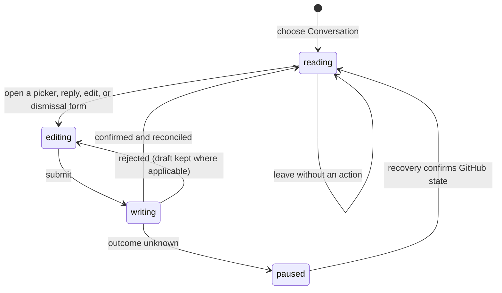

# Conversation and pull request metadata

## Summary

The Conversation view presents the pull request description, issue comments, review summaries, general review threads, and the pull request's labels, assignees, and requested reviewers. The maintainer reaches it from the Conversation tab of an open Review. Reading remains available for represented terminal Reviews and during write recovery; GitHub controls appear only when the current Review and the exact action are writable. The pull request's own author additionally finds a draft toggle in the PR overview's Merge readiness row, and any maintainer on an open Review finds **Change base branch** there.

## The simple case

The maintainer opens Conversation, reads the description and timeline, including their images, and uses the metadata rail to add or remove labels, assignees, or reviewers. They can reply to an open thread, resolve or unresolve it, edit or delete a comment they authored, and dismiss an eligible published review. Patchdesk shows a confirmed write immediately, records it for later reconciliation, then refreshes the represented GitHub state without making the same mutation twice.

## The task, event by event

### Arrive

Conversation opens inside the represented Review without changing the Review revision. A non-empty pull request description appears first, in a card labeled "Pull request description", and counts as conversation content even when the timeline has no entries. When both the description and the timeline are empty, the view reads "No conversation yet."

The timeline below it lists entries in time order. A plain issue comment — one posted on the pull request rather than on a line of the diff — is an entry of its own, beside review summaries and general review threads. A review summary shows its author, time, and a verdict badge: Approved, Changes requested, Commented, or Dismissed, each with the same icon the Reviewers rail draws for it. Comment and review times read as an age, such as "3d", with the exact date and time on hover. Authors use cached avatars when available and initials otherwise; review summaries always show initials.

Markdown in the description, comments, review summaries, and threads is rendered through Patchdesk's safe shared renderer:

- **Images** render as images. Patchdesk loads each one only when it scrolls near the view. A grey placeholder holds its place while it loads: small for an image written with Markdown syntax, block-sized for an image written as an HTML `` tag. An image Patchdesk refuses or cannot download stays as the text `[Image: alt]`, never a broken-image icon. Off-site images such as status badges load through GitHub's own image proxy.
- **Zoom.** An image written as an HTML `` tag opens a full-size view when clicked, and Escape closes it. An image written with Markdown syntax, such as ``, has no zoom, even when it stands alone on its own line. An image inside a link never zooms, because the click belongs to the link.
- **Links** to `https` addresses open in the default browser. A relative link resolves against the pull request's GitHub page. A link with another scheme, a port, or credentials renders as plain text.
- **Mermaid diagrams** render as diagrams with their source in a collapsed Mermaid source section, and open a full-size view when clicked.

The metadata rail shows current labels, assignees, and requested reviewers. Each management control loads its current candidates on demand. Candidate searches preserve the entered text, including an all-digit query such as `2026`. Suggested reviewers are grouped before other candidates. Each reviewer who has already approved, requested changes, commented, or been dismissed shows a re-request control beside their verdict; reviewers still waiting to answer show none. GitHub eligibility, current membership, and limits determine which entries can be changed. On a merged or closed Review, or while GitHub writes are locked, Reviewers lists the requested reviewers from the last refresh as read-only rows, without verdicts or a picker.

> Technical note: images are fetched by the main process, not the window. It checks every address and every redirect against the workspace's GitHub host, sends the GitHub token only to that host, gives each request 10 seconds, refuses images larger than 4 MiB, and caches each image per workspace. The camo address GitHub records for an off-site image replaces the author's address before the request.

An unresolved thread whose most recent comment was written by someone other than the viewer is marked **Needs your reply**, with a reply arrow beside the words; GitHub's own authorship flag for the viewer decides it, not a login comparison. In the Diff's Threads navigator those threads come first, each group in diff order, and the Threads tab label carries a second count of them. The `{` and `}` thread jump visits them first in the same order. On Analysis, a Finding whose published thread is in that state shows the same marker. A reply or a resolve clears the marker when the confirmed write is reconciled into the Review, without pressing Refresh. A comment GitHub returned without the authorship flag never counts as needing a reply.

Leaving a Review records a last-looked cursor: the head it showed and GitHub's timestamp of the newest Conversation entry it showed. Leaving means navigating to Pull requests, to another Review, or switching workspace profile; a Review that never finished loading records nothing. On the next open, each timeline comment, review summary, or general thread with a comment GitHub dated after that cursor carries a left-edge marker, and a line at the top says how many there are with a **Jump to first new** button that moves to the earliest of them. In the Diff's Threads navigator, a thread with such comments shows how many are new. Refresh does not clear the marks; they clear once the maintainer leaves the Review again. A Review never left before marks nothing.

### Leave unchanged

Reading, expanding content, opening and closing an image or diagram view, opening and closing a picker, or changing tabs records nothing on GitHub. Cancelling a reply, edit, or dismissal keeps the represented conversation unchanged. Returning to Diff or Insights preserves the Review but does not promise to preserve every open row editor.

### Begin an action

Reply and edit require non-blank text. Deleting a published comment uses a separate confirmation. Resolving toggles an eligible thread between open and resolved. Dismissing a review requires a reason and explicit confirmation.

Metadata actions are exact: add or remove named labels, add or remove named assignees, assign the configured viewer, request reviewers, or remove reviewers. A reviewer who has already answered carries a re-request control on their own row, which asks that one person for another review without disturbing anyone else's request. The author's draft toggle names the state it moves to: Ready for review publishes a draft, and Convert to draft returns a published pull request to draft. **Change base branch** opens a dialog that searches the branches of the pull request's base repository, marks the current base as current and not selectable, and says that a new base can change the pull request's commits, files, checks, and merge conflicts. Picking a branch and pressing **Change base branch** asks for a second confirmation that names the old and new base. Patchdesk accepts only a receipt that confirms the requested action and resulting membership.

### While the action runs

The affected row or picker becomes busy and rejects a same-tick duplicate. A reply can appear immediately after GitHub confirms it. An edit keeps its draft until confirmation, and a failed edit or reply leaves the draft available for retry. Other independent rows can remain usable, but a represented-revision check already in progress settles before a GitHub write is sent.

### Settle

A confirmed reply, edit, delete, thread-state change, dismissal, or metadata change is recorded as a recent write and reconciled into the canonical Review projection. A confirmed base-branch change is followed by a Refresh, which rebuilds the Review against the new base: retained Insights stay readable and are marked outdated, and comments and Findings keep their place where their anchor still exists in the new diff. If that Refresh fails, the dialog says the base changed and offers Refresh; the change is never sent again. A read-back failure does not turn a durable confirmation into a failed write. A deterministic rejection leaves represented state intact and shows a bounded error beside the row.

Thread and comment failures use fixed sentences. A reply says "Patchdesk could not publish this reply." An edit says "Patchdesk could not edit this comment." A delete says "Patchdesk could not delete this comment." A Resolve or Unresolve that GitHub forbids says "GitHub denied this thread update. Use an authorized account with repository write access."; any other thread-state failure says "Patchdesk could not update this thread."

If Patchdesk cannot tell whether GitHub applied the write, all GitHub writes pause. Conversation stays readable and Refresh stays available. Check GitHub again can clear the pause when one exact remote result is found; ambiguous recovery requires manual inspection on GitHub.

## Variants

| Variant | Before the action runs | While the action runs |
| --- | --- | --- |
| Workspace profile and GitHub account | Candidate lists and self-assignment use the active profile's host and configured viewer identity. Images load with that profile's GitHub host and account. | Changing profile leaves the Review only after the normal navigation guard permits it. A receipt for another viewer cannot confirm Assign self. |
| Pull request and Review state | Open represented Reviews can expose writes. Merged or closed Reviews remain readable, images included, but hide write controls and list their reviewers read-only. | A remote terminal transition discovered before the write prevents it; one discovered afterward is reconciled as new represented state. |
| GitHub permissions and merge readiness | Each control depends on GitHub eligibility and permission. Re-request appears only when the reviewer read reports write permission on this pull request. The draft toggle appears only for the viewer who opened the pull request, and GitHub's repository permission is still resolved on the write itself. The base-branch dialog reads pull-request write permission with the branch list: denied disables the confirm and says why, unknown leaves it enabled with a warning that GitHub may refuse, and the write itself is refused without permitted evidence. Merge readiness does not itself block metadata writes. | A permission failure is shown for the action and does not imply that another metadata category is writable. |
| Network, local tool, and Insight provider availability | Conversation reading uses saved and refreshed GitHub data. An image that cannot be downloaded stays as `[Image: alt]`. Insight providers are unrelated. | Network or `gh` failure can block candidate loading, mutation, or reconciliation. A confirmed write remains confirmed when later observation fails. |
| Input path: mouse, keyboard, or desktop menu | Tabs, buttons, pickers, text fields, zoomable images, and dialogs support mouse and keyboard. | Submit and cancel controls keep the same action guard for either input path. The desktop menu does not directly write conversation data. |

## Cancel and interrupt

| Event | Before the action runs | While the action runs |
| --- | --- | --- |
| Cancel, Stop, or Escape | Closing a picker, editor, or full-size image view records nothing. Delete and dismiss need explicit confirmation. | A GitHub write has no Stop control after submission. Row controls stay guarded until it settles. |
| Navigate to another Patchdesk screen, Review, Settings section, or workspace profile | Clean reading can leave immediately. A non-empty editor contributes to the Review's dirty navigation state where wired. | Navigation is blocked while the Review reports a write pending. After settlement, the latest canonical projection owns the destination. |
| Start another action or request a refresh | Independent reads can run, but every GitHub write passes through the shared detect-before-write gate. | A same-row duplicate is ignored. Refresh and other writers wait for or reconcile with the active operation rather than guessing its result. |
| GitHub, the network, a local tool, or an Insight provider fails or times out | Candidate or refresh failures leave represented content readable. A failed image download leaves its placeholder text. | Confirmed rejection is retryable; an unknown outcome pauses all GitHub writes. Insight-provider failure has no effect on direct conversation actions. |
| Close Settings, reload the renderer, close the window, or quit Patchdesk | Settings is an overlay and does not replace the Review. Reload restores the saved Review position, not transient editor text. | Durable uncertain-write state survives reload and restores the write pause. Close and quit behavior during an ordinary in-flight row write needs live verification. |
| The pull request, represented revision, pending review, permission, or other target changes elsewhere | Detect updates can mark the Review as having a newer revision before a direct write starts. | The exact write receipt and subsequent observation decide settlement. Stale data cannot silently confirm a different membership or thread result. |
| macOS focus, a file or folder picker, or another input path takes control | Focus can move among the timeline, metadata rail, and dialogs without writing. A clicked link hands off to the default browser. | Focus loss does not cancel a request. Focus return after a failed picker or editor action needs live verification. |

## Interactions with other systems

**Workspace profile and identity.** The active profile supplies host, repository scope, and viewer identity. Viewer-authored comments receive Edit and Delete controls only when the projection confirms ownership. Image requests carry the profile's GitHub token only to its GitHub host.

**Review revision and freshness.** Reading belongs to the represented revision. Direct thread and comment writes additionally require a Fresh revision and a known patch hash; pull-request metadata writes require an open Review and recovery clearance.

**Local persistence and recovery.** Confirmed writes enter a recent-write journal so a slower GitHub read cannot temporarily erase them. Unknown outcomes persist as a durable recovery operation. Downloaded images are cached per workspace and are not part of the stored Review snapshot.

**GitHub permissions and write authority.** Patchdesk never treats a visible control as proof of success. Exact typed receipts and remote membership confirm each write.

**Network, local tools, and Insight providers.** GitHub reads and writes use the local GitHub boundary. Cached avatars and cached images can render without a new network read. Insight providers do not participate.

**Concurrent operations and locking.** The Review coordinator orders detection and writes. Row-local guards prevent duplicate submissions; durable recovery locks every GitHub writer.

**Feedback, errors, and diagnostics.** Errors stay next to the editor, row, or recovery banner. Missing or malformed thread data can keep comments readable while explaining why Reply or Resolve is unavailable. A refused image shows its placeholder text.

**Preferences, keyboard commands, and desktop integration.** The selected outer tab and saved Review position can be restored. Links open in the default browser. No native menu command performs a metadata mutation.

**Supported input and accessibility limits.** Named regions, controls, fields, and dialogs support keyboard and mouse use. Patchdesk does not claim screen-reader, touch, or pen support.

## Edge cases

- A malformed thread ID does not hide readable comments; it withholds thread-level Reply and Resolve.
- An invalid comment timestamp is represented by an unavailable-replies notice rather than silently dropping the comment.
- A published reply stays visible when the next detached read fails and is replaced when authoritative thread data includes the same comment ID.
- A confirmed deletion stays removed even when follow-up reconciliation fails.
- Comment-only cards explain why thread controls are unavailable. They can still expose comment-level actions when confirmed.
- A failed cached avatar falls back to initials and can retry when the cached data URI changes.
- A stale or terminal Review hides direct conversation writers without hiding its represented content.
- A pull request whose only discussion is one plain issue comment shows that comment in the timeline.
- An HTML `` with no `src` renders as `[Image: alt]` without a request.
- Two screenshots that look the same can behave differently on click: the one written as an HTML tag zooms, the one written in Markdown syntax does not.
- Re-request is hidden for a reviewer the candidate read did not return, because the request GitHub accepts names a person by identifier rather than by login.
- A base-branch change to the branch the pull request already targets is refused before any GitHub write. The dialog lists at most 100 branches and says how many exist when there are more; searching narrows the list.
- A draft change the pull request has already made is refused rather than sent, because neither GitHub draft mutation is idempotent and its refusal cannot be told apart from a permission denial.

## Open questions and verification

- Confirmed live on 2026-09-14: on a pull request built to test images, a Markdown-syntax image and an HTML `` both render as screenshots, and a Markdown link and a bare URL both render as links. Only the HTML image opens the full-size view, which Escape closes.
- Suspected defect: a Markdown-syntax screenshot on its own line has no zoom while an HTML screenshot does. The Markdown renderer marks every Markdown image as sitting in a line of text, which removes zoom. See [B-18](../bug-triage.md#b-18-a-markdown-syntax-image-never-opens-the-full-size-view).
- [B-10](../bug-triage.md#b-10-the-reviewers-control-never-loads-on-a-merged-or-closed-review), confirmed live on 2026-09-14, is fixed: a merged or closed Review now lists its stored requested reviewers read-only instead of holding "Loading reviewers…" forever. The read-only rows are not yet live-verified.
- Not checked live: a pull request whose only discussion is a plain issue comment, off-site badge images, the metadata picker popovers, and every failure sentence, which each need a fixture or a rejected GitHub write.
- Confirm focus return after closing metadata pickers, failed editors, delete confirmation, review dismissal, and the full-size image view.
- Confirm which transient row editors survive switching among Conversation, Diff, and Insights.
- Confirm that the dirty-navigation guard covers every non-empty reply and edit form, not only inline diff authoring.
- Confirm visible ordering when a metadata write is confirmed while a slower candidate-list request is still pending.

Baseline drafted from Patchdesk application source commit `3100615`; verified against `737c515c`, with live checks from the 2026-09-14 pass; reviewer re-request and the author's draft toggle updated for issue #230; the base-branch change added for issue #117; Needs your reply added for issue #228; marks for what changed since the maintainer last looked added at `737c515c`.
