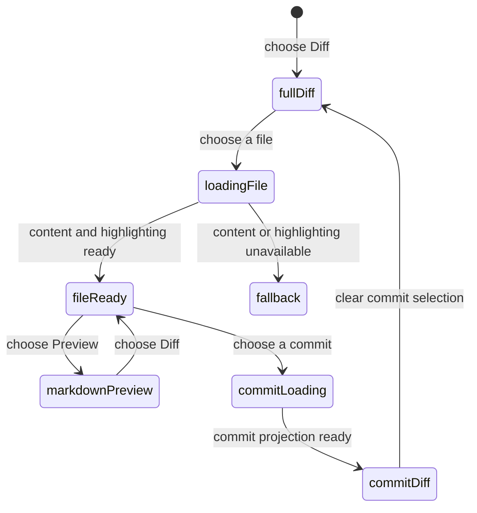

# Files, diff, commits, and navigation

## Summary

The Diff view is the main code-reading surface for a Review. It combines the represented full patch, a navigator with Browse, Commits, and Threads tabs, optional single-commit diffs, a diff toolbar, inline annotations, and keyboard movement. The maintainer reaches it by opening a Review, choosing Diff, or following a Finding from Analysis. Local checkout preparation expands the experience, but a metadata-only Review can still show the GitHub snapshot with reduced local features.

## The simple case

The maintainer chooses a file in Browse, reads its hunks, moves through files or changes with the navigator or keyboard, and optionally selects one commit to narrow the patch. When the selected file is a non-deleted Markdown file whose complete head text Patchdesk has verified and loaded, the diff toolbar offers Diff and Preview for it. Patchdesk hydrates file content only for the current patch generation, keeps the selected file visible, and shows discussion annotations and Finding cards at their mapped lines. The maintainer can return to the full pull-request diff without changing the represented Review.

When the current Analysis cites a file, Browse and that file's header show how many Findings point at it. A Finding card in the diff offers Open in Analysis, and a Finding in Analysis offers the way back to its lines in the diff.

When an open pull request conflicts with its base branch, a Merge conflicts notice sits above the diff. It is headed Merge conflicts and reads: "`<head>` no longer merges cleanly into `<base>`. Resolve locally and push." When either branch name is missing, it drops the branch clause and reads "Resolve the conflicts locally and push." The diff itself reads as it always does.

## The task, event by event

### Arrive

Conversation is the default outer tab: a Review with no saved position opens there, and Diff is one click away. A Review that carries a saved position reopens on the tab it was left on. Insights follows the same rule and the same reading order: its sub-nav reads Brief, Walkthrough, Analysis, and with no saved Insight it lands on the first of those with a retained result, or on Brief, showing its Generate control, when none has one. The header puts the title on its own row, the status chips (Draft, Scope, Checks, Merge) on the row below with Open on GitHub and the review actions at its right, and the repository, branches, represented revision, freshness, and check age on the meta line, which ends in Refresh GitHub state on an open Review. The layout is the same for open, draft, merged, and closed pull requests. A merged or closed Review states that once, in the Merge chip. The left navigator has three tabs: Browse, Commits, and Threads. The Commits and Threads tab labels each show a count, including zero. The main pane shows the full patch unless a commit is selected.

Refresh GitHub state starts a durable refresh operation and immediately changes the header control to a spinner. Patchdesk prepares the candidate snapshot and Review before replacing the represented revision. A renderer reload resumes polling the same operation, including a refresh that runs longer than the desktop request timeout. Completion loads the saved new revision. An interrupted or failed operation leaves the represented Review readable, explains the failure, and permits a safe retry without adopting a partial candidate.

When the Review has a current Analysis for the represented session and head, each file that one or more mapped Findings cite shows a Finding badge on its Browse row and in its diff file header. The badge takes the tone of the most severe Finding among them: destructive for P0 and P1, warning for P2, muted for P3. Its accessible name reads, for example, "2 findings, highest P1". Each mapped Finding also appears as a card at its line in the diff, with its severity, title, and explanation.

The first resolvable file becomes active when no saved active file is valid. Restored position can select an outer tab, navigator section, commit, file, and scroll target only when those values still exist in the current projection.

### Leave unchanged

Scrolling, selecting a file, switching one Markdown file between Diff and Preview, changing navigator sections, resizing the navigator, changing the file display mode, changing any View option, marking a file Viewed, or selecting a commit changes local view state only. It does not write GitHub or change the Review revision. Preview mode belongs to that open Diff and is not saved as a preference.

The diff toolbar holds, from left to right: the All files and Selected buttons, Since your review when the maintainer has submitted a review on this pull request, the Diff and Preview switch when the selected file can be previewed, the Scope picker, View options, the Context control, a count such as "3 of 15 viewed", and Mark all viewed. The All files and Selected buttons set the file display mode. All files draws every file of the displayed patch in one scrolling pane; Selected draws only the selected file, and stays disabled until a file is selected. The default is All files. The choice is saved per profile together with the View options, so the next Review opens the way the last one was left; a profile that last used Selected opens every Review in Selected.

Since your review shows only what changed after the maintainer's last submitted GitHub review: the diff from that review's head commit to the represented head, in All files mode. Browse lists only those files, keyboard movement works as in All files, and inline conversations and Finding cards appear where their head-side lines are in that diff. Viewed marks there last only while it is open, and a new comment can start only on a line the full diff also shows. Choosing All files or Selected returns to the full pull-request diff, and selecting a commit hides the option. With no submitted review the option is absent. It is disabled, with the reason beside it, when the last review was on the current head ("No commits since your review") or when a force-push removed the reviewed commit from the pull request ("Your reviewed commit is no longer in this pull request"). A Review opened before this option existed needs Refresh GitHub state to read each review's commit. If the diff cannot be loaded, the full diff stays and Patchdesk says "The diff since your review could not be loaded."

File, hunk, unresolved-comment, and Viewed keyboard commands work only while All files is chosen, because the Selected pane holds one file and the next target may sit in a file that is not drawn. Pressing one in Selected moves nothing and says "Keyboard navigation works in All files." The All files tooltip lists the keys: `,` and `.` for the previous and next file, `[` and `]` for the previous and next change, `{` and `}` for the previous and next comment, `p` and `n` for the previous and next unviewed file, and `v` to toggle Viewed.

Each file's path appears once, in its sticky file header. The navigator toggle starts the diff toolbar; a bar above the toolbar appears only for a selected commit and names it. In Browse, a folder row that joins several folders, such as `docs / product-description / review-workbench`, keeps its last folder whole and shortens the leading folders first. Hovering any Browse row shows its full path. Folder rows carry no change marker, since every folder in a pull request diff holds a change; file rows keep their status letter.

One View options control holds every way the diff is drawn: split view, wrapped lines, line numbers, and backgrounds. Each is a switch that states whether the option is on. A change applies to the diff at once and is saved per profile, so the next Review opens the way the last one was left. When the Diff pane is narrower than 840 pixels, split view draws as unified without changing the saved choice: the Split view switch keeps its saved state, is disabled, and reads "Pane too narrow". Widening the pane, by enlarging the window or narrowing the navigator, restores split view.

Each file header has a Viewed checkbox that collapses the file, and the toolbar count goes up by one; Mark all viewed collapses every file the Scope picker shows and then reads Show all, which clears the marks on those files; marks on files the Scope picker hides stay as they were. `v` toggles Viewed on the current file, the one highlighted in Browse. `n` and `p` jump to the next or previous file not marked Viewed and wrap past the last or first file, saying so, such as "Wrapped to the first unviewed file. Unviewed file 1 of 4: src/a.ts."; with every file viewed they say "Every file is viewed." Viewed marks on the full Review diff are saved for the represented head and come back after leaving the Review, switching Reviews, or restarting Patchdesk. A new head starts with no files viewed. A commit slice keeps its own Viewed marks only while it is open. If a mark cannot be saved, the Diff restores the last saved marks and says "Viewed marks could not be saved."

### Begin an action

Selecting a file requests its hydrated diff data when needed. After complete verified head text loads for a selected non-deleted `.md` or `.markdown` file, the diff toolbar offers Diff and Preview for that file. Preview renders the complete head text as Markdown without diff highlighting or inline-comment controls, and hides the All files and Selected buttons, View options, Context, and Mark all viewed; the Scope picker stays because it also filters Browse. Choosing Diff restores the ordinary diff and its inline-comment behavior. Selecting a commit requests a commit-specific projection and replaces the displayed patch after the response is valid. While All files is chosen, file, hunk, and unresolved-comment keyboard commands compute the next exact target and stop at the first or last item instead of wrapping. The unviewed-file keys are the exception and wrap. In Selected, pressing one shows "Keyboard navigation works in All files." and moves nothing.

The Context control expands or collapses unchanged lines around each hunk. It is enabled only when Patchdesk has the exact file contents for a rendered file. While those contents load it reads Loading context; when they cannot be used it reads Context unavailable and is disabled, with the reason in its tooltip, such as "Patchdesk could not load unchanged context from the saved review revisions" or "The file is too large to load unchanged context".

Context and Preview read file contents from the Review's represented-review worktree. When that worktree is missing from disk, for example after its cache folder was removed, every file shows Context unavailable with the first of those reasons, and no Markdown file offers Preview. Reopening the Review does not rebuild the worktree, so the state lasts as long as that Review session stays current.

Open in Analysis on a Finding card switches to the Insights tab and asks Analysis to bring that Finding into view; [Analysis](analysis.md) owns what happens there. Following a Finding's file and line from Analysis does the reverse: the workbench switches to Diff and Browse, selects the Finding's file, and selects its line range on its side of the diff.

The Diff can be filtered to one Scope bucket from the Scope picker on the diff toolbar. The picker reads "Scope" while the whole diff is shown, and lists Clear scope followed by every bucket that has files, each with its colour, its name, and how many files it holds. Choosing a bucket narrows both the file tree and the diff pane to that bucket's files, in the order the patch lists them; the picker then shows the bucket's colour and name. Choosing Clear scope clears the filter and restores the full tree and pane, as does selecting a commit. Commits and Threads stay complete throughout.

Changing a diff preference updates the view and saves that preference. The navigator and active file update together so the current location can be restored after renderer reload.

### While the action runs

Duplicate hydration requests for the same path and generation share one request. Switching from file A to file B leaves loading ownership with B; a late A response cannot replace B. Several valid hydration results may be coalesced into one render.

A commit-diff load shows a loading state. If it fails, Patchdesk keeps the represented full Review available and shows a commit-diff error rather than substituting an incomplete patch. Syntax highlighting loads before the enhanced CodeView mounts; a plain-text fallback remains available when highlighting cannot load.

### Settle

A valid file response renders only for the patch generation that requested it. Verified Markdown head text makes Preview available only for that file; neighboring files keep their own Diff or Preview mode. A valid commit response shows its author, short SHA, relative time with the exact time on hover, position, file count, additions, and deletions. In a commit's diff, new comments can start only when that commit is the pull request head, and only on its new lines; an older commit offers no comment action and its header says "Comments are available on the latest commit or All files." Clearing the commit returns to the full pull-request patch.

Keyboard movement shows one visible latest-status message for the resolved file, hunk, or unresolved-thread target and for a first or last boundary, such as "Already at the last hunk." It reports a target only after that target materializes; a fallback never claims false success. One shared generation cancels stale file, hunk, and thread effects. A target that mounts after virtualized scrolling is polled across animation frames, then focused unless the Review became stale.

## Variants

| Variant                                                | Before the action runs                                                                                                                                                                                                   | While the action runs                                                                                                              |
| ------------------------------------------------------ | ------------------------------------------------------------------------------------------------------------------------------------------------------------------------------------------------------------------------ | ---------------------------------------------------------------------------------------------------------------------------------- |
| Workspace profile and GitHub account                   | Paths and local checkout roots belong to the active profile's prepared Review session. The file display mode and View options are the active profile's saved choices.                                                    | A profile change leaves the Review; late hydration for the old session cannot become the new screen.                               |
| Pull request and Review state                          | Open, closed, and merged Reviews can be read. A metadata-only Review explains that local expansion and commit inspection are unavailable. A conflicting open pull request shows a Merge conflicts notice above the diff. | Revision change marks the represented Review as having updates; it does not rewrite the patch underneath the maintainer.           |
| GitHub permissions and merge readiness                 | Diff reading does not require write permission. The Checks and Merge status controls both open PR overview in the same state; [Merge](merge.md#arrive) owns it.                                                          | Read failures do not change merge authority. A terminal transition can update the header after refresh.                            |
| Network, local tool, and Insight provider availability | Saved patch data can render without an Insight provider. Local `git` and checkout preparation enable local expansion and commit inspection. Finding badges and Finding cards appear only while the Analysis is current.  | Hydration, commit load, or syntax-highlighting failure falls back or shows a local error without corrupting the represented patch. |
| Input path: mouse, keyboard, or desktop menu           | Files, commits, tabs, toolbar buttons, and preferences support mouse and keyboard. Plain unmodified shortcuts move through files, hunks, or unresolved comments while All files is chosen.                               | Shortcuts are ignored in text controls, dialogs, with modifiers, or during IME composition.                                        |

## Cancel and interrupt

| Event                                                                                                 | Before the action runs                                                                                                 | While the action runs                                                                                                                                                                                                                                   |
| ----------------------------------------------------------------------------------------------------- | ---------------------------------------------------------------------------------------------------------------------- | ------------------------------------------------------------------------------------------------------------------------------------------------------------------------------------------------------------------------------------------------------- |
| Cancel, Stop, or Escape                                                                               | View navigation has no commit action to cancel. Escape closes an active overlay before ordinary diff movement resumes. | Hydration and commit loads have no visible Stop. A newer selection makes the older response irrelevant.                                                                                                                                                 |
| Navigate to another Patchdesk screen, Review, Settings section, or workspace profile                  | Clean reading can leave immediately and saves supported position state.                                                | Leaving makes late file or commit results unable to replace a different Review. Settings overlays the current position.                                                                                                                                 |
| Start another action or request a refresh                                                             | A new file or commit selection can supersede the previous selection.                                                   | Duplicate file requests coalesce; a new patch generation invalidates every old-generation hydration response.                                                                                                                                           |
| GitHub, the network, a local tool, or an Insight provider fails or times out                          | A metadata-only explanation replaces unavailable local features. Unusable file contents leave Context unavailable.     | Commit-load error preserves the full diff. Highlighting failure uses plain text. Insight-provider failure does not affect the diff.                                                                                                                     |
| Close Settings, reload the renderer, close the window, or quit Patchdesk                              | Supported tab, navigator, file, commit, and position values are saved for restoration. Viewed marks are saved with the Review session.            | A reload resumes an active durable refresh by its operation ID. Startup marks an unprepared refresh interrupted and completes or interrupts a prepared one without repeating its GitHub reads. App close during a file request needs live verification. |
| The pull request, represented revision, pending review, permission, or other target changes elsewhere | Detect updates can mark the Review without replacing its patch.                                                        | A stale-generation response is dropped. Refresh prepares or loads the newer represented revision as a new canonical projection.                                                                                                                         |
| macOS focus, a file or folder picker, or another input path takes control                             | Keyboard navigation runs only from a plain non-editable target outside dialogs.                                        | Focus loss does not change the selected file. Returning focus after virtualized movement needs live verification.                                                                                                                                       |

## Interactions with other systems

**Workspace profile and identity.** The prepared session and local checkout are profile-scoped, and so are the saved file display mode and View options. Diff reading itself is not viewer-specific.

**Review revision and freshness.** Every hydrated file and Insight annotation is tied to the represented patch generation. Finding badges and Finding cards come only from an Analysis that is current for the represented session and head. Detecting updates never mutates the currently represented revision in place.

**Local persistence and recovery.** Review position, file display mode, and diff preferences are saved. Prepared patches, indexes, and worktrees are local Review data managed separately from UI preferences.

**GitHub permissions and write authority.** Reading and navigation do not grant write authority. Inline authoring is injected only when the separate write preconditions pass.

**Network, local tools, and Insight providers.** GitHub supplies the remote snapshot; `git` and a prepared checkout supply local expansion, unchanged context, and commit inspection; syntax highlighting is local renderer work. Finding badges read the retained Analysis and start no Insight run.

**Concurrent operations and locking.** Patch generations, selected-path ownership, and shared duplicate requests prevent late data from taking over the view.

**Feedback, errors, and diagnostics.** Metadata-only state, commit-load failure, refresh failure, Context unavailable, and plain-text fallback are distinct messages. The latest keyboard navigation target or boundary is visible feedback, not a diagnostic mode. Scroll diagnostics are implementation evidence, not a maintainer-facing mode.

**Preferences, keyboard commands, and desktop integration.** The file display mode, the four View options (split view, wrapped lines, line numbers, backgrounds), theme, navigator width, active file, and position shape the restored view. Desktop menus can open screens but do not choose a diff target.

**Supported input and accessibility limits.** Mouse and keyboard are supported. The plain-text fallback preserves readable content when the enhanced diff cannot mount. Patchdesk does not claim assistive-technology support.

> Technical note: the All files and Selected buttons and Mark all viewed are drawn only by the virtualized diff. The Diff tab always uses it; Walkthrough hunks and Finding evidence render without it and show neither control.

## Edge cases

- Loading, unavailable, deleted, binary, omitted, mismatched, and over-1-MiB Markdown files remain ordinary diffs and the toolbar shows no Diff and Preview switch.
- The Merge conflicts notice appears only for an open pull request that conflicts with its base branch; a merge blocked by a draft, a stale head, a failing check, or an outstanding review shows no notice.
- When either branch name is unknown, the notice drops the sentence that names the branches rather than printing a placeholder.
- The notice's instruction to push the head branch is an action outside Patchdesk, which has no push control.
- Preview renders complete verified head text, not the changed hunk alone and not the base version.
- Each eligible Markdown file owns its mode independently; switching one does not switch another.
- A Finding with no mapped file and line adds no Finding badge and no Finding card. An Analysis that is outdated, failed, or not generated shows no Finding badges.
- The Scope picker's All files entry clears the bucket filter; the toolbar's All files button chooses the file display mode. They are separate controls.

- A Scope filter never hides a commit or a Conversation thread; only Browse and the diff pane narrow.
- The Scope picker is absent when the represented patch could not be read, when it leaves no populated bucket, and while a commit slice is shown.
- The Scope picker offers only buckets that have files; an empty bucket is never listed.
- A Scope filter applies to the full pull-request patch, not a single commit's diff. A bucket and a commit slice are exclusive: choosing a bucket clears any selected commit, and opening Commits or selecting a commit clears the filter.
- If the selected file is not in the chosen bucket, the bucket's first file becomes the selection; a bucket with no file leaves the selection alone.
- A Scope filter is not saved. Reopening the Review shows the whole diff again.
- An empty patch has no active file and keyboard navigation returns no target.
- With Selected chosen, file, hunk, and unresolved-comment keys do nothing and show no boundary or status message.
- A Review whose represented-review worktree is missing shows Context unavailable on every file and never offers Preview.
- A restored file missing from the new patch is treated as unresolved and falls back to the first available file.
- File and hunk navigation stop at boundaries instead of wrapping.
- Two thread IDs on the same file, line, and side remain distinct navigation targets.
- Resolved threads and non-thread annotations are excluded from unresolved-comment navigation.
- Deletion-only hunks remain renderable in filtered walkthrough and fallback patches.
- A failed file hydration is not retried repeatedly in the same generation; a new generation permits another request.
- The enhanced diff waits for highlighting, while the accessible fallback can render without it.
- Keyboard navigation shows only its latest file, hunk, or unresolved-thread target or boundary after materialization; stale effects and fallback failures do not report success.

## Open questions and verification

- Confirmed live on 2026-09-14: the navigator's first tab reads Browse; Commits and Threads show counts, including 0; the Merge conflicts notice reads as quoted above, names both branches, and sits above an ordinary diff; the All files and Selected buttons appear on a one-file pull request; "Already at the last hunk." appears at the hunk boundary with All files chosen; restoring a reloaded renderer returned to the same Review and tab.
- Confirmed live and by an independent review: with Selected chosen, `]` did nothing and showed no message; with All files chosen it showed "Already at the last hunk." The gating is intended and test-covered. The live pass saw Selected on a freshly opened Review only because that machine's Personal profile had stored Selected; the default is All files. The silence recorded as [UX-02](../ux-friction.md#ux-02-keyboard-navigation-does-nothing-in-selected-with-no-hint) is fixed: Selected now answers with "Keyboard navigation works in All files." That hint is not yet live-verified.
- Suspected defect, confirmed live and by an independent review: in the live workspace, Context read Context unavailable with the `github_read` reason on every Review checked and no Markdown file offered Preview, because the Personal profile's represented-review worktrees were missing from disk. Nothing rebuilds a missing worktree, and the reason names a GitHub read rather than the missing local checkout. See [B-13](../bug-triage.md#b-13-context-and-preview-stay-unavailable-when-the-review-worktree-is-missing).
- Not checked live: Finding badges, Finding cards, Open in Analysis, and the arrival from Analysis, because no Review in the workspace had a current Analysis.
- Suspected defect: Finding badges count every mapped Finding of the current Analysis, including a dismissed one, so a file keeps its count after its Finding is dismissed; its Finding card may stay as well. Confirm against a Review with a dismissed mapped Finding. See [B-21](../bug-triage.md#b-21-dismissed-findings-still-add-to-finding-badges).
- Not checked live: the absence of the Merge conflicts notice when a merge is blocked for another reason. The workspace had no such pull request; the claim rests on source.
- Confirm virtualized scroll settlement, focus, sticky headers, and the timing of the plain-text fallback.
- Confirm the exact desktop presentation and focus for an unresolved-thread target that materializes through the virtualized portal.
- Confirm which navigator and scroll values survive app quit, not only renderer reload.
- Confirm the visible transition from full diff to commit diff when the selected commit touches no files currently in view.

Baseline drafted from Patchdesk application source commit `3100615`; verified against `737c515c`, with live checks from the 2026-09-14 pass.
