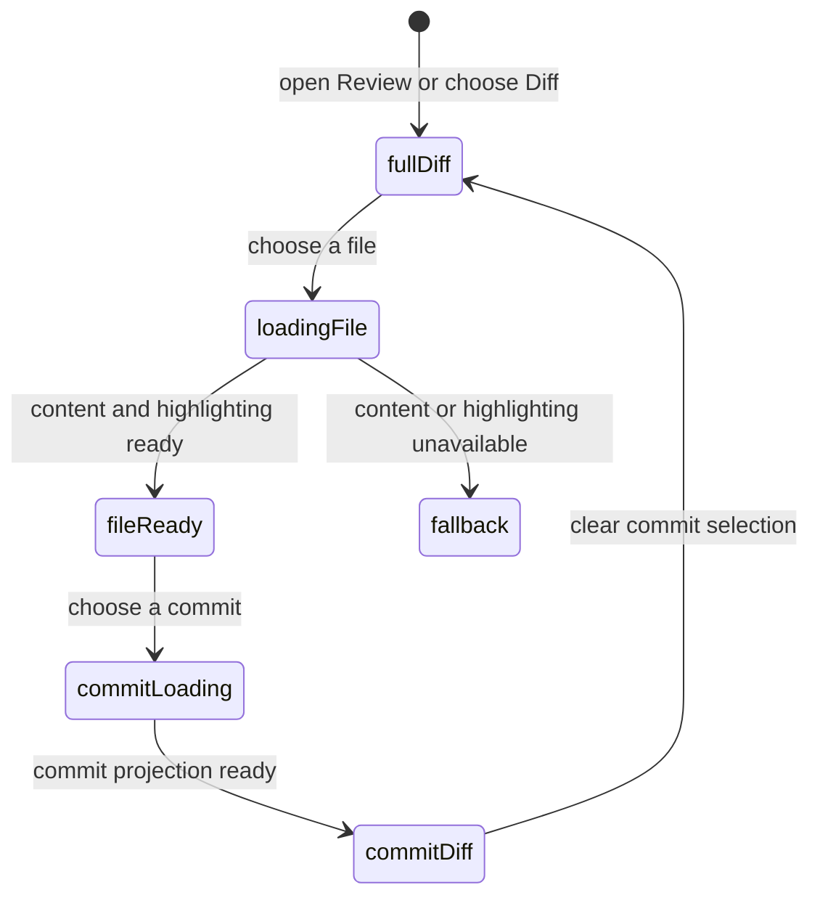

# Files, diff, commits, and navigation

## Summary

The Diff view is the main code-reading surface for a Review. It combines the represented full patch, a file and conversation navigator, optional single-commit diffs, diff display preferences, inline annotations, and keyboard movement. The maintainer reaches it by opening a Review or choosing Diff. Local checkout preparation expands the experience, but a metadata-only Review can still show the GitHub snapshot with reduced local features.

## The simple case

The maintainer chooses a file, reads its hunks, moves through files or changes with the navigator or keyboard, and optionally selects one commit to narrow the patch. Patchdesk hydrates file content only for the current patch generation, keeps the selected file visible, and shows discussion annotations at their mapped lines. The maintainer can return to the full pull-request diff without changing the represented Review.

## The task, event by event

### Arrive

Diff is the default outer tab. The header names the pull request and represented revision, shows Checks and Merge status controls, and offers Refresh GitHub state. The left navigator can show Files, Commits, and Conversation threads. The main pane shows the full patch unless a commit is selected.

The first resolvable file becomes active when no saved active file is valid. Restored position can select an outer tab, navigator section, commit, file, and scroll target only when those values still exist in the current projection.

### Leave unchanged

Scrolling, selecting a file, changing navigator sections, resizing the navigator, changing unified or split layout, toggling wrapping, or selecting a commit changes local view state only. It does not write GitHub or change the Review revision.

### Begin an action

Selecting a file requests its hydrated diff data when needed. Selecting a commit requests a commit-specific projection and replaces the displayed patch after the response is valid. File, hunk, and unresolved-comment keyboard commands compute the next exact target and stop at the first or last item instead of wrapping.

Changing a diff preference updates the view and saves that preference. The navigator and active file update together so the current location can be restored after renderer reload.

### While the action runs

Duplicate hydration requests for the same path and generation share one request. Switching from file A to file B leaves loading ownership with B; a late A response cannot replace B. Several valid hydration results may be coalesced into one render.

A commit-diff load shows a loading state. If it fails, Patchdesk keeps the represented full Review available and shows a commit-diff error rather than substituting an incomplete patch. Syntax highlighting loads before the enhanced CodeView mounts; a plain-text fallback remains available when highlighting cannot load.

### Settle

A valid file response renders only for the patch generation that requested it. A valid commit response shows its author, short SHA, relative time, position, file count, additions, and deletions. Clearing the commit returns to the full pull-request patch.

Keyboard movement shows one visible latest-status message for the resolved file, hunk, or unresolved-thread target and for a first or last boundary. It reports a target only after that target materializes; a fallback never claims false success. One shared generation cancels stale file, hunk, and thread effects. A target that mounts after virtualized scrolling is polled across animation frames, then focused unless the Review became stale.

## Variants

| Variant                                                | Before the action runs                                                                                                                          | While the action runs                                                                                                              |
| ------------------------------------------------------ | ----------------------------------------------------------------------------------------------------------------------------------------------- | ---------------------------------------------------------------------------------------------------------------------------------- |
| Workspace profile and GitHub account                   | Paths and local checkout roots belong to the active profile's prepared Review session.                                                          | A profile change leaves the Review; late hydration for the old session cannot become the new screen.                               |
| Pull request and Review state                          | Open, closed, and merged Reviews can be read. A metadata-only Review explains that local expansion and commit inspection are unavailable.       | Revision change marks the represented Review as having updates; it does not rewrite the patch underneath the maintainer.           |
| GitHub permissions and merge readiness                 | Diff reading does not require write permission. Checks and merge readiness open the PR overview.                                                | Read failures do not change merge authority. A terminal transition can update the header after refresh.                            |
| Network, local tool, and Insight provider availability | Saved patch data can render without an Insight provider. Local `git` and checkout preparation enable local expansion and commit inspection.     | Hydration, commit load, or syntax-highlighting failure falls back or shows a local error without corrupting the represented patch. |
| Input path: mouse, keyboard, or desktop menu           | Files, commits, tabs, and preferences support mouse and keyboard. Plain unmodified shortcuts move through files, hunks, or unresolved comments. | Shortcuts are ignored in text controls, dialogs, with modifiers, or during IME composition.                                        |

## Cancel and interrupt

| Event                                                                                                 | Before the action runs                                                                                                 | While the action runs                                                                                                                                   |
| ----------------------------------------------------------------------------------------------------- | ---------------------------------------------------------------------------------------------------------------------- | ------------------------------------------------------------------------------------------------------------------------------------------------------- |
| Cancel, Stop, or Escape                                                                               | View navigation has no commit action to cancel. Escape closes an active overlay before ordinary diff movement resumes. | Hydration and commit loads have no visible Stop. A newer selection makes the older response irrelevant.                                                 |
| Navigate to another Patchdesk screen, Review, Settings section, or workspace profile                  | Clean reading can leave immediately and saves supported position state.                                                | Leaving makes late file or commit results unable to replace a different Review. Settings overlays the current position.                                 |
| Start another action or request a refresh                                                             | A new file or commit selection can supersede the previous selection.                                                   | Duplicate file requests coalesce; a new patch generation invalidates every old-generation hydration response.                                           |
| GitHub, the network, a local tool, or an Insight provider fails or times out                          | A metadata-only explanation replaces unavailable local features.                                                       | Commit-load error preserves the full diff. Highlighting failure uses plain text. Insight-provider failure does not affect the diff.                     |
| Close Settings, reload the renderer, close the window, or quit Patchdesk                              | Supported tab, navigator, file, commit, and position values are saved for restoration.                                 | A reload discards in-memory requests and restores only values valid for the loaded projection. App close during a file request needs live verification. |
| The pull request, represented revision, pending review, permission, or other target changes elsewhere | Detect updates can mark the Review without replacing its patch.                                                        | A stale-generation response is dropped. Refresh prepares or loads the newer represented revision as a new canonical projection.                         |
| macOS focus, a file or folder picker, or another input path takes control                             | Keyboard navigation runs only from a plain non-editable target outside dialogs.                                        | Focus loss does not change the selected file. Returning focus after virtualized movement needs live verification.                                       |

## Interactions with other systems

**Workspace profile and identity.** The prepared session and local checkout are profile-scoped. Diff reading itself is not viewer-specific.

**Review revision and freshness.** Every hydrated file and Insight annotation is tied to the represented patch generation. Detecting updates never mutates the currently represented revision in place.

**Local persistence and recovery.** Review position and diff preferences are saved. Prepared patches, indexes, and worktrees are local Review data managed separately from UI preferences.

**GitHub permissions and write authority.** Reading and navigation do not grant write authority. Inline authoring is injected only when the separate write preconditions pass.

**Network, local tools, and Insight providers.** GitHub supplies the remote snapshot; `git` and a prepared checkout supply local expansion and commit inspection; syntax highlighting is local renderer work.

**Concurrent operations and locking.** Patch generations, selected-path ownership, and shared duplicate requests prevent late data from taking over the view.

**Feedback, errors, and diagnostics.** Metadata-only state, commit-load failure, refresh failure, and plain-text fallback are distinct messages. The latest keyboard navigation target or boundary is visible feedback, not a diagnostic mode. Scroll diagnostics are implementation evidence, not a maintainer-facing mode.

**Preferences, keyboard commands, and desktop integration.** Unified or split layout, wrapping, theme, navigator width, active file, and position shape the restored view. Desktop menus can open screens but do not choose a diff target.

**Supported input and accessibility limits.** Mouse and keyboard are supported. The plain-text fallback preserves readable content when the enhanced diff cannot mount. Patchdesk does not claim assistive-technology support.

## Edge cases

- An empty patch has no active file and keyboard navigation returns no target.
- A restored file missing from the new patch is treated as unresolved and falls back to the first available file.
- File and hunk navigation stop at boundaries instead of wrapping.
- Two thread IDs on the same file, line, and side remain distinct navigation targets.
- Resolved threads and non-thread annotations are excluded from unresolved-comment navigation.
- Deletion-only hunks remain renderable in filtered walkthrough and fallback patches.
- A failed file hydration is not retried repeatedly in the same generation; a new generation permits another request.
- The enhanced diff waits for highlighting, while the accessible fallback can render without it.
- Keyboard navigation shows only its latest file, hunk, or unresolved-thread target or boundary after materialization; stale effects and fallback failures do not report success.

## Open questions and verification

- Live desktop verification is pending. Confirm virtualized scroll settlement, focus, sticky headers, and the timing of the plain-text fallback.
- Confirm the exact desktop presentation and focus for an unresolved-thread target that materializes through the virtualized portal.
- Confirm which navigator and scroll values survive app quit, not only renderer reload.
- Confirm the visible transition from full diff to commit diff when the selected commit touches no files currently in view.

Baseline drafted from Patchdesk application source commit `3100615`; follow-up behavior updated and verified through `c49045d`.
