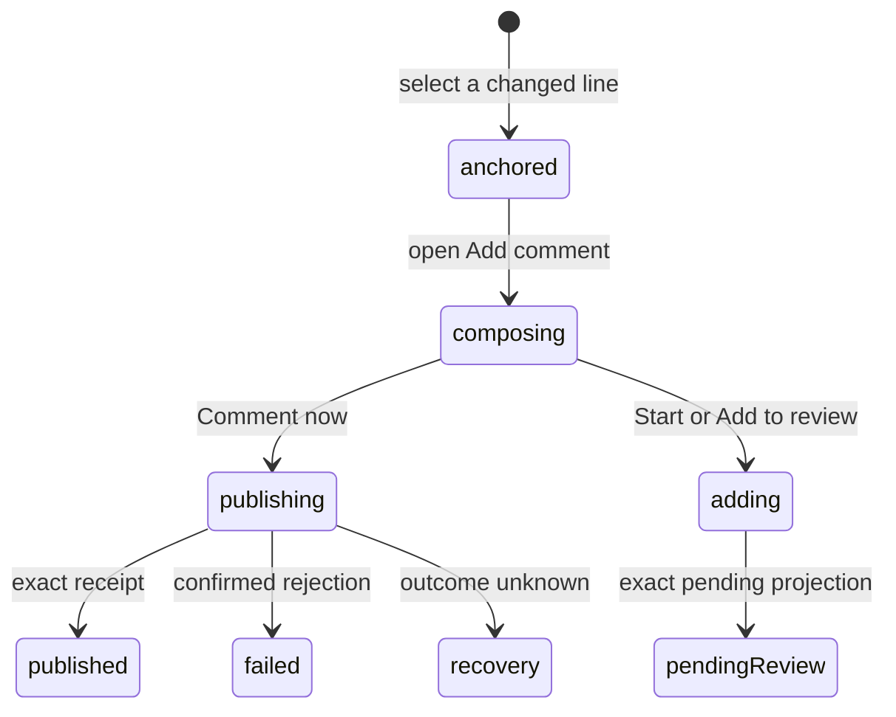

# Inline conversations

## Summary

Inline conversations attach GitHub review comments and Patchdesk pending-review comments to exact diff locations. The maintainer reaches them in Diff, in the Conversation-thread navigator, and in Analysis evidence. Direct publication is available only for an open, Fresh Review with a represented patch hash and no recovery lock. A pending review can instead collect comments for one later Finish review submission.

## The simple case

The maintainer selects a changed line, writes a comment, and chooses either Comment now or Start a review. Comment now publishes directly to GitHub and shows a pending card until the typed receipt confirms it. Start a review creates GitHub's pending review, adds the comment, closes the composer, and shows the authoritative pending-review card. Published thread cards can then expose Reply, Resolve, Edit, and Delete when the returned GitHub identifiers and ownership allow them.

## The task, event by event

### Arrive

Existing comments render as annotations on their mapped file, side, and line. Thread cards distinguish open, resolved, outdated, unknown, pending-review, locally publishing, published comment-only, and failed local creation states. The navigator lists conversation threads for the represented revision and can move focus to the matching card.

Add comment appears only on eligible changed lines when direct conversation authoring is enabled. A stale, closed, merged, patchless, or recovery-locked Review remains readable but does not expose the authoring action.

### Leave unchanged

Selecting a line or opening and cancelling the composer records nothing. An empty draft cannot submit. Moving among files does not publish the draft; whether an open composer remains mounted across file switches needs live verification.

### Begin an action

The composer fingerprints the represented session, head SHA, patch hash, path, side, and line. Ctrl+Enter uses the same guarded submission as the visible action.

When no pending review exists, the maintainer can publish immediately or Start a review. When a pending review already exists, Add to review appends the comment to it. The selected action is fixed for that submission; switching buttons does not create two writes.

### While the action runs

Submission is admitted synchronously once, including same-tick clicks or Ctrl+Enter. The composer and its action controls show the busy action and prevent duplicates.

Direct publication shows a temporary publishing card. A rejected direct write converts it to a failed card with Dismiss and no GitHub thread controls. An outcome-unknown direct write removes the speculative card because durable recovery, not an optimistic object, must determine what GitHub contains.

Start a review closes the composer immediately and shows a transient starting card. A confirmed rejection leaves a bounded failed card. Success replaces it with the authoritative pending-review thread.

### Settle

A direct `CommentCreated` receipt confirms the comment. If it includes a GitHub thread ID, the card upgrades to full thread controls; without a thread ID, it stays comment-only and explains why Reply and Resolve are unavailable. Read-back later reconciles the optimistic published card with authoritative GitHub data.

A pending-review command settles only from its returned pending-review projection. Newly created thread IDs enter the recent-write journal. A forbidden Resolve or Unresolve keeps the thread visible and gives permission or access guidance; Patchdesk does not assume permission through a preflight check. Other thread-state errors use generic retryable failure guidance. Malformed success or unknown outcome locks pending-review mutation until explicit recovery reloads the Review or reports that manual resolution is required.

## Variants

| Variant                                                | Before the action runs                                                                                                             | While the action runs                                                                                                                                                                        |
| ------------------------------------------------------ | ---------------------------------------------------------------------------------------------------------------------------------- | -------------------------------------------------------------------------------------------------------------------------------------------------------------------------------------------- |
| Workspace profile and GitHub account                   | The active profile and viewer identity determine the repository and ownership controls.                                            | A profile switch cannot reuse a location fingerprint from the prior Review session.                                                                                                          |
| Pull request and Review state                          | Direct authoring needs an open, Fresh Review with a patch hash. Pending-review availability decides which composer actions appear. | Terminal or revision changes discovered by the shared gate prevent a stale direct write.                                                                                                     |
| GitHub permissions and merge readiness                 | Comment and thread-state permission are independent of merge readiness. Existing comments stay readable without write permission.  | A forbidden response becomes a confirmed rejection; Resolve or Unresolve retains the thread and explains the permission or access problem. Patchdesk does not call it published or resolved. |
| Network, local tool, and Insight provider availability | Diff data must contain the target location. No Insight provider is required for manual authoring.                                  | Network uncertainty triggers recovery. Local highlighting failure can use plain text without changing the comment fingerprint.                                                               |
| Input path: mouse, keyboard, or desktop menu           | Mouse selects lines and buttons; keyboard can reach the fallback composer and use Ctrl+Enter.                                      | Both paths share the same synchronous duplicate guard. Desktop menus do not publish comments.                                                                                                |

## Cancel and interrupt

| Event                                                                                                 | Before the action runs                                                                                        | While the action runs                                                                                                                                     |
| ----------------------------------------------------------------------------------------------------- | ------------------------------------------------------------------------------------------------------------- | --------------------------------------------------------------------------------------------------------------------------------------------------------- |
| Cancel, Stop, or Escape                                                                               | Cancel closes the composer and discards its renderer-only draft.                                              | No Stop exists after a GitHub request begins. Pending controls stay guarded until settlement.                                                             |
| Navigate to another Patchdesk screen, Review, Settings section, or workspace profile                  | A non-empty composer makes the Review navigation state dirty.                                                 | A pending write makes navigation state write-pending and blocks leaving until the outcome is known.                                                       |
| Start another action or request a refresh                                                             | Another composer may open only within the current UI's selection rules; each submission has its own location. | Same-composer duplicates are ignored. Refresh and other writes wait behind the detect/write coordinator.                                                  |
| GitHub, the network, a local tool, or an Insight provider fails or times out                          | Unavailable GitHub authoring leaves the diff readable.                                                        | Confirmed rejection keeps a failed or retryable surface; unknown outcome removes speculation and pauses writes.                                           |
| Close Settings, reload the renderer, close the window, or quit Patchdesk                              | Settings overlays the diff. Renderer-only drafts do not have documented restart persistence.                  | Durable unknown outcomes restore the write pause after reload. Window-close behavior during a confirmed-but-unreconciled comment needs live verification. |
| The pull request, represented revision, pending review, permission, or other target changes elsewhere | A changed revision makes the old location ineligible for a new write.                                         | The exact session, head, patch hash, and pending-review receipt prevent another target from confirming this action.                                       |
| macOS focus, a file or folder picker, or another input path takes control                             | Keyboard shortcuts are ignored inside text fields and dialogs.                                                | Focus loss does not cancel publication. Focus placement after failure or reconciliation needs live verification.                                          |

## Interactions with other systems

**Workspace profile and identity.** Profile, host, repository, and viewer ownership scope every comment action.

**Review revision and freshness.** Location fingerprints and direct-write authority bind authoring to the represented revision. An outdated Review is readable but not writable.

**Local persistence and recovery.** Recent-write entries preserve confirmed comments across delayed reads. Unknown outcomes persist in the review-write or pending-review recovery journal.

**GitHub permissions and write authority.** Only typed receipts and exact returned projections confirm publication. A local pending card is never treated as GitHub authority.

**Network, local tools, and Insight providers.** GitHub performs publication. Local diff rendering provides the anchor. Analysis can propose a comment through a separate path, but manual comments need no model.

**Concurrent operations and locking.** Synchronous component guards prevent double submission; the Review coordinator orders detection and mutation; recovery locks all writers.

**Feedback, errors, and diagnostics.** Publishing, failed, pending-review, published, and comment-only cards are visibly distinct. Errors stay with the composer or card and never expose raw provider or command detail.

**Preferences, keyboard commands, and desktop integration.** Diff layout and wrapping change presentation but not fingerprints. Ctrl+Enter mirrors the visible action; desktop menus do not author.

**Supported input and accessibility limits.** The accessible plain-text diff includes an authoring fallback. Keyboard and mouse are supported; assistive-technology behavior is not claimed.

## Edge cases

- A direct comment receipt without a thread ID confirms the comment but cannot enable Reply or Resolve.
- A read-back that later finds the thread ID upgrades the card to full controls.
- A failed direct create card has Dismiss but no GitHub controls.
- An unknown direct-create outcome leaves no speculative card because recovery owns reconciliation.
- Pending-review thread cards never expose published-thread Reply or Resolve controls.
- Two threads at the same line remain distinct by GitHub thread ID.
- A response from an older patch generation cannot attach to the current diff.
- Analysis Findings outside the represented diff cannot offer Add to review.
- Resolve and Unresolve do not preflight permission. A forbidden response retains the thread and gives permission or access guidance; other errors use generic failure guidance.

## Open questions and verification

- Live desktop verification is pending. Confirm line-selection affordance, composer placement, focus, and the transition among publishing, pending, and published cards.
- Confirm whether Cancel can be invoked with Escape in both enhanced and plain-text diff renderers.
- Confirm navigation behavior when a non-empty composer is open and the maintainer selects another file.
- Confirm the visible recovery path when a pending-review Start outcome is unknown and no speculative card remains.

Baseline drafted from Patchdesk application source commit `3100615`; follow-up behavior updated and verified through `c49045d`.
