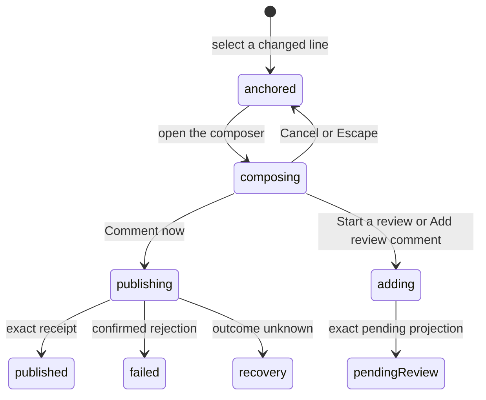

# Inline conversations

## Summary

Inline conversations attach GitHub review comments and Patchdesk pending-review comments to exact diff locations. The maintainer reaches them in Diff, in the Threads tab of the navigator, and in Analysis evidence. Direct publication is available only for an open, Fresh Review with a represented patch hash and no recovery lock. A pending review can instead collect comments for one later Finish review submission.

## The simple case

The maintainer selects a changed line and writes a comment. With no pending review, the composer offers Start a review, Comment now, and Cancel. Comment now publishes directly to GitHub and shows a pending card until the typed receipt confirms it. Start a review creates GitHub's pending review, adds the comment, closes the composer, and shows the authoritative pending-review card. With a pending review, the composer offers Add review comment instead. Published thread cards can then expose Reply, Resolve, Edit, and Delete when the returned GitHub identifiers and ownership allow them.

Comment bodies in every inline card render as Markdown, including images and links, by the rules [Conversation](conversation-and-metadata.md#arrive) describes.

## The task, event by event

### Arrive

Existing comments render as annotations on their mapped file, side, and line. Thread cards distinguish open, resolved, outdated, unknown, pending-review, locally publishing, published comment-only, and failed local creation states. Each card renders its comment bodies as Markdown with images and links. The Threads tab lists conversation threads for the represented revision and can move focus to the matching card.

The composer appears only on eligible changed lines when direct conversation authoring is enabled. A stale, closed, merged, patchless, or recovery-locked Review remains readable but does not expose the authoring action.

### Leave unchanged

Selecting a line records nothing. Cancel or Escape closes an empty composer at once. When the draft holds text, Patchdesk first asks "Discard this unsent comment?"; declining keeps the composer and its text. An empty draft cannot submit: its submit buttons stay disabled. Moving among files does not publish the draft; whether an open composer remains mounted across file switches needs live verification.

### Begin an action

The composer names the location, such as `path:12–14`, and what submitting does: "publishes to GitHub", "joins your pending review on GitHub", or "GitHub write is paused". It fingerprints the represented session, head SHA, patch hash, path, side, and line. The hint beneath it reads "Press ⌘/Ctrl+Enter to comment. Escape cancels." Either ⌘+Enter or Ctrl+Enter submits through the same guarded path as the buttons.

When no pending review exists, the maintainer can Comment now or Start a review. When a pending review already exists, Add review comment appends the comment to it. When pending-review actions are not available for the Review, the composer offers only Comment, which publishes directly. The selected action is fixed for that submission; switching buttons does not create two writes.

The keyboard shortcut does not choose Comment now. It runs Add review comment when a pending review exists, Start a review when none exists, and Comment when pending-review actions are not available.

If the pending review's state is unavailable or needs recovery, the text field is disabled, the shortcut does nothing, and the composer says "Pending review state is unavailable. Check GitHub again or refresh before commenting."

### While the action runs

Submission is admitted synchronously once, including same-tick clicks or ⌘/Ctrl+Enter. The chosen button reads Commenting…, Starting…, or Adding…, and every submit button and Cancel are disabled.

Direct publication shows a temporary publishing card. A rejected direct write converts it to a failed card with Dismiss and no GitHub thread controls. An outcome-unknown direct write removes the speculative card because durable recovery, not an optimistic object, must determine what GitHub contains.

Start a review closes the composer immediately and shows a transient starting card. A confirmed rejection leaves a bounded failed card. Success replaces it with the authoritative pending-review thread.

### Settle

A direct `CommentCreated` receipt confirms the comment. If it includes a GitHub thread ID, the card upgrades to full thread controls; without a thread ID, it stays comment-only and explains why Reply and Resolve are unavailable. Read-back later reconciles the optimistic published card with authoritative GitHub data.

A composer that fails keeps its text and shows a message for the cause:

- The pull request changed: "This pull request has changed. Refresh and try again."
- GitHub rejected the comment: "GitHub rejected this comment."
- The location no longer fits the diff: "This comment cannot be published against the current diff."
- GitHub could not confirm the write: "GitHub could not confirm this write. Check GitHub again before trying again."
- The pending review changed or is locked: "The pending review changed. Refresh to see its current state."
- Access is forbidden: "GitHub blocked this comment: the repository or organization restricts access here. Retrying will not help — check GitHub's access settings for this organization."
- Any other failure: "Patchdesk could not publish this comment (`<kind>`). Try refreshing."

A pending-review command settles only from its returned pending-review projection. Newly created thread IDs enter the recent-write journal. A forbidden Resolve or Unresolve keeps the thread visible and says "GitHub denied this thread update. Use an authorized account with repository write access."; Patchdesk does not assume permission through a preflight check. Other thread-state errors say "Patchdesk could not update this thread." A failed reply, edit, or delete shows one fixed sentence each: "Patchdesk could not publish this reply.", "Patchdesk could not edit this comment.", or "Patchdesk could not delete this comment." Malformed success or unknown outcome locks pending-review mutation until explicit recovery reloads the Review or reports that manual resolution is required.

## Variants

| Variant                                                | Before the action runs                                                                                                             | While the action runs                                                                                                                                                                        |
| ------------------------------------------------------ | ---------------------------------------------------------------------------------------------------------------------------------- | -------------------------------------------------------------------------------------------------------------------------------------------------------------------------------------------- |
| Workspace profile and GitHub account                   | The active profile and viewer identity determine the repository and ownership controls.                                            | A profile switch cannot reuse a location fingerprint from the prior Review session.                                                                                                          |
| Pull request and Review state                          | Direct authoring needs an open, Fresh Review with a patch hash. Pending-review availability decides which composer actions appear. | Terminal or revision changes discovered by the shared gate prevent a stale direct write.                                                                                                     |
| GitHub permissions and merge readiness                 | Comment and thread-state permission are independent of merge readiness. Existing comments stay readable without write permission.  | A forbidden response becomes a confirmed rejection; Resolve or Unresolve retains the thread and explains the permission or access problem. Patchdesk does not call it published or resolved. |
| Network, local tool, and Insight provider availability | Diff data must contain the target location. No Insight provider is required for manual authoring.                                  | Network uncertainty triggers recovery. Local highlighting failure can use plain text without changing the comment fingerprint.                                                               |
| Input path: mouse, keyboard, or desktop menu           | Mouse selects lines and buttons; keyboard can reach the fallback composer and use ⌘+Enter or Ctrl+Enter.                          | Both paths share the same synchronous duplicate guard. Desktop menus do not publish comments.                                                                                                |

## Cancel and interrupt

| Event                                                                                                 | Before the action runs                                                                                                        | While the action runs                                                                                                                                     |
| ----------------------------------------------------------------------------------------------------- | ----------------------------------------------------------------------------------------------------------------------------- | --------------------------------------------------------------------------------------------------------------------------------------------------------- |
| Cancel, Stop, or Escape                                                                               | Cancel or Escape closes an empty composer. A composer with text asks "Discard this unsent comment?" before discarding it.     | Cancel is disabled and no Stop exists after a GitHub request begins. Pending controls stay guarded until settlement.                                     |
| Navigate to another Patchdesk screen, Review, Settings section, or workspace profile                  | A non-empty composer makes the Review navigation state dirty.                                                                 | A pending write makes navigation state write-pending and blocks leaving until the outcome is known.                                                       |
| Start another action or request a refresh                                                             | Another composer may open only within the current UI's selection rules; each submission has its own location.                 | Same-composer duplicates are ignored. Refresh and other writes wait behind the detect/write coordinator.                                                  |
| GitHub, the network, a local tool, or an Insight provider fails or times out                          | Unavailable GitHub authoring leaves the diff readable.                                                                        | Confirmed rejection keeps a failed or retryable surface; unknown outcome removes speculation and pauses writes.                                           |
| Close Settings, reload the renderer, close the window, or quit Patchdesk                              | Settings overlays the diff. Renderer-only drafts do not have documented restart persistence.                                  | Durable unknown outcomes restore the write pause after reload. Window-close behavior during a confirmed-but-unreconciled comment needs live verification. |
| The pull request, represented revision, pending review, permission, or other target changes elsewhere | A changed revision makes the old location ineligible for a new write.                                                         | The exact session, head, patch hash, and pending-review receipt prevent another target from confirming this action.                                       |
| macOS focus, a file or folder picker, or another input path takes control                             | Diff keyboard shortcuts are ignored inside text fields and dialogs; the composer's own ⌘/Ctrl+Enter and Escape still work.   | Focus loss does not cancel publication. Focus placement after failure or reconciliation needs live verification.                                          |

## Interactions with other systems

**Workspace profile and identity.** Profile, host, repository, and viewer ownership scope every comment action.

**Review revision and freshness.** Location fingerprints and direct-write authority bind authoring to the represented revision. An outdated Review is readable but not writable.

**Local persistence and recovery.** Recent-write entries preserve confirmed comments across delayed reads. Unknown outcomes persist in the review-write or pending-review recovery journal.

**GitHub permissions and write authority.** Only typed receipts and exact returned projections confirm publication. A local pending card is never treated as GitHub authority.

**Network, local tools, and Insight providers.** GitHub performs publication and serves the images in comment bodies. Local diff rendering provides the anchor. Analysis can propose a comment through a separate path, but manual comments need no model.

**Concurrent operations and locking.** Synchronous component guards prevent double submission; the Review coordinator orders detection and mutation; recovery locks all writers.

**Feedback, errors, and diagnostics.** Publishing, failed, pending-review, published, and comment-only cards are visibly distinct. Composer errors name their cause; thread errors distinguish forbidden from other failures. Errors stay with the composer or card and never expose raw provider or command detail.

**Preferences, keyboard commands, and desktop integration.** Diff layout and wrapping change presentation but not fingerprints. ⌘/Ctrl+Enter submits and Escape cancels; desktop menus do not author.

**Supported input and accessibility limits.** The accessible plain-text diff includes an authoring fallback. Keyboard and mouse are supported; assistive-technology behavior is not claimed.

## Edge cases

- A direct comment receipt without a thread ID confirms the comment but cannot enable Reply or Resolve.
- A read-back that later finds the thread ID upgrades the card to full controls.
- A failed direct create card has Dismiss but no GitHub controls.
- An unknown direct-create outcome leaves no speculative card because recovery owns reconciliation.
- Pending-review thread cards never expose published-thread Reply or Resolve controls.
- Pending-review cards and publishing cards render their bodies with images and links, like published thread cards.
- Two threads at the same line remain distinct by GitHub thread ID.
- A response from an older patch generation cannot attach to the current diff.
- Analysis Findings outside the represented diff cannot offer Add to review.
- Resolve and Unresolve do not preflight permission. A forbidden response retains the thread and gives the access sentence above; other errors use the generic sentence.
- A draft of only whitespace counts as empty.

## Open questions and verification

- Confirmed live on 2026-09-14: the composer's Start a review, Comment now, and Cancel labels; the hint "Press ⌘/Ctrl+Enter to comment. Escape cancels."; disabled submit buttons for an empty draft; Cancel closing an empty composer with no write.
- Suspected defect: the hint says ⌘/Ctrl+Enter comments, but with no pending review the shortcut runs Start a review, which creates a GitHub pending review instead of publishing the comment. See [B-17](../bug-triage.md#b-17-the-inline-composer-shortcut-starts-a-review-while-its-hint-says-comment).
- Not checked live: image and link rendering inside inline cards, thread states, replies, and failure wording. No Review in the workspace had an inline thread, and each failure needs a rejected GitHub write.
- Confirm line-selection affordance, composer placement, focus, and the transition among publishing, pending, and published cards.
- Confirm Escape and the discard question in the plain-text diff composer as well as the enhanced diff.
- Confirm navigation behavior when a non-empty composer is open and the maintainer selects another file.
- Confirm the visible recovery path when a pending-review Start outcome is unknown and no speculative card remains.

Baseline drafted from Patchdesk application source commit `3100615`; verified against `dd613996`, with live checks from the 2026-09-14 pass.
