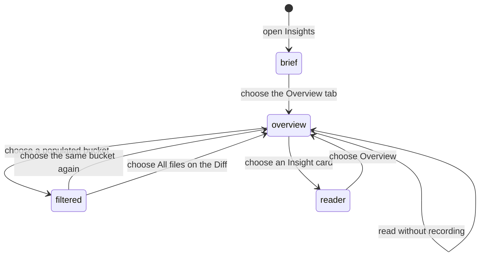

# Insights overview

## Summary

Overview is the Insights screen that says what is known about this revision before the maintainer reads any single Insight. It is the first tab in the Insight tab strip, but Insights opens on [Brief](brief.md); the maintainer reaches Overview by choosing its tab. It carries the Scope card, a deterministic account of what the change touches, and one card each for Brief, Walkthrough, and Analysis with their current status. Overview records nothing and sends nothing to GitHub. Its only actions are choosing a Scope bucket, which filters the Diff, and choosing a card, which opens that Insight.

## The simple case

The maintainer chooses Insights, lands on Brief, and chooses the Overview tab. The Scope card shows one bar and five named buckets with their added and removed line counts, so the maintainer can see at a glance that a large diff is mostly generated files. Choosing Core takes them to the Diff with the tree and the pane narrowed to the core files. Coming back, they choose the Analysis card and read its findings.

## The task, event by event

### Arrive

Insights opens on Brief, including when no Brief has been generated; the Brief empty state and its Generate brief action are then the first thing shown. Returning to Insights from another workbench tab opens Brief again. Overview is the first tab in the Insight tab strip, ahead of Brief, Walkthrough, and Analysis. Each of those three tabs carries its own status badge, so the strip already says what exists before anything is opened.

> Technical note: the selected Insight is state of the Insights panel, which the workbench mounts only while the Insights tab is shown, so every return starts from Brief.

The Scope card sits at the top of Overview. It names the number of changed files, draws one bar whose segments are the changed lines per bucket, and lists five rows in a fixed order: Core, Tests, Generated, Docs, Config. A row with files shows that bucket's added and removed line counts. A row with no file is dimmed and shows a long dash in place of the counts, which says this change has no such file rather than leaving the reader to notice a missing row. A closing line reads "Buckets come from this repository's path rules. No model involved."

Every changed file lands in exactly one bucket, and the rules are tried in a fixed order, by file path alone. Generated comes first: lockfiles, files with `.generated.` in the name, snapshot files and snapshot directories, and `api-report` Markdown files. Then tests: files under a test, end-to-end, or fixture directory, plus the test file-name conventions of the common languages. Then docs: anything under a docs directory, Markdown files, and changelog or licence files. Then config: dot files at the repository root, any file under a `.github` or `scripts` directory, TypeScript configuration, files with `.config.` in the name, and JSON, YAML, or TOML data outside the source tree. Everything left is core. Because generated is tried first, a generated snapshot stored under a test directory reads as generated, and an `api-report` Markdown file reads as generated rather than docs.

Patchdesk does not read `.gitattributes`. A file the repository marks as generated there, but whose path matches none of the generated rules, lands in another bucket. The `.github` rule covers every file in that directory, including issue templates, `CODEOWNERS`, and Dependabot configuration, not only workflows.

> Technical note: the domain rule accepts a list of `linguist-generated` paths and a file-banner check, but the workbench and the pull-request list build the Scope gauge from the stored unified patch with no such list and no file contents, so only the path rules apply.

The bar keeps a visible sliver for any bucket that changed at least one line, so a one-line config change beside a large lockfile does not disappear.

Below the Scope card sit three cards in reading order: Brief, then Walkthrough, then Analysis. Each card shows its name, one headline line, and a status badge. Brief's headline is its Start here lead, or the title of its first Flow view. Walkthrough's headline is its chapter and section count. Analysis's headline is its verdict, how many findings still need attention, and the current CI state. A card with nothing retained leaves its headline blank, so only its status badge names the state. A card with a retained result also says how long ago it was retained.

The status badge reads Not generated, Running, Current, Outdated, or Failed. Running carries a spinner. Current is the only state whose document can navigate the live code, and it is the only one drawn as a success.

### Leave unchanged

Reading Overview, reading the Scope card, and leaving the tab record nothing. Overview starts no provider run, writes nothing to GitHub, and does not change any retained Insight. The Scope card is derived from the represented patch alone, so opening it costs no network call.

### Begin an action

Choosing a bucket row that has files applies the Scope filter. A row with no file is plain text, not a button, so there is nothing to choose. The Brief reader shows the same Scope card in its side column, where every row stays plain text because that card cannot filter the Diff.

Choosing an Insight card opens that Insight's reader in place of Overview, the same as choosing its tab.

### While the action runs

Both actions settle at once. The Scope filter is worked out locally from the represented patch, and opening a card only changes which Insight is selected. Neither waits on a provider, on GitHub, or on any stored write.

### Settle

Applying a bucket moves the maintainer to the Diff tab and its Browse section. The file tree and the diff pane both narrow to that bucket's files, listed in the order the patch gives them. If the file that was already selected belongs to the bucket, it stays selected; otherwise the first file of the bucket is selected instead. The chosen bucket row on the Scope card is marked as pressed.

The Diff toolbar carries a Scope picker showing the active bucket in that bucket's colour, so the same filter can be chosen and changed without returning to Overview. Choosing Clear scope there clears the filter, as does choosing the same bucket on the Scope card again. Moving to the Commits section, or choosing a commit there, clears it too, so a commit slice and a bucket slice never compete over the same pane.

The filter is a way of reading this diff now, not a place to return to. It is session-local and is never stored with the saved workbench position, so a reload comes back unfiltered. Moving to a newer represented revision also drops it along with the rest of the position.

## Variants

| Variant                                                | Before the action runs                                                                                                     | While the action runs                                                                                        |
| ------------------------------------------------------ | ---------------------------------------------------------------------------------------------------------------------------- | -------------------------------------------------------------------------------------------------------------- |
| Workspace profile and GitHub account                   | Overview belongs to a profile-scoped Review session. Viewer identity does not change what the cards say.                    | A profile switch leaves the Review; the filter and the selected card do not travel with it.                  |
| Pull request and Review state                          | Overview can be read for open or terminal Reviews. Scope needs a readable represented patch.                                | Card status can change as a run settles. The Scope card stays bound to the represented patch.                |
| GitHub permissions and merge readiness                 | Overview needs no GitHub write permission and no merge readiness.                                                           | Neither a Scope filter nor a card choice can change checks, review decision, or merge readiness.             |
| Network, local tool, and Insight provider availability | Scope and every card can be read with no provider available. Generating an Insight is a separate action inside its reader.  | The Scope filter needs nothing outside the represented patch. A provider failure only changes a card badge.  |
| Input path: mouse, keyboard, or desktop menu           | Tabs, bucket buttons, and cards are reachable by mouse or keyboard, and a chosen bucket reports itself as pressed.          | Both input paths take the same route. Desktop menus do not filter the Diff or open an Insight.               |

## Cancel and interrupt

| Event                                                                                                 | Before the action runs                                                                                    | While the action runs                                                                                             |
| ----------------------------------------------------------------------------------------------------- | ----------------------------------------------------------------------------------------------------------- | --------------------------------------------------------------------------------------------------------------------- |
| Cancel, Stop, or Escape                                                                               | There is nothing to cancel; reading Overview records nothing.                                             | Neither action has a meaningful in-flight Stop. Clearing the filter is the way back.                              |
| Navigate to another Patchdesk screen, Review, Settings section, or workspace profile                  | Overview can be left without a guard. Coming back to Insights opens Brief, not Overview.                  | Leaving drops the session-local filter. It cannot follow the maintainer into another Review.                      |
| Start another action or request a refresh                                                             | Any bucket or card can be chosen at once; there is no queue.                                              | A second bucket replaces the first. A GitHub refresh can change card status without touching the filter.          |
| GitHub, the network, a local tool, or an Insight provider fails or times out                          | Scope is readable during any outage. A failed run shows on its card as Failed.                            | A failed run leaves the retained result and its Overview headline in place. The Scope filter is unaffected.       |
| Close Settings, reload the renderer, close the window, or quit Patchdesk                              | Retained Insights are durable; the Scope filter is not.                                                   | A reload returns to an unfiltered Diff. Card status is rebuilt from the durable run and artifact state.           |
| The pull request, represented revision, pending review, permission, or other target changes elsewhere | A newer revision can move a card from Current to Outdated while its document stays readable.              | Moving to a newer represented revision clears the filter along with the rest of the workbench position.           |
| macOS focus, a file or folder picker, or another input path takes control                             | Focus can move across the tab strip, bucket buttons, and cards without acting.                            | Focus loss neither applies nor clears a filter. Focus placement after landing on the Diff needs live checking.    |

## Interactions with other systems

**Workspace profile and identity.** Overview is scoped to the profile's Review session. Nothing on it depends on the GitHub viewer.

**Review revision and freshness.** Scope describes the represented patch, and every card names the state of one Insight for that same revision. Outdated says the retained document no longer stands for the current revision.

**Local persistence and recovery.** Retained Insights and their generation times are durable. The Scope filter is deliberately not: it is left out of the saved workbench position. The selected Insight tab is not restored either; Insights opens on Brief.

**GitHub permissions and write authority.** Overview is read-only with respect to GitHub. Neither filtering nor opening a card carries any write authority.

**Network, local tools, and Insight providers.** Scope is deterministic and needs no model. Card status reflects the separate Insight run lifecycle owned by each reader.

**Concurrent operations and locking.** One bucket is active at a time, and a commit slice and a bucket filter cannot both own the pane.

**Feedback, errors, and diagnostics.** Not generated, Running, Current, Outdated, and Failed are distinct card states, each with its own tone. Overview does not restate a run's error text; the reader for that Insight does.

**Preferences, keyboard commands, and desktop integration.** The Scope card shares its bucket names and colours with the Diff toolbar's Scope picker and with the gauge shown in the pull-request list and the workbench header, so a bucket reads the same everywhere.

**Supported input and accessibility limits.** The bar carries a single sentence naming each bucket with its counts, used as both the accessible name and the hover text. Patchdesk does not claim screen-reader, touch, or pen support.

## Edge cases

- The Scope card is absent when the represented patch could not be read; the three Insight cards still show.
- A bucket with no changed file is dimmed, shows a long dash instead of counts, and cannot be chosen.
- Every bucket with at least one changed line keeps a visible sliver of the bar, however small its share.
- A generated file stored under a test directory reads as generated, because the generated rule is tried first.
- An `api-report` Markdown file reads as generated, not docs, for the same reason.
- A file marked `linguist-generated` in `.gitattributes` is classified by its path alone.
- A file under `.github` or `scripts` at any depth reads as config, unless an earlier rule claims it first.
- A file deleted by the change is classified under the path it had.
- Choosing an already active bucket clears the filter rather than reapplying it.
- Choosing a bucket while a file outside it is selected moves the selection to the bucket's first file.
- Moving to Commits, or choosing a commit there, clears an active Scope filter.
- A card with no retained result shows a blank headline and no retained time; its status badge carries the state.
- A Brief with no Start here lead falls back to the title of its first Flow view for its headline.
- An Analysis card counts only the findings still needing attention, using the same rule as merge readiness, so the card and the readiness card never disagree.

## Open questions and verification

- The 2026-09-14 live pass confirmed the Scope card layout, the dimmed empty rows with a long dash, the closing line, the sliver for a small bucket, bucket navigation to Diff → Browse with the toolbar Scope picker, clearing through All files, clearing on Commits, and landing on Brief when Insights opens (three pull requests).
- [UX-09](../ux-friction.md#ux-09-the-pressed-scope-bucket-row-looks-unpressed) is fixed: the pressed bucket row is tinted and bolded, where the live pass could not tell it apart from an unpressed row. The new treatment is not yet live-verified.
- `.gitattributes`-marked generated files are ignored by the Scope card even though the domain rule accepts them. Filed as a product call in [B-24](../bug-triage.md#b-24-repository-marked-generated-files-do-not-reach-the-scope-gauge).
- No retained Insight existed in the live workspace. Card headlines, retained-time wording, and the Current to Outdated change on a moved revision remain unchecked.
- Confirm where focus lands after choosing a bucket sends the maintainer to the Diff.
- Confirm what the Diff shows when a bucket's files are all hidden by another active view state.

Baseline drafted from Patchdesk application source commit `d00c5178`; revised and verified against `737c515c`.
