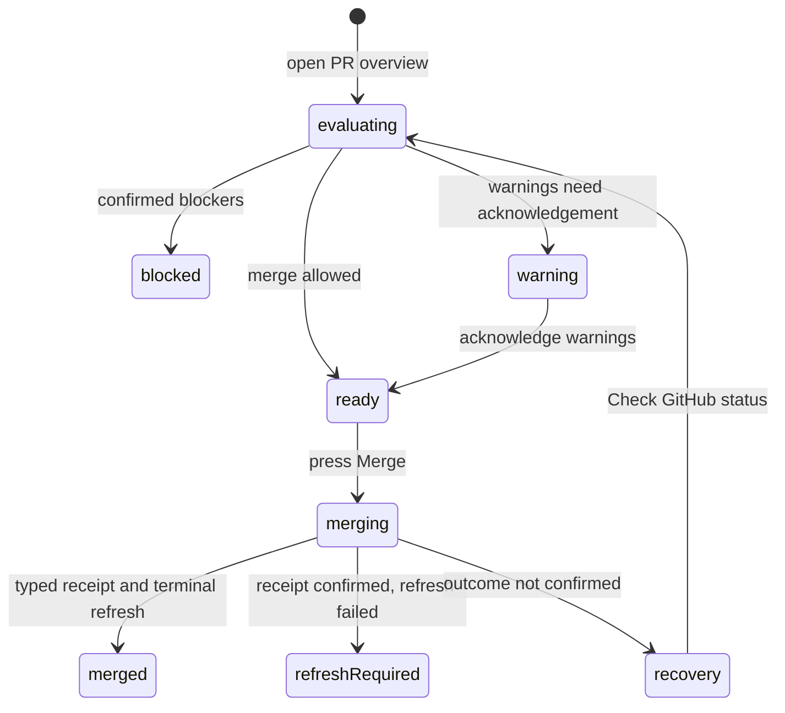

# Merge

## Summary

Merge evaluates the represented pull request's exact revision, required checks, GitHub mergeability, policy evidence, warnings, allowed merge methods, and write-recovery state before offering one explicit GitHub merge. The maintainer reaches it from the Merge status control and PR overview, whose rows this page describes in full. Patchdesk never automatically retries an uncertain merge.

## The simple case

The maintainer opens PR overview from the Checks or Merge status control, reviews readiness, chooses Squash, Merge, or Rebase, acknowledges any warnings tied to the represented revision, and presses Merge once. Patchdesk sends the exact head, base, patch hash, refresh revision, method, and acknowledged warning codes. A typed receipt makes the Review terminal immediately; Patchdesk then reloads GitHub state and shows the merge commit when available.

## The task, event by event

### Arrive

The Review header shows separate Checks and Merge status controls. Both open PR overview with Revision, Review status, and Merge readiness expanded. The Checks control also expands the Checks row and moves focus to it; the Merge control leaves Checks collapsed and moves focus to the Merge readiness row. PR overview is a drawer on the right titled "PR overview", with the repository, pull-request number, and title beneath. It has four collapsible rows, in this order:

- **Revision.** Its label states freshness: Current, Updates available, Remote state unavailable, Not refreshed, or Unavailable. Expanded, it shows base ← head branches, "Refreshed" with a relative time, and the commit and changed-file counts. When GitHub reports a newer head than the represented one, it also shows the Reviewed and Current short SHAs. Without revision data it reads "Revision details unavailable." [Review session and revision](../foundations/review-session-and-revision.md) owns what each freshness state means.
- **Checks.** Its label states the overall check result, such as Passing or Failing, and its body lists the checks.
- **Review status.** One line each for Brief, Analysis, and Walkthrough, with the Insight's icon and its status: Not generated, Running, Current, Outdated, or Failed. The Insight tab strip owns those Insights ([Brief](brief.md#arrive)).
- **Merge readiness.** Its label reads Ready to merge, Warnings, Blocked, or Unknown, and its body holds the reasons, warnings, and the merge command.

Readiness distinguishes Ready, Needs acknowledgement, and Blocked. Blockers and warnings remain separate. With none of either, the row says "No blockers or warnings." The merge command appears inside Merge readiness only while the Review is not terminal and readiness is not Blocked. A merged or closed Review adds a footer: "This Review is merged." or the same sentence with closed. Open P0 or P1 findings from the current Analysis appear as one card that counts them; its Review findings action closes PR overview and opens the first of those findings on the Insights tab. A sole unknown-mergeability condition is not presented with the same destructive certainty as a confirmed policy block: the row label reads Unknown in an informational tone.

A reason GitHub or a rule confirmed shows in a destructive card with its source, such as Branch protection. A reason Patchdesk could not confirm shows in an informational card captioned "Patchdesk could not confirm this rule" with its source. One case has its own wording: when GitHub requires an approval and Patchdesk cannot see whether one exists, the card says "Requires an approval; check on GitHub." and has no caption.

The merge command names repository and pull-request number, base and head branches, and short represented head SHA. Methods remain the catalogued Squash, Merge, and Rebase choices. GitHub-originated reasons can offer Open on GitHub when the safe external pull-request URL is available. Only the first reason that offers it shows the button, because every reason links to the same pull request.

### Leave unchanged

Opening and closing PR overview, reading checks and reasons, changing the selected method, or leaving warnings unacknowledged records nothing. Acknowledgement is local and revision-bound; it does not merge by itself.

### Begin an action

Blocked readiness shows reasons and no Merge submission. Needs acknowledgement requires the warning checkbox before Merge enables. Pressing Merge snapshots the selected method and, only when checked, the warning codes.

Patchdesk sends profile ID, Review ID, session ID, expected head SHA, expected base SHA, expected patch hash, represented refresh revision, method, and the exact revision-bound acknowledged warning set.

### While the action runs

Merge changes to Merging… and the method and acknowledgement controls disable. Same-tick submissions share one in-flight mutation. The operation is not cancellable after GitHub receives it.

If another action already holds the Review write gate, Patchdesk reports that the merge was not submitted before GitHub received it; that outcome is retryable. Any other malformed, lost, or uncertain merge response moves to recovery required and prevents another merge.

### Settle

A strict merge receipt commits terminal confirmation locally before refresh. The Review is immediately represented as merged, so later open projections cannot replace the terminal state or cause another mutation. A successful terminal reload finishes reconciliation.

If the receipt is confirmed but terminal refresh fails, Patchdesk shows Merged plus Merge confirmed; refresh required and offers Check GitHub status. If no receipt confirms the mutation, it shows Merge not confirmed and offers read-side recovery. Recovery checks GitHub only; it never issues another merge. Repeated recovery failure keeps the non-retryable warning.

## Variants

| Variant | Before the action runs | While the action runs |
| --- | --- | --- |
| Workspace profile and GitHub account | The active profile chooses host, repository, viewer, and Review session. | Switching profile is blocked while the merge write is pending. A receipt for another Review cannot confirm it. |
| Pull request and Review state | Merge needs an open, Fresh, patch-backed Review. Merged or closed Reviews hide the ordinary merge writer. | A confirmed receipt makes the Review terminal before refresh. A remote terminal or revision change detected first prevents stale submission. |
| GitHub permissions and merge readiness | Required checks, branch policy, mergeability, permission, and allowed methods determine readiness. | GitHub refusal is not renamed as a conflict. A confirmed policy block remains blocked; partial evidence can direct the maintainer to GitHub. |
| Network, local tool, and Insight provider availability | GitHub and valid revision evidence are required. Insight providers are unrelated. | Network uncertainty triggers merge recovery. Local read failure after receipt becomes refresh required, not merge failure. |
| Input path: mouse, keyboard, or desktop menu | PR overview, method selector, acknowledgement, external link, and Merge support mouse and keyboard. | Either input path shares the same in-flight guard. Desktop menus do not merge. |

## Cancel and interrupt

| Event | Before the action runs | While the action runs |
| --- | --- | --- |
| Cancel, Stop, or Escape | Closing PR overview before Merge records nothing. Warning acknowledgement is local. | Merge is explicitly non-cancellable until GitHub returns a final result. Escape cannot turn it into a cancelled write. |
| Navigate to another Patchdesk screen, Review, Settings section, or workspace profile | Clean readiness inspection can leave immediately. | The Review reports write-pending and blocks navigation. After confirmation, terminal state owns settlement. |
| Start another action or request a refresh | Other writes and refresh use the same Review coordinator. | Same-tick Merge is admitted once. Recovery and submit are mutually guarded. Refresh after confirmation cannot cause a second merge. |
| GitHub, the network, a local tool, or an Insight provider fails or times out | Readiness can show unknown or blocked evidence and Open on GitHub. | An in-progress-gate failure is retryable because GitHub did not receive the merge; other uncertainty is non-retryable until recovery. |
| Close Settings, reload the renderer, close the window, or quit Patchdesk | Settings overlays readiness. Confirmed terminal and unknown merge operation are durable. | Durable state must restore terminal or recovery behavior after reload. Close and quit during active GitHub merge need live verification. |
| The pull request, represented revision, pending review, permission, or other target changes elsewhere | Any mismatch in head, base, patch, represented revision, permission, or readiness invalidates the request. | Server-side exact-revision checks and typed receipts prevent an older screen from confirming a different merge. |
| macOS focus, a file or folder picker, or another input path takes control | Focus can move among readiness, method, acknowledgement, and external GitHub link. Closing PR overview returns focus to the header control that opened it; Review findings instead leaves focus on the Analysis Finding it opens. | Focus loss does not cancel merge or recovery. |

## Interactions with other systems

**Workspace profile and identity.** Profile and configured identity scope the repository and GitHub permission used for merge.

**Review revision and freshness.** Merge authority is bound to exact head SHA, base SHA, patch hash, and represented refresh revision. Warning acknowledgement is bound to the same revision.

**Local persistence and recovery.** Merge operation state commits the receipt or outcome unknown before the UI can allow another mutation. Confirmed-refresh-required and recovery survive rerender.

**GitHub permissions and write authority.** The enabled Merge control plus an explicit press is necessary but not sufficient; GitHub and the exact receipt remain authoritative.

**Network, local tools, and Insight providers.** GitHub performs the merge and status recovery. Insight providers do not participate. Local refresh projects the terminal result.

**Concurrent operations and locking.** One promise owns same-tick submissions. Submit and recovery exclude each other. The Review coordinator detects updates before the mutation.

**Feedback, errors, and diagnostics.** Blocked, acknowledgement required, merging, retryable not submitted, not confirmed, confirmed refresh required, and merged are distinct surfaces.

**Preferences, keyboard commands, and desktop integration.** Method selection is local to the command surface unless a higher-level default is introduced. Safe external links open the exact pull request on GitHub.

**Supported input and accessibility limits.** Named readiness, command, action group, selector, checkbox, and status support mouse and keyboard. Patchdesk does not claim screen-reader, touch, or pen support.

## Edge cases

- Unknown mergeability alone is not styled as a confirmed destructive block.
- A failed required check and an unfinished required check remain two separately identified rows.
- Warnings require explicit acknowledgement and only acknowledged warning codes are sent.
- A gate-busy response states that GitHub did not receive the merge and can be retried.
- Any other unconfirmed outcome is non-retryable until Check GitHub status settles it.
- A confirmed receipt followed by refresh failure still shows merged terminal UI.
- A later open projection cannot replace locally committed terminal confirmation.
- A malformed or extra-field receipt fails closed and enters recovery.
- Recovery performs a read and never repeats the merge mutation.

## Open questions and verification

- Confirmed live on 2026-09-14: PR overview shows the Revision, Checks, Review status, and Merge readiness rows in that order with the content described above; the Merge control opens it with Merge readiness expanded and focused; closing it with Escape or Close returns focus to the Merge or Checks control that opened it. Merge was not pressed.
- Suspected defect, confirmed live and by an independent review: the Checks control opens PR overview exactly as the Merge control does, with the Checks row collapsed and not focused, so a maintainer who asked for checks is shown Merge readiness. See [B-12](../bug-triage.md#b-12-the-checks-control-opens-pr-overview-on-merge-readiness).
- Not checked live: the unconfirmed-approval wording, a Revision row with a newer head, warning acknowledgement, method grouping, external-link handoff, and recovery feedback. No pull request in the workspace reached those states, and merging is a GitHub write.
- Confirm close and quit behavior while GitHub is still processing a merge.
- Confirm visible readiness messages for each current GitHub policy and permission reason.
- Confirm the selected method's persistence when PR overview closes and reopens without leaving the Review.

Baseline drafted from Patchdesk application source commit `3100615`; verified against `737c515c`, with live checks from the 2026-09-14 pass.
