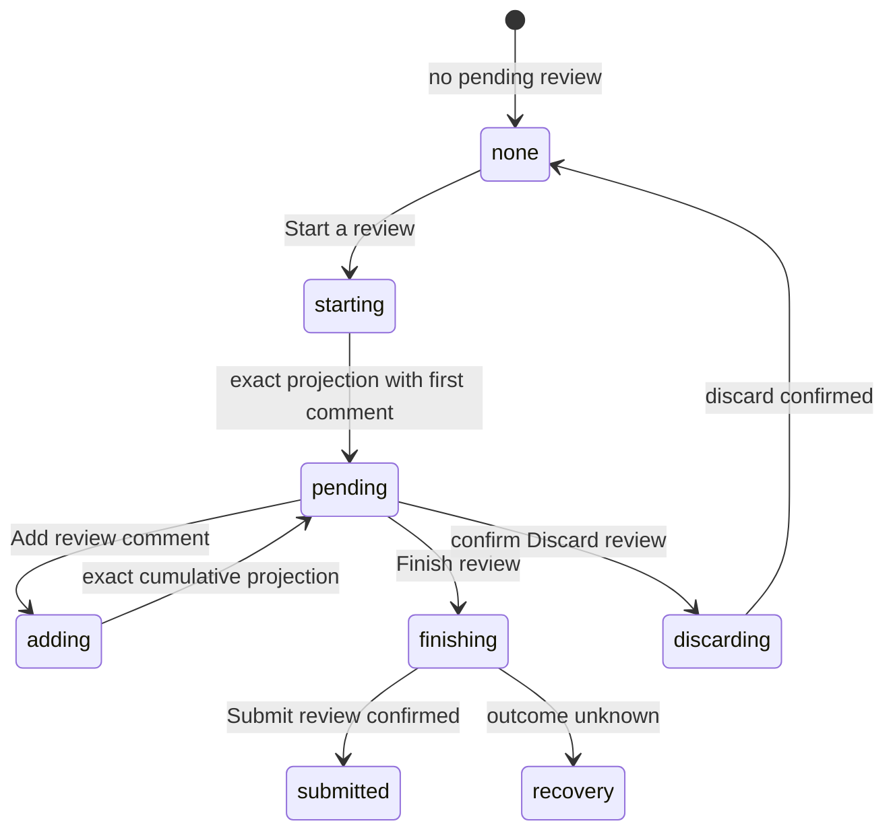

# Pending review and Finish review

## Summary

The pending-review flow collects one or more inline comments in GitHub's unpublished review, then submits them together with an optional summary and one decision: Comment, Approve, or Request changes. The maintainer starts it from an inline composer or an Analysis Finding and finishes it from the Review header. Patchdesk treats the returned pending-review projection as authority and pauses mutation when the outcome cannot be identified exactly.

## The simple case

The maintainer chooses Start a review on the first inline comment, adds more comments with Add review comment, then chooses Finish review · N in the header, where N counts the pending comments. The dialog lists every pending comment and its location under Pending comments · N, focuses the optional Summary, defaults the decision to Comment, and submits once with Submit review. GitHub publishes the review, Patchdesk records the created or discarded thread IDs for reconciliation, closes the dialog, and refreshes review state and merge readiness.

## The task, event by event

### Arrive

With no pending review, the header offers Start a review and inline composers offer Start a review or Comment now. With a pending review, the header shows Finish review · N, and inline composers offer Add review comment. If pending-review state is unavailable, Patchdesk shows a recovery banner instead of pretending there is none, and inline composers disable their text field and say "Pending review state is unavailable. Check GitHub again or refresh before commenting."

Finish review says "Submit your pending review comments to GitHub. The summary below is sent only when you submit." It lists the pending ledger with path, line or range, side, and comment body, and repeats the count as an "N pending" badge beside Decision. The Summary is modal-local and sent only with Submit review. Decision labels are human-readable while the request uses GitHub's `COMMENT`, `APPROVE`, or `REQUEST_CHANGES` values.

### Leave unchanged

Closing Finish review records nothing and preserves the pending review on GitHub. Editing the summary or decision does not persist it outside the current dialog. Cancelling an inline composer before Start or Add leaves pending state unchanged.

### Begin an action

Start and Add include expected session ID, head SHA, patch hash, anchor, and body. Add also includes the exact pending-review node ID. Submit includes the same represented revision plus decision and modal summary.

Discard review is destructive and visually separated from Close and Submit. The first press arms it; only Confirm discard issues the write. Keep editing disarms it.

### While the action runs

The pending-review action reports busy for the whole command. Composer or dialog controls disable; Finish review cannot close, change decision, submit again, or discard while submission is in flight. The summary input is focused when the dialog opens.

Every command passes through the shared detect-before-write gate. Patchdesk accepts only a strict response containing a valid pending-review projection. It applies that projection directly rather than issuing a speculative full Review reload.

### Settle

Start or Add success records only newly created thread IDs and renders the returned cumulative pending review. Submit success expects pending state `none`, closes the dialog, journals the published review evidence, and observes the Review so checks and merge readiness can reconcile. Discard success expects `none` and journals the formerly pending thread IDs so stale reads cannot resurrect them.

A confirmed rejection of an inline Start or Add leaves a failed card with the complete error and **Edit draft**. That action restores the same body and a still-valid anchor into the canonical inline composer; if Refresh invalidated the anchor, Patchdesk keeps the body and asks the maintainer to select a new diff line before editing or submitting. It never retries automatically or creates a second composer. Outcome-unknown writes remain locked for **Check GitHub again** and do not offer **Edit draft**. When Patchdesk cannot verify the pending review against the current diff, it sends nothing and says to refresh, then try again. In Finish review, a failed submit says "Patchdesk could not finish this review. Check GitHub again or refresh." and a failed discard says "Patchdesk could not discard this review. Check GitHub again or refresh.", unless the workbench supplies a more specific message; either failure offers Check GitHub again when recovery is available, and a failed discard disarms Discard review. A malformed success or transport-unknown outcome changes pending state to recovery required. Check GitHub again unlocks an uncertain added comment only when exactly one comment created after the saved pre-write review matches its body and location. Other pending comments found by that check become visible, but the uncertain write stays locked so Patchdesk cannot submit it twice. A reload Patchdesk cannot read reports that it could not check GitHub and to try again. If Patchdesk finds a pending review but cannot identify the exact Finding comment, it directs the maintainer to inspect or discard it on GitHub.

## Variants

| Variant                                                | Before the action runs                                                                                      | While the action runs                                                                                                   |
| ------------------------------------------------------ | ----------------------------------------------------------------------------------------------------------- | ----------------------------------------------------------------------------------------------------------------------- |
| Workspace profile and GitHub account                   | Pending review belongs to the active profile, Review ID, and configured GitHub identity.                    | A profile change is blocked while the write is pending and cannot adopt the old pending node.                           |
| Pull request and Review state                          | Start, Add, Submit, and Discard need an open, Fresh, patch-backed represented Review.                       | A revision or terminal transition detected before the command prevents stale submission.                                |
| GitHub permissions and merge readiness                 | Comment or review permission is required. Approve and Request changes may have GitHub-specific eligibility. | A confirmed Submit can change merge readiness; readiness is reconciled afterward, not assumed from the chosen decision. |
| Network, local tool, and Insight provider availability | GitHub is required. Insight providers are optional; Analysis can only seed a summary or proposed comment.   | Network uncertainty triggers recovery. Provider failure has no effect on an already pending GitHub review.              |
| Input path: mouse, keyboard, or desktop menu           | Inline actions, dialog fields, decision selector, and buttons support mouse and keyboard.                   | Both input paths share one busy guard. Desktop menus do not submit a review.                                            |

## Cancel and interrupt

| Event                                                                                                 | Before the action runs                                                                                               | While the action runs                                                                                                    |
| ----------------------------------------------------------------------------------------------------- | -------------------------------------------------------------------------------------------------------------------- | ------------------------------------------------------------------------------------------------------------------------ |
| Cancel, Stop, or Escape                                                                               | Close preserves the pending review. Discard needs a second explicit confirmation.                                    | Dialog close, decision, Submit, and Discard are disabled. There is no Stop after GitHub submission begins.               |
| Navigate to another Patchdesk screen, Review, Settings section, or workspace profile                  | A pending review alone is durable GitHub state and can be left when no local draft is dirty.                         | The Review reports write-pending and blocks navigation until the command settles.                                        |
| Start another action or request a refresh                                                             | Add and Finish act on the current pending node and represented revision.                                             | Same-tick duplicate command is ignored. Other GitHub writers wait behind the shared coordinator.                         |
| GitHub, the network, a local tool, or an Insight provider fails or times out                          | A pending-state read failure shows recovery instead of `none`.                                                       | Deterministic failure is retryable; unknown outcome locks mutation and requires Check GitHub again or manual inspection. |
| Close Settings, reload the renderer, close the window, or quit Patchdesk                              | Pending review is remote and reprojected on load; modal summary and selected decision are not documented as durable. | Recovery-required state is durable. App close during a known in-flight command needs live verification.                  |
| The pull request, represented revision, pending review, permission, or other target changes elsewhere | A different pending node, head, or patch invalidates the command preconditions.                                      | Only the returned exact projection settles the command; stale lower projections cannot erase newer cumulative comments.  |
| macOS focus, a file or folder picker, or another input path takes control                             | Opening Finish review schedules focus to Summary.                                                                    | Focus loss does not cancel submission. Focus return after error, Close, or Check GitHub again needs live verification.   |

## Interactions with other systems

**Workspace profile and identity.** Profile, host, repository, Review ID, and viewer identity scope the remote pending review.

**Review revision and freshness.** Every command carries the exact session, head, and patch hash. Freshness is checked before GitHub receives it.

**Local persistence and recovery.** Pending state is projected from durable Review/session data. An uncertain added comment keeps its exact body, location, target review, and the pre-write pending review so reconciliation can distinguish the intended new thread from older or unrelated comments. Recent-write journals prevent delayed reads from losing confirmed created, submitted, or discarded thread effects.

**GitHub permissions and write authority.** Start, Add, Submit, and Confirm discard are the explicit GitHub boundaries. Dialog edits alone are local.

**Network, local tools, and Insight providers.** GitHub owns the pending review. Analysis may provide a proposed comment or initial summary but cannot submit it autonomously.

**Concurrent operations and locking.** One pending-review busy state covers the whole command. Detect/write coordination and recovery locking prevent duplicate or stale mutations.

**Feedback, errors, and diagnostics.** Comment count, pending ledger, busy labels, bounded errors, recovery banner, and manual-resolution guidance expose distinct states.

When an Analysis Finding action fails, its error remains with that Finding. Retrying clears it immediately. Otherwise, a transition to pending review or published, a dismissal, or reconciliation from locked back to actionable clears only that Finding's obsolete error; failures on other Findings remain visible.

**Preferences, keyboard commands, and desktop integration.** Finish review always defaults decision to Comment when remounted. Analysis can seed Summary for that opening only. No native menu command submits.

**Supported input and accessibility limits.** Named dialog, ledger, summary, decision, and controls support mouse and keyboard. Patchdesk does not claim screen-reader, touch, or pen support.

## Edge cases

- Start a review from the header opens the summary dialog directly when no pending review exists; it does not open an inline composer.
- An Analysis summary seeds only Summary and keeps Comment selected.
- Discard stays in a separate footer group and requires Confirm discard.
- The Finish review ledger shows each comment body as plain text. Inline pending-review cards in the Diff render the same bodies as Markdown, with images and links, by the rules [Conversation](conversation-and-metadata.md#arrive) describes.
- Start a review in the header is disabled when the summary dialog is not available for the Review.
- A malformed successful response produces recovery required rather than assuming the write failed or succeeded.
- Reverse settlement of cumulative Add commands cannot replace a newer projection with one missing its target.
- Submit can be confirmed even if the later observation refresh fails; Patchdesk must not resubmit.
- Pending-review state can be unavailable, distinct from confirmed `none`.
- Starting a review when GitHub says one is already pending is not treated as a refusal on its own. Patchdesk reads the viewer's pending review first: if it holds the comment this start meant to create, the start is confirmed and that review becomes the Review's pending review. If it holds different work, the composer names the unfinished review and the Review adopts it, so the next comment is added to it rather than starting a second review. If the read proves neither, the comment stays pending and the Review offers Check GitHub again.
- Recovery may find the remote review but still be unable to match an exact Analysis Finding comment.
- An unrelated comment that arrives while an Add review comment result is unknown remains visible after Check GitHub again, while the original action stays locked until its exact new thread can be identified.

## Open questions and verification

- Not checked live on 2026-09-14: every step past arming the inline composer. No Review in the workspace had a pending review, and creating one is a GitHub write.
- Confirm focus, scroll, wrapping, and error presentation in Finish review at narrow window sizes.
- Confirm that the armed Discard state reads as destructive at a glance: Confirm discard uses the destructive button style, while the unarmed Discard review is a ghost button.
- Confirm the user-visible Start a review behavior from the header when there are no inline comments.
- Confirm app close and quit behavior while a pending-review command is in flight.
- Confirm how GitHub permission restrictions for Approve and Request changes are explained before or after submission.

Baseline drafted from Patchdesk application source commit `3100615`; verified against `c9bf65db`, with live checks from the 2026-09-14 pass and affected-screen render checks on 2026-09-21.
