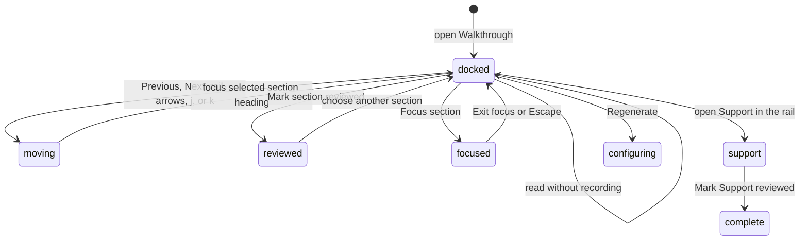

# Walkthrough

## Summary

Walkthrough is a generated, guided reading sequence for one represented Review revision. It groups chapters and sections, pairs prose with focused diff hunks, keeps a compact Support group, and records local reviewed markers. The maintainer reaches it from the Walkthrough tab or card in Insights, or from Open walkthrough on the Brief's Start here card. It opens in a docked layout beside the ordinary Insights chrome; Focus section switches to a focused layout that hides that chrome. It is a reader inside the Review, not a GitHub review action.

## The simple case

The maintainer opens the Walkthrough. If none exists, a borderless empty state centers the Walkthrough icon, the heading "No walkthrough yet", a one-line explanation, and the Generate walkthrough action in the available reader space. With a retained Walkthrough, they read the active section and its cited diff hunks, move with Previous section, Next section, the chapter rail, the arrow keys, or plain `j` and `k`, and mark sections reviewed. When they want fewer distractions they choose Focus section, and Escape brings the docked layout back. At the end they can open Support in the chapter rail and mark Support reviewed.

## The task, event by event

### Arrive

The reader opens on the saved current section when it is still valid, or on the first section. It always opens docked. Opening the Walkthrough does not move keyboard focus.

The docked layout keeps the Insight tab strip and the shared Insight header above the reader. The header shows the Walkthrough's own title, when it was generated ("Generated 7 h ago", or "Outdated · generated 7 h ago"), the provider and model, and a Regenerate button. On a window at least 1280 pixels wide, the chapter rail sits in a column on the left; on a narrower window it sits above the reading surface with a limited height.

The chapter rail is headed Chapters and shows progress as the current position and the reviewed count, for example "2/5 · 1 of 5 sections reviewed". It lists each chapter's sections with a two-digit number, the section title with the full title on hover, and a "done" badge for a reviewed section. The active section is highlighted. Below the chapters, a collapsed Support disclosure holds the Support group.

The reading surface shows a chapter-context eyebrow, the complete current section title, the generated prose, a badge counting the section's hunks, a "reviewed" badge when the section is reviewed, and the Focus section button. The cited hunks follow, then Mark section reviewed, Previous section and Next section. The focused layout adds the position as "N of M"; the docked layout leaves it to the chapter rail. A one-section Walkthrough omits Previous section and Next section. A zero-section Walkthrough reports 0, omits Mark section reviewed, and keeps no fabricated active section.

When the Walkthrough is current and its inline discussion is available, the cited hunks show the pull request's open and resolved inline conversation threads that fall on those lines. These threads are read-only in the Walkthrough: there is no reply, resolve, or comment control. [Inline conversations](inline-conversations.md) owns thread writes. Inline discussion is available only when the Walkthrough is current and verified, the Review is Fresh, the represented patch is loaded, the inline conversation has fully loaded, and the Walkthrough was generated for this exact profile, session, head, and patch. Otherwise the reading surface names the next step: an outdated Walkthrough says "Older revision; regenerate to see replies.", and every other cause says "Discussion unavailable; refresh to check."

A Walkthrough retained before hunk citations were verified shows "Diff links need regeneration" and asks for a rerun. A section with no verified hunk shows "No verified hunks for this section" in place of the diff, and says they are listed under Support until it is regenerated. Repeated files use unique block identifiers so separate cited hunks do not collapse into one render target.

### Leave unchanged

Reading, scrolling, changing diff layout or wrapping, opening Support, switching between docked and focused layouts, and leaving without marking reviewed do not change GitHub or the generated Walkthrough. Moving to another section saves the current section locally; it records no reviewed marker.

### Begin an action

For multiple sections, Previous section and Next section move one section and disable at the first and last boundaries. The chapter rail can jump directly to a section. The Left arrow and `k` move to the previous section; the Right arrow and `j` move to the next, matching the Vim convention. These keys act only when no text field, select, or combobox has focus. One-section and zero-section Walkthroughs omit the movement buttons.

Mark section reviewed records the current section's stable identity. Mark Support reviewed, inside the Support disclosure, records the Support group. Both are offered only while the Review is open.

Focus section hides the Insight tab strip, the shared header, and the chapter rail, and leaves a single reading column. The same button, now named Exit focus, returns to the docked layout. The layout change fades out and back in.

Regenerate opens the shared Insight run dialog described in [Brief](brief.md#begin-an-action). It is shown only in the docked layout, only while a retained Walkthrough is current and the Review is open, and is disabled unless an Insight provider is available.

### While the action runs

Section movement updates the active prose and cited hunks together, and scrolls the chosen section into view in the chapter rail. Each cited hunk keeps its original file header, uses natural height, and lets the reader own scrolling. It respects unified or split layout, wrapping, app appearance, and diff theme.

Reviewed markers and the current section are shown at once and saved locally in the background. Controls stay usable while the save runs. Generation follows the Insight run lifecycle described in [Brief](brief.md#while-the-action-runs) and keeps any retained Walkthrough until a replacement succeeds.

A Codex CLI account run also shows what it is doing. The panel reads **Preparing…** until Codex starts the turn, then how long ago the run started. Below that it shows the last line of the model's reasoning summary, when the model sends one, and a **Commands** list with one row per command Codex ran: its exit status, **declined**, or a spinner while it runs; the command as plain text; and its duration. Codex asks Patchdesk before it runs any command. Patchdesk accepts commands requested from inside the represented worktree and declines network, stdin-write, file-change, permission, and outside-worktree requests. An API key run shows only the spinner and start time. When the run fails, times out, or is cancelled, the failure notice keeps the last command list until another run starts or the renderer reloads.

> Technical note: commands are shortened to 200 characters, with paths inside the represented worktree made relative and the home directory shown as `~`, before they leave the main process. Command output is never shown. The trace is held in memory only; see [ADR 0043](../../adr/0043-project-a-bounded-codex-activity-trace.md). The command approval boundary is recorded in [ADR 0016](../../adr/0016-use-the-local-codex-cli-account.md).

### Settle

After movement, focus moves to the selected section heading and progress reflects the new position. At boundaries, movement stops instead of wrapping.

Escape in the focused layout returns to the docked layout and puts focus on the Focus section button. Escape in the docked layout moves focus to the current section heading. Escape never leaves the Walkthrough.

A reviewed section shows "Section reviewed" on a disabled button and a "done" badge in the rail. Support shows "Support reviewed"; that button stays enabled and choosing it again saves the same state. On a merged or closed Review, markers saved earlier still show, with both buttons disabled; an unreviewed section or Support shows no mark button. Moving between sections there changes only the screen and saves nothing. If a save fails, the reader shows "Walkthrough progress could not be saved." above the Walkthrough while the marker stays on screen.

Reviewed indicators are projected for the exact Walkthrough revision. They do not submit a GitHub review, mark files viewed on GitHub, or change pending-review state.

## Variants

| Variant                                                | Before the action runs                                                                                                                                                                                                                                                                                                        | While the action runs                                                                                                                                        |
| ------------------------------------------------------ | ----------------------------------------------------------------------------------------------------------------------------------------------------------------------------------------------------------------------------------------------------------------------------------------------------------------------------- | ------------------------------------------------------------------------------------------------------------------------------------------------------------ |
| Workspace profile and GitHub account                   | Walkthrough belongs to a profile-scoped Review session. Viewer identity does not affect reading markers.                                                                                                                                                                                                                      | Switching profile leaves the Review; the old section state cannot become another profile's Walkthrough.                                                      |
| Pull request and Review state                          | A retained Walkthrough can be read for open or terminal represented Reviews. Generation needs an open Review; on a merged or closed Review, a muted line above the reader says so; Generate walkthrough and Regenerate are not drawn. Inline discussion appears only on a current Walkthrough for a Fresh Review. | Remote updates do not rewrite the reader; a newer revision needs its own Walkthrough.                                                                        |
| GitHub permissions and merge readiness                 | No GitHub write permission or merge readiness is required.                                                                                                                                                                                                                                                                    | Mark reviewed is local and cannot change checks, review decision, or merge readiness.                                                                        |
| Network, local tool, and Insight provider availability | A retained Walkthrough is readable without a provider. Generation needs an available provider and prepared context.                                                                                                                                                                                                           | Provider failure leaves the retained Walkthrough. Local highlighting failure inside a cited hunk needs live verification.                                    |
| Input path: mouse, keyboard, or desktop menu           | Rail, Previous section, Next section, review markers, Focus section, arrow keys, `j`, `k`, and Escape support mouse or keyboard use.                                                                                                                                                                                          | Arrow keys, `j`, and `k` are ignored while a text field, select, or combobox has focus. They do not check modifier keys. Desktop menus do not mark progress. |

## Cancel and interrupt

| Event                                                                                                 | Before the action runs                                                                                                                                         | While the action runs                                                                                                                                                               |
| ----------------------------------------------------------------------------------------------------- | -------------------------------------------------------------------------------------------------------------------------------------------------------------- | ----------------------------------------------------------------------------------------------------------------------------------------------------------------------------------- |
| Cancel, Stop, or Escape                                                                               | Escape leaves the focused layout, or in the docked layout moves focus to the section heading. No review marker is added by leaving.                            | Cancel applies only to generation. A local marker save has no Stop.                                                                                                                 |
| Navigate to another Patchdesk screen, Review, Settings section, or workspace profile                  | Reading can leave without a write guard. The saved current section and reviewed markers remain local. Returning to Insights opens Brief and the docked layout. | A provider run remains bound to its original session. A section movement cannot target another Review.                                                                              |
| Start another action or request a refresh                                                             | The maintainer can choose a different section immediately.                                                                                                     | A new section selection supersedes view movement. GitHub refresh can mark updates without changing the retained Walkthrough.                                                        |
| GitHub, the network, a local tool, or an Insight provider fails or times out                          | Existing content stays readable during GitHub or provider failure. An incomplete inline-conversation load replaces thread display with the unavailable notice. | Generation failure is retryable and does not erase retained content. Reviewed markers do not depend on GitHub; a failed local save shows "Walkthrough progress could not be saved." |
| Close Settings, reload the renderer, close the window, or quit Patchdesk                              | Settings overlays the reader according to normal navigation. The current section and markers are saved together locally.                                       | Renderer reload restores only a valid saved section and returns to the docked layout. A save still in flight at quit reaches storage or does not.                                   |
| The pull request, represented revision, pending review, permission, or other target changes elsewhere | A newer remote revision makes this Walkthrough historical for the represented snapshot and removes its inline discussion.                                      | Current section and markers remain bound to the original Walkthrough identity; they cannot confirm the newer revision reviewed.                                                     |
| macOS focus, a file or folder picker, or another input path takes control                             | Opening the Walkthrough does not move focus. Arrow keys, `j`, and `k` act only while focus is inside the Walkthrough.                                          | Focus loss does not move sections. Focus return after leaving the focused layout needs live desktop verification.                                                                   |

## Interactions with other systems

**Workspace profile and identity.** The Walkthrough is session-scoped; reviewed markers are local reading state, not GitHub viewer state.

**Review revision and freshness.** Every chapter, section, hunk, and marker belongs to one represented revision. Brief opens only the Walkthrough that stands for that revision. Inline conversation threads appear only when the Walkthrough, the session, and GitHub's current revision all agree.

**Local persistence and recovery.** Retained Walkthrough, current section, and reviewed markers are stored locally. Invalid restored section IDs fall back to a valid section. The docked or focused layout is not saved.

**GitHub permissions and write authority.** Walkthrough is read-only with respect to GitHub. Mark reviewed grants no write authority, and the inline conversation threads it shows offer no reply or resolve control.

**Network, local tools, and Insight providers.** Generation uses the selected Insight provider. Cited hunk rendering uses retained patch evidence and local highlighting. Inline conversation threads come from the inline conversation the workbench already loaded; the Walkthrough itself makes no GitHub read.

**Concurrent operations and locking.** One retained artifact and active section identity own the reader. Generation is coordinated separately from local movement. A layout switch requested while the previous one is still fading is ignored.

**Feedback, errors, and diagnostics.** Progress, reviewed indicators, inline-discussion unavailability, progress save failure, unavailable generation, and run failure are distinct. Legacy unverified citations are withheld rather than presented as proven support.

**Preferences, keyboard commands, and desktop integration.** Cited hunks respect current layout, wrapping, appearance, and theme. Arrow keys, `j`, `k`, and Escape are reader-level keyboard behavior.

**Supported input and accessibility limits.** Mouse and keyboard are supported with focused headings and named controls. Patchdesk does not claim screen-reader, touch, or pen support.

## Edge cases

- An empty Walkthrough uses the same centered structure as empty Brief and Analysis readers.
- With multiple sections, Previous is disabled on the first section and Next on the last; movement never wraps.
- A one-section Walkthrough omits Previous section and Next section. A zero-section Walkthrough reports 0 and omits the movement buttons and Mark section reviewed.
- Repeated files use unique block IDs, so different hunks stay separate.
- Deletion-only hunks remain renderable with a preserved file header.
- Full section titles remain available on hover in the chapter rail even when a title is truncated.
- Support stays compact and excludes legacy unverified citations.
- Support and Mark Support reviewed live in the chapter rail, so they are unavailable in the focused layout.
- An already reviewed section keeps its indicator and disables another Mark action. Mark Support reviewed stays enabled after Support is reviewed.
- `j` moves to the next section and `k` to the previous, so the letters follow Vim while the arrows follow reading direction.
- The Left and Right arrows move between sections rather than scrolling a wide hunk sideways.
- Arrow keys, `j`, and `k` do nothing while a text field, select, or combobox has focus.
- Escape can focus the current section heading without changing reviewed state.
- A reviewed marker stays on screen even when its save fails.

## Open questions and verification

- The 2026-09-14 live pass confirmed only the empty state. No retained Walkthrough existed in the live workspace, so the docked and focused layouts, Regenerate, inline conversation threads, and keyboard movement were checked from source only.
- The reversed `j` and `k` recorded as [UX-11](../ux-friction.md#ux-11-walkthrough-j-and-k-run-opposite-to-the-vim-convention) are fixed; the new direction is not yet live-verified.
- The reading surface no longer ends with a sentence pointing at a Back to files control the Walkthrough does not have; the copy was removed with [B-22](../bug-triage.md#b-22-small-copy-and-rendering-slips). The removal is not yet live-verified.
- [UX-12](../ux-friction.md#ux-12-the-inline-discussion-notice-does-not-say-what-failed) is fixed: an outdated Walkthrough now says to regenerate it. The other causes still share one sentence, and neither wording is live-verified.
- Suspected defect: arrow keys, `j`, and `k` do not check modifier keys, so a Command or Control combination with those keys may also move sections. See [B-23](../bug-triage.md#b-23-walkthrough-section-keys-ignore-modifier-keys).
- Fixed: a merged or closed Review draws no Regenerate and keeps the reason line on screen. See [B-11](../bug-triage.md#b-11-generate-and-regenerate-are-disabled-on-a-merged-or-closed-review-with-no-reason).
- Confirm the layout fade, scroll ownership, and focus return after leaving the focused layout in the built app.
- Confirm persistence of the current section and reviewed markers across app quit, not only rerender.
- Confirm fallback presentation when syntax highlighting fails inside a Walkthrough block.

Baseline drafted from Patchdesk application source commit `3100615`; revised and verified against `737c515c`; command approval behavior revised from source commit `2e2fac4c` and not live-verified.
