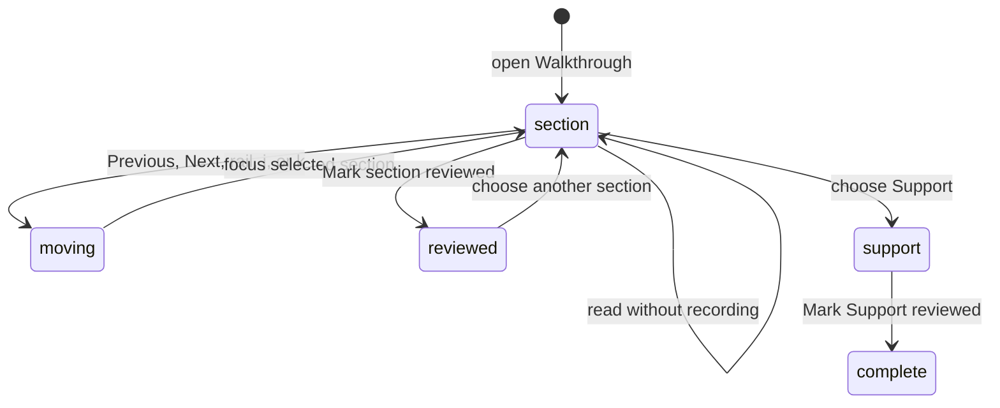

# Walkthrough

## Summary

Walkthrough is a generated, guided reading sequence for one represented Review revision. It groups chapters and sections, pairs prose with focused diff hunks, keeps a compact Support group, and records local reviewed markers. The maintainer reaches it from Brief or the Walkthrough entry in Insights. It is a takeover reader inside the Review, not a GitHub review action.

## The simple case

The maintainer opens the Walkthrough, reads the active section and its focused diff, moves with Previous, Next, the chapter rail, or plain `j` and `k`, and marks sections reviewed. At the end they can review Support material and mark Support reviewed. Escape returns focus to the current section heading and, when leaving the takeover, restores focus to the trigger.

## The task, event by event

### Arrive

The reader opens on a valid restored section or the first section. It shows the visible active-section count, a chapter rail when sections exist, progress, the complete current section title, a chapter-context eyebrow, generated prose, and focused evidence blocks. Support is a separate compact group. A one-section Walkthrough omits Previous and Next. A zero-section Walkthrough reports 0, omits section navigation and Mark section reviewed, and keeps no fabricated active section. Navigation chrome from the ordinary workbench stays out of the Walkthrough reading surface.

Opening the takeover does not steal focus immediately. When opened from a trigger, Patchdesk remembers that trigger for focus restoration. Repeated files use unique block identifiers so separate cited hunks do not collapse into one render target.

### Leave unchanged

Reading, scrolling, moving among sections, changing diff layout or wrapping, and closing without marking reviewed do not change GitHub or the generated Walkthrough. Navigation position can be saved independently of reviewed progress.

### Begin an action

For multiple sections, Previous and Next move one section and disable at the first and last boundaries. The chapter rail can jump directly to a section. Plain `j` and `k` are aliases only when no editor control has focus. One-section and zero-section Walkthroughs omit movement controls.

Mark section reviewed records the current section's stable identity. Mark Support reviewed records the Support group. An already reviewed item shows its indicator and disables the same toggle rather than creating a second record.

### While the action runs

Section movement updates the active prose and focused diff together. The filtered diff keeps the original file header and requested hunk, uses natural height, and lets the reader own scrolling. It respects unified or split layout, wrapping, app appearance, and diff theme.

Reviewed-marker writes are local and fast. Generated Walkthrough creation, when needed, follows the separate Insight run lifecycle and keeps any retained Walkthrough until a replacement succeeds.

### Settle

After movement, focus can move to the selected section heading and progress reflects the new position. At boundaries, movement stops instead of wrapping. Escape from a focused reader control returns focus to the current section heading; closing the takeover restores the original trigger when it still exists.

Reviewed indicators survive rerender and are projected for the exact Walkthrough revision. They do not submit a GitHub review, mark files viewed on GitHub, or change pending-review state.

## Variants

| Variant                                                | Before the action runs                                                                                                           | While the action runs                                                                                                           |
| ------------------------------------------------------ | -------------------------------------------------------------------------------------------------------------------------------- | ------------------------------------------------------------------------------------------------------------------------------- |
| Workspace profile and GitHub account                   | Walkthrough belongs to a profile-scoped Review session. Viewer identity does not affect reading markers.                         | Switching profile leaves the Review; the old section state cannot become another profile's Walkthrough.                         |
| Pull request and Review state                          | A retained Walkthrough can be read for open or terminal represented Reviews. Its provenance must match the represented revision. | Remote updates do not rewrite the reader; a newer revision needs its own Walkthrough.                                           |
| GitHub permissions and merge readiness                 | No GitHub write permission or merge readiness is required.                                                                       | Mark reviewed is local and cannot change checks, review decision, or merge readiness.                                           |
| Network, local tool, and Insight provider availability | A retained Walkthrough is readable without a provider. Generation needs an available provider and prepared context.              | Provider failure leaves the retained Walkthrough. Local highlighting failure needs live verification for this focused renderer. |
| Input path: mouse, keyboard, or desktop menu           | Rail, Previous, Next, review markers, `j`, `k`, and Escape support mouse or keyboard use.                                        | `j` and `k` are ignored in editors and modified key combinations. Desktop menus do not mark progress.                           |

## Cancel and interrupt

| Event                                                                                                 | Before the action runs                                                                                                 | While the action runs                                                                                                                  |
| ----------------------------------------------------------------------------------------------------- | ---------------------------------------------------------------------------------------------------------------------- | -------------------------------------------------------------------------------------------------------------------------------------- |
| Cancel, Stop, or Escape                                                                               | Escape can return focus or close the takeover according to the active layer. No review marker is added by leaving.     | Stop applies only to generation. A local marker action has no meaningful in-flight Stop.                                               |
| Navigate to another Patchdesk screen, Review, Settings section, or workspace profile                  | Reading can leave without a write guard. Supported position and reviewed markers remain local.                         | A provider run remains bound to its original session. A section movement cannot target another Review.                                 |
| Start another action or request a refresh                                                             | The maintainer can choose a different section immediately.                                                             | A new section selection supersedes view movement. GitHub refresh can mark updates without changing the retained Walkthrough.           |
| GitHub, the network, a local tool, or an Insight provider fails or times out                          | Existing content stays readable during GitHub or provider failure.                                                     | Generation failure is retryable and does not erase retained content. Local reviewed markers do not depend on GitHub.                   |
| Close Settings, reload the renderer, close the window, or quit Patchdesk                              | Settings overlays or leaves the reader according to normal navigation. Position and markers have separate persistence. | Renderer reload restores only valid section state. App-close focus behavior is not applicable after quit and needs no synthetic claim. |
| The pull request, represented revision, pending review, permission, or other target changes elsewhere | A newer remote revision makes this Walkthrough historical for the represented snapshot.                                | Current section and markers remain bound to the original Walkthrough identity; they cannot confirm the newer revision reviewed.        |
| macOS focus, a file or folder picker, or another input path takes control                             | Mounting does not steal focus. The takeover remembers its trigger when possible.                                       | Focus loss does not move sections. Escape and close focus restoration need live desktop verification.                                  |

## Interactions with other systems

**Workspace profile and identity.** The Walkthrough is session-scoped; reviewed markers are local reading state, not GitHub viewer state.

**Review revision and freshness.** Every chapter, section, hunk, and marker belongs to one represented revision. Brief opens only the Walkthrough that stands for that revision.

**Local persistence and recovery.** Retained Walkthrough, current section position, and reviewed markers are stored locally. Invalid restored section IDs fall back to a valid section.

**GitHub permissions and write authority.** Walkthrough is read-only with respect to GitHub. Mark reviewed grants no write authority.

**Network, local tools, and Insight providers.** Generation uses the selected Insight provider. Focused diff rendering uses retained patch evidence and local highlighting.

**Concurrent operations and locking.** One retained artifact and active section identity own the reader. Generation is coordinated separately from local movement.

**Feedback, errors, and diagnostics.** Progress, reviewed indicators, unavailable generation, and run failure are distinct. Legacy unverified citations are withheld rather than presented as proven support.

**Preferences, keyboard commands, and desktop integration.** The focused diff respects current layout, wrapping, appearance, and theme. `j`, `k`, and Escape are reader-level keyboard behavior.

**Supported input and accessibility limits.** Mouse and keyboard are supported with focused headings and named controls. Patchdesk does not claim screen-reader, touch, or pen support.

## Edge cases

- With multiple sections, Previous is disabled on the first section and Next on the last; movement never wraps.
- A one-section Walkthrough omits Previous and Next. A zero-section Walkthrough reports 0 and omits navigation and section-review controls.
- Repeated files use unique block IDs, so different hunks stay separate.
- Deletion-only hunks remain renderable with a preserved file header.
- Full section titles remain in the chapter rail even when space is constrained.
- Support stays compact and excludes legacy unverified citations.
- An already reviewed section keeps its indicator and disables another Mark action.
- `j` and `k` do nothing while an editor has focus.
- Escape can focus the current section heading without changing reviewed state.

## Open questions and verification

- Live desktop verification is pending. Confirm takeover entry and exit animation, scroll ownership, focus restoration, and `j`/`k` behavior in the built app.
- Confirm persistence of active section and reviewed markers across app quit, not only rerender.
- Confirm fallback presentation when syntax highlighting fails inside a Walkthrough block.
- Confirm how a retained Walkthrough is labeled after GitHub reports a newer revision.

Baseline drafted from Patchdesk application source commit `3100615`; follow-up behavior updated and verified through `c49045d`.
