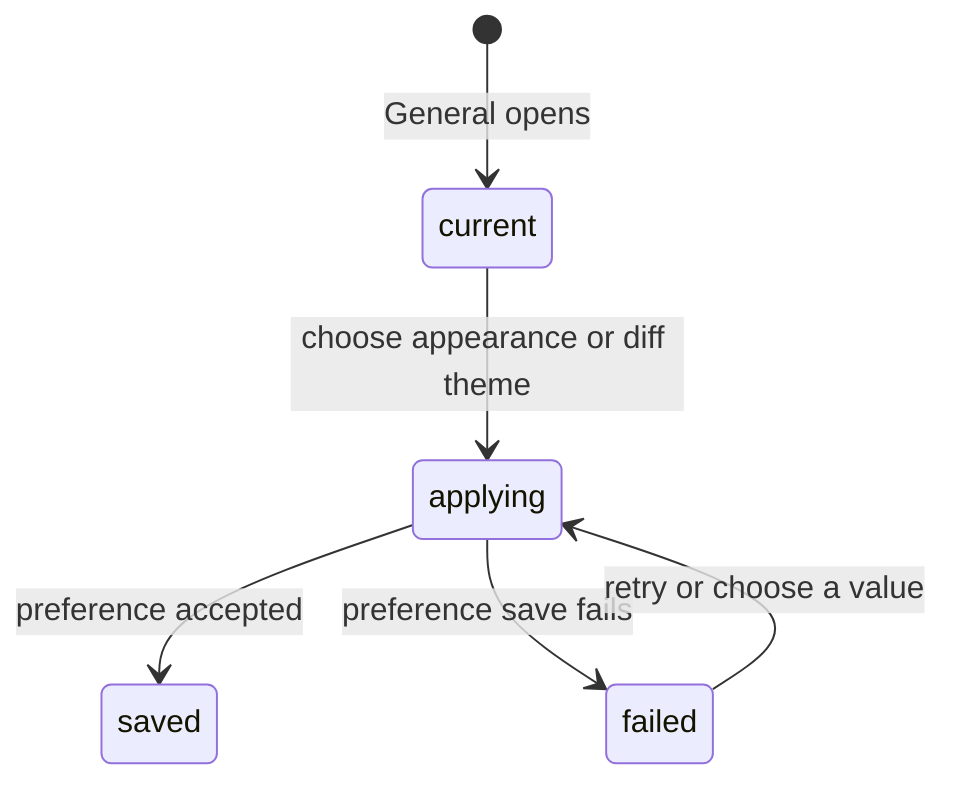

# Appearance and diff theme

## Summary

Appearance and Diff theme are global controls in Settings > General. Appearance chooses whether Patchdesk follows macOS, stays light, or stays dark; Diff theme chooses one syntax theme for light appearance and another for dark appearance. Both controls are available without an active workspace profile and affect the current app window.

## The simple case

The maintainer opens Settings, leaves Appearance on System, and chooses a light and dark Diff theme. The app applies the appearance immediately. A mounted Review diff receives the matching theme without leaving the workbench. Patchdesk saves each choice separately, so a failure to persist one choice does not undo the other or hide the visible change.

## The task, event by event

### Arrive

General is the default Settings section. Appearance offers System, Light, and Dark. System resolves from the macOS color-scheme preference and updates when that system preference changes.

Diff theme offers separate Light appearance and Dark appearance selectors from the installed theme catalog. The default pair is `pierre-light` and `pierre-dark`. The selected appearance determines which member of the pair a Review diff uses.

### Leave unchanged

Opening and closing Settings without changing a selector has no effect. Changing Settings sections does not apply a new value. Reading a selector does not write GitHub, alter a Review session, or start an Insight.

### Begin an action

Choosing Appearance applies the new mode at once. Choosing either Diff theme applies that side at once to mounted diff views. Patchdesk then saves the changed global preference while leaving the other side unchanged.

The values belong to the app, not to the active workspace profile. A profile switch does not choose a different appearance or Diff theme. A renderer reload reads the saved global values before the next diff is mounted.

### While the action runs

The selector keeps the maintainer's new value while Patchdesk saves it. Appearance and Diff theme saves have independent progress and failure ownership. An older save cannot replace a newer choice.

If a save fails, the visible change remains active and Settings shows a preference error with Retry. Retrying the latest failed preference is explicit. Patchdesk does not send an appearance or Diff theme choice to GitHub.

### Settle

A successful save keeps the value in the global application settings. A system appearance continues to follow macOS; Light and Dark remain fixed until changed. A saved Diff theme pair is reused by later Review and Walkthrough diffs.

If loading global settings fails, Patchdesk uses the current defaults, shows a preference error, and offers Retry. A missing first-run settings file is treated as normal and does not show that error.

## Variants

| Variant | Before the action runs | While the action runs |
| --- | --- | --- |
| Workspace profile and GitHub account | Global appearance and Diff theme are shared across workspace profiles and GitHub accounts. | A profile switch does not change the pending global preference save. |
| Pull request and Review state | A diff reads the selected light or dark theme for its current appearance; Review state does not change the setting. | A theme change repaints the mounted diff without changing represented revision or Review freshness. |
| GitHub permissions and merge readiness | No GitHub permission or merge readiness is needed. | The save is local; GitHub access and write authority are unaffected. |
| Network, local tool, and Insight provider availability | Selectors work without GitHub, local checkout tools, or an Insight provider. | A local settings failure leaves the visible choice active and offers Retry. |
| Input path: mouse, keyboard, or desktop menu | Mouse and keyboard can reach both selectors through Settings. | The same immediate-apply and save behavior applies to either input path; desktop menus do not add another theme control. |

## Cancel and interrupt

| Event | Before the action runs | While the action runs |
| --- | --- | --- |
| Cancel, Stop, or Escape | Closing Settings or leaving a selector unchanged keeps the current values. | There is no Stop control for a preference save; the value remains visible until settlement. |
| Navigate to another Patchdesk screen, Review, Settings section, or workspace profile | Navigation leaves unchanged values alone. | Navigation does not cancel the save; a late old save cannot replace newer intent. |
| Start another action or request a refresh | Choosing another value starts a newer preference intent. | Appearance and Diff theme settle independently; a newer choice owns its own field. |
| GitHub, the network, a local tool, or an Insight provider fails or times out | No external provider is needed to choose a value. | A local settings failure shows Retry; no GitHub or Insight retry is implied. |
| Close Settings, reload the renderer, close the window, or quit Patchdesk | An unchanged selector has no pending work. | A value is applied in the current window; the next load uses the last successfully saved value. |
| The pull request, represented revision, pending review, permission, or other target changes elsewhere | Theme selection is independent of a Pull request or represented revision. | Remote target changes do not alter the pending preference save. |
| macOS focus, a file or folder picker, or another input path takes control | Focus loss without a selection has no effect. | Focus loss does not cancel the save or revert the visible theme. |

## Interactions with other systems

**Workspace profile and identity.** These are global app preferences, separate from profile identity and watchlist data.

**Review revision and freshness.** Theme changes affect presentation only; represented revision and Fresh state remain owned by the Review workbench.

**Local persistence and recovery.** Global values are saved in application Config. Renderer-held legacy values are migrated or cleared only after the file-backed value is accepted.

**GitHub permissions and write authority.** No GitHub read or write is part of changing appearance or Diff theme.

**Network, local tools, and Insight providers.** The app can apply the visible value without those systems; only local settings persistence can fail.

**Concurrent operations and locking.** Each preference tracks its own newer intent, so overlapping Appearance and Diff theme saves cannot settle into one another's field.

**Feedback, errors, and diagnostics.** A visible preference error says the active change is still present and offers Retry. It does not present raw storage errors.

**Preferences, keyboard commands, and desktop integration.** Settings is a global overlay; closing it normally returns focus to its opener. Keyboard selectors use the same values as mouse selection.

**Supported input and accessibility limits.** Keyboard and mouse controls are supported. Touch, pen, and screen-reader behavior are outside the supported product surface.

## Edge cases

- System appearance follows macOS changes while Settings remains open.
- Light and dark Diff themes are independent; a malformed side falls back to that side's default without discarding a valid other side.
- Older Diff theme family values migrate to a light/dark pair.
- File-backed settings take precedence over stale renderer local values.
- A missing settings file is normal first-run state; an actual read failure uses defaults and shows Retry.
- A save failure does not roll back the visible Appearance or Diff theme.
- A mounted diff receives a theme event without requiring a Review remount.
- Settings does not show the provider, model, or reasoning controls; those belong to Review preferences and Insight run dialogs.

## Open questions and verification

- Live desktop verification is pending; no CDP pass was run for this document.
- Confirm the visible repaint timing when a mounted diff changes from Light to Dark or changes only one Diff theme.
- Confirm the focus target after selecting a theme and after a preference-save error.
- Confirm how the app presents a system appearance change while a fixed Light or Dark choice is active.
- Confirm the final visible copy when global settings cannot be read or saved.

Verified against Patchdesk application source commit `3100615`.
