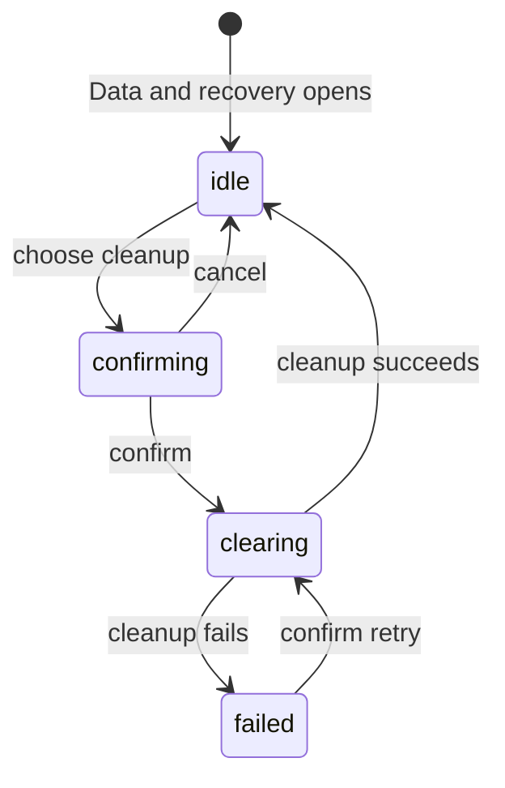

# Data and recovery

## Summary

Data & recovery is a Settings section for removing rebuildable Cache or non-running Local data for the active workspace profile. Each action requires an explicit confirmation. Clear cache keeps saved Review history; Clear local review data removes completed and failed local Reviews while protecting active work and Diagnostic records.

## The simple case

The maintainer opens Settings > Data & recovery and sees the two cleanup actions. They choose Clear cache, read the confirmation, and confirm. Patchdesk removes rebuildable files, reloads workspace data, and closes Settings after success, leaving the screen underneath in place.

If they choose Clear local review data, the stronger confirmation says that completed and failed local Reviews are removed while an active Review and Diagnostic records stay. Its success also returns the app to the Pull requests screen. A failed cleanup leaves its confirmation open with the action-specific error so the maintainer can try again or cancel.

## The task, event by event

### Arrive

The active workspace profile is the target. With no active profile, both cleanup buttons and Load activity are disabled, and the section shows `No active workspace` with `Choose a workspace before clearing its local data.`

The Local review data card states the boundary once: `Stored reviews stay readable` over `Clear cache keeps review history. Clear local review data removes completed and failed local reviews; an active review and diagnostic reports stay.` Clear cache is the lower-impact action: it removes rebuildable local files while saved Reviews and Diagnostic records stay. Clear local review data is stronger: completed and failed local Reviews are removed, but active work and Diagnostic records stay. The Review activity card below it is described in [Logs and diagnostics](logs-and-diagnostics.md).

The section does not present a storage browser, per-session delete list, or quarantine list. Retention cleanup also runs in the background: a terminal Review older than 14 days is removed with its record and session, orphaned sessions older than 14 days and quarantine entries older than 30 days are removed, as [Persistence and recovery](../foundations/persistence-and-recovery.md#edge-cases) describes.

### Leave unchanged

Opening the section, reading its explanation, or closing a confirmation leaves local data unchanged. Cancel dismisses the confirmation without calling cleanup. Switching Settings sections does not confirm an action.

### Begin an action

Choosing Clear cache or Clear local review data opens its own confirmation. `Clear cache?` says `This removes rebuildable local files. Your saved reviews and diagnostic reports stay.` and confirms with Clear cache. `Clear local review data?` says `This removes completed and failed local reviews. An active review and diagnostic reports stay.` and confirms with a destructive Clear local data button.

Confirming sends the action for the active profile. The dialog becomes busy and its controls are disabled. Clear local review data first protects active work and moves invalid entries to quarantine before removing eligible session data.

### While the action runs

Patchdesk serializes cleanup for the profile. Clear cache removes the profile's rebuildable Cache children. Clear local review data checks preparation, Insight, Review, pending-review, direct-summary, and merge activity before removing a session; protected activity is left in place.

Cleanup does not ask GitHub to delete anything. It does not remove Diagnostic records, and it does not turn an active Review or write into a discardable item. A retention sweep records its own redacted milestone and continues past an individual failure.

### Settle

A successful cleanup reloads workspace data and closes Settings. Saved Review history remains after Clear cache, and the destination underneath is unchanged. After Clear local review data, the app returns to Pull requests; removed completed or failed Reviews are no longer available locally, while protected active work and Diagnostic records remain.

If cleanup fails, the confirmation stays open with `Cleanup failed` and `Could not clear cache. Try again.` or `Could not clear local review data. Try again.`, the same alert appears in the card, and the same action remains available for an explicit retry. A missing profile or unavailable storage is reported as a failure; Patchdesk does not silently broaden the target.

## Variants

| Variant | Before the action runs | While the action runs |
| --- | --- | --- |
| Workspace profile and GitHub account | Cleanup targets the active workspace profile; GitHub identity is not a cleanup target. | Profile-scoped locking keeps concurrent cleanup from racing on the same local data. |
| Pull request and Review state | Clear cache keeps Review history; Clear local review data removes eligible completed or failed Review sessions. | While Clear local review data runs, active Review, represented work, Insight runs, pending review, direct summary, and unresolved merge work protect their session data. |
| GitHub permissions and merge readiness | Cleanup needs no GitHub permission or merge readiness. | GitHub state is not changed; cleanup only changes local rebuildable or eligible Review data. |
| Network, local tool, and Insight provider availability | Cleanup is local and does not require a provider or GitHub connection. | Local storage or recovery checks can fail; provider availability does not make protected work removable. |
| Input path: mouse, keyboard, or desktop menu | Mouse and keyboard can choose either button and confirmation action. | The same confirmation and busy-state rules apply; desktop menus do not expose another cleanup path. |

## Cancel and interrupt

| Event | Before the action runs | While the action runs |
| --- | --- | --- |
| Cancel, Stop, or Escape | Cancel or Escape closes the confirmation without changing data. | The cleanup dialog disables Cancel while the request is pending; there is no Stop control. |
| Navigate to another Patchdesk screen, Review, Settings section, or workspace profile | Navigation before confirmation has no effect. | The confirmation remains owned by the active profile until cleanup settles; profile switching is guarded by normal Settings behavior. |
| Start another action or request a refresh | Choosing another action replaces the unconfirmed choice. | Cleanup uses a request identity; a later request cannot display an earlier result as its own. |
| GitHub, the network, a local tool, or an Insight provider fails or times out | No external connection is required. | Storage or protection failures keep the dialog open with an action-specific retry message. |
| Close Settings, reload the renderer, close the window, or quit Patchdesk | No data changes before confirmation. | The local operation settles in the main process; the renderer does not promise to keep its busy dialog after reload. |
| The pull request, represented revision, pending review, permission, or other target changes elsewhere | The confirmation describes local data, not a remote target. | A newly active session or write is protected by the cleanup check; GitHub changes do not authorize removal. |
| macOS focus, a file or folder picker, or another input path takes control | Focus loss without confirmation has no effect. | Focus loss does not confirm or cancel cleanup. |

## Interactions with other systems

**Workspace profile and identity.** The active profile selects the local Cache, Review data, and Diagnostic scope.

**Review revision and freshness.** Cleanup does not change a represented revision; protected active sessions remain governed by Review freshness and lifecycle rules.

**Local persistence and recovery.** Cache is rebuildable. Local Review data includes sessions, retained Insights, receipts, journals, and related artifacts; cleanup protects active work and quarantines invalid entries.

**GitHub permissions and write authority.** Both actions are local and perform no GitHub write. They do not reconcile or retry an uncertain GitHub write.

**Network, local tools, and Insight providers.** No network or provider is needed to confirm cleanup, though local recovery checks inspect active work state.

**Concurrent operations and locking.** Profile locks serialize cleanup and coordinate with preparation and other Review lifecycle activity.

**Feedback, errors, and diagnostics.** Confirmation copy names the retention boundary. Failures remain in the dialog; redacted cleanup milestones go to Diagnostic records, not raw UI errors.

**Preferences, keyboard commands, and desktop integration.** Cleanup controls live in the Settings overlay and return to the opener after successful close. No desktop shortcut confirms cleanup.

**Supported input and accessibility limits.** Keyboard and mouse confirmations are supported. Touch, pen, and screen-reader behavior are outside the supported product surface.

## Edge cases

- With no active workspace profile, cleanup buttons are disabled rather than targeting an implicit profile.
- Clear cache keeps saved Review history and Diagnostic records.
- Clear local review data keeps active Review work and Diagnostic records.
- Invalid session entries are quarantined before eligible local Review data is removed.
- A session with an active preparation journal, active Insight, protected pending review, direct summary, or unresolved merge is not removed.
- A terminal or orphaned session is eligible for automatic retention removal only when older than 14 days. A terminal session's Review record goes with it, unless the record holds an unreconciled GitHub write operation.
- A quarantine entry is eligible for automatic removal only when older than 30 days.
- Retention sweep runs at startup and every 24 hours while the app runs; per-item failures do not stop the sweep.
- Cleanup success reloads workspace data and closes Settings; Clear local review data also returns to Pull requests. Cleanup failure keeps the confirmation context.
- Neither cleanup makes the [Visited pull requests column](../foundations/visited-pull-requests.md) read its list again, so rows for removed Reviews stay until the next Review open or workspace switch.

## Open questions and verification

- A read-only live pass on 2026-09-14 confirmed the Local review data and Review activity card copy and that both cleanup buttons are enabled with an active workspace. It pressed neither, so the confirmations, success, and failure were not observed, and the no-active-workspace state was not reachable.
- Confirm focus behavior for both cleanup confirmations and after Settings closes on success.
- Confirm what the maintainer sees if a protected session becomes active after the confirmation opens.
- Confirm the Review workbench a maintainer reaches after Clear cache when its represented-review worktree was removed. The 2026-09-14 pass found Reviews with missing worktrees showing Context unavailable and no Preview; see [B-13](../bug-triage.md#b-13-context-and-preview-stay-unavailable-when-the-review-worktree-is-missing).
- Suspected defect: after Clear local review data, a Visited pull requests row for a removed Review stays listed and fails when clicked; see [Visited pull requests](../foundations/visited-pull-requests.md#open-questions-and-verification) and [B-16](../bug-triage.md#b-16-the-visited-pull-requests-column-keeps-rows-for-removed-reviews).
- Confirm whether a failed retention sweep has any visible Settings indication beyond redacted activity.

Baseline drafted from Patchdesk application source commit `3100615`; revised and verified against `737c515c`.
