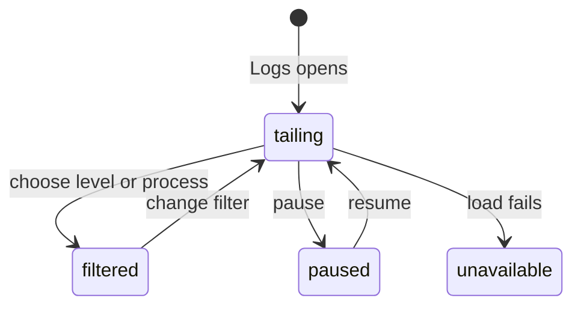

# Logs and diagnostics

## Summary

The Diagnostics overlay holds two observability surfaces: the app-wide Logs section and the profile-scoped Review activity section. The maintainer opens it from Help → Diagnostics… or the Diagnostics command in ⌘K; it opens above the current screen, starts on Logs, and Escape or Close returns focus to the control that held it. It does not open while Settings is open, and Settings does not open over it. Logs are a live main-process and renderer tail with filters and pause; Review activity is a bounded, redacted record of Review and Insight lifecycle milestones. Neither surface displays raw credentials; Review activity also omits prompts, provider output, and sensitive paths.

## The simple case

The maintainer opens Help → Diagnostics… and sees recent local entries in Logs. The tail polls for new entries, follows the newest entries while the view is at the bottom, and can be paused. Level and process selectors narrow what is shown without changing the underlying stream.

For Review-specific evidence, the maintainer opens the Review activity section and chooses Load activity. Patchdesk shows the most recent redacted milestones for the active profile, or an empty message when there are none. This activity feed is not the raw app log and does not expose the details that the app log can retain.

## The task, event by event

### Arrive

Logs starts with up to 300 recent entries, then asks for entries after the last delivered sequence every two seconds. The panel's own poll is not logged, so it does not fill the tail it draws. It shows All levels, Error, Warn, Info, or Debug and All processes, Main, or Renderer. The visible list holds at most 1,000 entries.

Each row shows time, level, process, topic, message, and bounded metadata when present. Credentials are masked. The stream is also appended to the local `patchdesk.jsonl` log file, which is separate from Review Diagnostic records.

Review activity is loaded only when the maintainer asks for it and an active profile exists. It shows up to the most recent 40 profile events in reverse chronological order, with a friendly phase, category, retryability, duration when available, and safe detail.

### Leave unchanged

Opening Logs or loading Review activity does not change a Review, Insight, GitHub state, or local configuration. Changing a log filter only changes the visible projection. Pausing the Logs tail stops future polls but does not clear entries already shown.

### Begin an action

The maintainer chooses Pause, a level, or a process. Pause stops the next polling interval; Resume starts it again. A filter choice is applied locally to the entries already held by the panel.

Choosing Load activity requests the active profile's Diagnostic records. There is no automatic load when merely opening Review activity, and Diagnostics has no export button for a support bundle.

### While the action runs

The Logs panel keeps its cursor and appends only entries after that cursor. If a poll returns no entries, the cursor is retained. An in-flight poll can still settle after Pause; subsequent polls wait until Resume. Scrolling away from the bottom prevents automatic scrolling until the maintainer returns to the bottom.

Review activity parses each event independently. Malformed events are omitted rather than causing the whole feed to display. Diagnostics are sanitized before persistence and on read; paths, diff text, prompts, tokens, provider output, and credential-shaped details are replaced or omitted.

### Settle

A successful log poll adds valid entries, updates the cursor, and keeps the selected filters. A successful activity load shows the redacted events or `No local review activity yet.`

If the app log request fails, Logs shows `Logs unavailable` and keeps any entries already visible. If Review activity fails, its section shows `Could not load local activity. Try again.` and removes the current activity list. Neither failure changes Review data.

## Variants

| Variant | Before the action runs | While the action runs |
| --- | --- | --- |
| Workspace profile and GitHub account | Logs is app-wide; Review activity is scoped to the active workspace profile. | A profile-specific activity response cannot replace a newer profile's feed. |
| Pull request and Review state | Logs can contain many operations; Review activity reports lifecycle milestones without exposing a pull-request body or diff. | A Review or Insight state change may add a later event, but reading the feed does not change that state. |
| GitHub permissions and merge readiness | Neither viewer needs GitHub write permission or merge readiness. | A GitHub failure can be recorded as safe evidence; the viewer does not retry the GitHub action. |
| Network, local tool, and Insight provider availability | Logs and stored Diagnostics are local; provider output is not shown. | A failed read shows the relevant unavailable message while existing safe evidence remains bounded. |
| Input path: mouse, keyboard, or desktop menu | Help → Diagnostics… and the ⌘K Diagnostics command open the overlay; mouse and keyboard can pause, filter, resume, and load activity. | The same polling and redaction rules apply; desktop menus do not expose raw log files. |

## Cancel and interrupt

| Event | Before the action runs | While the action runs |
| --- | --- | --- |
| Cancel, Stop, or Escape | Closing Diagnostics or leaving a filter unchanged has no effect. | Pause stops future log polls; it does not cancel a poll already in flight. Activity loading has no separate Stop control. |
| Navigate to another Patchdesk screen, Review, Diagnostics section, or workspace profile | Navigation leaves the stored evidence unchanged. | Leaving Logs stops its panel polling on unmount; a profile change invalidates the old activity request. |
| Start another action or request a refresh | Choosing a new filter changes only the visible projection. | A later poll continues from the latest cursor; independent activity loads use their newest generation. |
| GitHub, the network, a local tool, or an Insight provider fails or times out | No external system is needed to read local evidence. | Logs or activity show bounded unavailable copy; provider secrets and raw failures are not surfaced. |
| Close Diagnostics, reload the renderer, close the window, or quit Patchdesk | No evidence changes merely by opening the panel. | The app log file and Diagnostic records are local durable evidence; live panel polling ends with the renderer. |
| The pull request, represented revision, pending review, permission, or other target changes elsewhere | The viewer does not pin or alter a target. | New events may describe target changes, but the feed does not adopt or write them. |
| macOS focus, a file or folder picker, or another input path takes control | Focus loss without a filter or pause action has no effect. | Focus loss does not expose more entries, cancel redaction, or authorize a write. |

## Interactions with other systems

**Workspace profile and identity.** Review activity is read for the active profile; the app log is not profile-filtered by the Logs panel.

**Review revision and freshness.** Diagnostic milestones may refer to a Review session, but logs do not define represented revision or Fresh state.

**Local persistence and recovery.** App logs append to the local JSONL file with bounded rotation. Diagnostics are bounded profile records used for safe recovery evidence; both survive a renderer reload.

**GitHub permissions and write authority.** Reading either surface performs no GitHub write and never treats a log entry as write authority.

**Network, local tools, and Insight providers.** Logs may report their failures, but the Diagnostics viewer does not run providers, local tools, or network actions.

**Concurrent operations and locking.** Log tail polling uses a sequence cursor; Diagnostic writes are serialized per profile. Late reads cannot replace a newer panel generation.

**Feedback, errors, and diagnostics.** Logs preserve local debug context such as paths and error text while masking credential shapes. Review Diagnostics fail closed for paths, diff bodies, prompts, tokens, provider output, and sensitive details.

**Preferences, keyboard commands, and desktop integration.** Pause and filter choices are panel-local. Focus return belongs to the Diagnostics overlay, which does not reopen after a renderer reload; no desktop command exposes raw evidence.

**Supported input and accessibility limits.** Keyboard and mouse log controls and scrolling are supported. Touch, pen, and screen-reader behavior are outside the supported product surface.

## Edge cases

- Logs begins with up to 300 entries and polls every two seconds using an exclusive sequence cursor.
- A paused panel can still commit an already in-flight response, then waits before the next poll.
- The panel keeps at most 1,000 visible entries and filters client-side by level and process.
- Scrolling away from the bottom prevents automatic scroll-to-newest behavior.
- The app log masks credential shapes and sensitive metadata keys but may retain local paths and error detail.
- The app log rotates at 5 MB and keeps three rotated files by default; logging failures do not break app flows.
- Review activity shows at most 40 recent events, while the Diagnostic store bounds the profile history to 200 events and 256 KB of file data.
- Review Diagnostics redact paths, diff text, PR text, stack details, prompts, tokens, provider output, and credentials before persistence and support export.
- A malformed activity event is skipped individually; a malformed whole response shows the activity error.
- Diagnostics loads activity but does not expose the support-bundle export route.
- A phase name is made readable by capitalising each hyphen-separated word, so an underscore-named phase shows as recorded: the retention sweep appears as `Retention_sweep`.
- When a Review listing skips unreadable records, Review activity gains a `Sidebar Listing Unreadable` recovery event that gives only the count.

## Open questions and verification

- A read-only live pass on 2026-09-14 confirmed the live tail row layout, Pause holding the tail still and Resume restoring updates, the level filter choices All levels, Error, Warn, Info, and Debug, the process filter choices All processes, Main, and Renderer, and Load activity returning redacted `Retention_sweep` cleanup events.
- Suspected defect: hyphen-named phases read as title-cased words, but underscore-named phases keep their raw name, such as `Retention_sweep`. See [B-22](../bug-triage.md#b-22-small-copy-and-rendering-slips).
- [UX-08](../ux-friction.md#ux-08-the-logs-tail-is-filled-by-its-own-polling) is fixed: the tail no longer logs its own two-second poll, so an idle session's rows are other work. The quieter tail is not yet live-verified.
- Confirm log tail focus and scroll behavior in a real window.
- Confirm the visible distinction between app logs and Review activity when both contain the same lifecycle failure.
- Confirm the exact number of entries shown after a long-running tail exceeds its display bound.
- Confirm the user-facing recovery path when local app logs or profile Diagnostics cannot be read.

Baseline drafted from Patchdesk application source commit `3100615`; revised and verified against `737c515c`.
